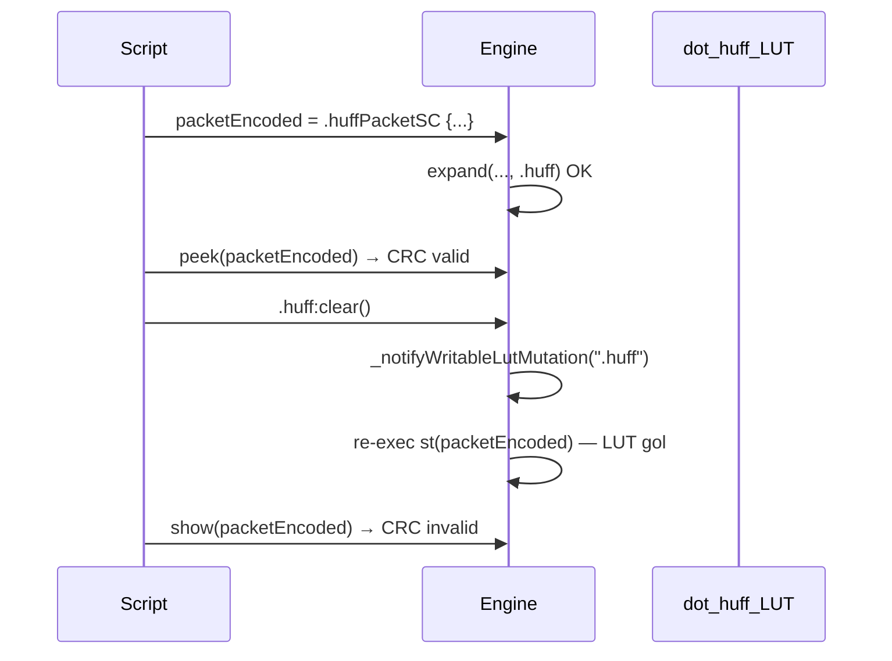
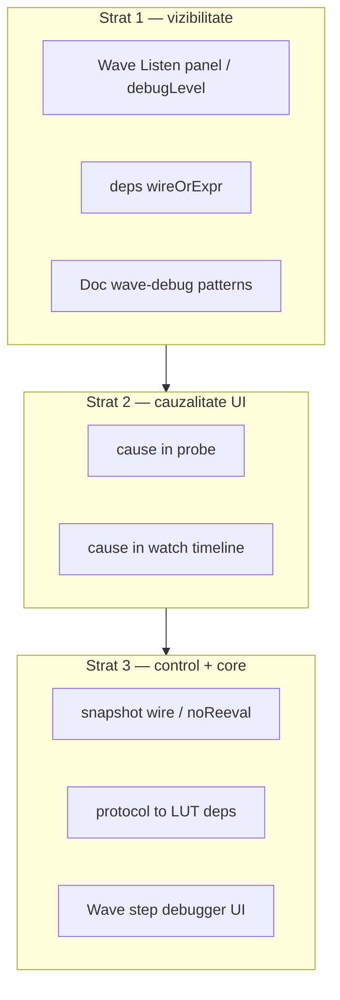
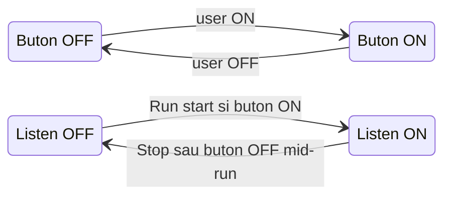
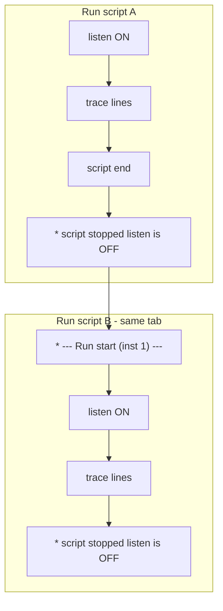
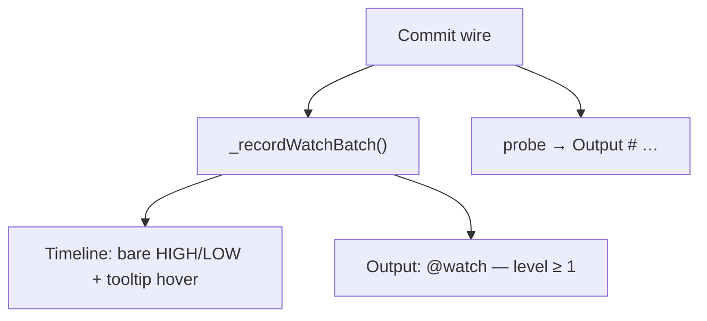

# Wave debug — propagare, cauzalitate, snapshot

Plan **elaborabil pe parcurs** — nu presupune implementare într-o singură iterație.

**Planuri înrudite (deja în repo):**
- [wave_signal_propagation_5efca976.plan.md](.cursor/plans/wave_signal_propagation_5efca976.plan.md) — engine wave (DONE)
- [evaluare_timeline_watch.plan.md](.cursor/plans/evaluare_timeline_watch.plan.md) — `cause` în watch (parțial overlap, todo-uri pending)
- [watch_compact.plan.md](.cursor/plans/watch_compact.plan.md) — tag `watch(…; compact)` — 1 coloană per expresie (pending)
- [huffman_packet_sc.plan.md](.cursor/plans/huffman_packet_sc.plan.md) — cazul care a expus limitările debug

**Documentație existentă:**
- [v0_3_2/doc/debug.md](v0_3_2/doc/debug.md) — `show` / `peek` / `probe` / `watch`
- [v0_3_2/doc/signal-propagation.md](v0_3_2/doc/signal-propagation.md) — wave vs legacy
- [v0_3_2/doc/huffman-v2.md](v0_3_2/doc/huffman-v2.md) — workaround `peek` + snapshot literal (L1071–1098)

---

## Problema

La complexitate mare (ex. Huffman SC round-trip în wave), **`show` / `peek` / `probe` nu explică propagarea** — doar valori la momente diferite.

### Caz concret (discutat 2026-07-06)



**Cauză în cod** — [`interpreter.js`](v0_3_2/core/interpreter.js) `_notifyWritableLutMutation` (L893–916):

- Re-execută wire statements care citesc LUT writable **sau** conțin invocări protocol când `instName === '.huff'`
- `show` pe wave e amânat până la settle → vede valoarea **post re-eval**
- `probe` emite `- changed` fără a spune **de ce** (LUT clear vs UI vs NEXT)

**Workaround validat (doc):** `peek` imediat după encode + copiere literală `123wire packet = ^…` înainte de `:clear()`.

---

## Ce avem azi vs ce lipsește

| Tool | Rol | Limită la complexitate mare |
|------|-----|------------------------------|
| `peek` | Valoare la statement | Nu explică re-eval ulterioară |
| `show` | Valoare după settle (wave) | Ordine temporală înșelătoare după side-effects |
| `probe` / `watch` | La fiecare commit | Fără `cause` (re-eval LUT, NEXT, UI, seed) |
| Timeline UI | Istoric vizual | Fără wave index / statement trigger |
| `debugLevel` | Flag pe strategie | **Definit dar nefolosit** în `WavePropagationStrategy.propagate()` |

Infrastructură existentă neexploatată:
- `SignalPropagationStrategy.debugLevel` + `setDebugLevel()` — [`signal-propagation.js`](v0_3_2/core/signal-propagation.js) L6, L24–26
- `_wireDependentsIndex`, `_componentDependentsIndex` — construite la elaborare
- `watchRecorder` + [`timeline-analyzer.js`](v0_3_2/ui/timeline-analyzer.js)
- `_probeReasonContext` parțial pentru probe (initialised / changed / edge committed)

---

## Arhitectură țintă (3 straturi)



---

## Strat 1 — Quick wins (fără schimbări majore de limbaj)

### 1.1 Wave Listen — panel UI dedicat (fără statement în script)

**Decizie (2026-07-08):** Nu există keyword `traceWave()` în limbaj — activarea e **doar din UI**, într-un panel separat de Output (ca Network Traffic / Timeline). Output-ul scriptului rămâne curat.

#### Panel UI

- **Locație:** selector panouri (`panel-dropdown`) — item nou alături de Timeline și Network Traffic
- **Label UI:** „Wave Listen” (intern: `waveListenPanel`)
- **Conținut:** `<div>` scrollabil (ca `#out.output-panel` + `appendOutputLine`), **nu** textarea — permite culori pe tip de eveniment
- **Toolbar:**
  - **ON / OFF** (buton panel) — **armează** panelul: dacă e ON, panelul **ascultă** când scriptul rulează; dacă OFF, nu. Poate fi schimbat oricând (script rulează sau nu, wave sau legacy)
  - **Level 1 / 2 / 3** — vizibile când buton ON; la buton OFF rămân vizibile dar inactive; level **nu se resetează**
  - **Clear** — șterge tot conținutul panelului (confirmat; **fără** auto-clear la Run)
- **Persistență:** `sdb` — `prog/waveListenArmed` (bool buton), `prog/waveListenLevel` (1–3)

#### Buton vs Listen — două concepte distincte

| | **Buton ON/OFF** | **Listen** (intern) |
|--|------------------|---------------------|
| **Ce e** | Preferință UI — panel armat să asculte | Stare runtime — panelul **primește** evenimente de la script |
| **Când e activ** | Setat de utilizator, persistă | Doar cât scriptul **rulează** și butonul e ON |
| **La Stop script** | **Rămâne** cum era (ex. ON) | Trece automat **OFF** |
| **Mesaje panel** | `** state ON` / `** state OFF` | `listen is ON` / `listen is OFF` în mesajele `*` |



**Listen ON** = script în execuție **și** buton panel ON → engine emite linii în panel.

**Listen OFF** = script oprit, **sau** buton OFF (chiar dacă scriptul rulează).

Mesaje meta buton (stil `wave-listen-line--meta`):

```text
** state ON
** state OFF
** level is now 2
** level is now 3
```

#### Mesaje la Run / Stop / Legacy

Mesajele `*` descriu starea **Listen** (intern), nu butonul:

**Legacy + Run:**

```text
* Script runs in mode legacy, listen is OFF    ← buton OFF
* Script runs in mode legacy, listen is ON     ← buton ON, script rulează (fără linii [wave N])
```

(La legacy: **zero** linii `[wave N]` indiferent de level — listen poate fi ON dar nu există propagare wave de urmărit.)

**Wave + Run + buton ON:** listen ON + linii trace conform levelului.

**Wave + Run + buton OFF:** listen OFF — fără linii trace (opțional: niciun mesaj, sau silent).

**Stop script** (eroare sau buton Stop):

```text
* script stopped listen is OFF
```

Listen trece OFF; **butonul rămâne neschimbat** (ex. ON → la Run următor listen pornește din nou).

#### Schimbare buton / level **în timpul** Run-ului

- **Buton ON mid-run:** listen pornește imediat; trace de acel moment (fără retroactiv); `** state ON`
- **Buton OFF mid-run:** listen se oprește imediat; `** state OFF`
- **Level mid-run:** `** level is now N`; de la evenimentul următor aplică noul prag (doar dacă listen ON)

#### Toolbar — indicator „Listening…”

- Pe toolbar-ul panelului Wave Listen (lângă ON/OFF / level): badge **„Listening…”** vizibil doar când **listen ON** (intern), indiferent de wave/legacy
- La listen OFF: badge ascuns sau text neutru „Idle”
- Culoare badge: verde/albastru discret (distinct de butonul armed ON)

#### Run-uri multiple — același tab sau instance

Editorul suportă deja **multi-instance** (1–5) și **run-context** per instance ([`run-context.js`](v0_3_2/ui/run-context.js)). Wave Listen urmează același model ca Output + Network Traffic.

**Scenariul tipic: Run script A, apoi Run script B (același tab, aceeași instance)**

```text
… trace script A …
* script stopped listen is OFF
* --- Run start (instance 1) ---
… trace script B …
* script stopped listen is OFF
```

| Aspect | Comportament |
|--------|--------------|
| **Listen** | OFF între run-uri; ON din nou la fiecare Run dacă buton armed |
| **Conținut panel** | **Append** cu separator `* --- Run start (instance N) ---` — **fără auto-clear** la Run (Output face `clearOutput()`; Wave Listen nu) |
| **Clear** | Buton **Clear** pe toolbar panel — singura cale de golire manuală |
| **Buton armed** | Rămâne ON — nu e nevoie să re-armezi între run-uri |

Motivație: panelul e jurnal de debug — păstrarea run-ului A ajută la comparație cu B; separatorul evită confuzia.

**Scenariul: două tab-uri / instance paralele** (ex. tab 1 pe instance 1, tab 2 pe instance 2, ambele rulează)

- Fiecare **run-context** are buffer propriu: `ctx.waveListenLog[]` + `ctx.waveListenActive`
- Panelul afișează **flux multiplexat** — fiecare linie prefixată cu `[inst N]` când **≥2 instance** au listen ON simultan
- Cu o singură instance activă în listen: **fără prefix** (output curat)
- Toolbar badge: `Listening… (inst 1, 2)` sau `Listening… inst 1` dacă una singură

**Schimbare tab** (instance rulează în fundal):

- La switch tab: panelul arată log-ul **tab-ului curent** — din `panelSnapshot.waveListenLog` (extinde snapshot-ul existent) sau live dacă instance încă rulează
- Instance în fundal continuă să acumuleze în `ctx.waveListenLog`; la revenire pe tab → refresh live

**Preempt instance** (tab B preia instance de la tab A):

- Tab A: listen OFF + `* script stopped listen is OFF` (instance preempted)
- Tab B: Run nou → separator + trace proaspăt pe aceeași instance



#### Niveluri `debugLevel`

| Level | Ce loghează |
|-------|-------------|
| **1** | wave index, commit wire, re-eval LUT/comp, flush deferred show |
| **2** | + fiecare `execWireStatement`, component changes |
| **3** | + valori complete / pending detail (verbose) |

**Exemplu level 1 (panel Wave Listen, nu Output):**

```text
[wave 0] RUN init → exec st(1062:asg) packetEncoded := .huffPacketSC {…}
[wave 1] lut-mut .huff:clear → re-exec st(1062:asg) packetEncoded
[wave 1] commit packetEncoded = ^4808… + 000
[wave 1] flush deferred show(packetEncoded)
```

#### Formatare valori commit (decizie 2026-07-08 — de implementat)

**Problema:** `_formatWaveListenValue` taie brut la ~48 caractere; fire/tensori mari (ex. `1000wire[3,3]` = 9000 bit) sunt ilizibile.

**Prag:** `bitWidth ≤ 256` → afișare inline cu `formatValue` (ca `show`), fără `[+]`.  
Peste 256 bit (scalar sau total tensor) → rezumat + control expand.

##### Toolbar — `Fmt` global

Buton pe toolbar (lângă L1/L2/L3): **`Fmt: hex ▾`** — ciclu la click: **hex ↔ bin**.

| Mod | Afișare |
|-----|---------|
| **hex** | literal `^…` hex; suffix **`(Nbits)`** mereu |
| **bin** | grupe câte 8 biți; wrap multi-rând **doar între grupuri** (nu sparge grupuri); suffix **`(Nbits)`** |

Persistență: `sdb` → `prog/waveListenFmt` (`hex` | `bin`; `short` migrat la `hex`).

##### `[+]` expand — stânga, înainte de valoare (fix)

Doar când `bitWidth > 256` (sau total biți tensor):

```text
[wave 1] commit matrixA  [+]  (1000wire[3,3]) — 9000 bits
```

- **`[+]`** rămâne **stânga, înainte de valoarea rezumat** — poziție fixă pe linia principală
- Click → **`[-]`** + bloc expand **dedesubt** (indentat), ca Network Traffic row expand
- `[+]` **nu** se mută la dreapta când expandezi

Layout DOM:

```text
wave-listen-row-main:   prefix + wireName + [+] + inlineSummary
wave-listen-row-expand: (wrap multi-linie, doar dacă expand ON)
```

##### Conținut expand — multi-linie, wrap ca Network Traffic

Reutilizare logică din [`network-traffic-display.js`](v0_3_2/ui/network-traffic-display.js):

- `PACKET_WRAP_MAX_CHARS = 40` (același default) — linii scurte, lizibile
- `wrapFormattedPacket(formatted, maxRowChars)` pentru hex/bin scalar
- **`formatValue`** / **`_formatShowWireValue`** pentru hex (ca `show`)
- **bin:** grupe câte 8 biți, wrap la 40–64 caractere/rând — **tot conținutul**, fără omitere

**Tensor / matrix** (expand sau `Fmt: hex|bin`):

- Aceeași abordare ca scalar mare: **multi-linie în blocul expand**
- Opțional: sub-linii stil `show` (`name:0 = …`, `:1 = …`) când e vector/matrix — nu un singur șir de 9000 caractere
- `short` fără expand: doar tip + `has shape [R,C]` / total biți

**Limită UX (nu omitere date):**

- Bloc expand: `max-height` + scroll intern (ex. 240px) — tot textul e acolo, scroll pentru 9000 bit
- Opțional viitor: Copy pe bloc expand

##### Metadata log entry (engine)

În loc de string simplu, commit entries stochează:

```javascript
{ kind: 'commit', wireName, rawValue, bitWidth, tensorMeta?, prefix: '[wave 1] commit …' }
```

Panelul formatează la render după `Fmt` + `expandedIds`.

##### Fișiere (formatare)

- [`signal-propagation.js`](v0_3_2/core/signal-propagation.js) — `_formatWaveListenValue` → metadata sau delegare `interp.formatValue`
- [`wave-listen-panel.js`](v0_3_2/ui/wave-listen-panel.js) — Fmt toolbar, `[+]` expand, wrap
- Extrage/refolosește `wrapFormattedPacket` din [`network-traffic-display.js`](v0_3_2/ui/network-traffic-display.js) (shared sau import)

##### UI mic (done)

- Buton ON/OFF: lățime fixă `3.25rem` — nu sare la toggle

#### Engine → UI (fără poluare Output)

- `SignalPropagationStrategy.debugLevel` — setat din level UI când **listen ON**
- Stare internă per run-context: `ctx.waveListenActive`, `ctx.waveListenLog[]`
- Helper `emitWaveListenLine(instanceId, text, kind)` — emite dacă instance respectiv are listen ON; append în `ctx.waveListenLog`; notifică panel
- Run start: dacă buton armed → `waveListenActive = true` + separator run (dacă log non-gol); Stop/eroare → `waveListenActive = false` + mesaj stop
- `freezePanelSnapshot` / `panelSnapshot` — include `waveListenLog` pentru restore la schimbare tab

#### Fișiere

- [`v0_3_2/core/signal-propagation.js`](v0_3_2/core/signal-propagation.js) — instrumentare + `debugLevel`
- [`v0_3_2/core/interpreter.js`](v0_3_2/core/interpreter.js) — hook LUT re-eval, emit callback
- [`v0_3_2/ui/wave-listen-panel.js`](v0_3_2/ui/wave-listen-panel.js) — panel nou (model `network-traffic-panel.js` + render ca `appendOutputLine`)
- [`v0_3_2/ui/app.js`](v0_3_2/ui/app.js) — `toggleWaveListen`, wiring dropdown, Run/Stop hooks pentru mesaje legacy/stop
- [`v0_3_2/ui/run-context.js`](v0_3_2/ui/run-context.js) — propagare preferință listen la creare interpreter
- [`v0_3_2/script_editor_v0_3_2.html`](v0_3_2/script_editor_v0_3_2.html) — panel HTML + dropdown item
- [`v0_3_2/doc/debug.md`](v0_3_2/doc/debug.md) — secțiune Wave Listen

#### Teste (fără UI)

- API engine: `strategy.setDebugLevel(n)` + mock `onWaveListenLine` — teste în [`test_suite.js`](v0_3_2/tests/test_suite.js) ~2200+
- Nu testăm keyword inexistent în script

**Acceptance:** Huffman SC round-trip wave — panel ON level 1 arată explicit re-eval după `:clear()`; Output rămâne doar `show`/`peek`; legacy Run → un singur mesaj legacy.

### 1.2 `deps(wireOrExpr)` — dump graf dependențe

**Decizie (2026-07-08):** Acceptă **wire sau expresie**; format **tree text** în Output (ca `Zlist`).

#### Sintaxă

```logts
deps(packetEncoded)              # wire — caz principal
deps(source)
deps(source + codebook)          # expr ad-hoc — upstream only
deps(.huff)                      # LUT instance — stmts sensibile la mutație
```

#### Output tree text — exemplu `deps(packetEncoded)`

```text
=== deps(packetEncoded) ===
Type: 123wire
Producer: 1062:1 — 123wire packetEncoded =: .huffPacketSC { tokens=source, … }

Upstream wires:
  source (32wire)
  codebook (8wire[N])

Upstream LUT / protocol:
  .huff (writable, read)
  protocol .huffPacketSC

NEXT-sensitive inputs: (none)

Downstream consumers (re-exec when packetEncoded changes):
  (none)

LUT-mutation sensitive (re-exec when .huff mutates):
  → producer st(1062:asg) packetEncoded
```

#### Expr fără wire numit

Pentru `deps(source + codebook)`: secțiuni **Upstream** + **NEXT-sensitive**; **Producer / Downstream** = `(ad-hoc expression — no wire producer)`.

#### Date sursă (elaborare)

- `_wireDependentsIndex` — downstream
- `collectWireInputsFromExpr` — upstream
- `_exprReferencesWritableLutInst` + `_exprHasProtocolInvoke` — LUT/protocol
- `exprDependsOnNextCycle` — `~` / `%` / `$`
- Funcționează **identic în wave și legacy** (analiză statică)

#### Fișiere

- [`v0_3_2/core/parser.js`](v0_3_2/core/parser.js) — parse `deps(...)`
- [`v0_3_2/core/interpreter.js`](v0_3_2/core/interpreter.js) — `_execDeps`
- [`v0_3_2/doc/debug.md`](v0_3_2/doc/debug.md)
- Teste ~2200+ — wire, expr, `.huff`, legacy + wave

**Acceptance:** `deps(packetEncoded)` listează `.huff` + `.huffPacketSC` + secțiune LUT-mutation; `deps(source)` arată downstream către `packetEncoded`.

### 1.3 Documentare pattern-uri wave-debug

**Scop:** Secțiune dedicată în [`debug.md`](v0_3_2/doc/debug.md) + link din [`huffman-v2.md`](v0_3_2/doc/huffman-v2.md):

| Pattern | Când |
|---------|------|
| `peek` imediat după encode | Înainte de orice mutație LUT |
| Snapshot literal wire | Înainte de `.huff:clear()` pentru recover |
| `show` doar pe rezultate finale | Wire-uri care nu depind de LUT mutat |
| `probe(.huff:size())` | Witness pentru mutații LUT |
| `watch(ph.*)` | FSM + protocol multi-step |
| Wave Listen panel ON | Vizualizare propagare wave fără poluare Output |

Opțional: exemplu `logts-play wave` minimal reproducer (fără literal manual după ce există `snapshot`).

---

## Strat 2 — Cauzalitate în probe / watch

**Scop:** Extinde mesajele probe de la `# wire = … - changed` la explicații **de ce** s-a schimbat (re-eval LUT, wave, stmt, NEXT, UI, …).

**Strat 2a + 2b livrate împreună** — toate motivele într-o singură implementare:

| Motiv | Sursă |
|-------|-------|
| `initialised` / `changed` / `edge committed` | Existent probe (level 0) |
| `re-eval ← lutMut` | `_notifyWritableLutMutation` |
| `re-eval ← compMut` | `_notifyComponentComputedMutation` |
| `wave N` | Index în `propagate()` |
| `stmt st(line:asg)` | Context `execWireStatement` (ca Wave Listen) |
| `seed` | Primul rând după `seedWatchTimeline()` post-Run |
| `next` | După `NEXT(~)` / buton Next |
| `ui` | Toggle switch / key / DIP |
| `osc tick` | Timer `osc` / `~` |
| `settle` | Final batch propagare wave |

**Nu duplicăm cause în Wave Listen** — panelul rămâne jurnal propagare; probe/watch = observabilitate la commit.

### Verbozitate — `probe(a; level=N)` / `watch(a; level=N)`

| Level | Default | Probe Output | Ce cause se afișează |
|-------|---------|--------------|---------------------|
| **0** | **da** | Ca acum — o linie | Doar `- initialised` / `- changed` / `- edge committed` |
| **1** | | Linie 1: valoare + status; **rând 2:** cauză dominantă | Un singur motiv (ex. `re-eval ← .huff:clear`) |
| **2** | | Linie 1: valoare + status; **rânduri 2+:** detaliu | Toate câmpurile relevante, câte unul per rând |

**Motiv dominant (level 1)** — prioritate:
1. `re-eval ← lutMut` / `compMut`
2. `edge committed`
3. `next` / `ui` / `osc tick`
4. `settle` / `seed`
5. (altfel fără rând cause — statusul de pe linia 1 e suficient)

**Format probe — cauză NU inline în paranteză** (valori mari = greu de găsit):

```text
# packetEncoded = ^4808 ABCD EF12 …
  re-eval ← .huff:clear
```

Level 2 (exemplu):

```text
# packetEncoded = ^4808 ABCD EF12 …
  re-eval ← .huff:clear
  wave 1
  st(1062:asg)
```

- Prefix rând cause: indent `  ` (2 spații) sau `  → ` — aceeași convenție ca sub-linii Output
- Valoarea rămâne pe **linia 1**; cause pe **linia 2+**
- Compatibil cu `probe(a; hex; level=2)` — formatare valoare + cause multi-rând
- `level=0` sau lipsă tag → **fără** rânduri cause

**Legacy:** `wave N` omis în mod legacy; restul cause funcționează.

### Watch / Timeline — grafic + tooltip (decizie 2026-07-08)

**Principiu:** Timeline rămâne **100% grafic** (bare HIGH/LOW) — **fără** text desenat permanent, **fără** textbox / panou inspect. Cause la watch apare în **Output** (`@watch`) și, la hover, în **tooltip canvas** (acceptat).



| Level | Timeline canvas | Output |
|-------|-----------------|--------|
| **0** | Ca acum — doar tranziții | **Nimic** |
| **1** | Bandă color opțională + **tooltip:** cause dominant | `@watch` + 1 rând cause |
| **2** | Bandă color + **tooltip:** toate liniile cause | `@watch` + cause complet |

**Ce NU punem pe Timeline:** text fix pe rând, icon „i”, textbox, panou lateral — doar hover tooltip nativ canvas.

**Tooltip (level ≥ 1):**
- Trigger: hover pe **rând** (label stânga sau bandă HIGH/LOW)
- Conținut = același text cause ca Output (dominant la L1, complet la L2)
- Opțional prima linie: nume canal + `seq/cycle` — **fără** hex lung (valoarea e vizuală pe bare)
- Implementare: div tooltip poziționat de `timeline-analyzer.js` (pattern existent în app dacă e) sau `title` pe hit-region — preferat div pentru multi-rând

**Format Output watch** (log / grep; complement tooltip-ului):

```text
@watch packetEncoded, ph.state — changed
  re-eval ← .huff:clear
```

Level 2:

```text
@watch packetEncoded — changed
  re-eval ← .huff:clear
  wave 1
  st(1062:asg)
```

- Prefix **`@watch`** — distinct de probe `#`
- **Fără** valoare hex pe linia 1 — tranziția e pe Timeline
- Canale din același batch grupate: `@watch a, b, c — changed`
- Probe + watch pe același target: `#` = valoare + cause; `@watch` = doar eveniment + cause (roluri diferite)

**Bandă color (opțional, level ≥ 1):** indiciu vizual (portocaliu = re-eval) — zero text; poate fi omisă dacă tooltip + Output sunt suficiente.

**Level watch — sursă:** `watch(expr; level=N)` pe target, ca probe.

**Un cause per batch** — același commit → același set cause (tooltip + Output share metadata din `_recordWatchBatch`).

**Fișiere:**
- [`v0_3_2/core/interpreter.js`](v0_3_2/core/interpreter.js) — `_probeCauseContext`, `_emitProbeTarget`, `_recordWatchBatch` (+ `cause`/`causeLines`, emit `@watch`)
- [`v0_3_2/core/signal-propagation.js`](v0_3_2/core/signal-propagation.js) — context wave/stmt
- [`v0_3_2/core/parser.js`](v0_3_2/core/parser.js) — parse `level=N`
- [`v0_3_2/ui/timeline-analyzer.js`](v0_3_2/ui/timeline-analyzer.js) — bandă color opțională + **tooltip hover** (cause din payload rând)
- [`v0_3_2/doc/debug.md`](v0_3_2/doc/debug.md)

**Acceptance:** `watch(packetEncoded; level=2)` — canvas fără text permanent; hover arată cause; Output `@watch …`; `level=0` = zero tooltip cause / zero Output; probe `level=2` neschimbat.

---

## Strat 2.1 — Fix tooltip Timeline (prioritate, înainte de compact)

**Feedback (2026-07-08):** tooltip deplasat față de pointer; pe ecran mic nu funcționează. **Compact watch amânat** — livrăm doar fix-ul tooltip.

### Cauze identificate

1. **Scalare CSS vs backing store (bug principal)**  
   - Canvas: `width="640" height="220"` (coord. interne) + CSS `width:100%; height:auto` ([`script_editor_v0_3_2.html`](v0_3_2/script_editor_v0_3_2.html)).  
   - Hit-test: `y = clientY - rect.top` în **pixeli CSS**, dar `_rowIndexAtCanvasY` compară cu `canvas.height` (220).  
   - Pe panel îngust, raportul `canvas.height / rect.height ≠ 1` → rând greșit (pare „pe lângă” cursor).

2. **Rânduri de 8px** — toleranță mică; o eroare de 1 rând = 8px vizual.

3. **Tooltip doar la `watchLevel ≥ 1`** — fără `level=1/2` în script, hover nu arată nimic (poate părea „nu merge”).

4. **Fără touch** — doar `mousemove`; pe mobil/tablet mic nu există hover.

5. **Clamp incomplet** — `_showTooltip` evită depășirea dreapta/jos, nu garantează `left/top ≥ 8`; pe viewport mic tooltip poate ieși sau fi ilizibil.

### Fix propus — [`timeline-analyzer.js`](v0_3_2/ui/timeline-analyzer.js)

**A. Coordonate corecte (obligatoriu)**

```javascript
function canvasCoords(canvas, clientX, clientY) {
  const rect = canvas.getBoundingClientRect();
  const scaleX = canvas.width / rect.width;
  const scaleY = canvas.height / rect.height;
  return {
    x: (clientX - rect.left) * scaleX,
    y: (clientY - rect.top) * scaleY,
  };
}
```

Folosit în `_rowIndexAtCanvasY` și oriunde se mapează pointer → rând.

**B. Hit-test pe banda desenată** — folosește aceeași formulă `currentY` ca în `render()` (deja aliniată cu `scrollOffsetY` + `LABEL_BAND` clip).

**C. Tooltip ancorat la rând, nu doar la cursor**

- Poziție: `rect.left + lanesWidth/2` (sau marginea rândului) + `rect.top + rowCenterY / scaleY` convertit în client — tooltip lângă rândul hit, nu offset arbitrar de la mouse.
- Clamp complet: `left/top` min 8px, max `innerWidth/Height - size - 8`.

**D. Touch (ecran mic)**

- `touchstart` / `touchmove` (când nu drag): același hit-test; tooltip rămâne până la `touchend` sau tap în afara canvas.
- Opțional: `long-press` dacă conflict cu scroll drag — inițial tap simplu pe rând.

**E. Opțional UX**

- Tooltip minimal la `level=0`: doar `seq/cycle` + nume canale (fără cause) — reduce confuzia „nu merge fără level”.
- `ResizeObserver` pe canvas: la redimensionare panel, invalidare hit-test (scale se recalculează automat din rect).

### Fișiere

- [`v0_3_2/ui/timeline-analyzer.js`](v0_3_2/ui/timeline-analyzer.js) — coord scale, tooltip anchor, touch, clamp
- [`v0_3_2/script_editor_v0_3_2.html`](v0_3_2/script_editor_v0_3_2.html) — opțional `touch-action` / min-height canvas pe mobile
- [`v0_3_2/doc/debug.md`](v0_3_2/doc/debug.md) — notă: tooltip cause necesită `level≥1`; pe touch tap pe rând

### Acceptance

- Panel Timeline redimensionat (50% lățime): hover pe bară → tooltip pe **rândul corect** (cause matches seq vizual).
- Viewport îngust (&lt;768px): tap pe rând → tooltip vizibil, în ecran.
- `watch(x; level=2)` + drag scroll: tooltip nu sare pe rând vecin.
- Regresie: Pause/Live, drag scroll, cause bandă portocalie neschimbate.

### Amânat

- **Watch `compact`** — [watch_compact.plan.md](watch_compact.plan.md) (Strat 2.5, după 2.1 ✅).

---

## Strat 3 — Control și corectitudine structurală

### 3.1 `snapshot(wire)` sau atribut `noReeval`

**Scop:** Îngheață valoarea wire-ului după evaluare reușită; `_notifyWritableLutMutation` sare re-exec unless reassignment explicit sau `unfreeze(wire)`.

**Alternativă sintactică:** atribut pe declarație `123wire packetEncoded noReeval =: .huffPacketSC {…}`

**Beneficiu:** Elimină clasa de bug-uri „encode OK → clear → wire corupt” fără literal manual.

**Fișiere:**
- [`v0_3_2/core/parser.js`](v0_3_2/core/parser.js), [`interpreter.js`](v0_3_2/core/interpreter.js) — metadata wire
- [`signal-propagation.js`](v0_3_2/core/signal-propagation.js) — filtru în re-eval paths
- Doc + teste round-trip SC fără workaround literal

**Decizie de elaborat:** statement `snapshot(w)` vs atribut vs ambele.

### 3.2 Dependențe protocol → LUT generalizate

**Scop:** Înlocuiește hardcod `instName === '.huff' && _exprHasProtocolInvoke` (L904) cu map elaborat `lutInst → wire stmts` bazat pe analiza def protocol (`expand`, `collapse`, `codebookLoad`).

**Fișiere:**
- [`interpreter.js`](v0_3_2/core/interpreter.js) — elaborare protocol
- [`protocol-assembler.js`](v0_3_2/core/protocol-assembler.js) dacă e nevoie de metadata suplimentar
- [`signal-propagation.md`](v0_3_2/doc/signal-propagation.md), [`protocol.md`](v0_3_2/doc/protocol.md)

### 3.3 Wave step debugger (UI)

**Scop:** Buton „Step wave” — oprește după fiecare `commitPendingWires` + batch `execWireStatement`, nu doar RUN/NEXT complet.

**Fișiere:** [`app.js`](v0_3_2/ui/app.js), eventual API nou pe interpreter pentru breakpoint în `propagate()`.

**Prioritate:** După Wave Listen — reutilizează aceeași instrumentare `debugLevel`.

---

## Ordine recomandată de implementare

| # | Item | Efort | Impact |
|---|------|-------|--------|
| 1 | Wave Listen panel (debugLevel) | Mediu | Foarte mare |
| 2 | deps() | Mic | Mare |
| 3 | Doc pattern-uri | Mic | Mediu |
| 4 | cause în probe/watch | Mediu | Foarte mare |
| 5 | snapshot() | Mediu–mare | Foarte mare |
| 6 | protocol deps | Mare | Mare (corectitudine) |
| 7 | step debugger UI | Mare | Mediu–mare |

---

## Scenarii de test (regresie)

1. **Huffman SC round-trip wave** — script din `huffman-v2.md`; trace arată re-eval; după `snapshot`, recover fără literal
2. **peek vs show** — teste existente **807**, **813** — fără regresie
3. **probe duplicate** — debug.md L415 — cause nu dublează output inutil
4. **Legacy mode** — Wave Listen: mesaj unic legacy; `deps()` funcționează normal
5. **FSM + NEXT** — `watch(ph.*)` cu motive `next` / `edge committed`

---

## Note pentru elaborare viitoare

- **Nu înlocuiește** wave engine — complementează observabilitatea
- **Overlap intenționat** cu todo-urile pending din `evaluare_timeline_watch.plan.md` — la implementare strat 2, unificăm
- **Implementarea e pe faze separate** — fiecare strat poate fi livrat independent
- **Quick win fără cod:** pattern-urile din strat 1.3 sunt deja parțial în `huffman-v2.md` — pot fi extrase în `debug.md` independent de engine

---

## Decizii Strat 1 (confirmate 2026-07-08)

| Item | Decizie |
|------|---------|
| **1.1 activare trace** | Panel UI „Wave Listen” — **fără** keyword în script |
| **1.1 destinație output** | Panel dedicat, nu Output |
| **1.1 buton vs listen** | **Buton** = panel armat (persistă); **Listen** = intern, activ doar cât rulează scriptul |
| **1.1 controale** | Buton ON/OFF + level 1/2/3; level păstrat la buton OFF |
| **1.1 legacy** | `* Script runs in mode legacy, listen is ON/OFF` (stare listen, nu buton) |
| **1.1 stop** | `* script stopped listen is OFF` — listen OFF; buton neschimbat |
| **1.1 multi-run** | Append + separator; **fără auto-clear**; Clear doar via buton toolbar |
| **1.1 clear** | Buton Clear pe toolbar panel (confirmat 2026-07-08) |
| **1.1 multi-instance** | Buffer per run-context; prefix `[inst N]` când ≥2 listen paralele |
| **1.1 toolbar** | Badge „Listening…” când listen activ |
| **1.2 deps** | Wire + expr, format tree text, secțiune LUT-mutation |

### Decizii Strat 2 (confirmate 2026-07-08)

| Item | Decizie |
|------|---------|
| **2.0 level probe/watch** | `probe(a; level=0\|1\|2)` / `watch(a; level=N)` — default **0** = ca acum |
| **2.1 layout cause** | **Nu** inline în paranteză; cause pe **rând 2+** (indent), valoarea pe rând 1 |
| **2.2 level 1** | Un motiv dominant pe rând 2 |
| **2.3 level 2** | Toate câmpurile cause — câte un rând (wave, stmt, lutMut, …) |
| **2.4 scope motive** | **2a+2b împreună** — seed, next, ui, osc, settle incluse |
| **2.5 stmt ref** | `st(line:asg)` — același format ca Wave Listen |
| **2.6 Wave Listen** | Fără cause duplicat în panel |
| **2.7 watch level** | Cause în **Output** (`@watch`) + **tooltip hover** pe rând Timeline |
| **2.8 Timeline** | Grafic (bare); opțional bandă color; **tooltip da**, textbox/text fix **nu** |
| **2.9 batch watch** | Un set cause per batch; canale grupate pe linia `@watch` |
| **2.10 watch compact** | Tag `compact` — 1 coloană per expr; [watch_compact.plan.md](watch_compact.plan.md) |

### Recomandări tehnice (de inclus la implementare)

1. **Toolbar badge:** „Listening…” / „Listening… (inst 1, 2)” — distinct de buton armed.
2. **Run-uri consecutive:** append + separator; **niciodată** auto-clear la Run.
3. **Clear:** buton pe toolbar panel; ring buffer ~2000 linii per instance la level 3.
4. **Culori panel:** ex. `[wave N]` neutru, `lut-mut` portocaliu, `[inst N]` mov discret, `** meta` gri italic, `*` status albastru.
5. **Mid-run buton OFF:** oprește listen imediat pe instance respectiv; fără trace retroactiv.
6. **Teste engine:** per-instance `waveListenActive` + `setDebugLevel` + callback mock.
7. **Step debugger (3.3):** reutilizează același panel / buffer Wave Listen.
