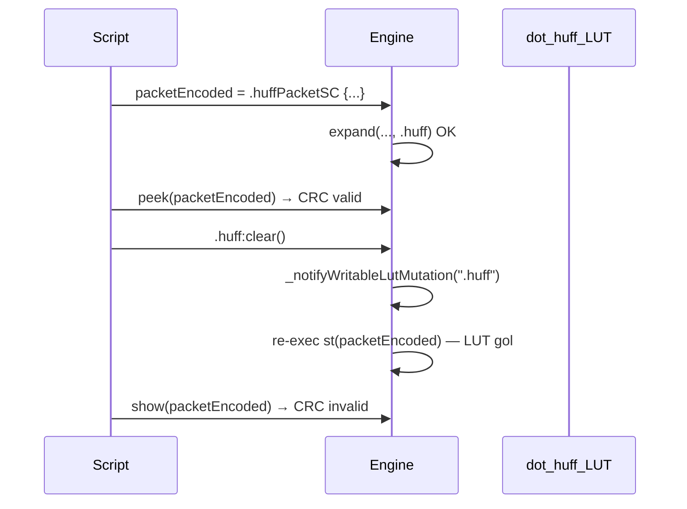
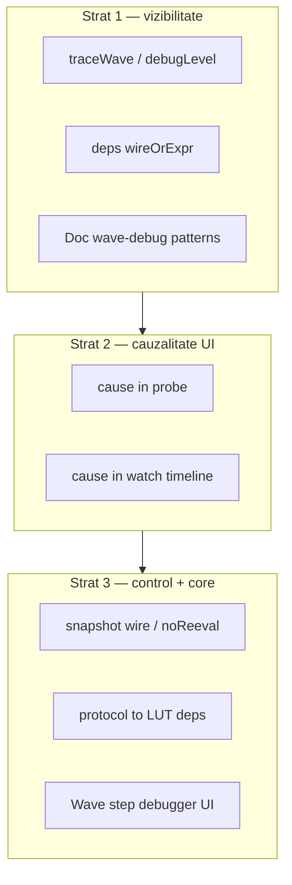

# Wave debug — propagare, cauzalitate, snapshot

Plan **elaborabil pe parcurs** — nu presupune implementare într-o singură iterație.

**Planuri înrudite (deja în repo):**
- [wave_signal_propagation_5efca976.plan.md](.cursor/plans/wave_signal_propagation_5efca976.plan.md) — engine wave (DONE)
- [evaluare_timeline_watch.plan.md](.cursor/plans/evaluare_timeline_watch.plan.md) — `cause` în watch (parțial overlap, todo-uri pending)
- [huffman_packet_sc.plan.md](.cursor/plans/huffman_packet_sc.plan.md) — cazul care a expus limitările debug

**Documentație existentă:**
- [v0_3_2/doc/debug.md](v0_3_2/doc/debug.md) — `show` / `peek` / `probe` / `watch`
- [v0_3_2/doc/signal-propagation.md](v0_3_2/doc/signal-propagation.md) — wave vs legacy
- [v0_3_2/doc/huffman-v2.md](v0_3_2/doc/huffman-v2.md) — workaround `peek` + snapshot literal (L1071–1098)

---

## Problema

La complexitate mare (ex. Huffman SC round-trip în wave), **`show` / `peek` / `probe` nu explică propagarea** — doar valori la momente diferite.

### Caz concret (discutat 2026-07-06)



**Cauză în cod** — [`interpreter.js`](v0_3_2/core/interpreter.js) `_notifyWritableLutMutation` (L893–916):

- Re-execută wire statements care citesc LUT writable **sau** conțin invocări protocol când `instName === '.huff'`
- `show` pe wave e amânat până la settle → vede valoarea **post re-eval**
- `probe` emite `- changed` fără a spune **de ce** (LUT clear vs UI vs NEXT)

**Workaround validat (doc):** `peek` imediat după encode + copiere literală `123wire packet = ^…` înainte de `:clear()`.

---

## Ce avem azi vs ce lipsește

| Tool | Rol | Limită la complexitate mare |
|------|-----|------------------------------|
| `peek` | Valoare la statement | Nu explică re-eval ulterioară |
| `show` | Valoare după settle (wave) | Ordine temporală înșelătoare după side-effects |
| `probe` / `watch` | La fiecare commit | Fără `cause` (re-eval LUT, NEXT, UI, seed) |
| Timeline UI | Istoric vizual | Fără wave index / statement trigger |
| `debugLevel` | Flag pe strategie | **Definit dar nefolosit** în `WavePropagationStrategy.propagate()` |

Infrastructură existentă neexploatată:
- `SignalPropagationStrategy.debugLevel` + `setDebugLevel()` — [`signal-propagation.js`](v0_3_2/core/signal-propagation.js) L6, L24–26
- `_wireDependentsIndex`, `_componentDependentsIndex` — construite la elaborare
- `watchRecorder` + [`timeline-analyzer.js`](v0_3_2/ui/timeline-analyzer.js)
- `_probeReasonContext` parțial pentru probe (initialised / changed / edge committed)

---

## Arhitectură țintă (3 straturi)



---

## Strat 1 — Quick wins (fără schimbări majore de limbaj)

### 1.1 `traceWave` — activare `debugLevel`

**Scop:** Linii structurate în Output când `debugLevel >= 1`:

```text
[wave 0] RUN init → exec st(packetEncoded:asg)
[wave 1] lut-mut .huff:clear → re-exec st(packetEncoded:asg)
[wave 1] commit packetEncoded = ^4808… + 000
[wave 1] flush deferred show(packetEncoded)
```

**Fișiere:**
- [`v0_3_2/core/signal-propagation.js`](v0_3_2/core/signal-propagation.js) — instrumentare în `WavePropagationStrategy.propagate()`, `_finishPropagate`, loop commit/exec
- [`v0_3_2/core/interpreter.js`](v0_3_2/core/interpreter.js) — helper `traceProp(msg)` → `this.out`; hook în `_notifyWritableLutMutation`, `execWireStatement`
- [`v0_3_2/ui/app.js`](v0_3_2/ui/app.js) — toggle „Wave trace” (sau checkbox lângă Wave/Legacy)
- [`v0_3_2/doc/debug.md`](v0_3_2/doc/debug.md) — secțiune `traceWave`

**Acceptance:** Script Huffman SC round-trip din `huffman-v2.md` — cu trace ON, output-ul arată explicit re-eval după `:clear()`.

### 1.2 `deps(wireOrExpr)` — dump graf dependențe

**Scop:** Statement debug (similar `Zlist` / `peek`) care afișează la elaborare sau la RUN:

- statement producător (id, tip asg/decl, expresie scurtă)
- downstream din `_wireDependentsIndex`
- upstream (wire-uri citite în expresie)
- flag NEXT-tracked (`~` / `%` / `$`)
- referințe LUT writable + invocări protocol detectate

**Fișiere:**
- [`v0_3_2/core/parser.js`](v0_3_2/core/parser.js) — parse `deps(...)`
- [`v0_3_2/core/interpreter.js`](v0_3_2/core/interpreter.js) — `_execDeps`
- [`v0_3_2/doc/debug.md`](v0_3_2/doc/debug.md)
- Teste noi în [`v0_3_2/tests/test_suite.js`](v0_3_2/tests/test_suite.js) — interval liber ~2200+

**Acceptance:** `deps(packetEncoded)` înainte de RUN listează legătura cu `.huff` și `.huffPacketSC`.

### 1.3 Documentare pattern-uri wave-debug

**Scop:** Secțiune dedicată în [`debug.md`](v0_3_2/doc/debug.md) + link din [`huffman-v2.md`](v0_3_2/doc/huffman-v2.md):

| Pattern | Când |
|---------|------|
| `peek` imediat după encode | Înainte de orice mutație LUT |
| Snapshot literal wire | Înainte de `.huff:clear()` pentru recover |
| `show` doar pe rezultate finale | Wire-uri care nu depind de LUT mutat |
| `probe(.huff:size())` | Witness pentru mutații LUT |
| `watch(ph.*)` | FSM + protocol multi-step |

Opțional: exemplu `logts-play wave` minimal reproducer (fără literal manual după ce există `snapshot`).

---

## Strat 2 — Cauzalitate în probe / watch

**Scop:** Extinde mesajele de la `# wire = … - changed` la:

```text
# packetEncoded = … - changed (re-eval ← .huff:clear, stmt st(packetEncoded:asg), wave 1)
```

**Motive propuse (aliniat cu [evaluare_timeline_watch.plan.md](.cursor/plans/evaluare_timeline_watch.plan.md)):**

| Motiv | Sursă |
|-------|-------|
| `initialised` / `changed` / `edge committed` | Existent probe |
| `re-eval ← lutMut` | `_notifyWritableLutMutation` |
| `re-eval ← compMut` | `_notifyComponentComputedMutation` |
| `wave N` | Index în `propagate()` |
| `stmt …` | `execWireStatement` context |
| `next` / `ui` / `seed` | Fază 2 timeline |

**Fișiere:**
- [`v0_3_2/core/interpreter.js`](v0_3_2/core/interpreter.js) — `_probeCauseContext`, `_emitProbeTarget`, `_recordWatchBatch`
- [`v0_3_2/core/signal-propagation.js`](v0_3_2/core/signal-propagation.js) — set/clear context per wave iteration
- [`v0_3_2/ui/timeline-analyzer.js`](v0_3_2/ui/timeline-analyzer.js) — tooltip / culoare marginală pe motiv
- [`v0_3_2/doc/debug.md`](v0_3_2/doc/debug.md)

**Acceptance:** Toggle `.huff:clear()` în panel + `probe(packetEncoded)` distinge commit UI de re-eval declarativă.

---

## Strat 3 — Control și corectitudine structurală

### 3.1 `snapshot(wire)` sau atribut `noReeval`

**Scop:** Îngheață valoarea wire-ului după evaluare reușită; `_notifyWritableLutMutation` sare re-exec unless reassignment explicit sau `unfreeze(wire)`.

**Alternativă sintactică:** atribut pe declarație `123wire packetEncoded noReeval =: .huffPacketSC {…}`

**Beneficiu:** Elimină clasa de bug-uri „encode OK → clear → wire corupt” fără literal manual.

**Fișiere:**
- [`v0_3_2/core/parser.js`](v0_3_2/core/parser.js), [`interpreter.js`](v0_3_2/core/interpreter.js) — metadata wire
- [`signal-propagation.js`](v0_3_2/core/signal-propagation.js) — filtru în re-eval paths
- Doc + teste round-trip SC fără workaround literal

**Decizie de elaborat:** statement `snapshot(w)` vs atribut vs ambele.

### 3.2 Dependențe protocol → LUT generalizate

**Scop:** Înlocuiește hardcod `instName === '.huff' && _exprHasProtocolInvoke` (L904) cu map elaborat `lutInst → wire stmts` bazat pe analiza def protocol (`expand`, `collapse`, `codebookLoad`).

**Fișiere:**
- [`interpreter.js`](v0_3_2/core/interpreter.js) — elaborare protocol
- [`protocol-assembler.js`](v0_3_2/core/protocol-assembler.js) dacă e nevoie de metadata suplimentar
- [`signal-propagation.md`](v0_3_2/doc/signal-propagation.md), [`protocol.md`](v0_3_2/doc/protocol.md)

### 3.3 Wave step debugger (UI)

**Scop:** Buton „Step wave” — oprește după fiecare `commitPendingWires` + batch `execWireStatement`, nu doar RUN/NEXT complet.

**Fișiere:** [`app.js`](v0_3_2/ui/app.js), eventual API nou pe interpreter pentru breakpoint în `propagate()`.

**Prioritate:** După traceWave — reutilizează aceeași instrumentare.

---

## Ordine recomandată de implementare

| # | Item | Efort | Impact |
|---|------|-------|--------|
| 1 | traceWave (debugLevel) | Mic–mediu | Foarte mare |
| 2 | deps() | Mic | Mare |
| 3 | Doc pattern-uri | Mic | Mediu |
| 4 | cause în probe/watch | Mediu | Foarte mare |
| 5 | snapshot() | Mediu–mare | Foarte mare |
| 6 | protocol deps | Mare | Mare (corectitudine) |
| 7 | step debugger UI | Mare | Mediu–mare |

---

## Scenarii de test (regresie)

1. **Huffman SC round-trip wave** — script din `huffman-v2.md`; trace arată re-eval; după `snapshot`, recover fără literal
2. **peek vs show** — teste existente **807**, **813** — fără regresie
3. **probe duplicate** — debug.md L415 — cause nu dublează output inutil
4. **Legacy mode** — trace/deps no-op sau mesaj „legacy only” clar
5. **FSM + NEXT** — `watch(ph.*)` cu motive `next` / `edge committed`

---

## Note pentru elaborare viitoare

- **Nu înlocuiește** wave engine — complementează observabilitatea
- **Overlap intenționat** cu todo-urile pending din `evaluare_timeline_watch.plan.md` — la implementare strat 2, unificăm
- **Implementarea e pe faze separate** — fiecare strat poate fi livrat independent
- **Quick win fără cod:** pattern-urile din strat 1.3 sunt deja parțial în `huffman-v2.md` — pot fi extrase în `debug.md` independent de engine
