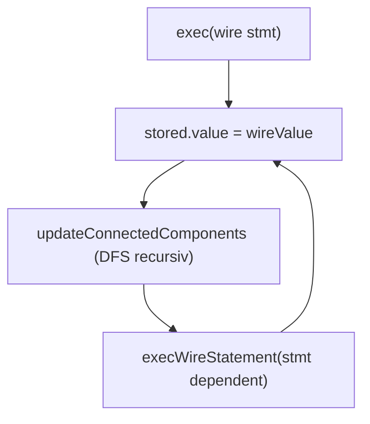
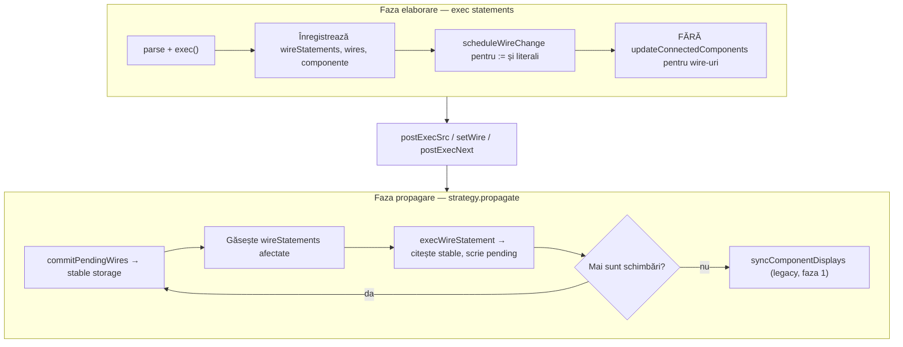
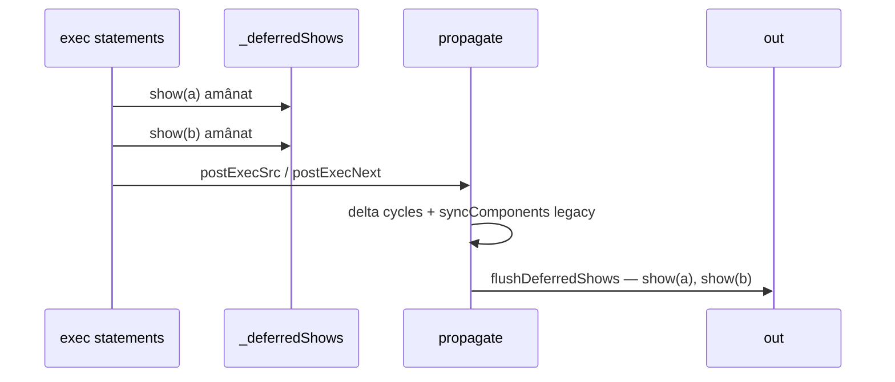
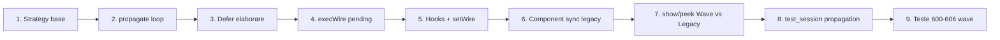
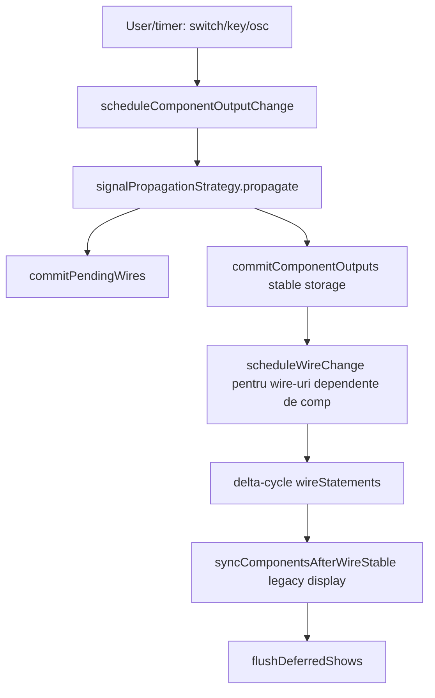
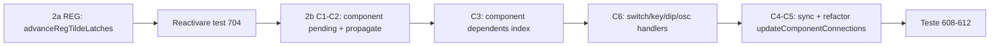
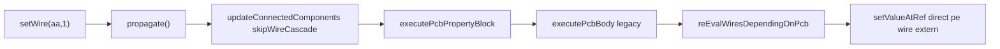
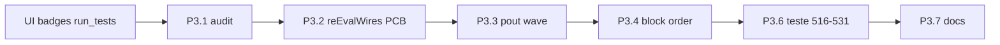

# Plan: Wave-based Signal Propagation

## Problema actuală

Fluxul curent tratează limbajul ca un program secvențial:



În [`interpreter.js`](v0_3_2/core/interpreter.js), fiecare declarație/assignment de wire scrie direct în `storage` și apelează imediat `updateConnectedComponents` (ex. L2533, L2880). Logica de cascadă (~1600 linii) trăiește în [`signal-propagation.js`](v0_3_2/core/signal-propagation.js) ca `Interpreter.prototype.updateConnectedComponents`.

[`SignalPropagationStrategy`](v0_3_2/core/signal-propagation.js) este un stub gol: `propagate()` iese imediat, iar `isStable()` are semantică inversată (`_dirty`).

Hook-urile `postExecSrc()` / `postExecNext()` → `startProc()` → `strategy.propagate()` există (L1403–1433) dar nu fac nimic util.

**Rezultat:** ordinea statement-urilor din sursă influențează rezultatul, contrar unui simulator de circuite.

---

## Model țintă (faza 1 — wire-uri)



**Principiu delta-cycle:** componentele citesc starea **stabilă** curentă și scriu în **pending**; commit-ul se face o dată per undă, apoi se re-evaluează statement-urile afectate.

---

## Ierarhie clase strategie

În [`signal-propagation.js`](v0_3_2/core/signal-propagation.js):

| Clasă | Rol |
|-------|-----|
| `SignalPropagationStrategy` | Bază abstractă: `bind(interp)`, `scheduleWireChange`, `commitPendingWires`, `propagate`, `wirePendingStates`, `wireCommitPendingStates` (Set/Mape per undă) |
| `WavePropagationStrategy` | **Default** — algoritm BFS/delta-cycle descris mai sus |
| `LegacyCascadePropagationStrategy` | Comportamentul actual (DFS prin `updateConnectedComponents`) — pentru compatibilitate explicită / debug |

Factory în [`components/index.js`](v0_3_2/core/components/index.js):

```js
function createSignalPropagationStrategy(kind = 'wave') {
  if (kind === 'legacy') return new LegacyCascadePropagationStrategy();
  return new WavePropagationStrategy();
}
```

**Default-uri per context:**

| Context | Default `kind` | Motiv |
|---------|----------------|-------|
| Editor (`app.js`) | `'wave'` | simulator nou |
| `test_session` / `run_tests` | `'legacy'` | suite existentă (PCB, REG, doc) scrisă pentru cascade; fără surprize la Run All |
| Teste signal 600–606 | `'wave'` explicit | validează WavePropagationStrategy |

---

## Modificări `Interpreter`

### 1. Constructor — strategie obligatorie

```js
constructor(funcs, out, pcbs, componentRegistry, signalPropagationStrategy) {
  this.signalPropagationStrategy =
    signalPropagationStrategy ?? createSignalPropagationStrategy();
  this.signalPropagationStrategy.bind(this);
}
```

Elimină toate guard-urile `if (!this.signalPropagationStrategy) return` din `postExecSrc`, `postExecNext`, `postExecBody`.

### 2. Poartă centrală pentru scriere wire

Adaugă metode delegate:

- `scheduleWireChange(name, value)` → `strategy.scheduleWireChange`
- `getWireStableValue(name)` → citește din `storage` via `wire.ref`
- `commitWireIfPending(name)` → folosit intern de strategie

### 3. Elaborare — oprește cascada imediată

În căile de exec wire din `exec()` (assignment L2503–2533, declarație cu expr L2753–2882, `:=` init L2647–2671):

| Situație | Comportament nou (WaveStrategy) |
|----------|--------------------------------|
| `wire q := 1` | Creează wire + storage slot; `scheduleWireChange(q, '1')`; **nu** propagă |
| `1wire a = 0` (literal) | Creează wire; `scheduleWireChange(a, '0')`; adaugă la `wireStatements` |
| `1wire b = NOT(a)` (expr) | Creează wire + slot; adaugă la `wireStatements`; **nu** evaluează expr acum |
| `b = MUX(...)` (reassignment) | Adaugă/actualizează `wireStatements`; **nu** scrie + cascadă |

`LegacyCascadePropagationStrategy` poate seta un flag `deferWireWrites = false` și păstra comportamentul vechi (pentru teste de regresie explicite).

### 4. `execWireStatement` — mod pending

Adaugă parametru/opțiune `target: 'stable' | 'pending'`:

- **`pending`** (în propagare): evaluează expr citind valori stabile; rezultatul merge în `scheduleWireChange`, nu în `stored.value`
- **`stable`** (legacy / final commit): comportament actual

REG (`REG(data, clk, clr)`) se evaluează în undă — citește `clk` stabil din unda curentă, ceea ce este **mai corect** pentru edge detection decât cascada DFS. Testele 700–703 ar trebui verificate după implementare; nu fac parte din criteriul de acceptare faza 1, dar nu necesită refactor REG separat dacă `execWireStatement` funcționează în undă.

### 5. `postExecSrc` / `postExecNext`

```js
postExecSrc() {
  this.signalPropagationStrategy.initializeFromElaboration();
  this.signalPropagationStrategy.propagate();
  this.signalPropagationStrategy.flushDeferredShows(); // Wave: golește coada show acumulate
}
postExecNext() {
  this.signalPropagationStrategy.onNextCycle();
  this.signalPropagationStrategy.propagate();
  this.signalPropagationStrategy.flushDeferredShows(); // Wave: show-uri de după ultimul NEXT
}
```

`initializeFromElaboration()`: colectează toate `:=` și declarațiile literale deja programate; construiește indexul de dependențe.

`flushDeferredShows()`: no-op pe Legacy; pe Wave evaluează coada `_deferredShows` în ordinea sursei și face `out.push`.

### 6. Index de dependențe wire (precomputat)

La finalul elaborării, construiește:

```js
// inputWireName → Set<wireStatement>
this._wireDependentsIndex = new Map();
```

Folosește `exprReferencesWire` (deja în signal-propagation.js L93) pe fiecare `wireStatement`. La commit, pentru fiecare wire schimbat, union statement-urile dependente — **fără** scan liniar O(n) per undă.

### 7. `setWire` / interacțiuni utilizator

În [`test_session.js`](v0_3_2/test_session.js) L86–91 și handlers switch/key din componente:

```js
setWire(name, val) {
  interp.scheduleWireChange(name, val);
  interp.signalPropagationStrategy.propagate();
}
```

**Nu** mai apela direct `updateConnectedComponents` pentru wire-uri când WaveStrategy e activă.

---

## Implementare `WavePropagationStrategy.propagate()`

Pseudocod:

```js
propagate() {
  if (!this._hasPendingChanges()) return;
  const maxWaves = this.wires.size * 2 + 10; // protecție bucle
  for (let wave = 0; wave < maxWaves; wave++) {
    const changed = this.commitPendingWires();
    if (changed.size === 0) break;

    const toExec = this.collectAffectedStatements(changed);
    let anyScheduled = false;
    for (const ws of toExec) {
      const outputs = this.interp.execWireStatementToPending(ws);
      if (outputs.some(([n,v]) => this.scheduleWireChange(n, v))) anyScheduled = true;
    }
    if (!anyScheduled) break;
  }
  this.resetPending();
  this.interp.syncComponentsAfterWireStable(changedAll); // faza 1: LED/display only
}
```

**Auto-referință** (`a = NOT(a)`, test 605): o singură execuție per undă per statement (Set `_executedThisWave`); unda următoare vede noul stable.

**MUX toggle** (test 602–603): `tg0` se schimbă în undă N; statement-ul `tg0 = MUX(...)` nu se re-execută în aceeași undă dacă `tg0` era input propriu — re-executare doar la unda N+1 când `tg0` committed.

---

## Ce rămâne pe legacy în faza 1

| Mecanism | Faza 1 | Faza 2 (viitor) |
|----------|--------|-----------------|
| Wire cascade (`wireStatements`) | WaveStrategy | — |
| `show(...)` | Wave: amânat, flush la `postExecSrc`/`postExecNext`; Legacy: imediat top-down | — |
| `peek(...)` | Immediat pe ambele strategii (nou în parser) | — |
| `updateComponentConnections` (componente UI) | Legacy; apelat în `syncComponentsAfterWireStable` **înainte** de flush show | Integrat în strategie |
| Property blocks `on:raise` / `on:1` / `on:edge` | Legacy; declanșate în sync post-propagate | Migrare în undă |
| REG cu `~` (NEXT-based) | Funcționează via `postExecNext` + `onNextCycle`; verificare test 701 | Rafinare dacă e nevoie |
| PCB `on:1` blocks (teste 500+) | Neschimbate în faza 1 | Faza 2 |

**Notă despre edge-triggered:** singurul caz „hardware edge” în wire-uri este REG (falling edge pe `clk` wire, L1053–1058 în interpreter). Blocurile `on:raise`/`on:1` sunt pe **componente/PCB**, nu pe wire-uri — rămân pe mecanismul vechi în faza 1, conform alegerii tale.

---

## `show` / `peek` — Opțiunea E + Variantă 1 (decizie finală)

### Principiu

Pe **Wave**, `show` este o **probă la graniță de simulare** (după propagate), nu un statement imperativ la mijlocul elaborării. Pe **Legacy**, `show` rămâne **top-down imediat** ca acum.

UI-ul (și factory-ul) vor permite alegerea strategiei: `createSignalPropagationStrategy('wave')` vs `'legacy'`. Exemplele din `fs.js` nu sunt constrângere — prioritatea e modelul corect pentru simulare.

### Comportament pe strategie

| | **WavePropagationStrategy** | **LegacyCascadePropagationStrategy** |
|---|---------------------------|--------------------------------------|
| `show(...)` | **Amânat** — pus în `_deferredShows`; executat la `flushDeferredShows()` | **Imediat** — `evalExpr` + `out.push` la exec (comportament actual) |
| `peek(...)` | **Imediat** — citește stable curent (poate fi incomplet în elaborare) | La fel ca `show` (sau alias) |
| Granițe flush `show` | `postExecSrc`, `postExecNext` | N/A — deja imediat |

### Variantă 1 — show-uri fără `NEXT` între ele

```logtscript
block 1
show(a)
block 2
show(b)
# fără NEXT
```

Pe Wave: ambele intră în coadă; la `postExecSrc` → `propagate()` → `flushDeferredShows()` rulează `show(a)` apoi `show(b)` **în ordinea sursei**. Ambele văd **aceeași stare stabilă finală** (după elaborarea întregului script + propagate). Nu există „timp” între ele — doar ordinea liniilor de output.

### show intercalat cu `NEXT` — cazul cu sens

```logtscript
block
NEXT(1)
show(a)       # în coadă segment A
block 2
NEXT(1)
show(b)       # în coadă segment B
```

Flux exec:

1. `block` — elaborare
2. `NEXT(1)` → `postExecNext` → propagate → **flush** → `show(a)` vede starea după primul tick
3. `block 2` — elaborare (poate adăuga wire-uri noi)
4. `NEXT(1)` → propagate → **flush** → `show(b)` vede starea după al doilea tick

Sau:

```logtscript
block
NEXT(1)
show(a)
NEXT(1)
show(b)
```

Fiecare `NEXT` golește coada de `show` acumulate **de la ultimul flush**; fiecare probă e după un propagate distinct.



### Implementare

**Parser** — adaugă `peek()` analog `show()` → `{ peek: args }`.

**`exec()` la `s.show`:**

```js
if (s.show) {
  if (this.signalPropagationStrategy.deferShow) {
    this.signalPropagationStrategy.enqueueShow(s);
    return;
  }
  this._execShowImmediate(s); // Legacy + cod existent L1487–1632 extras în metodă
}
if (s.peek) {
  this._execShowImmediate(s); // mereu imediat
}
```

**`WavePropagationStrategy`:**

- `deferShow = true`
- `enqueueShow(stmt)` → `_deferredShows.push(stmt)`
- `flushDeferredShows()` → pentru fiecare stmt din coadă: `_execShowImmediate`; golește coada
- Apelat la finalul `postExecSrc` / `postExecNext` (după `propagate()`)

**`LegacyCascadePropagationStrategy`:**

- `deferShow = false` — `show` imediat, fără coadă

### Faza 1 — componente pe legacy și impact la `show`

În faza 1, property blocks (`on:1`, `on:raise`) și `updateComponentConnections` rămân pe mecanismul legacy. Implicații pentru `flushDeferredShows`:

1. `propagate()` Wave stabilizează **wire-urile**
2. Apoi `syncComponentsAfterWireStable()` rulează logica legacy (display LED, property blocks declanșate de wire-uri schimbate)
3. **Abia după** pasul 2, `flushDeferredShows()` evaluează `show(.comp:get)` — altfel componentele ar putea fi în urmă față de wire-uri

Ordine obligatorie în `postExecSrc` / `postExecNext`:

```
propagate()  →  syncComponentsAfterWireStable()  →  flushDeferredShows()
```

Pentru `.c:set = 1` executat în elaborare (legacy imediat): starea componentei e deja actualizată la momentul flush; `show(.c:get)` citește valoarea corectă. Dacă `.c:set` depinde de un wire schimbat doar în propagate, sync-ul legacy de la pasul 2 trebuie să fi rulat înainte de show.

### Teste

- `show` / `peek` — **nu** apar în `test_suite_ported.js` (zero impact CI faza 1)
- Smoke manual opțional în editor: Wave + `NEXT` + `show`; Legacy + `show` mid-script neschimbat

### Notă tehnică

`Interpreter.EXEC_DISPATCH.show = '_execShow'` (L6886) nu are implementare — refactor: extrage logica existentă în `_execShowImmediate(s)` reutilizată de ambele strategii.

---

## Bug de corectat

În [`test_session.js`](v0_3_2/test_session.js) L15–20, `_ensureSignalPropagationStrategy()` asignează greșit la `this.registry` în loc de `this.signalPropagationStrategy`.

---

## Fișiere de modificat

1. [`v0_3_2/core/signal-propagation.js`](v0_3_2/core/signal-propagation.js) — clase strategie + logică wave; extrage index dependențe; păstrează helper-ele `exprReferencesWire` etc.
2. [`v0_3_2/core/interpreter.js`](v0_3_2/core/interpreter.js) — elaborare fără cascadă; `execWireStatement` pending; hooks postExec; constructor obligatoriu
3. [`v0_3_2/core/components/index.js`](v0_3_2/core/components/index.js) — factory cu `WavePropagationStrategy` default
4. [`v0_3_2/test_session.js`](v0_3_2/test_session.js) — `createSession(options)`, fix bug, `setWire` via strategie
5. [`v0_3_2/test_suite.js`](v0_3_2/test_suite.js) — `registerTest(..., options)`, `getTest(id)`, `createSession(opts)`
6. [`v0_3_2/test_suite_ported.js`](v0_3_2/test_suite_ported.js) — `{ propagation: 'wave' }` pe reg 600–606
7. [`v0_3_2/run_tests.js`](v0_3_2/run_tests.js) — `entryForTest` + `runOneTest` cu `test.propagation`
8. [`v0_3_2/ui/app.js`](v0_3_2/ui/app.js) — `scheduleWireChange` + `propagate`; toggle Wave/Legacy incremental
9. [`v0_3_2/core/parser.js`](v0_3_2/core/parser.js) — keyword `peek(...)` analog `show(...)`

---

## Testare — `run_tests` + `test_session`

### API `createSession(options)`

[`test_session.js`](v0_3_2/test_session.js) primește opțiuni la creare:

```js
function createSession(options = {}) {
  const propagation = options.propagation ?? 'legacy'; // default legacy
  // ...
  signalPropagationStrategy: createSignalPropagationStrategy(propagation),
}
```

Corectează bug-ul actual: `_ensureSignalPropagationStrategy()` asignează greșit la `this.registry`.

Sesiunea expune `session.propagation` (`'legacy'` | `'wave'`) pentru ramificări în `setWire` / `postExecNext`.

### Metadata pe `reg` — decizie finală

**Semnătură** în [`test_suite.js`](v0_3_2/test_suite.js) — actualizează **ambele**: `reg` (folosit în corpul fișierului) și `registerTest` (exportat pentru `test_suite_ported.js`):

```js
function registerTest(id, group, title, run, options = {}) {
  const propagation = options.propagation ?? 'legacy';
  tests.push({ id, group, title, run, propagation });
}
```

[`test_suite_ported.js`](v0_3_2/test_suite_ported.js) folosește `suite.registerTest` — același al 5-lea argument.

**Exemplu test signal** — corpul testului neschimbat, doar metadata:

```js
reg(600, 'signal', 'wire simplu — propagare cascadat', function(h, session) {
  const { interp } = session.run(`...`);
  session.setWire(interp, 'a', '1');
  h.assert('600 b=NOT(a)', session.getWire(interp, 'b'), '0');
}, { propagation: 'wave' });
```

Teste cu `{ propagation: 'wave' }` în faza 1: **600, 601, 602, 603, 604, 605, 606** + test nou paralelism (607 sau id liber).

### `run_tests.js` — propagare din metadata

Adaugă lookup pe obiectul test complet (nu doar `run`):

```js
// test_suite.js — export nou
getTest(id) {
  return this.tests.find(t => t.id === id) ?? null;
}

// run_tests.js
function entryForTest(entry) {
  const t = suite.getTest(entry.id);
  return {
    id: entry.id,
    title: entry.title,
    group: entry.group,
    run: t?.run ?? null,
    propagation: t?.propagation ?? 'legacy',
  };
}

async function runOneTest(test) {
  const session = suite.createSession({ propagation: test.propagation ?? 'legacy' });
  // ... rest neschimbat
}
```

Testele nu creează session propriu — harness-ul din `runOneTest` furnizează session-ul corect via metadata.

### Ce strategie folosește fiecare grup

| Grup | ID-uri | `propagation` | Notă |
|------|--------|---------------|------|
| repeat … registry | 6–223 | omis → **legacy** | |
| doc, doc-comp | 300–427 | omis → **legacy** | |
| pcb | 500–515 | omis → **legacy** | |
| **signal** | **600–606** (+607) | **`'wave'`** pe `reg` | |
| reg | 700, 702, 703 | omis → **legacy** | |
| **reg** | **701** | omis → **legacy** | REG cu `~` + `NEXT` — referință legacy |
| **reg** | **704** (nou) | **`'wave'`** | același scenariu ca 701, strategie wave |

### Test 701 — REG cu clock `~` și `NEXT` (legacy + wave)

**Număr:** [`701`](v0_3_2/test_suite_ported.js) — titlu „REG cu clock ~ — NEXT-based”.

Sursă testată:

```logtscript
1wire data = 1
1wire read = REG(data, ~, 0)
```

Flux în test: `run` → `read=0` → `NEXT(1)` + `postExecNext` → `read=1` → `setWire(data,0)` fără NEXT → `read=1` (hold) → `NEXT(2)` → `read=0`.

**De ce merită ambele strategii:** REG cu `~` folosește `cycle` și `regPendingMap`; `NEXT` avansează ciclul și re-evaluează wire-uri. Wave schimbă *când* se propagă `read` față de legacy — testul 701 validează că comportamentul REG+NEXT rămâne identic.

**Implementare fără duplicare de logică** — funcție partajată + două `reg`:

```js
function runReg701NextBased(h, session) {
  const { interp } = session.run(`
1wire data = 1
1wire read = REG(data, ~, 0)`);
  h.assert('initial read=0', session.getWire(interp, 'read'), '0');
  session.execNext(interp, 1);   // wrapper: exec({next}) + postExecNext
  h.assert('dupa NEXT(1) read=1', session.getWire(interp, 'read'), '1');
  session.setWire(interp, 'data', '0');
  h.assert('data=0 fara NEXT → read=1', session.getWire(interp, 'read'), '1');
  session.execNext(interp, 1);
  h.assert('dupa NEXT(2) read=0', session.getWire(interp, 'read'), '0');
}

reg(701, 'reg', 'REG cu clock ~ — NEXT-based', runReg701NextBased);
// legacy implicit

reg(704, 'reg', 'REG cu clock ~ — NEXT-based (wave)', runReg701NextBased, {
  propagation: 'wave',
});
```

**Manifest:** adaugă intrare `{ id: 704, group: 'reg', title: '...' }` în [`test_manifest.js`](v0_3_2/test_manifest.js) (ID **704** e liber).

**Prefix assert:** la 704, prefixează mesajele cu `704` sau folosește `const prefix = session.propagation === 'wave' ? '704' : '701'` în funcția partajată ca să distingi eșecurile în UI.

### `setWire` / `postExecNext` în test_session

Trebuie să respecte strategia sesiunii:

```js
setWire(interp, name, val) {
  if (this.propagation === 'wave') {
    interp.scheduleWireChange(name, val);
    interp.signalPropagationStrategy.propagate();
  } else {
    // legacy: comportament actual
    interp.setValueAtRef(w.ref, val);
    interp.updateConnectedComponents(name, val);
  }
}
```

Adaugă helper **`session.execNext(interp, count = 1)`** — înlocuiește perechea `interp.exec({ next: count }); interp.postExecNext();` din testul 701/704:

```js
execNext(interp, count = 1) {
  interp.exec({ next: count });
  interp.postExecNext(); // wave: onNextCycle + propagate + flushDeferredShows
}
```

### `run_tests.js` — UI faza 1

- Run All / Run group: propagare automată din metadata `reg` — fără checkbox suplimentar
- Badge UI legacy/wave în run_tests — **faza 3** (nu opțional)

### Criterii testare

1. **Run All cu default legacy** — testele fără metadata trec neschimbate
2. **Grup signal** — 600–606 (+607) pe wave
3. **701 legacy** — REG(`~`)+NEXT; **704 wave** — done faza 2

---

## Criterii de acceptare (faza 1)

Teste din [`test_suite_ported.js`](v0_3_2/test_suite_ported.js):

- **600** — cascadă NOT(NOT(a)) după setWire
- **601** — cascadă 4 niveluri
- **602** — MUX toggle
- **603** — counter binar cascadat
- **604** — propagare oprită când valoarea nu se schimbă
- **605** — auto-referință o singură evaluare per undă
- **606** — multi-decl propagare individuală
- **701** — REG(`~`)+NEXT pe **legacy**
- **704** — același scenariu ca 701 pe **wave** — **done** faza 2

Test suplimentar recomandat (nou, mic):

```logtscript
1wire A := 1
1wire B := 0
1wire X = NOT(A)
1wire Y = AND(X, A)
1wire Z = NOT(B)
1wire T = AND(Z, B)
```

După `postExecSrc`, ordinea sursă nu trebuie să conteze; X=0, Y=0, Z=1, T=0 — confirmă paralelismul pe ramuri.

---

## Ordine implementare recomandată

1. Bază `SignalPropagationStrategy` + `bind` + `scheduleWireChange` / `commitPendingWires`
2. `WavePropagationStrategy.propagate()` minimal (fără component sync)
3. Modifică elaborarea wire în `interpreter.js` (defer writes)
4. `execWireStatement` mod pending + index dependențe
5. Conectează `postExecSrc` / `setWire` (ordine: propagate → sync legacy → flush shows)
6. `syncComponentsAfterWireStable` (legacy faza 1 — înainte de `flushDeferredShows`)
7. **`show` amânat + `peek` imediat** pe Wave; Legacy păstrează show imediat; parser `peek`
8. `LegacyCascadePropagationStrategy` + factory `kind: 'wave' | 'legacy'`
9. **reg metadata** + `getTest` + `run_tests` propagation
10. Rulează Run All (legacy default) + verificare grup signal (wave via metadata)



---

## Faza 2 — REG builtin + componente pe wave (fără PCB)

**Organizare (decizie utilizator):**
- **Faza 2:** REG builtin `~` (test 704) + **toate componentele builtin** (switch, key, dip, osc, led, lcd, mem, reg component, etc.)
- **Faza 3:** PCB pe wave (teste 516–531) + badge-uri propagation în run_tests — vezi secțiunea Faza 3
- **Legacy:** testele existente PCB/componente rămân pe `propagation: 'legacy'` (Run All neschimbat)
- **Wave:** prioritate pentru editor + teste **noi** acolo unde comportamentul diferă sau trebuie validat explicit

---

### Ce spune planul faza 1 despre componente (deja decis)

| Mecanism | Faza 1 (implementat) | Faza 2 (rămas) |
|----------|---------------------|----------------|
| Wire cascade | Wave | — |
| `show` / `peek` | Wave defer + Legacy imediat | — |
| `syncComponentsAfterWireStable` | După propagate: `updateConnectedComponents(wire, skipWireCascade)` | Extinde la output-uri componentă |
| `updateComponentConnections` | Legacy + parțial wave (`scheduleWireChange` pentru comp→wire) | Unifică intrările utilizator |
| Property blocks `on:1` pe **comp** | Legacy, declanșate la sync | Rămân legacy în faza 2 (trigger post-propagate) |
| Property blocks pe **PCB** | Legacy, teste 500–515 legacy-only | **Faza 3** |

Ordinea post-propagate (faza 1, păstrată):

```
propagate()  →  syncComponentsAfterWireStable()  →  flushDeferredShows()
```

---

### Model țintă: output componentă = schimbare de wire (commit la final)

Principiu: când un **output de componentă** se schimbă (switch, key, dip, osc tick, reg component set, etc.), pe **Wave** nu se face cascadă DFS imediată. Se programează schimbarea și se **commit-uiește la granița de propagare**, ca la wire-uri.



**Legacy** păstrează fluxul actual: scriere directă în `storage` + `updateComponentConnections` sincron.

#### API propus (Interpreter + Strategy)

```js
// Wave: nu scrie stable imediat, nu apelează updateComponentConnections imediat
scheduleComponentOutputChange(compName, value) {
  if (deferWirePropagation()) {
    return this.signalPropagationStrategy.scheduleComponentChange(compName, value);
  }
  // Legacy: comportament actual
  this.writeComponentStable(compName, value);
  this.updateComponentConnections(compName);
}

// WavePropagationStrategy — extinde SignalPropagationStrategy
componentPendingStates = new Map(); // compName → value
commitComponentOutputs() { /* stable storage + return Set changed comps */ }
propagate() {
  // 1. commit component outputs (dacă există)
  // 2. pentru comps schimbate: scheduleWireChange pe wire-uri dependente (reutilizează index)
  // 3. delta-cycle wire existent
  // 4. _finishPropagate
}
```

**De ce nu doar `scheduleWireChange` pe un nume virtual:** componentele au `comp.ref` în storage separat de `wires`; wire-urile citesc comp prin `exprReferencesComponent`. Trebuie commit la `comp.ref` **înainte** de re-evaluarea wire-urilor dependente.

**OSC (timer async):** fiecare tranziție high/low = un apel `scheduleComponentOutputChange` + `propagate()` (ca un `setWire` repetat), nu cascadă în timer.

**LED/LCD/mem (consumatori):** rămân actualizați prin `syncComponentsAfterWireStable` / `updateComponentValue` după ce wire-urile/comp-urile sursă sunt stabile — fără cascadă wire pe wave.

**Reg component (`comp [reg]`):** `applyProperties` la `set=1` scrie în device UI; pe wave trece prin același `scheduleComponentOutputChange`.

**Property blocks `on:1` pe componente simple (ex. led `.L:{ set=1 on:1 }`):** faza 2 — **rămân pe mecanismul legacy** declanșat din `syncComponentsAfterWireStable` când wire-urile s-au stabilizat (nu migrare delta-cycle pentru blocks încă).

---

### Componente de modificat (faza 2)

| Fișier | Schimbare |
|--------|-----------|
| [signal-propagation.js](v0_3_2/core/signal-propagation.js) | `componentPendingStates`, `commitComponentOutputs`, extindere `propagate()` |
| [interpreter.js](v0_3_2/core/interpreter.js) | `scheduleComponentOutputChange`, `writeComponentStable`, `getComponentStableValue` |
| [switch.js](v0_3_2/core/components/switch.js), [key.js](v0_3_2/core/components/key.js), [dip.js](v0_3_2/core/components/dip.js), [rotary.js](v0_3_2/core/components/rotary.js) | `onChange`/`onPress` → `scheduleComponentOutputChange` |
| [osc.js](v0_3_2/core/components/osc.js) | `goHigh`/`goLow` → schedule + propagate |
| [interpreter.js](v0_3_2/core/interpreter.js) L3344+ | key handlers inline (dacă încă există) — aliniere la același API |
| [reg.js](v0_3_2/core/components/reg.js) | `applyProperties` pe wave |

Elimină duplicarea: `updateComponentConnections` wave path (`waveWireScheduled`) devine consecință a `propagate()`, nu apel separat din handlers.

---

### Stare actuală vs țintă (cod existent)

| Eveniment | Legacy (azi) | Wave (azi, incomplet) | Wave (țintă faza 2) |
|-----------|--------------|------------------------|---------------------|
| `session.setWire` | `setValueAtRef` + `updateConnectedComponents` DFS | `scheduleWireChange` + `propagate()` | la fel (done) |
| Switch `onChange` | scrie `storage` → `updateComponentConnections` | la fel ca legacy | `scheduleComponentOutputChange` + `propagate()` |
| Key `onPress`/`onRelease` | scrie `storage` → `updateComponentConnections` | la fel | idem switch |
| Dip `onChange` | scrie `storage` → `updateComponentConnections` | la fel | idem (valoare N-bit) |
| Osc `goHigh`/`goLow` | scrie `storage` → `updateComponentConnections` | la fel | schedule + `propagate()` per tick |
| Comp → wire în `updateComponentConnections` | scrie wire direct + `updateConnectedComponents` | `scheduleWireChange` + `propagate()` la final | mutat în strategie după `commitComponentOutputs` |
| Wire → LED display | `syncComponentsAfterWireStable` | `updateConnectedComponents(wire, skipWireCascade)` | + sync pentru `comp` schimbat |
| Property block `on:1` pe comp | `updateConnectedComponents` / `_uccPendingBlocks` | legacy neschimbat | declanșat după propagate stabil |

**Problema curentă:** pe editor wave, inputurile utilizator (switch/key) încă folosesc cascada legacy imediată, amestecată cu wire-uri wave — comportament inconsistent.

---

### Implementare componente wave — pași concreți

#### Pas C1 — Infrastructură Strategy + Interpreter

În [`signal-propagation.js`](v0_3_2/core/signal-propagation.js), clasa bază `SignalPropagationStrategy`:

```js
componentPendingStates = new Map(); // compName → string value (binar, lățime din comp)

scheduleComponentChange(compName, value) {
  const stable = this.interp.getComponentStableValue(compName);
  if (stable === value) return false;
  this.componentPendingStates.set(compName, value);
  return true;
}

hasPendingChanges() {
  return this.wirePendingStates.size > 0
    || this.componentPendingStates.size > 0
    || this._recomputeAllWires;
}

commitComponentOutputs() {
  const changed = new Set();
  for (const [name, value] of this.componentPendingStates.entries()) {
    const stable = this.interp.getComponentStableValue(name);
    if (stable !== value) {
      this.interp.writeComponentStable(name, value);
      changed.add(name);
    }
  }
  this.componentPendingStates.clear();
  return changed;
}
```

În [`interpreter.js`](v0_3_2/core/interpreter.js):

```js
getComponentStableValue(compName) {
  const comp = this.components.get(compName);
  if (!comp?.ref || comp.ref === '&-') return null;
  return this.getValueFromRef(comp.ref);
}

writeComponentStable(compName, value) {
  const comp = this.components.get(compName);
  if (!comp?.ref) return;
  const bits = this.getComponentBits(comp.type, comp.attributes) || value.length;
  let v = value;
  if (v.length < bits) v = v.padStart(bits, '0');
  else if (v.length > bits) v = v.substring(v.length - bits);
  this.setValueAtRef(comp.ref, v);
}

scheduleComponentOutputChange(compName, value) {
  if (this.deferWirePropagation()) {
    const scheduled = this.signalPropagationStrategy.scheduleComponentChange(compName, value);
    if (scheduled) this.signalPropagationStrategy.propagate();
    return;
  }
  this.writeComponentStable(compName, value);
  this.updateComponentConnections(compName);
}
```

`LegacyCascadePropagationStrategy`: `scheduleComponentChange` no-op; `commitComponentOutputs` returnează set gol.

#### Pas C2 — Extindere `WavePropagationStrategy.propagate()`

Ordine **obligatorie** într-un singur `propagate()`:

```js
propagate() {
  const executedThisPropagate = new Set();
  const allChanged = new Set();

  // A) Recompute global (NEXT / postExecSrc) — ca acum
  if (this._recomputeAllWires) { /* ... */ }

  for (let wave = 0; wave < maxWaves; wave++) {
    // B) Commit component outputs ÎNAINTE de wire în fiecare undă
    const compsChanged = this.commitComponentOutputs();
    for (const c of compsChanged) allChanged.add(c); // track pentru sync

    // C) Pentru fiecare comp schimbat: programează wire-uri dependente
    for (const compName of compsChanged) {
      this._scheduleWiresDependingOnComponent(compName);
    }

    // D) Commit wire pending + delta-cycle (existent)
    const wiresChanged = this.commitPendingWires();
    // ... collectAffectedStatements, execWireStatement, executedThisPropagate ...

    if (compsChanged.size === 0 && wiresChanged.size === 0 && !anyScheduled) break;
  }

  this._finishPropagate(allChanged); // sync + show
}
```

#### Pas C3 — Index dependențe comp → wire (evită scan O(n))

La `initializeFromElaboration()` (wave), după `buildWireDependentsIndex()`:

```js
buildComponentDependentsIndex() {
  // compName → Set<wireStatement> unde exprReferencesComponent(expr, compName, comp.ref)
  this._componentDependentsIndex = new Map();
  for (const ws of interp.wireStatements) {
    const expr = ws.assignment ? ws.assignment.expr : ws.expr;
    if (!expr) continue;
    for (const compName of interp.components.keys()) {
      const comp = interp.components.get(compName);
      if (interp.exprReferencesComponent(expr, compName, comp?.ref)) {
        if (!this._componentDependentsIndex.has(compName))
          this._componentDependentsIndex.set(compName, new Set());
        this._componentDependentsIndex.get(compName).add(ws);
      }
    }
  }
}
```

`_scheduleWiresDependingOnComponent(compName)`:

1. Ia stmts din index (fallback: scan ca în `updateComponentConnections` L685+ dacă index lipsă)
2. Pentru fiecare stmt: `outputs = execWireStatement(ws, true)` → `scheduleWireChange` per output
3. Adaugă stmt în `executedThisPropagate` (aceeași regulă ca MUX — o execuție per propagate)

**Nu** rescrie wire storage direct în `updateComponentConnections` pe wave — elimină blocul `waveWireScheduled` (L297, L724, L1097) după ce C3 e stabil.

#### Pas C4 — Propagare comp → comp (lanț led, conexiuni)

După `commitComponentOutputs`, pentru comps schimbate:

```js
for (const compName of compsChanged) {
  this.interp.updateComponentConnections(compName, new Set()); // fără cascadă wire
}
```

`updateComponentConnections` pe wave:
- actualizează `componentConnections` (comp alimentează comp)
- **nu** mai scrie wire-uri direct (delegat la C3)
- property blocks: colectează în `_uccPendingBlocks`, execută la final top-level (legacy, păstrat)

#### Pas C5 — Extindere `_syncComponentsAfterWireStable`

```js
_finishPropagate(allChanged) {
  // allChanged = wire names + comp names din undă
  for (const name of allChanged) {
    if (interp.wires.has(name)) {
      interp.updateConnectedComponents(name, interp.getWireStableValue(name), null, true);
    } else if (interp.components.has(name)) {
      interp.updateComponentConnections(name); // display LED/LCD/mem; skip wire write pe wave
    }
  }
  this.flushDeferredShows();
}
```

Consumatori (LED citește wire/comp sursă) văd starea stabilă după întreaga undă.

#### Pas C6 — Refactor handlers componente

| Componentă | Fișier | Modificare |
|------------|--------|------------|
| switch | `switch.js` L43–54 | `stored.value = …` → `ctx.scheduleComponentOutputChange(name, val)` |
| key | `key.js` L49–67 | idem press/release |
| dip | `dip.js` L61–75 | reconstruiește valoare N-bit, apoi schedule |
| rotary | `rotary.js` L57–71 | idem |
| osc | `osc.js` L70–84 | `goHigh`/`goLow` → schedule + propagate (păstrează `setTimeout`) |
| reg comp | `reg.js` `applyProperties` | scriere device → `scheduleComponentOutputChange` pe wave |
| key inline | `interpreter.js` L3344+ | delegă la același API sau elimină duplicat |

**LED/LCD/mem:** fără handler user — doar Pas C5 (sync downstream).

#### Pas C7 — Property blocks `on:1` pe componente (non-PCB)

Nu intră în delta-cycle. După wire+comp stabile:

- `updateConnectedComponents(wire)` cu `skipWireCascade` poate declanșa property blocks prin logica existentă L1635+
- Verificare: `.led:{ on:1 set=wire }` — block rulează la sync post-propagate, nu la elaborare

Dacă block depinde de comp output schimbat prin user input: `updateComponentConnections(compName)` la Pas C4 trebuie să evalueze rising edge `on:1` ca acum.

---

### Ordine implementare recomandată (faza 2 completă)



1. **2a REG** — `advanceRegTildeLatchesForWave()` + test 704 (independent, deblochează NEXT pe wave)
2. **C1–C2** — infrastructură `componentPendingStates` + loop propagate
3. **C3** — index + `_scheduleWiresDependingOnComponent`; elimină `waveWireScheduled`
4. **C6** — switch, key, dip, rotary, osc, reg component
5. **C4–C5** — sync extins, property blocks smoke
6. **Teste 608–611** + regresie 600–607, 701, 704, Run All — **done**

---

### Teste faza 2 componente (noi, wave)

Teste **noi** cu `{ propagation: 'wave' }` — nu mutăm 500–515 pe wave:

| ID sugerat | Scenariu |
|------------|----------|
| 608 | switch → wire → wire cascadat (wave) |
| 609 | key press/release → wire (wave) |
| 610 | dip bit change → wire multi-bit (wave) |
| 611 | osc tick → wire dependent (wave, mock timer sau step manual) |
| 612 | `show(.sw:get)` după toggle — vede valoarea post-propagate |

Unde comportamentul e identic cu legacy, un singur test wave e suficient; nu duplicăm tot grupul registry (134–153) pe wave în faza 2.

**Regresie:** Run All legacy — 500–515, 134–153, restul suite neschimbate.

---

## Faza 2a — REG builtin + wave (test 704)

**Status:** testul **704** nu e înregistrat în `test_suite_ported.js` până la integrarea REG pe wave. Funcția `runReg701NextBased` și comentariul de reactivare sunt lângă testul 701.

### Ce validează 704 (când va fi activat)

Același scenariu ca **701**, cu `{ propagation: 'wave' }`:

```logtscript
1wire data = 1
1wire read = REG(data, ~, 0)
```

1. După elaborare: `read = 0`
2. După `NEXT(1)`: `read = 1` (latch la `data=1`)
3. `data = 0` fără NEXT: `read = 1` (hold)
4. După `NEXT(2)`: `read = 0` (latch la `data=0`)

### De ce eșuează pe wave (nu e problemă de așteptări în test)

REG cu clock `~` folosește în `interpreter.js` (`regPendingMap` + `cycle`):

- **Ciclu nou** (`pending.cycle !== this.cycle`, după NEXT): latch `pending.value` → `output`
- **Același ciclu** (re-evaluare în cascadă): păstrează `pending.output`

**Legacy (701):** la `exec({ next })`, wire-urile (inclusiv `read = REG(...)`) se re-evaluează **în interiorul** handler-ului NEXT, înainte de `postExecNext`. REG vede `cycle` deja incrementat în contextul re-exec-ului imediat.

**Wave (704):** `deferWirePropagation()` sare loop-ul de wire din NEXT; recompute-ul vine din `postExecNext` → `onNextCycle()` → `_recomputeAllWires` → `propagate()`. Ordinea și numărul de evaluări REG per tranziție NEXT **nu coincid** încă cu legacy.

### Ce trebuie reparat (faza 2 — mecanism, nu test)

1. **Aliniere timing REG ↔ wave la NEXT**  
   Asigură că după `NEXT`, `read = REG(data, ~, 0)` e evaluat o dată per ciclu nou, cu `cycle` și `currentStmt` corecte, astfel încât ramura `pending.cycle !== this.cycle` să latch-uiască la momentul potrivit.

2. **`_recomputeAllWires` + `executedThisPropagate`**  
   După recompute global (NEXT), statement-urile deja rulate nu trebuie re-executate în delta-loop în mod care să strice starea REG (marcare în `executedThisPropagate` după `_recomputeAllWires` — de verificat interacțiunea cu `regPendingMap`).

3. **Opțional: hook dedicat REG la `onNextCycle()`**  
   Dacă recompute-ul generic nu e suficient, invalidare/actualizare explicită a stării REG pentru statement-uri cu `~` înainte de `propagate()`.

4. **Reactivare test** — decomentează în `test_suite_ported.js`:

   ```js
   reg(704, 'reg', 'REG cu clock ~ — NEXT-based (wave)', runReg701NextBased, { propagation: 'wave' });
   ```

   Readaugă intrarea 704 în `test_manifest.js`.

### Ce nu face parte din faza 2

- Testele **700, 702, 703** (REG cu `clk` wire) — bug-uri legacy preexistente, separate.
- **PCB 516–531** pe wave — faza 3 (500–515 rămân legacy).
- Migrarea property blocks `on:1` / `on:raise` în delta-cycle complet — după PCB sau faza 4.

---

## Criterii acceptare faza 2 (complet)

- **704** trece pe wave (REG builtin `~`)
- **600–607** rămân verzi pe wave
- **701** trece pe legacy
- **608–611** trec pe wave pentru componente builtin
- Editor pe wave: switch/key/dip/osc funcționale fără cascadă legacy pe wire-uri
- Run All: **281/284** (excl. 700–703 cunoscute)

---

## Faza 3 — PCB pe wave + UI propagation badges

### Recap decizii

| Subiect | Decizie |
|---------|---------|
| Teste PCB legacy | **500–515** rămân pe `propagation` implicit (legacy) |
| Teste PCB wave | **516–531** — aceleași scenarii, `{ propagation: 'wave' }` |
| Run All | Un singur buton; fiecare test folosește `registerTest` propagation — **nu** există „Run All legacy” separat |
| Corp PCB intern | Rămâne legacy (`insidePcbBody` → `deferWirePropagation()` false) |
| Documentație user | [`signal-propagation.md`](v0_3_2/doc/signal-propagation.md), [`interactive-components.md`](v0_3_2/doc/interactive-components.md) |

### Clarificare: Run All și propagation

În [`run_tests.js`](v0_3_2/run_tests.js) fiecare test primește strategia din manifest:

```js
propagation: ported ? ported.propagation : 'legacy'
const session = suite.createSession({ propagation: test.propagation || 'legacy' });
```

- Majoritatea testelor → **legacy** (implicit)
- **600–611**, **704** → **wave** (explicit)
- După faza 3: **516–531** → **wave**

---

### UI: badge propagation pe fiecare test (run_tests)

**Fișiere:** [`run_tests.html`](v0_3_2/run_tests.html), [`run_tests.js`](v0_3_2/run_tests.js)

| Mod | Badge | Culoare (dark theme) |
|-----|-------|----------------------|
| `legacy` | `legacy` | verde — fundal `#1a2e1a`, text/border `#5c8` |
| `wave` | `wave` | portocaliu — fundal `#2e2210`, text/border `#fa0` |

- Poziție: în `.test-body`, după titlu, înainte de butonul ▶
- `entryForTest()` citește deja `propagation` din `suite.getTest(id)`
- Teste **not ported**: fără badge
- **Legendă** în `#toolbar`: verde = legacy, portocaliu = wave

```html
<span class="prop-badge prop-badge--legacy" title="Signal propagation: legacy">legacy</span>
<span class="prop-badge prop-badge--wave" title="Signal propagation: wave">wave</span>
```

**Opțional (faza 4):** filtru toolbar wave/legacy; contor `Wave: N | Legacy: M` în summary.

---

### Scop faza 3 PCB

Programele cu **instanțe PCB** și property blocks (`.instance:{ data=… set=wire }`) funcționează corect pe **wave** — trigger din `setWire` / componente, fire externe (`4wire q = .e`) actualizate după exec PCB.

### Ce rămâne legacy în faza 3

**Corpul PCB** (`executePcbBody`, `insidePcbBody = true`) — deja forțat în [`interpreter.js`](v0_3_2/core/interpreter.js):

```js
deferWirePropagation() {
  return !!(this.signalPropagationStrategy.deferWireWrites && !this.insidePcbBody);
}
```

Wire-urile **interne** PCB nu migrează la wave. Se migrează **legătura PCB ↔ lumea exterioară**.

### Probleme actuale pe wave



1. **Trigger property block** — `setWire` pe wave → `_uccPendingBlocks` pentru `.p:{ set=aa }` cu `on:1` (505, 509)
2. **`reEvalWiresDependingOnPcb`** (L5082) — scrie direct storage; ocolește `scheduleWireChange` (503)
3. **`pout>` în `executePcbPropertyBlock`** (L5056+) — trebuie `scheduleWireChange` pe wave
4. **Test 510** — manual `storage` + `updateComponentConnections`; pe wave: `session.setComp`

### Pași implementare

#### P3.1 — Audit rapid

Rulare manuală 500–515 cu `{ propagation: 'wave' }` — listă eșecuri înainte de cod.

#### P3.2 — `reEvalWiresDependingOnPcb` pe wave

- `deferWirePropagation()` → `scheduleWireChange` în loc de `setValueAtRef`
- `propagate()` cu guard anti-recursie (`_inPropagate` sau flag strategie)
- Prefer `part.value` la eval (ca REG faza 2)

#### P3.3 — `pout>` → wire extern pe wave

În `executePcbPropertyBlock`: wave = `scheduleWireChange` + propagare; legacy = comportament actual.

#### P3.4 — Ordinea property blocks PCB

Blocuri PCB din `_uccPendingBlocks` (post-`propagate`, `skipWireCascade`) executate **înainte** de `flushDeferredShows`, ordine `blockIndex` (509–511).

Scenarii: `set=wire` (505, 509); `set=.key` (510, 511); alternanță A/B (505); comp intern PCB (506–507).

#### P3.5 — Index PCB (opțional)

`_pcbDependentsIndex` sau extindere `buildWireDependentsIndex` pentru `.instance` / pout — înlocuiește scan în `reEvalWiresDependingOnPcb`.

#### P3.6 — Teste 516–531 (wave)

Refactor [`test_suite_ported.js`](v0_3_2/test_suite_ported.js):

```js
function runPcb500(h, session) { /* corp actual */ }
reg(500, 'pcb', '...', runPcb500);
reg(516, 'pcb', '...(wave)', runPcb500, { propagation: 'wave' });
// 501→517 … 515→531
```

- [`test_manifest.js`](v0_3_2/test_manifest.js) — grup `pcb`: `500–531`
- [`_run_suite_node.js`](v0_3_2/_run_suite_node.js) — automat via suite

#### P3.7 — Documentație utilizator

Actualizare [`signal-propagation.md`](v0_3_2/doc/signal-propagation.md) — secțiune PCB pe wave.

### Ordine recomandată faza 3



UI badges pot fi făcute **în paralel** cu P3.1.

### Criterii acceptare faza 3

- Badge **legacy** (verde) / **wave** (portocaliu) pe fiecare test portat în run_tests
- **500–515** trec pe legacy (neschimbat)
- **516–531** trec pe wave
- **600–611**, **704** rămân verzi; **701** pe legacy
- Editor: PCB + `setWire` / switch / key declanșează blocuri și fire externe
- Run All: **297/300** (excl. 700–703) — **done**

### În afara scope-ului (faza 4)

- Wave **în interiorul** `executePcbBody`
- Property blocks `on:1` pe componente non-PCB în delta-cycle complet
- Fix REG 700, 702, 703
- Filtru toolbar wave/legacy în run_tests
