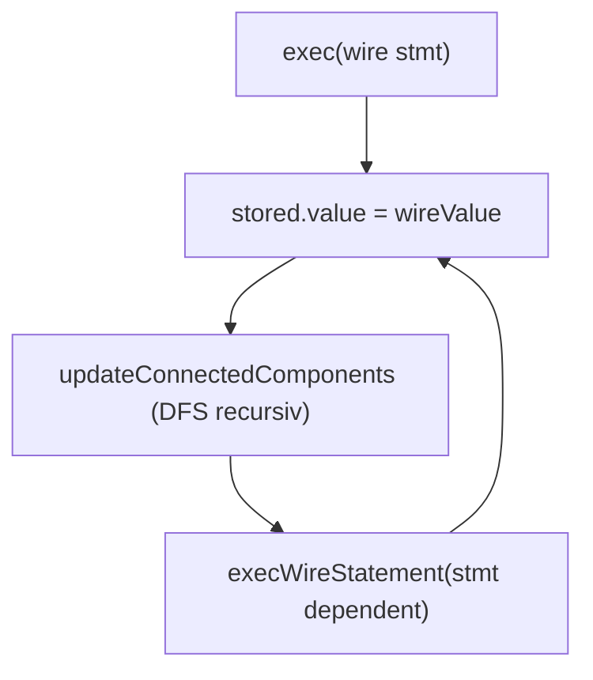
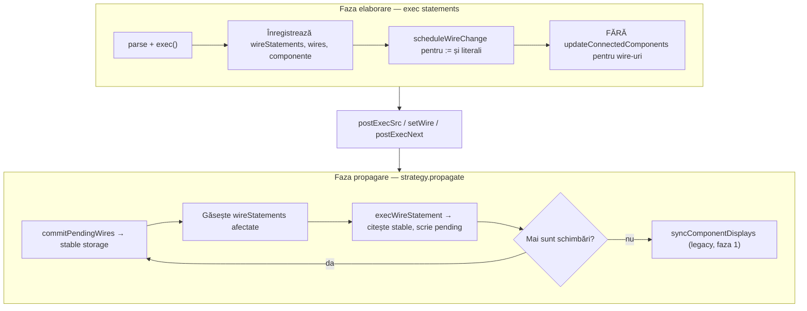
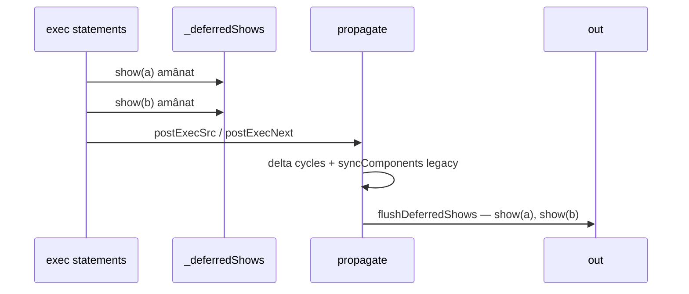
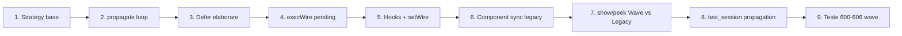

# Plan: Wave-based Signal Propagation

## Problema actuală

Fluxul curent tratează limbajul ca un program secvențial:



În [`interpreter.js`](v0_3_2/core/interpreter.js), fiecare declarație/assignment de wire scrie direct în `storage` și apelează imediat `updateConnectedComponents` (ex. L2533, L2880). Logica de cascadă (~1600 linii) trăiește în [`signal-propagation.js`](v0_3_2/core/signal-propagation.js) ca `Interpreter.prototype.updateConnectedComponents`.

[`SignalPropagationStrategy`](v0_3_2/core/signal-propagation.js) este un stub gol: `propagate()` iese imediat, iar `isStable()` are semantică inversată (`_dirty`).

Hook-urile `postExecSrc()` / `postExecNext()` → `startProc()` → `strategy.propagate()` există (L1403–1433) dar nu fac nimic util.

**Rezultat:** ordinea statement-urilor din sursă influențează rezultatul, contrar unui simulator de circuite.

---

## Model țintă (faza 1 — wire-uri)



**Principiu delta-cycle:** componentele citesc starea **stabilă** curentă și scriu în **pending**; commit-ul se face o dată per undă, apoi se re-evaluează statement-urile afectate.

---

## Ierarhie clase strategie

În [`signal-propagation.js`](v0_3_2/core/signal-propagation.js):

| Clasă | Rol |
|-------|-----|
| `SignalPropagationStrategy` | Bază abstractă: `bind(interp)`, `scheduleWireChange`, `commitPendingWires`, `propagate`, `wirePendingStates`, `wireCommitPendingStates` (Set/Mape per undă) |
| `WavePropagationStrategy` | **Default** — algoritm BFS/delta-cycle descris mai sus |
| `LegacyCascadePropagationStrategy` | Comportamentul actual (DFS prin `updateConnectedComponents`) — pentru compatibilitate explicită / debug |

Factory în [`components/index.js`](v0_3_2/core/components/index.js):

```js
function createSignalPropagationStrategy(kind = 'wave') {
  if (kind === 'legacy') return new LegacyCascadePropagationStrategy();
  return new WavePropagationStrategy();
}
```

**Default-uri per context:**

| Context | Default `kind` | Motiv |
|---------|----------------|-------|
| Editor (`app.js`) | `'wave'` | simulator nou |
| `test_session` / `run_tests` | `'legacy'` | suite existentă (PCB, REG, doc) scrisă pentru cascade; fără surprize la Run All |
| Teste signal 600–606 | `'wave'` explicit | validează WavePropagationStrategy |

---

## Modificări `Interpreter`

### 1. Constructor — strategie obligatorie

```js
constructor(funcs, out, pcbs, componentRegistry, signalPropagationStrategy) {
  this.signalPropagationStrategy =
    signalPropagationStrategy ?? createSignalPropagationStrategy();
  this.signalPropagationStrategy.bind(this);
}
```

Elimină toate guard-urile `if (!this.signalPropagationStrategy) return` din `postExecSrc`, `postExecNext`, `postExecBody`.

### 2. Poartă centrală pentru scriere wire

Adaugă metode delegate:

- `scheduleWireChange(name, value)` → `strategy.scheduleWireChange`
- `getWireStableValue(name)` → citește din `storage` via `wire.ref`
- `commitWireIfPending(name)` → folosit intern de strategie

### 3. Elaborare — oprește cascada imediată

În căile de exec wire din `exec()` (assignment L2503–2533, declarație cu expr L2753–2882, `:=` init L2647–2671):

| Situație | Comportament nou (WaveStrategy) |
|----------|--------------------------------|
| `wire q := 1` | Creează wire + storage slot; `scheduleWireChange(q, '1')`; **nu** propagă |
| `1wire a = 0` (literal) | Creează wire; `scheduleWireChange(a, '0')`; adaugă la `wireStatements` |
| `1wire b = NOT(a)` (expr) | Creează wire + slot; adaugă la `wireStatements`; **nu** evaluează expr acum |
| `b = MUX(...)` (reassignment) | Adaugă/actualizează `wireStatements`; **nu** scrie + cascadă |

`LegacyCascadePropagationStrategy` poate seta un flag `deferWireWrites = false` și păstra comportamentul vechi (pentru teste de regresie explicite).

### 4. `execWireStatement` — mod pending

Adaugă parametru/opțiune `target: 'stable' | 'pending'`:

- **`pending`** (în propagare): evaluează expr citind valori stabile; rezultatul merge în `scheduleWireChange`, nu în `stored.value`
- **`stable`** (legacy / final commit): comportament actual

REG (`REG(data, clk, clr)`) se evaluează în undă — citește `clk` stabil din unda curentă, ceea ce este **mai corect** pentru edge detection decât cascada DFS. Testele 700–703 ar trebui verificate după implementare; nu fac parte din criteriul de acceptare faza 1, dar nu necesită refactor REG separat dacă `execWireStatement` funcționează în undă.

### 5. `postExecSrc` / `postExecNext`

```js
postExecSrc() {
  this.signalPropagationStrategy.initializeFromElaboration();
  this.signalPropagationStrategy.propagate();
  this.signalPropagationStrategy.flushDeferredShows(); // Wave: golește coada show acumulate
}
postExecNext() {
  this.signalPropagationStrategy.onNextCycle();
  this.signalPropagationStrategy.propagate();
  this.signalPropagationStrategy.flushDeferredShows(); // Wave: show-uri de după ultimul NEXT
}
```

`initializeFromElaboration()`: colectează toate `:=` și declarațiile literale deja programate; construiește indexul de dependențe.

`flushDeferredShows()`: no-op pe Legacy; pe Wave evaluează coada `_deferredShows` în ordinea sursei și face `out.push`.

### 6. Index de dependențe wire (precomputat)

La finalul elaborării, construiește:

```js
// inputWireName → Set<wireStatement>
this._wireDependentsIndex = new Map();
```

Folosește `exprReferencesWire` (deja în signal-propagation.js L93) pe fiecare `wireStatement`. La commit, pentru fiecare wire schimbat, union statement-urile dependente — **fără** scan liniar O(n) per undă.

### 7. `setWire` / interacțiuni utilizator

În [`test_session.js`](v0_3_2/test_session.js) L86–91 și handlers switch/key din componente:

```js
setWire(name, val) {
  interp.scheduleWireChange(name, val);
  interp.signalPropagationStrategy.propagate();
}
```

**Nu** mai apela direct `updateConnectedComponents` pentru wire-uri când WaveStrategy e activă.

---

## Implementare `WavePropagationStrategy.propagate()`

Pseudocod:

```js
propagate() {
  if (!this._hasPendingChanges()) return;
  const maxWaves = this.wires.size * 2 + 10; // protecție bucle
  for (let wave = 0; wave < maxWaves; wave++) {
    const changed = this.commitPendingWires();
    if (changed.size === 0) break;

    const toExec = this.collectAffectedStatements(changed);
    let anyScheduled = false;
    for (const ws of toExec) {
      const outputs = this.interp.execWireStatementToPending(ws);
      if (outputs.some(([n,v]) => this.scheduleWireChange(n, v))) anyScheduled = true;
    }
    if (!anyScheduled) break;
  }
  this.resetPending();
  this.interp.syncComponentsAfterWireStable(changedAll); // faza 1: LED/display only
}
```

**Auto-referință** (`a = NOT(a)`, test 605): o singură execuție per undă per statement (Set `_executedThisWave`); unda următoare vede noul stable.

**MUX toggle** (test 602–603): `tg0` se schimbă în undă N; statement-ul `tg0 = MUX(...)` nu se re-execută în aceeași undă dacă `tg0` era input propriu — re-executare doar la unda N+1 când `tg0` committed.

---

## Ce rămâne pe legacy în faza 1

| Mecanism | Faza 1 | Faza 2 (viitor) |
|----------|--------|-----------------|
| Wire cascade (`wireStatements`) | WaveStrategy | — |
| `show(...)` | Wave: amânat, flush la `postExecSrc`/`postExecNext`; Legacy: imediat top-down | — |
| `peek(...)` | Immediat pe ambele strategii (nou în parser) | — |
| `updateComponentConnections` (componente UI) | Legacy; apelat în `syncComponentsAfterWireStable` **înainte** de flush show | Integrat în strategie |
| Property blocks `on:raise` / `on:1` / `on:edge` | Legacy; declanșate în sync post-propagate | Migrare în undă |
| REG cu `~` (NEXT-based) | Funcționează via `postExecNext` + `onNextCycle`; verificare test 701 | Rafinare dacă e nevoie |
| PCB `on:1` blocks (teste 500+) | Neschimbate în faza 1 | Faza 2 |

**Notă despre edge-triggered:** singurul caz „hardware edge” în wire-uri este REG (falling edge pe `clk` wire, L1053–1058 în interpreter). Blocurile `on:raise`/`on:1` sunt pe **componente/PCB**, nu pe wire-uri — rămân pe mecanismul vechi în faza 1, conform alegerii tale.

---

## `show` / `peek` — Opțiunea E + Variantă 1 (decizie finală)

### Principiu

Pe **Wave**, `show` este o **probă la graniță de simulare** (după propagate), nu un statement imperativ la mijlocul elaborării. Pe **Legacy**, `show` rămâne **top-down imediat** ca acum.

UI-ul (și factory-ul) vor permite alegerea strategiei: `createSignalPropagationStrategy('wave')` vs `'legacy'`. Exemplele din `fs.js` nu sunt constrângere — prioritatea e modelul corect pentru simulare.

### Comportament pe strategie

| | **WavePropagationStrategy** | **LegacyCascadePropagationStrategy** |
|---|---------------------------|--------------------------------------|
| `show(...)` | **Amânat** — pus în `_deferredShows`; executat la `flushDeferredShows()` | **Imediat** — `evalExpr` + `out.push` la exec (comportament actual) |
| `peek(...)` | **Imediat** — citește stable curent (poate fi incomplet în elaborare) | La fel ca `show` (sau alias) |
| Granițe flush `show` | `postExecSrc`, `postExecNext` | N/A — deja imediat |

### Variantă 1 — show-uri fără `NEXT` între ele

```logtscript
block 1
show(a)
block 2
show(b)
# fără NEXT
```

Pe Wave: ambele intră în coadă; la `postExecSrc` → `propagate()` → `flushDeferredShows()` rulează `show(a)` apoi `show(b)` **în ordinea sursei**. Ambele văd **aceeași stare stabilă finală** (după elaborarea întregului script + propagate). Nu există „timp” între ele — doar ordinea liniilor de output.

### show intercalat cu `NEXT` — cazul cu sens

```logtscript
block
NEXT(1)
show(a)       # în coadă segment A
block 2
NEXT(1)
show(b)       # în coadă segment B
```

Flux exec:

1. `block` — elaborare
2. `NEXT(1)` → `postExecNext` → propagate → **flush** → `show(a)` vede starea după primul tick
3. `block 2` — elaborare (poate adăuga wire-uri noi)
4. `NEXT(1)` → propagate → **flush** → `show(b)` vede starea după al doilea tick

Sau:

```logtscript
block
NEXT(1)
show(a)
NEXT(1)
show(b)
```

Fiecare `NEXT` golește coada de `show` acumulate **de la ultimul flush**; fiecare probă e după un propagate distinct.



### Implementare

**Parser** — adaugă `peek()` analog `show()` → `{ peek: args }`.

**`exec()` la `s.show`:**

```js
if (s.show) {
  if (this.signalPropagationStrategy.deferShow) {
    this.signalPropagationStrategy.enqueueShow(s);
    return;
  }
  this._execShowImmediate(s); // Legacy + cod existent L1487–1632 extras în metodă
}
if (s.peek) {
  this._execShowImmediate(s); // mereu imediat
}
```

**`WavePropagationStrategy`:**

- `deferShow = true`
- `enqueueShow(stmt)` → `_deferredShows.push(stmt)`
- `flushDeferredShows()` → pentru fiecare stmt din coadă: `_execShowImmediate`; golește coada
- Apelat la finalul `postExecSrc` / `postExecNext` (după `propagate()`)

**`LegacyCascadePropagationStrategy`:**

- `deferShow = false` — `show` imediat, fără coadă

### Faza 1 — componente pe legacy și impact la `show`

În faza 1, property blocks (`on:1`, `on:raise`) și `updateComponentConnections` rămân pe mecanismul legacy. Implicații pentru `flushDeferredShows`:

1. `propagate()` Wave stabilizează **wire-urile**
2. Apoi `syncComponentsAfterWireStable()` rulează logica legacy (display LED, property blocks declanșate de wire-uri schimbate)
3. **Abia după** pasul 2, `flushDeferredShows()` evaluează `show(.comp:get)` — altfel componentele ar putea fi în urmă față de wire-uri

Ordine obligatorie în `postExecSrc` / `postExecNext`:

```
propagate()  →  syncComponentsAfterWireStable()  →  flushDeferredShows()
```

Pentru `.c:set = 1` executat în elaborare (legacy imediat): starea componentei e deja actualizată la momentul flush; `show(.c:get)` citește valoarea corectă. Dacă `.c:set` depinde de un wire schimbat doar în propagate, sync-ul legacy de la pasul 2 trebuie să fi rulat înainte de show.

### Teste

- `show` / `peek` — **nu** apar în `test_suite_ported.js` (zero impact CI faza 1)
- Smoke manual opțional în editor: Wave + `NEXT` + `show`; Legacy + `show` mid-script neschimbat

### Notă tehnică

`Interpreter.EXEC_DISPATCH.show = '_execShow'` (L6886) nu are implementare — refactor: extrage logica existentă în `_execShowImmediate(s)` reutilizată de ambele strategii.

---

## Bug de corectat

În [`test_session.js`](v0_3_2/test_session.js) L15–20, `_ensureSignalPropagationStrategy()` asignează greșit la `this.registry` în loc de `this.signalPropagationStrategy`.

---

## Fișiere de modificat

1. [`v0_3_2/core/signal-propagation.js`](v0_3_2/core/signal-propagation.js) — clase strategie + logică wave; extrage index dependențe; păstrează helper-ele `exprReferencesWire` etc.
2. [`v0_3_2/core/interpreter.js`](v0_3_2/core/interpreter.js) — elaborare fără cascadă; `execWireStatement` pending; hooks postExec; constructor obligatoriu
3. [`v0_3_2/core/components/index.js`](v0_3_2/core/components/index.js) — factory cu `WavePropagationStrategy` default
4. [`v0_3_2/test_session.js`](v0_3_2/test_session.js) — `createSession(options)`, fix bug, `setWire` via strategie
5. [`v0_3_2/test_suite.js`](v0_3_2/test_suite.js) — `registerTest(..., options)`, `getTest(id)`, `createSession(opts)`
6. [`v0_3_2/test_suite_ported.js`](v0_3_2/test_suite_ported.js) — `{ propagation: 'wave' }` pe reg 600–606
7. [`v0_3_2/run_tests.js`](v0_3_2/run_tests.js) — `entryForTest` + `runOneTest` cu `test.propagation`
8. [`v0_3_2/ui/app.js`](v0_3_2/ui/app.js) — `scheduleWireChange` + `propagate`; toggle Wave/Legacy incremental
9. [`v0_3_2/core/parser.js`](v0_3_2/core/parser.js) — keyword `peek(...)` analog `show(...)`

---

## Testare — `run_tests` + `test_session`

### API `createSession(options)`

[`test_session.js`](v0_3_2/test_session.js) primește opțiuni la creare:

```js
function createSession(options = {}) {
  const propagation = options.propagation ?? 'legacy'; // default legacy
  // ...
  signalPropagationStrategy: createSignalPropagationStrategy(propagation),
}
```

Corectează bug-ul actual: `_ensureSignalPropagationStrategy()` asignează greșit la `this.registry`.

Sesiunea expune `session.propagation` (`'legacy'` | `'wave'`) pentru ramificări în `setWire` / `postExecNext`.

### Metadata pe `reg` — decizie finală

**Semnătură** în [`test_suite.js`](v0_3_2/test_suite.js) — actualizează **ambele**: `reg` (folosit în corpul fișierului) și `registerTest` (exportat pentru `test_suite_ported.js`):

```js
function registerTest(id, group, title, run, options = {}) {
  const propagation = options.propagation ?? 'legacy';
  tests.push({ id, group, title, run, propagation });
}
```

[`test_suite_ported.js`](v0_3_2/test_suite_ported.js) folosește `suite.registerTest` — același al 5-lea argument.

**Exemplu test signal** — corpul testului neschimbat, doar metadata:

```js
reg(600, 'signal', 'wire simplu — propagare cascadat', function(h, session) {
  const { interp } = session.run(`...`);
  session.setWire(interp, 'a', '1');
  h.assert('600 b=NOT(a)', session.getWire(interp, 'b'), '0');
}, { propagation: 'wave' });
```

Teste cu `{ propagation: 'wave' }` în faza 1: **600, 601, 602, 603, 604, 605, 606** + test nou paralelism (607 sau id liber).

### `run_tests.js` — propagare din metadata

Adaugă lookup pe obiectul test complet (nu doar `run`):

```js
// test_suite.js — export nou
getTest(id) {
  return this.tests.find(t => t.id === id) ?? null;
}

// run_tests.js
function entryForTest(entry) {
  const t = suite.getTest(entry.id);
  return {
    id: entry.id,
    title: entry.title,
    group: entry.group,
    run: t?.run ?? null,
    propagation: t?.propagation ?? 'legacy',
  };
}

async function runOneTest(test) {
  const session = suite.createSession({ propagation: test.propagation ?? 'legacy' });
  // ... rest neschimbat
}
```

Testele nu creează session propriu — harness-ul din `runOneTest` furnizează session-ul corect via metadata.

### Ce strategie folosește fiecare grup

| Grup | ID-uri | `propagation` | Notă |
|------|--------|---------------|------|
| repeat … registry | 6–223 | omis → **legacy** | |
| doc, doc-comp | 300–427 | omis → **legacy** | |
| pcb | 500–515 | omis → **legacy** | |
| **signal** | **600–606** (+607) | **`'wave'`** pe `reg` | |
| reg | 700, 702, 703 | omis → **legacy** | |
| **reg** | **701** | omis → **legacy** | REG cu `~` + `NEXT` — referință legacy |
| **reg** | **704** (nou) | **`'wave'`** | același scenariu ca 701, strategie wave |

### Test 701 — REG cu clock `~` și `NEXT` (legacy + wave)

**Număr:** [`701`](v0_3_2/test_suite_ported.js) — titlu „REG cu clock ~ — NEXT-based”.

Sursă testată:

```logtscript
1wire data = 1
1wire read = REG(data, ~, 0)
```

Flux în test: `run` → `read=0` → `NEXT(1)` + `postExecNext` → `read=1` → `setWire(data,0)` fără NEXT → `read=1` (hold) → `NEXT(2)` → `read=0`.

**De ce merită ambele strategii:** REG cu `~` folosește `cycle` și `regPendingMap`; `NEXT` avansează ciclul și re-evaluează wire-uri. Wave schimbă *când* se propagă `read` față de legacy — testul 701 validează că comportamentul REG+NEXT rămâne identic.

**Implementare fără duplicare de logică** — funcție partajată + două `reg`:

```js
function runReg701NextBased(h, session) {
  const { interp } = session.run(`
1wire data = 1
1wire read = REG(data, ~, 0)`);
  h.assert('initial read=0', session.getWire(interp, 'read'), '0');
  session.execNext(interp, 1);   // wrapper: exec({next}) + postExecNext
  h.assert('dupa NEXT(1) read=1', session.getWire(interp, 'read'), '1');
  session.setWire(interp, 'data', '0');
  h.assert('data=0 fara NEXT → read=1', session.getWire(interp, 'read'), '1');
  session.execNext(interp, 1);
  h.assert('dupa NEXT(2) read=0', session.getWire(interp, 'read'), '0');
}

reg(701, 'reg', 'REG cu clock ~ — NEXT-based', runReg701NextBased);
// legacy implicit

reg(704, 'reg', 'REG cu clock ~ — NEXT-based (wave)', runReg701NextBased, {
  propagation: 'wave',
});
```

**Manifest:** adaugă intrare `{ id: 704, group: 'reg', title: '...' }` în [`test_manifest.js`](v0_3_2/test_manifest.js) (ID **704** e liber).

**Prefix assert:** la 704, prefixează mesajele cu `704` sau folosește `const prefix = session.propagation === 'wave' ? '704' : '701'` în funcția partajată ca să distingi eșecurile în UI.

### `setWire` / `postExecNext` în test_session

Trebuie să respecte strategia sesiunii:

```js
setWire(interp, name, val) {
  if (this.propagation === 'wave') {
    interp.scheduleWireChange(name, val);
    interp.signalPropagationStrategy.propagate();
  } else {
    // legacy: comportament actual
    interp.setValueAtRef(w.ref, val);
    interp.updateConnectedComponents(name, val);
  }
}
```

Adaugă helper **`session.execNext(interp, count = 1)`** — înlocuiește perechea `interp.exec({ next: count }); interp.postExecNext();` din testul 701/704:

```js
execNext(interp, count = 1) {
  interp.exec({ next: count });
  interp.postExecNext(); // wave: onNextCycle + propagate + flushDeferredShows
}
```

### `run_tests.js` — UI faza 1

- Run All / Run group: propagare automată din metadata `reg` — fără checkbox suplimentar
- Opțional viitor: badge în UI „wave” pe rândurile testelor cu `propagation: 'wave'`

### Criterii testare

1. **Run All cu default legacy** — testele fără metadata trec neschimbate
2. **Grup signal** — 600–606 (+607) pe wave
3. **701 legacy + 704 wave** — același scenariu REG(`~`)+NEXT; ambele trec

---

## Criterii de acceptare (faza 1)

Teste din [`test_suite_ported.js`](v0_3_2/test_suite_ported.js):

- **600** — cascadă NOT(NOT(a)) după setWire
- **601** — cascadă 4 niveluri
- **602** — MUX toggle
- **603** — counter binar cascadat
- **604** — propagare oprită când valoarea nu se schimbă
- **605** — auto-referință o singură evaluare per undă
- **606** — multi-decl propagare individuală
- **701** — REG(`~`)+NEXT pe **legacy**
- **704** — același scenariu ca 701 pe **wave**

Test suplimentar recomandat (nou, mic):

```logtscript
1wire A := 1
1wire B := 0
1wire X = NOT(A)
1wire Y = AND(X, A)
1wire Z = NOT(B)
1wire T = AND(Z, B)
```

După `postExecSrc`, ordinea sursă nu trebuie să conteze; X=0, Y=0, Z=1, T=0 — confirmă paralelismul pe ramuri.

---

## Ordine implementare recomandată

1. Bază `SignalPropagationStrategy` + `bind` + `scheduleWireChange` / `commitPendingWires`
2. `WavePropagationStrategy.propagate()` minimal (fără component sync)
3. Modifică elaborarea wire în `interpreter.js` (defer writes)
4. `execWireStatement` mod pending + index dependențe
5. Conectează `postExecSrc` / `setWire` (ordine: propagate → sync legacy → flush shows)
6. `syncComponentsAfterWireStable` (legacy faza 1 — înainte de `flushDeferredShows`)
7. **`show` amânat + `peek` imediat** pe Wave; Legacy păstrează show imediat; parser `peek`
8. `LegacyCascadePropagationStrategy` + factory `kind: 'wave' | 'legacy'`
9. **reg metadata** + `getTest` + `run_tests` propagation
10. Rulează Run All (legacy default) + verificare grup signal (wave via metadata)


