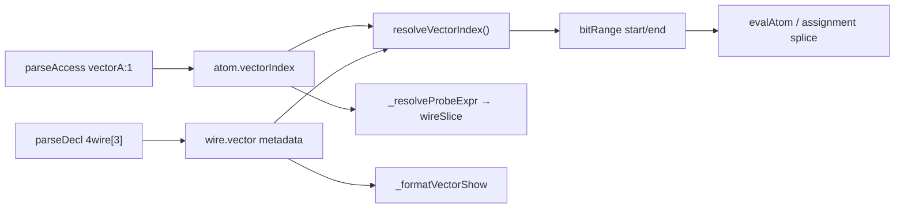

# 1D Wire Vectors (`4wire[3]`)

> **Plan canonic (repo):** [`.cursor/plans/wire_vectors_1d.plan.md`](wire_vectors_1d.plan.md)  
> Copie Cursor IDE: `c:\Users\adypa\.cursor\plans\1d_wire_vectors_32027f14.plan.md` — mențineți ambele sincronizate.

## Scop

Vectori 1D: declarație `Nwire[count] name`, acces element `name:i` / `name:(indexWire)`, inițializare și bit-range existente pe același wire subiacent. **Fără** dimensiuni multiple în V1 (`4wire[3,3]` — doar documentat ca extensie viitoare).

Exemple declarație:

```logts
4wire[3] vectorA
8wire[16] memoryRow
1wire[32] bits
```

`4wire[3] vectorA` = un wire de **12 biți** (trei elemente × 4 biți), cu metadata pentru indexare și afișare.

## Decizii de design (confirmate + recomandate)

| Subiect | Decizie |
|---------|---------|
| Stocare | Un singur wire de `elementWidth × elementCount` biți; metadata `wire.vector = { elementWidth, elementCount }` |
| Element 0 | **MSB** — aliniat cu convenția existentă „bit 0 = MSB” din [`interpreter.js`](v0_3_2/core/interpreter.js) (~3222) |
| Traducere index | `vectorA:i` ≡ `vectorA.(i×W)/W` unde `W = elementWidth` |
| Index dinamic | `vectorA:(index)` — **doar nume de wire** în paranteze (ca regula din spec); `start = index × W` |
| Assign element | Read-modify-write pe slice (calea existentă pentru `target.bitRange` în `_execAssignment`, ~5757–5761) |
| Tip afișat | `4wire[3]` în Variables / show / peek / Zlist header; `getBitWidth` returnează **12** (biți totali) |
| Variables panel | O linie plată + truncare `...` existentă via `formatValue(..., true)`; tip `4wire[3]` nu `12wire` ([`app.js`](v0_3_2/ui/app.js) `buildVarsSnapshot`) |
| Init | `:=`, `=:`, `=`, `:` — aceleași reguli ca wire plat; lățime totală = `elementWidth × count` |
| Multidim | Parse error clar la `4wire[3,3]` |
| Index invalid | Eroare runtime dacă `index < 0` sau `index ≥ elementCount` |
| `bit[3]` | **Nu** în V1 — doar sufixul `wire` |
| `Zlist` | Doar nume wire întreg: `Zlist(vectorA)` — **nu** `Zlist(vectorA:1)` |

### Reprezentare internă (echivalențe)

| Sintaxă vector | Bit-range echivalent | Exemplu `4wire[3]`, valoare `111100110101` |
|----------------|---------------------|---------------------------------------------|
| `vectorA:0` | `vectorA.0/4` | `1111` (MSB) |
| `vectorA:1` | `vectorA.4/4` | `0011` |
| `vectorA:2` | `vectorA.8/4` | `0101` |
| `vectorA:(index)` | `vectorA.(index×4)/4` | `index` = wire; `4` = elementWidth |

Primul element declarat = biți cei mai semnificativi. Vectorul **nu** creează stocare separată per element.

### Relație cu wire plat

```logts
4wire[3] vectorA   // metadata + indexare + show bogat
12wire flat        // același număr de biți, fără metadata vector
```

Toate operațiile pe wire-uri funcționează pe vectori (sunt un singur wire contiguu).

## Arhitectură



**Recomandare cheie:** nu duplica logica de extract/splice — `vectorIndex` se rezolvă la `{start, end}` apoi se folosește codul existent pentru `bitRange`.

---

## 1. Parser — [`parser.js`](v0_3_2/core/parser.js)

### 1a. Declarație `Nwire[count]`

În `var()` și `mixedVar()`, imediat după `eat('TYPE')`:

```javascript
// după type = "4wire"
if (SYM '[') {
  eat count (DEC sau BIN, >= 1)
  eat ']'
  reject dacă urmează ',' (multidim → error)
  decl.vectorCount = count
}
```

- `decls.push({ type, name, vectorCount?, line, col })`
- `4wire[3] a, b` — fiecare decl primește propriul `vectorCount`
- `4wire[0]` — reject la parse (`count >= 1`)

### 1b. Acces element `name:index`

În ramura `atom()` pentru ID simplu (după `name`, **înainte** de `.` bit-range), adăugare:

```
if SYM ':' :
  if BIN|DEC → vectorIndex: parseInt
  else if '(' :
    if ID și ')' → vectorIndexExpr: [{ var: wireName }]  // un singur wire
    else → error "Only wire names supported in vector index (...)"
  else → error
```

**Fără conflict** cu `comp:prop` — componentele folosesc prefix `.` ([`parser.js`](v0_3_2/core/parser.js) ~2779).

Atom rezultat: `{ var, vectorIndex }` sau `{ var, vectorIndexExpr }`.

Exemple:

```logts
4wire a = vectorA:0
4wire b = vectorA:1
4wire value = vectorA:(index)   // index = nume wire, nu expresie
```

### 1c. Assignment `vectorA:1 = ...`

Extinde `peekNextIsAssign()` (~70) să accepte și pattern `:digits =` / `:(id) =` (similar cu skip-ul pentru `.start/len`).

```logts
vectorA:1 = 0011   // doar elementul 1 se modifică
```

---

## 2. Interpreter — core — [`interpreter.js`](v0_3_2/core/interpreter.js)

### 2a. Helpers noi

```javascript
getWireVectorMeta(wire) → { elementWidth, elementCount } | null
getWireTypeLabel(wire) → '4wire[3]' sau wire.type
getBitWidthFromDecl(decl) → elementWidth * vectorCount dacă vectorCount
resolveVectorIndex(wire, vectorIndexAtom) → { start, end }
vectorIndexToBitRange(wire, idxAtom) → obiect bitRange pentru evalAtom
_vectorElementLabel(varName, index) → 'vectorA:1'
```

La înregistrare wire (în `execWireStatement` / decl path, ~6200):

```javascript
if (decl.vectorCount) {
  const ew = getBitWidth(decl.type); // 4 din "4wire"
  wire.vector = { elementWidth: ew, elementCount: decl.vectorCount };
  wire.type = `${ew * decl.vectorCount}wire`; // compatibilitate getBitWidth existent
}
```

Alternativ: păstrează `type` total și adaugă doar `vector` — important ca `getBitWidth(wire.type)` să dea lățimea totală.

### 2b. `evalAtom`

La începutul handling-ului pentru `a.var` (wire), dacă `a.vectorIndex` / `a.vectorIndexExpr`:

1. Verifică `wire.vector`; altfel eroare „`name` is not a vector”
2. `bitRange = vectorIndexToBitRange(...)`
3. Continuă pe calea `a.bitRange` existentă (~3209)

Pentru index dinamic, evaluare index wire → `start = idx * elementWidth`, `end = start + elementWidth - 1`.

### 2c. Assignment

În `_execAssignment` (~5311), înainte de blocul slice:

- Dacă `target.vectorIndex` → traduce la `target.bitRange` via `resolveVectorIndex`
- Folosește `resolveBitRange` pentru orice `target.bitRange.isDynamic` (îmbunătățire utilă și pentru bit-range dinamic pe LHS)

### 2d. `expectedWireDeclBitTotal`

Folosește `getBitWidthFromDecl(d)` care înmulțește `vectorCount` — inițializare `= ^FF0` / concat / `:=` / `=:` rămâne pe total biți.

Exemple init echivalente pentru `4wire[3] vectorA`:

```logts
vectorA = ^FF0
vectorA = 111111110000
vectorA = 1111 + 1111 + 0000
```

---

## 3. `show` și `peek` — același formatter

Ambele apelează `_execShowImmediate` (~4269, ~4641). **Un singur helper** `_formatVectorShow`.

### Output — vector întreg (`show(vectorA)` / `peek(vectorA)`)

```text
vectorA = 111111110000 (12bit)
:0 = 1111 (4bit)
:1 = 1111 (4bit)
:2 = 0000 (4bit)
vectorA has length [3]
```

- Dacă `elementCount > 5`: primele 3 elemente, rând `..`, ultimul element `:N-1`
- Dacă `elementCount ≤ 5`: toate elementele
- Linie finală: `{name} has length [{count}]`

### Output — element singur (`show(vectorA:1)` / `peek(vectorA:1)`)

```text
vectorA:1 = 1111 (4bit)
vectorA has length [3]
```

### Implementare `_execShowImmediate`

- Detectează wire cu `vector` sau atom cu `vectorIndex`
- Pentru vector întreg: `out.push` per linie (nu `results.join(', ')`)
- Argumente mixte (`show(vectorA, plainWire)`): preferat **câte un `out.push` per linie**

### Diferență show vs peek (nemodificată)

- **Wave:** `show` amânat până la settle; `peek` imediat ([`debug.md`](v0_3_2/doc/debug.md))
- Formatarea vectorului este **identică**

---

## 4. `probe` — fix `wireSlice` (bit-range + vector index)

### Context

`probe(a.4/4)` și `probe(vectorA:1)` folosesc același tip de țintă internă: **`kind: 'wireSlice'`** (slice din wire-ul părinte). Parserul și `_resolveProbeExpr` pentru `bitRange` există deja; **citirea și notificarea la schimbare** sunt incomplete. Fix-ul este **unul singur** — regresie pentru wire plat + suport nou pentru index vector.

### Stare actuală (bug pre-existent pe bit-range)

| Punct | Cod | Problemă |
|-------|-----|----------|
| Parse | `probe(expr)` | OK — `probe(data.4/4)` și `probe(vectorA:1)` parsează |
| Rezolvare | `_resolveProbeExpr` (~1504) | `bitRange` → `wireSlice` OK; **`vectorIndex` lipsește** |
| Citire | `_readProbeTargetValue` (~1569) | **Fără ramură `wireSlice`** → `null` la `activateProbes` / `refreshProbeOutputs` |
| Notificare | `_emitProbeForWire` (~1669) | Doar probe wire întreg; **slice-urile nu primesc `changed`** |
| Model corect | `_emitWatchRowForWire` (~1405) | Watch pe slice funcționează — **copiem pattern-ul** |

### Modificări V1 (obligatorii)

1. **`_readProbeTargetValue`**: ramură `wireSlice` → `_readWireSliceValue(target)` (identic cu `_readWatchTargetValue` ~1339)
2. **`_emitProbeForWire(name, fullValue)`**: pentru fiecare `probeTarget` cu `kind === 'wireSlice' && wireName === name`, extrage slice din `fullValue`, apelează `_emitProbeTarget` (ca `_emitWatchRowForWire` ~1409–1413)
3. **`_resolveProbeExpr`**: dacă `atom.vectorIndex` / `vectorIndexExpr` pe wire cu `vector` metadata → `wireSlice` cu:
   - `label`: `_vectorElementLabel(var, index)` → `vectorA:1` (nu `vectorA.4-7`)
   - `sliceStart` / `sliceEnd` din `resolveVectorIndex`
   - `bitWidth`: `elementWidth`
4. **`probe(wire)` întreg** — neschimbat (`kind: 'wire'`)
5. **`probe(wire)` în ZSTATE** — `_probeDriverSuffix` neschimbat

### Ce funcționează după fix

| Expresie probe | Țintă | Label exemplu |
|----------------|-------|---------------|
| `probe(data)` | `wire` | `data` |
| `probe(data.4/4)` | `wireSlice` | `data.4-7` |
| `probe(vectorA)` | `wire` | `vectorA` |
| `probe(vectorA:1)` | `wireSlice` | `vectorA:1` |

### Format output (nemodificat)

Wire plat, bit-range:

```text
# data.4-7 = 0011 (&0.4-7) - initialised
# data.4-7 = 0101 (&0.4-7) - changed
```

Vector index:

```text
# vectorA:1 = 0011 (&0.4-7) - initialised
# vectorA:1 = 0101 (&0.4-7) - changed
```

### Documentație

[`debug.md`](v0_3_2/doc/debug.md) — notă: `probe(wire.start/len)` și `probe(vector:i)` sunt suportate după fix-ul `wireSlice` (nu doar wire întreg).

---

## 5. `Zlist` — verificare cod + modificări necesare

### Stare actuală

| Punct | Cod | Acțiune |
|-------|-----|---------|
| Sintaxă | `Zlist(wireName)` — doar ID (~1658) | OK — fără `Zlist(vectorA:1)` |
| Header | `_execZlist` (~2239) | `getWireTypeLabel(wire)` → `vectorA (4wire[3])` |
| Driver match | `_gatherWireDrivers` (~2171) | OK — `target.var === 'vectorA'` pentru `vectorA:1 = x` |
| Driver label | `_formatWireDriverLabel` (~2116) | `vectorA:1 = expr` când `target.vectorIndex` |
| Driver value | `_evalWireDriverContribution` (~2159) | **Gap:** `execWireStatement` ignoră slice/index pe LHS |

### Modificare `_evalWireDriverContribution` (obligatorie)

Pentru assignment cu slice/index:

1. Citește valoarea curentă wire
2. Evaluează RHS la lățimea elementului
3. Splice (ca `_execAssignment` ~5757–5761)
4. Returnează wire complet merged pentru linia `(active)`

Corectează și `bus.4/4 = …` (limitare pre-existentă).

### Output Zlist exemplu

```text
vectorA (4wire[3]):
-> vectorA:1 = 0011
  -> (active) vectorA:1 = 0011 = 111100110000
(resolved) = 111100110000
```

`probe(vectorA)` în ZSTATE beneficiază de label-uri `vectorA:1 = …` via `_gatherWireDrivers`.

---

## 6. UI — [`app.js`](v0_3_2/ui/app.js) + [`script_editor_v0_3_2.html`](v0_3_2/script_editor_v0_3_2.html)

- **`buildVarsSnapshot`**: `getWireTypeLabel(w)` → `4wire[3]`; valoare plată cu truncare `...` existentă (comportament actual păstrat)
- **CodeMirror** (~2293): `\d+(?:wire|bit|w|b)(?:\[\d+\])?`

---

## 7. Documentație (engleză)

Fișier nou [`v0_3_2/doc/wire-vectors.md`](v0_3_2/doc/wire-vectors.md) — conținut din spec:

- Syntax (`Nwire[count]`)
- Initialization (hex, binary, concat)
- Element access static / dynamic
- Bit ranges pe wire subiacent
- Display (`show` / `peek` — formatele de mai sus)
- Relationship to normal wires
- Internal representation (tabel echivalențe)
- Future extensions (`4wire[3,3]`, `matrix:1:2` — **nu implementat**)
- ZCONN / ZCONNECT: vector întreg vs element (secțiunea 10 din plan)

Cross-links:

- [`doc-index.json`](v0_3_2/doc/doc-index.json) — Reference: „Wire vectors”
- [`debug.md`](v0_3_2/doc/debug.md) — show/peek vectori; **probe pe slice** (`probe(wire.4/4)`, `probe(vectorA:1)`) după fix wireSlice
- [`assignment-operators.md`](v0_3_2/doc/assignment-operators.md) — declarație vector + assign element
- [`short-notation.md`](v0_3_2/doc/short-notation.md) — `vectorA:0` **în afara** backticks în V1; extensie viitoare în zone `` ` ``

Rulare: `node v0_3_2/node/_gen_doc_data.js`

---

## 8. Teste — [`test_suite.js`](v0_3_2/tests/test_suite.js)

### Grup `wire-vectors` — ID **1684–1701** (după 1683 MAC)

| ID | Scop |
|----|------|
| 1684 | Declarație `4wire[3]` → lățime 12 biți, metadata |
| 1685 | Init `= ^FF0` echivalent cu concat |
| 1686 | Acces static `:0`, `:1`, `:2` (MSB order) |
| 1687 | Assign element `vectorA:1 = 0011` fără a altera restul |
| 1688 | Index dinamic `vectorA:(index)` |
| 1689 | Bit-range cross-boundary `vectorA.3/6` pe același wire |
| 1690 | `show(vectorA)` format complet (≤5 elemente) |
| 1691 | `show(vectorA)` truncare elemente (>5 elemente, ex. `1wire[8]`) |
| 1692 | `show(vectorA:1)` + linie length |
| 1693 | Eroare: index out of bounds |
| 1694 | Eroare: `plainWire:0` pe wire fără vector |
| 1695 | Eroare parse: `4wire[3,3]` |
| 1696 | Echivalență `4wire[3]` vs `12wire` la operații wire |
| 1697 | `peek(vectorA)` — același format multi-line ca show |
| 1698 | `probe(vectorA:1)` — initialised + changed la assign element |
| 1699 | `probe(vectorA)` — changed la assign întreg sau element |
| 1700 | `Zlist(vectorA)` MODE ZSTATE — header `4wire[3]`, driver `vectorA:1 = …` |
| 1701 | Zlist — `(resolved)` corect după splice element (nu doar RHS) |

### Grup `probe` — ID **1702–1703** (regresie wire plat + bit-range)

Aceleași fix-uri `wireSlice` ca pentru vectori; **fără** sintaxă vector în script.

| ID | Scop |
|----|------|
| 1702 | `probe(data.4/4)` pe `8wire data` — `initialised` la RUN, `changed` după `data = …` (legacy propagation) |
| 1703 | Același scenariu cu `{ propagation: 'wave' }` (pattern ca testele 821–822) |

**Scenariu tipic test 1702:**

```logts
8wire data = 11110000
probe(data.4/4)
// RUN → output conține # data.4-7 = 0000 … - initialised
data = 11111111
// RUN sau pas propagare → # data.4-7 = 1111 … - changed
```

Assert pe linii `# data.4-7 = …` (valoare slice, nu wire întreg).

Manifest: `node v0_3_2/node/_gen_test_manifest.js`  
Suite: `node v0_3_2/node/_run_test_suite_node.js`

---

## 9. Out of scope / viitor (V1)

| Subiect | Decizie |
|---------|---------|
| Short notation | Amânăm `` `vectorA:0` `` → **V1.5** [v1.5_shortnotation_watch.plan.md](v1.5_shortnotation_watch.plan.md) |
| BOOL filt / simplify | Nu extinde în V1; vectorii = wire-uri la analiză booleană |
| Chip/board pins | `4wire[3]` ca pin pe chip/board — out of scope V1 |
| Multidim | `4wire[3,3]`, `matrix:1:2` — doar în doc ca extensie viitoare |
| `watch(vectorA:0)` | **V1.5** [v1.5_shortnotation_watch.plan.md](v1.5_shortnotation_watch.plan.md) — expand via `vectorIndex` + bitRange element |
| `Zlist(vectorA:1)` | Nu — doar wire întreg |
| **ZCONN / ZCONNECT pe element** (`vectorA:1 = ZCONNECT(en, data)`) | **Nu în V1** — vezi secțiunea 10 |
| **ZCONN pe vector întreg** (`vectorA = ZCONNECT(en, data12)`) | **Da** — vector = wire de 12 biți |
| **Element ca sursă date** (`bus = ZCONNECT(en, vectorA:1)`) | **Da** dacă `bus` și element au aceeași lățime (ex. 4 bit) |

---

## 10. ZCONN / ZCONNECT și vectori

### Ce merge în V1 (fără cod suplimentar)

| Formă | Suport |
|-------|--------|
| `vectorA = ZCONNECT(cpuEn, romData)` | **Da** — `data` = **12 biți** (lățime totală vector) |
| `ZCONNECT(vectorA, cpuEn, romData)` | **Da** — statement sugar; bus = nume wire întreg |
| `4wire lane = ZCONNECT(en, vectorA:1)` | **Da** — elementul e **RHS** (4 biți); lățimea trebuie să coincidă |
| `vectorA:1` în expresii citite de alți driveri | Da (via `evalAtom` / index) |

### Ce nu merge / nu e în scope V1

| Formă | Motiv |
|-------|--------|
| `ZCONNECT(vectorA:1, en, data)` | Parser: primul argument = **nume wire simplu** (`ID`), nu `vectorA:1` |
| `vectorA:1 = ZCONNECT(en, data)` ca **bus tristate** cu merge multi-driver | Assignment pe slice folosește **splice direct** (`_execAssignment` ~5757), nu coada de contribuții ZSTATE (`deferWirePropagation` + `queueWireContribution` — doar când **nu** e `range` pe LHS, ~5703) |
| `vectorA:1 = ZCONNECT(en, data)` cu `en=0` | Pe slice, `zConnectNoDrive` nu e tratat (~5714 doar pentru wire întreg); `en=0` riscă eroare lățime (RHS gol vs 4 biți) |
| Conflict `X` între doi driveri pe **același element** | Necesită merge ZSTATE pe slice — **nu** implementat în V1 |

### Recomandare utilizare

- Magistrală partajată pe vector **întreg**: `vectorA = ZCONNECT(en, fullData)` (12 biți).
- Lane de 4 biți din vector ca **sursă** spre alt bus: `lane = ZCONNECT(en, vectorA:1)`.
- Pentru tristate pe un singur element: în V1 folosiți **wire separat** `4wire lane` sau manipulați vectorul întreg + mască; **nu** `vectorA:1 = ZCONNECT(…)`.

### Viitor (opțional)

Driver ZSTATE pe slice/index: contribuție parțială la coadă, merge doar pe biții `[start..end]`, restul wire-ului nemodificat de acel driver — proiect separat de vectorii de bază.

## Ordine implementare

1. Parser: decl `[n]` + `vectorIndex` în atom + `peekNextIsAssign`
2. Interpreter: metadata wire + `resolveVectorIndex` + `evalAtom` + assignment
3. **Probe wireSlice fix** (`_readProbeTargetValue`, `_emitProbeForWire`) — poate fi verificat imediat cu teste **1702–1703**
4. `_resolveProbeExpr` + `vectorIndex` (după ce metadata vector există)
5. show/peek: `_formatVectorShow` multi-line
6. Zlist: type label + driver label + splice contribution eval
7. Variables type label + CodeMirror
8. Teste 1684–1703 + manifest
9. Doc + `_gen_doc_data.js`
