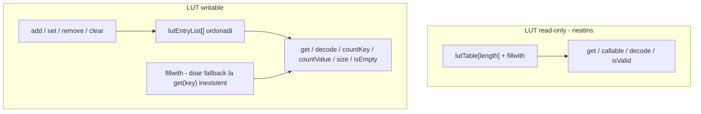

# Plan: Writable Inline LUT

## Obiectiv

Permite modificarea runtime a intrărilor unui `inline [lut]` când atributul `writable` este prezent. Fără `writable`, comportamentul rămâne read-only (ca acum).

**Domeniu confirmat:** doar [`inline [lut]`](v0_3_2/core/interpreter.js).

**`comp [lut]` — confirmat out of scope** (nu se extinde acum). Modulul `lut-writable.js` rămâne reutilizabil pentru o extensie viitoare (~30% efort suplimentar: device layer + propagare wave).

---

## Context — ce există acum

| Capabilitate | Status | Fișier |
|---|---|---|
| `inline [lut]` parse + `data {}` | Da | [`lut-labels.js`](v0_3_2/core/lut-labels.js), [`parser.js`](v0_3_2/core/parser.js) |
| Lookup `.name(in=addr)` / `.name(addr)` | Da | [`interpreter.js`](v0_3_2/core/interpreter.js) `evalInlineLutInvoke` |
| `:decode`, `:isValid` | Da | [`lut-decode.js`](v0_3_2/core/lut-decode.js) |
| `matchIndex` pe decode | Da | `lutDecode()` |
| `writable` + mutații runtime | **Nu** | — |
| `:get(key)` ca metodă cu argument | **Nu** | doar property `.name:get` după `in` |
| `matchIndex` pe lookup forward | **Nu** | — |

**Reprezentare actuală:** `lutTable[length]` indexat pe adresă, un singur value per slot; `fillwith` pentru sloturi nemapate. Chei duplicate în `data {}` → last-wins la build.

---

## Decizie arhitecturală: sursa de adevăr pe writable

Writable LUT necesită **listă ordonată** `{key, value}[]` (chei duplicate permise). Pe LUT writable, **lista este sursa unică de adevăr** pentru toate operațiile (get / decode / count). Read-only rămâne complet neschimbat pe `lutTable`.



### Reguli writable (lista = sursa de adevăr)

- La **înregistrare** (writable): `data {}` expandat în `lutEntryList` (fiecare linie/range → intrări ordonate, chei duplicate păstrate în ordine). `lutTable` NU mai e folosit pentru citire pe writable (poate fi menținut opțional doar pentru `doc(.inst)` / afișare tabelară).
- **Mutațiile** operează direct pe `lutEntryList`, fără rebuild pe `lutTable`.
- `get(key)` / `get(key, matchIndex)`, `decode`, `countKey`, `countValue` scanează **lista**.

### Decizie confirmată: `lutTable` opțional pe writable

Pe writable nu depindem de `lutTable` pentru corectitudine. Îl reconstruim (best-effort) doar când e nevoie de afișare `doc(.inst)`; dacă `variableDepth`/`prefixFree`, `doc` listează intrările din `lutEntryList` (nu sloturi indexate).

---

## Semantici confirmate

| Operație (pe writable) | Comportament v1 |
|---|---|
| `get(key)` cheie absentă din listă | returnează **fillwith** (fallback, nu eroare) |
| `get(key, matchIndex)` | a `matchIndex`-a potrivire din listă; index invalid → fillwith |
| `countKey(key)` cheie absentă | **0** |
| `countValue(fillValue)` | **0** (fillwith nu e intrare explicită) |
| **`decode(value)`** | scanează **lista**; prima cheie cu acea valoare (sau `matchIndex`) |
| **`decode(fillValue)`** | **eroare** „value does not exist” — consecvent cu `countValue(fill)=0` |
| `isValid(key, value)` | pe writable: verifică existența perechii în listă |
| `fillwith` cu `writable` | **permis** — doar ca fallback la `get` |
| Metode mutație fără `writable` | eroare la runtime |
| `add` / `set` / `remove` / `clear` la eșec | **excepție** (nu bit de status; decizie confirmată — status silent amânat pentru viitor, uniform pe tot API-ul) |
| `clear()` | golește `lutEntryList` (lookup ulterior → fillwith) |

**Read-only (fără `writable`):** `decode`/`get`/`isValid` rămân **exact ca acum** pe `lutTable`. Nicio schimbare de comportament, zero overhead.

---

## Faza 1 — Parser: atribut `writable`

**Fișiere:** [`lut-labels.js`](v0_3_2/core/lut-labels.js), [`parser.js`](v0_3_2/core/parser.js) (fallback `parseLutInlineBody`)

- Adaugă flag `writable` lângă `variableDepth` / `prefixFree` (linia ~298):
```logts
inline [lut] .huff:
    writable
    depth: 8
    ...
```
- Propagă `attributes.writable` în `registerInlineLutFromBuild()` → instanță `inlineInstances`.
- **`writable + prefixFree` = permis** (nu conflict). Invariantul prefix-free se validează la build (ca acum) ȘI după fiecare `add`/`set` (vezi Faza 2). Motivație: construirea incrementală de tabele Huffman/compresie fără a strica proprietatea prefix-free.

**Fișier:** [`components/lut.js`](v0_3_2/core/components/lut.js) — `getDef()`, `formatInlineTypeDoc()`, `formatInlineInstanceDoc()` (afișează `writable` + metode disponibile).

---

## Faza 2 — Modul `lut-writable.js` (nou)

**Fișier nou:** [`v0_3_2/core/lut-writable.js`](v0_3_2/core/lut-writable.js)

Funcții exportate (folosesc `resolveLutArgValue` din [`lut-decode.js`](v0_3_2/core/lut-decode.js)):

| Funcție | Rol |
|---|---|
| `buildEntryListFromLutData(entries, rawEntries)` | Construiește lista inițială ordonată din parse |
| `lutLookupWritable(inst, keyExpr, matchIndexExpr, ctx)` | Forward lookup pe listă + fallback fillwith |
| `lutDecodeWritable(inst, valueExpr, matchIndexExpr, ctx)` | Reverse lookup pe listă (fillValue → eroare) |
| `lutIsValidWritable(inst, keyExpr, valExpr, ctx)` | Existența perechii în listă |
| `lutAdd(inst, key, value, ctx)` | Append intrare (+ check prefixFree dacă e cazul) |
| `lutSet(inst, key, value, matchIndex, ctx)` | Replace/append (+ check prefixFree) |
| `lutRemove(inst, key, matchIndex, ctx)` | Remove indexed |
| `lutClear(inst)` | Golește lista |
| `lutSize(inst)` | `lutEntryList.length` |
| `lutCountKey(inst, key, ctx)` | potriviri în listă (0 dacă absent) |
| `lutCountValue(inst, value, ctx)` | potriviri în listă (**0** pentru fillwith) |
| `lutIsEmpty(inst)` | `1` / `0` |
| `validatePrefixFree(entries)` | Verifică că niciun value nu e prefixul altuia |

Validări: lățime key/value conform `depth`/`variableDepth`; key în `[0, length)`.

### Validare prefixFree la mutație

Când `inst.attributes.prefixFree`, după fiecare `add`/`set` se apelează `validatePrefixFree()` pe lista rezultată (reutilizează logica din `resolveLutBody`, [`lut-labels.js`](v0_3_2/core/lut-labels.js)). Dacă noul value ar deveni prefix al altuia (sau invers), mutația e **respinsă cu eroare** și lista rămâne neschimbată. Astfel `.huff:add(...)` incremental nu poate corupe tabelul Huffman.

---

## Faza 3 — Interpreter: dispatch metode

**Fișier:** [`interpreter.js`](v0_3_2/core/interpreter.js)

### 3a. `evalInlineMethod()` — extinde dispatch LUT

Metode noi (doar dacă `inst.attributes.writable`, altfel eroare):
`add`, `set`, `remove`, `clear`, `size`, `countKey`, `countValue`, `isEmpty`, **`get`**

`decode` / `isValid`:
- LUT **writable** → rutate spre `lutDecodeWritable` / `lutIsValidWritable` (pe listă).
- LUT **read-only** → rămân pe `lutDecode` / `lutIsValid` din [`lut-decode.js`](v0_3_2/core/lut-decode.js) (neschimbat).

### 3b. `evalInlineLutInvoke()` — lookup cu matchIndex

- Acceptă 1–2 argumente poziționale: `.huff(key)` sau `.huff(key, matchIndex)` (și `in=` ca acum).
- Dacă `writable`: delegă la `lutLookupWritable()` (listă + fallback fillwith); altfel: comportament actual `lutTable[addr]` (fără matchIndex forward în v1 read-only).

### 3c. `registerInlineLutFromBuild()` — inițializare

```js
lutEntryList: writable ? buildEntryListFromLutData(...) : null,
writable: !!attributes.writable,
```

---

## Faza 4 — Parser: argumente multiple la invocare

**Fișier:** [`parser.js`](v0_3_2/core/parser.js) `compInvoke()` (~L4175)

- Pentru `inline [lut]`: permite **până la 2** argumente poziționale (key, matchIndex opțional) în loc de „at most one argument”.
- `inlineMethod` suportă deja args multiple (`.huff:get(key, matchIndex)` etc.) — fără modificări.

---

## Faza 5 — Documentație

**Fișiere:**
- [`v0_3_2/doc/lut.md`](v0_3_2/doc/lut.md) — secțiune „Writable LUT API” (conținutul furnizat de user) + note explicite:
  - `get(key)` inexistent → fillwith (fallback)
  - `countValue(fillValue)` → 0, `decode(fillValue)` → eroare (asimetrie față de read-only, care se bazează pe `lutTable`)
  - `writable + prefixFree`: validare la fiecare `add`/`set`, cu exemplu de tabel Huffman construit incremental
- Regenerare [`ui/doc-data_generated.js`](v0_3_2/ui/doc-data_generated.js) dacă pipeline-ul o cere
- Actualizare `formatInlineTypeDoc()` / `formatInlineInstanceDoc()` pentru `doc(.inst)`

---

## Faza 6 — Teste

**Fișiere:** [`tests/test_suite.js`](v0_3_2/tests/test_suite.js) + manifest

Grup nou `lut-writable`:

| Test | Verifică |
|---|---|
| `writable` parse + flag pe instanță | atribut recunoscut |
| `add` append cu chei duplicate | ordine listă |
| `set` first match + append dacă lipsește | |
| `set` cu `matchIndex` | |
| `remove` / `remove` cu index | |
| `clear` + `isEmpty` | |
| `size`, `countKey`, `countValue` | inclusiv 0 pentru cheie/valoare fill |
| `get(key)` fallback fillwith | |
| `get(key, matchIndex)` pe chei duplicate | |
| `decode(value)` + `matchIndex` pe listă | |
| **`decode(fillValue)`** → **eroare** | consecvent cu countValue=0 |
| `writable + prefixFree` — `add` valid | intrare acceptată |
| `writable + prefixFree` — `add` care rupe prefixul → eroare | lista rămâne neschimbată |
| mutație fără `writable` → eroare | |
| read-only neschimbat: `decode(fillValue)` pe LUT non-writable | comportament vechi păstrat |
| compatibilitate `lutOf:` / labels / `isValid` | |

---

## Recomandări

1. **`comp [lut]` — out of scope confirmat** — nu se modifică [`devices/lut-devices.js`](v0_3_2/devices/lut-devices.js) în această fază.
2. **Read-only rămâne pe `lutTable`, writable pe listă** — zero overhead și zero regresii pentru codul existent; writable are semantici consecvente (get/decode/count pe aceeași sursă).
3. **`writable + prefixFree` validat la mutație** — protejează tabelele Huffman de compresie construite incremental. `collapse(...)` din `[protocol]` operează pe `lutTable`; pentru writable + prefixFree, `collapse` va trebui să folosească lista actualizată (verificat în implementare când combinația e efectiv folosită cu collapse).
4. **Mutații cu excepții, nu status bit** — decizie confirmată; un mecanism de status uniform poate fi introdus ulterior la nivel de limbaj.

---

## Fișiere atinse (rezumat)

| Fișier | Modificare |
|---|---|
| `core/lut-writable.js` | **nou** — logică mutație + lookup writable |
| `core/lut-labels.js` | parse `writable` |
| `core/parser.js` | fallback parse + 2 args invoke |
| `core/interpreter.js` | dispatch, init, invoke |
| `core/components/lut.js` | doc/def |
| `doc/lut.md` | documentație API |
| `tests/test_suite.js` | teste noi |

**Fără modificări:** [`devices/lut-devices.js`](v0_3_2/devices/lut-devices.js), `comp [lut]` component layer.
