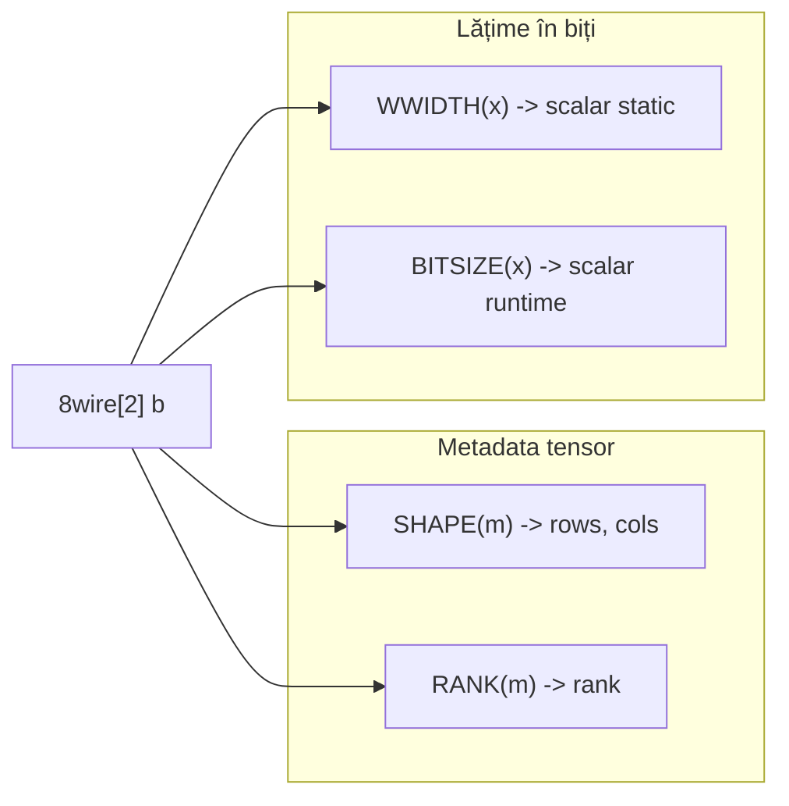

# Plan: WWIDTH — lățime statică în biți

**Status: livrat ✅** — implementare în `v0_3_2`; **1794 teste** în suite (inclusiv 2319–2326).

## Decizie nume: **WWIDTH**

| Candidat | Verdict |
|----------|---------|
| **WWIDTH** | **Ales** — „wire width”; clar, distinct de `Nwire` (tip), aliniat la familia built-in-urilor scurte (`SHAPE`, `RANK`, `BITSIZE`) |
| `CBITS` | Respins — prea criptic; sună ca „count bits” (overlap cu `CNTONE`) |
| `WIDTH` | Respins — ambiguu (tip wire? valoare? storage?) |
| `BITWIDTH` | Respins — prea lung; aproape sinonim cu `BITSIZE` la ureche |
| `DIMS` | **Nu** — planul [tensor_meta_plan_manual_copy.md](tensor_meta_plan_manual_copy.md) l-a respins ca alias la `SHAPE` (pereche rows/cols); cerința actuală e **un scalar** (lățime), nu dimensiuni |

**Semnătură:**

```
WWIDTH(X) -> Ybit
```

Returnează lățimea **statică** (din declarație / inferență pe AST), encodată ca **număr binar fără zero-uri leading** (ca `CNTONE` / `CNTZERO`), nu ca șir de biți de date. La assign pe țintă (`3wire w = WWIDTH(11111)`), rezultatul se **padează** la lățimea wire-ului țintă (ca la celelalte built-in-uri de analiză).

---

## Relația cu funcțiile existente



| Funcție | Ce măsoară | Exemplu `8wire[2] b` | Exemplu `11111` |
|---------|------------|----------------------|-----------------|
| **WWIDTH** | Lățime **declarată / inferată** (scalar element) | `100` (8) | `11` (5) |
| **BITSIZE** | Lungimea **valorii evaluate** la runtime | `10000` (16, blob total) | `11` (5) |
| **SHAPE** | Dimensiuni tensor (2 ieșiri) | `01`, `10` (1×2) | N/A |

**Regulă:** pentru vector/matrix **întreg** (`b`, nu `b:0`), `WWIDTH` = **`elementWidth`** din metadata (`8wire`), **nu** lățimea de stocare (`16wire`).

---

## Semantica confirmată (din exemplele tale)

| Input | Rezultat | Explicație |
|-------|----------|------------|
| `WWIDTH(11111)` | `11` | literal = 5 biți |
| `10wire a` … `WWIDTH(a)` | `1010` | lățime declarată scalar |
| `8wire[2] b` … `WWIDTH(b)` | `100` | element width, nu total 16 |

### Reguli extinse (pentru implementare consistentă)

1. **Literal binar / logic** — `WWIDTH(11111)` = numărul de caractere din literal (fără pad).
2. **Literal cu backslash** — `WWIDTH(\5)` → 4 (lățimea reprezentării `\5`).
3. **Wire scalar** — `Nw` din declarație (`10wire` → 10).
4. **Vector/matrix întreg** — `elementWidth` (`8wire[2]` → 8).
5. **Element vector** — `WWIDTH(b:0)` → 8 (același element width).
6. **Slice bit** — `WWIDTH(a:3)` sau `WWIDTH(a.3)` → 1.
7. **Slice coloană tensor** — `WWIDTH(m::1)` → lățimea slice-ului (rows × elementWidth), ca la evaluare.
8. **Câmp schema** — `WWIDTH(pkt:tag)` → lățimea câmpului din schema (ex. 8).
9. **Expresii** — lățime statică inferată din AST (fără a depinde de valoarea curentă):
   - `NOT(a)`, `a + b`, `MUX(sel,a,b)` → aceeași regulă ca la evaluare (lățimea rezultatului expresiei);
   - concatenare implicită în expr → sumă lățimi părți;
   - dacă inferența e imposibilă → eroare explicită (`WWIDTH: cannot infer width of expression`).
10. **Nu acceptăm** tensor întreg ca „lățime totală” — pentru asta există `BITSIZE` sau `SHAPE`/`RANK`; documentăm clar în doc.

---

## Implementare

### 1. Helper lățime statică — [`v0_3_2/core/interpreter.js`](v0_3_2/core/interpreter.js)

Funcție nouă `_inferExprStaticBitWidth(argExpr)` (+ eventual `_inferAtomStaticBitWidth(atom)`):

- Pentru atom `var` pe wire: citește metadata (`wire.vector.elementWidth`, `wire.tensor.elementWidth`, slice via `resolveAtomWireSlice`, schema via `_resolveSchemaFieldAbsoluteRange` fără valoare).
- Pentru literali: `bin`/`logic`.length.
- Pentru apeluri built-in în expr: recursie sau mapă minimă (NOT, AND, ADD, …) reutilizând regulile existente din `evalAtom` (`bitWidth` pe părți).
- **Important:** la wire întreg cu `vector`/`tensor`, returnează `elementWidth`, nu `getBitWidth(wire.type)`.

Ramură în `evalBuiltinFunction` (lângă `BITSIZE`, ~L7183):

```javascript
if (name === 'WWIDTH') {
  const w = this._inferExprStaticBitWidth(args[0]);
  const v = w.toString(2); // minimal, ca CNTONE
  // opțional: pad la declWireWidth din currentStmt (ca BITSIZE)
}
```

### 2. Înregistrare built-in

În același fișier:

- `isBuiltinFunction` — adaugă `'WWIDTH'`
- `BUILTIN_DOC` — `WWIDTH(X) -> Ybit`
- Listă built-in din `evalBuiltinFunction` header (~L4718)

### 3. Documentație

- Secțiune nouă în [`v0_3_2/doc/builtin-bit-analysis-functions.md`](v0_3_2/doc/builtin-bit-analysis-functions.md) (alături de `BITSIZE`, cu tabel comparativ).
- Rând în [`v0_3_2/doc/builtin-functions.md`](v0_3_2/doc/builtin-functions.md) la **Bit analysis**.
- Opțional pagină dedicată `builtin-WWIDTH.md` + keyword în [`v0_3_2/node/js/doc_search_keywords.js`](v0_3_2/node/js/doc_search_keywords.js).
- Regenerare: `node node/_gen_doc_data.js`.

### 4. Teste — grup `bit-analysis`, ID-uri **2319+**

| ID | Scenariu |
|----|----------|
| 2319 | literal `WWIDTH(11111)` → `11` |
| 2320 | `10wire a` … `WWIDTH(a)` → `1010` |
| 2321 | `8wire[2] b` … `WWIDTH(b)` → `100` (nu 16) |
| 2322 | `WWIDTH(b:0)` → `100`; contrast `BITSIZE(b)` → `10000` |
| 2323 | slice `4wire a` … `WWIDTH(a:2)` → `1` |
| 2324 | expresie `WWIDTH(NOT(a))` cu `4wire a` → `100` |
| 2325 | `doc(WWIDTH)` / `isBuiltinFunction` |
| 2326 | wave: `3wire w = WWIDTH(11111)` (propagare) |

Manifest: `node node/_gen_test_manifest.js`.

---

## Ce nu intră în scope

- Alias `CBITS` / `DIMS`
- `WWIDTH_TOTAL` pentru lățimea de stocare vector (folosește `BITSIZE`)
- Tag-uri parametrizate pe `WWIDTH`
- Modificări la `BITSIZE` existent

---

## Ordine implementare

1. Helper `_inferAtomStaticBitWidth` / `_inferExprStaticBitWidth`
2. Ramură `WWIDTH` în interpreter
3. Teste 2319–2326
4. Doc + manifest

---

## Extensie planificată — schema + parseView

Vezi [`wwidth_schema_parseview.plan.md`](wwidth_schema_parseview.plan.md):

- **Schema** (`WWIDTH(pkt:tag)`, `pkt:slots:0:alu`) — parțial în cod, teste 2327–2328
- **parseView** (`WWIDTH(parsed:packet:0:kind)`) — ramură de adăugat, teste 2329–2330
