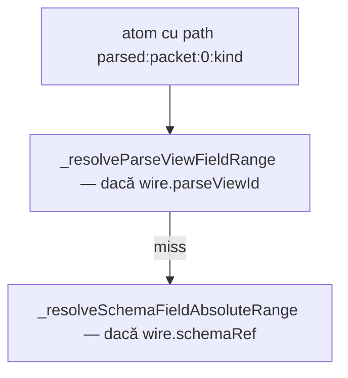

# WWIDTH pe schema și parseView

**Plan părinte:** [`wwidth_builtin.plan.md`](wwidth_builtin.plan.md) — builtin WWIDTH livrat ✅ (2319–2326).

---

## Răspuns scurt

| Țintă | Merge azi? | Exemplu |
|-------|------------|---------|
| **Câmp semantic schema** | **Da** (în cod, fără teste dedicate) | `WWIDTH(pkt:tag)` pe `40wire<frame> pkt` |
| **Câmp nested / array în schema** | **Da** (aceeași cale) | `WWIDTH(pkt:slots:0:alu)` |
| **Câmp parseView (protocol)** | **Nu** (lipsește ramura) | `WWIDTH(parsed:packet:0:kind)` |

---

## 1. Câmp din schema semantică — DA

În [`v0_3_2/core/interpreter.js`](v0_3_2/core/interpreter.js), `_inferWireAtomStaticBitWidth` verifică deja `schemaField` / `schemaFieldPath` și apelează `_resolveSchemaFieldAbsoluteRange`:

```javascript
if (atom.schemaField || (atom.schemaFieldPath && atom.schemaFieldPath.length)) {
  const abs = this._resolveSchemaFieldAbsoluteRange(atom, wire);
  if (abs.nonContiguous === 'schema_col') return abs.sliceWidth;
  return abs.end - abs.start + 1;
}
```

**Condiții** (aceleași ca la citire `pkt:tag`):

- Wire-ul trebuie să aibă `schemaRef` (ex. `40wire<frame> pkt`)
- Path-ul trebuie să fie **static** la compile-time (indici numerici, nu `(expr)` dinamici)
- Funcționează pentru frunză, nested, array element, slice coloană schema (`pkt:grid::1`)

**Exemple așteptate:**

```logts
<frame>:
    tag: 8
    slots: <opcode>[2]
:

40wire<frame> pkt := 0
4wire w = WWIDTH(pkt:tag)           # → 1000 (8)
4wire a = WWIDTH(pkt:slots:0:alu)   # → 0100 (4, din <opcode>)
```

**Ce lipsește:** teste 2327+; doc în [`v0_3_2/doc/builtin-bit-analysis-functions.md`](v0_3_2/doc/builtin-bit-analysis-functions.md).

---

## 2. Câmp din parseView tree — NU (încă)

La **citire** (`evalAtom`), ordinea e:



`WWIDTH` sare direct la schema și **nu** apelează `_resolveParseViewFieldRange`.

**Consecință azi:**

- `parsed` după `=: .repeatPv { … }` are `parseViewId`, **nu** `schemaRef`
- `WWIDTH(parsed:packet:0:kind)` → fie eroare „no schema for field access”, fie lățimea wire-ului întreg (16) — **nu** 8

**Ce ar trebui** (paritate cu `evalAtom`):

În `_inferWireAtomStaticBitWidth`, înainte de schema:

```javascript
if (atom.schemaField || atom.schemaFieldPath?.length) {
  const pvRange = this._resolveParseViewFieldRange(atom, wire);
  if (pvRange) {
    if (pvRange.fieldBits) return pvRange.fieldBits.length;
    return pvRange.end - pvRange.start + 1;
  }
  const abs = this._resolveSchemaFieldAbsoluteRange(atom, wire);
  // ...
}
```

Lățimea vine din [`resolveParseViewSlice`](v0_3_2/core/protocol-assembler.js) (deja folosit la show/read):

| Rezolvare parseView | Lățime WWIDTH |
|---------------------|---------------|
| Frunză `kind` 8b | `8` → `1000` |
| Secțiune `packet:0` (8b în `.repeatPv`) | `8` |
| Secțiune repetată fără index `packet:kind` | **Eroare** (ambiguous) — ca la read |
| Secțiune agregată `packet` (toate instanțele) | sumă lățimi copii (ex. 16 pentru 2×8b) |

**Exemplu țintă** (din teste existente protocol-ext):

```logts
16wire parsed = .repeatPv { data = 1111000000001111 }
4wire w = WWIDTH(parsed:packet:0:kind)   # → 1000 (8)
```

---

## 3. Wire cu schema ȘI parseView

Rar, dar posibil după protocol decode pe wire cu tag schema.

**Decizie:** aceeași prioritate ca `evalAtom` — **parseView întâi**, apoi schema. Evită confuzia când `parsed:packet:0:kind` e path protocol, nu schema.

---

## 4. WWIDTH vs BITSIZE pe câmp

| | WWIDTH | BITSIZE |
|---|--------|---------|
| `pkt:tag` | lățime declarată câmp (8) | lungimea valorii extrase (8 dacă e populat) |
| `parsed:packet:0:kind` | lățime din parseView tree (8) | lungimea biților extrași la runtime |

Pe câmpuri, de obicei coincid; diferența rămâne la vector întreg vs element.

---

## 5. Implementare

### Cod

- [`v0_3_2/core/interpreter.js`](v0_3_2/core/interpreter.js) — ramură parseView în `_inferWireAtomStaticBitWidth` (≈10 linii)

### Teste noi

| ID | Scenariu |
|----|----------|
| 2327 | `WWIDTH(pkt:tag)` pe FRAME40 |
| 2328 | `WWIDTH(pkt:slots:0:alu)` |
| 2329 | `WWIDTH(parsed:packet:0:kind)` pe INLINE_REPEAT_PV |
| 2330 | `WWIDTH(parsed:packet:kind)` → eroare ambiguous (ca 2305) |

### Doc

- Secțiune în [`v0_3_2/doc/builtin-bit-analysis-functions.md`](v0_3_2/doc/builtin-bit-analysis-functions.md): schema path + parseView path + erori index

---

## Concluzie

- **Schema:** da, poți scrie `WWIDTH(pkt:camp)` — logica e deja acolo; lipsesc teste și documentație explicită.
- **parseView:** conceptual da; **nu merge azi** — trebuie aceeași ramură ca la `evalAtom` (`_resolveParseViewFieldRange` + `resolveParseViewSlice`).
