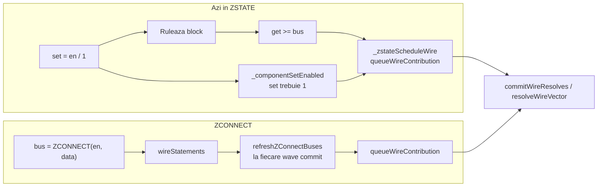
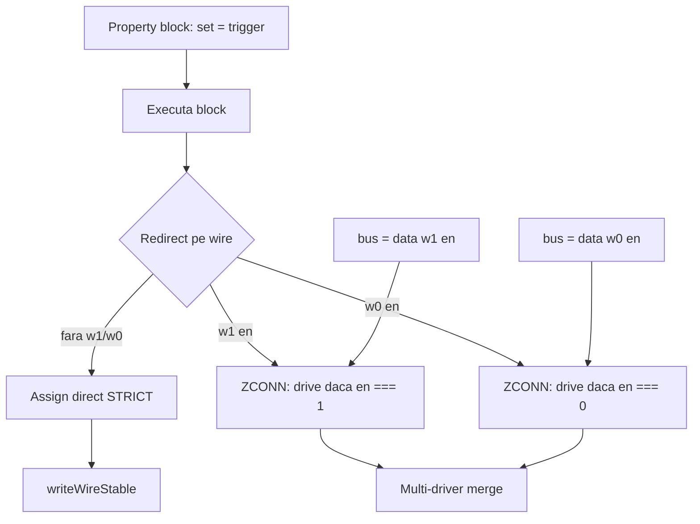

# ZSTATE: ZCONN unificat, sugar `w1`/`w0`, clarificare ZRELEASE

## Situația actuală (din cod)



---

## Inventar complet — output-uri care adaugă driveri în ZSTATE

Analizat în [`interpreter.js`](v0_3_2/core/interpreter.js) (`applyComponentProperties`, PCB/chip/board).

### Grupa A — `_zstateScheduleWire` + `_componentSetEnabled` (multi-driver, gated de `set`)

Acestea sunt **ținta principală** a refactorului: fără `w1`/`w0` → assign direct; cu `w1`/`w0` → ZCONN.

| Sintaxă sursă | Parser / helper | Componente tipice | Loc cod |
|---------------|-----------------|-------------------|---------|
| `get>=` / `get>` | `isGetRedirectProperty` — `^(2\|3\|4)?get>$` | switch, mem, queue (`:get`) | ~7103–7142 |
| `2get>=`, `3get>=`, `4get>=` | același | mem multi-port | ~7103–7142 |
| `front>=`, `top>=` | `isGenericPoutRedirectProperty` | queue, stack | ~7169–7205 |
| `empty>=`, `full>=` | idem | queue, stack | ~7169–7205 |
| `size>=`, `capacity>=`, `free>=` | idem | queue, stack, counter | ~7169–7205 |
| `out>=` / `out>` | `REDIRECT_PROPS` — `out` | shifter | ~7460–7510 |

Teste ZSTATE existente de migrat: **1459–1467** (`get>=`), **1498–1503** (`out>=`), **1503** (mixed get+out).

### Grupa B — assign direct (chiar în ZSTATE azi) — **deja aliniat** cu modelul „fără w1”

| Sintaxă | Componente | Loc cod |
|---------|------------|---------|
| `mod>=` | divider | ~7232–7305 |
| `carry>=` | adder, subtract | ~7308–7380 |
| `over>=` | multiplier | ~7384–7455 |

Nu folosesc `_zstateScheduleWire`. Rămân assign direct; opțional pot primi `w1`/`w0` dacă vreodată sunt rutați pe bus partajat (scope minim: **nu** — doar documentăm).

### Grupa C — PCB / chip / board `poutName>=`

| Sintaxă | Parser | ZSTATE azi | Loc cod |
|---------|--------|------------|---------|
| `val>= bus` (în block PCB) | `pout>` intern | `publishWireValue` → `scheduleWireChange` → `queueWireContribution` **fără** gate `set` | ~7667–7700, ~8036–8053 |

**Inconsistență:** contribuie la multi-driver dar **nu** respectă `_componentSetEnabled`. Trebuie același model: `pout>= bus w1 en` pentru bus, `pout>= bus` assign direct.

### Grupa D — nu e redirect component

| Mecanism | ZSTATE |
|----------|--------|
| `bus = expr` (wire assignment) | `queueWireContribution` via defer |
| `bus = ZCONNECT(en, data)` | refresh la fiecare wave commit |
| `ZRELEASE(bus)` | `replace=true` + `zReleasedWires` |

---

## Model țintă (actualizat)



**Reguli:**

- `set` = **doar** trigger de block (rising edge / `on: 1`).
- Orice redirect din **Grupa A** sau **Grupa C**:
  - fără suffix → assign direct (ca STRICT), chiar în `MODE ZSTATE`
  - `w1 en` → contribuție ZCONN când `en` e strict `1` (ultimul bit, ca ZCONNECT azi)
  - `w0 en` → contribuție ZCONN când `en` e strict `0` — **nu** `NOT(en)`
- Assignment: `databus = cpuData w1 cpuEn` → `databus = ZCONNECT(cpuEn, cpuData)`.

### Semantica `w0` — fără `NOT(en)`

În helper comun (extinde `call('ZCONNECT')` și toate path-urile redirect):

```javascript
// w1: enBit === '1'  → queue data
// w0: enBit === '0'  → queue data
// altfel (Z, X, etc. pe en): no-op — același comportament ca ZCONNECT cu en≠1
const enBit = enVal.length ? enVal.slice(-1) : '0';
const shouldDrive =
  polarity === 'w1' ? enBit === '1' :
  polarity === 'w0' ? enBit === '0' :
  false;
```

**De ce nu `NOT(en)`:** pe fire cu `X`/`Z`, `NOT(en)` produce valori IEEE diferite de „active când en e 0”; `w0` trebuie să însemne explicit **enable activ la nivel logic 0**, nu inversul boolean al lui `en`.

Teste noi obligatorii pentru `w0`:
- `en = 0` → drive
- `en = 1` → no-op (bus `Z` dacă niciun alt driver)
- `en = Z` / `en = X` → no-op (nu drive prin `NOT`)

---

## Faza 1 — Parser + interpreter (estimare: **7–9 zile-dev**)

### 1.1 Helper `scheduleBusContribution` (~1,5 zile)

Fișier: [`interpreter.js`](v0_3_2/core/interpreter.js)

- Un singur punct pentru: `ZCONNECT`/`ZCONN` call, assignment desugared, redirect-uri cu `w1`/`w0`.
- Parametru `polarity: 'w1' | 'w0' | null`.
- Integrare în `refreshZConnectBuses()` / tracking bus-uri ([`signal-propagation.js`](v0_3_2/core/signal-propagation.js) ~65–79).

### 1.2 Parser — assignment + toate redirect-urile (~2–2,5 zile)

Fișier: [`parser.js`](v0_3_2/core/parser.js)

**Assignment:** `bus = data w1 en` / `w0 en`

**Property blocks** — același suffix după target wire, pentru:
- `get>=`, `2get>=`, … (`isGetRedirectProp`)
- `front>=`, `top>=`, `empty>=`, `full>=`, `size>=`, `capacity>=`, `free>=`
- `out>=`
- PCB `poutName>=` (handler `pout>` ~925–944)

Structură AST: `{ property, target, busEnable: 'w1'|'w0'|null, busEnableExpr }`.

Rezervare contextuală `w0`/`w1`: după `=` assignment sau după target în redirect; nu afectează LSHIFT (`expr < rhs w0` rămâne neschimbat).

### 1.3 Interpreter — refactor Grupa A + C (~3–4 zile)

- **Elimină** `_componentSetEnabled` din toate path-urile `_zstateScheduleWire` (get, generic pout, out).
- Redirect fără suffix → ramura direct write (storage + `updateConnectedComponents` / `writeWireStable`).
- Redirect cu `w1`/`w0` → `scheduleBusContribution`.
- PCB `pout>`: același branch; fără `w1` nu mai trece prin `publishWireValue`→queue în ZSTATE dacă e bus drive intenționat.

**Grupa B** (`mod>`, `carry>`, `over>`): neschimbat în scope minim.

### 1.4 Teste (~1,5–2 zile)

Fișier: [`test_suite.js`](v0_3_2/test_suite.js)

| Grup | ID-uri | Acțiune |
|------|--------|---------|
| `get>=` multi-driver | 1459–1467, 1503 | migrate la `w1` |
| `out>=` | 1498–1503 | migrate la `w1` |
| Noi | 1575+ | `w0 en===0`, assignment sugar, `set` separat de enable, PCB `pout>= w1` |
| Regresie | 1570, queue 1055 | `get>=`/`front>=` fără ZSTATE neschimbat |

---

## Faza 2 — ZRELEASE + documentație (estimare: **2–4 zile-dev**)

- Doc: ZRELEASE = retrage driverii; `ZZZ` = consecință la resolve, nu „set wire = Z”.
- Test `ZRELEASE` + `ZCONNECT` același step.
- [`zstate.md`](v0_3_2/doc/zstate.md): tabel Grupa A/B/C; exemple switch/shifter cu `w1`; elimină formularea „get>= adaugă driver implicit”.

---

## Estimare efort (revizuită)

| Fază | Scope | Zile-dev |
|------|-------|----------|
| **1** | Helper w0 en===0, parser toate redirect-urile, interpreter A+C, teste migrate | **7–9** |
| **2** | ZRELEASE doc + docs | **2–4** |
| **Total** | | **9–13** |

**+1 zi** față de estimarea inițială din cauza inventarului complet (8 tipuri redirect + PCB `pout>=` + teste `out>=`).

**Opțional (+3–5 zile):** ZRELEASE per-driver (identitate sursă, nu `replace=true` global).

---

## Breaking changes

- `get>= bus` / `out>= bus` / `front>= bus` în ZSTATE **nu mai** face multi-driver merge — necesită `w1`/`w0`.
- Exemple [`zstate.md`](v0_3_2/doc/zstate.md) switch dual-drive → `get >= bus w1 1` sau `w1 .s1`.

---

## Ordine implementare

1. `scheduleBusContribution` + semantica `w0` (`en === '0'`).
2. Parser assignment `w1`/`w0`.
3. Parser redirect-uri (funcție comună `parseRedirectWithOptionalBusEnable()`).
4. Interpreter Grupa A (get, generic pout, out).
5. Interpreter Grupa C (PCB/chip/board `pout>`).
6. Migrare teste + docs.

## Planuri înrudite

- [tristate_bus_buffer.plan.md](tristate_bus_buffer.plan.md) — ZSTATE inițial
- [multi_driver_out_paths.plan.md](multi_driver_out_paths.plan.md) — `out>=` hook (livrat)
- [zstate_zconnect.plan.md](zstate_zconnect.plan.md) — ZCONNECT statement (livrat)
