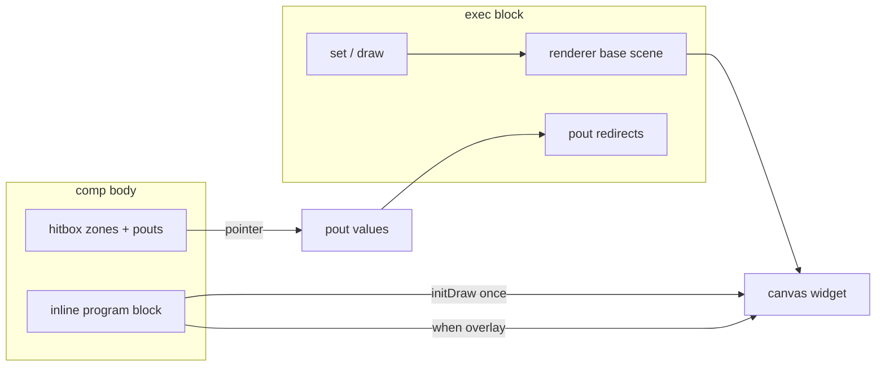

# Canvas hitbox — `hitbox { }`, `initDraw`, `renderer when`

Interactive **`comp [canvas]`** adds pointer hit zones on the HTML canvas widget, optional **pouts** for touch events, and **conditional draw overlays** in the linked `inline [canvas]` program block.

Base drawing pipeline → [comp-canvas.md](comp-canvas.md). Method definitions → [inline-canvas.md](inline-canvas.md).

In the **documentation viewer**, `logts-play` blocks support **Load** and **Load & Run** (`on: 1` runs the first `set` when you click **Load & Run**). Click or drag on the canvas in **Devices** to exercise hit zones.

---

## Quick reference

| Topic | Summary |
|-------|---------|
| **`hitbox { }`** | Comp body — named zones with literal `rect(x,y,w,h)` |
| **`touchType`** | `1` momentary, `2` pulse, `3` latch/toggle (same semantics as CLCD) |
| **`pout`** | `pout :event as name` or `pout :drag:eventX as dragX/s16` |
| **Program block** | `.inline { initDraw { } renderer when(zone) { } }` |
| **`renderer when`** | Overlay draw while event active — **no** background clear |
| **`eventX` / `eventY`** | Numbers in `when` body — pointer position in canvas pixels |
| **Exec block** | **`renderer { }` required** whenever `set` / `draw` schedules a redraw |
| **Redirect** | `btnPress >= outWire` in exec (same as other component pouts) |
| **`stroke`** | Optional debug border around zone (`"rrggbb"`) |

---

## Architecture



| Layer | Where | Role |
|-------|-------|------|
| **Hit zones** | `hitbox { }` on comp | Parse-time rectangles; pointer hit-test |
| **Pouts** | per zone | `press`, `release`, `drag`, `move` (+ `eventX`/`eventY` fields) |
| **`initDraw`** | inline program block | Runs **once** after widget creation (static chrome) |
| **`renderer when`** | inline program block | Drawn **on top** of exec `renderer` while event is active |
| **Exec `renderer`** | `.comp:{ }` | Base scene; cleared to `bgColor` unless `clear = 0` |

---

## `hitbox { }` — zones and pouts

Declare zones in the **component body** (not in the inline):

```logts
comp [canvas] .panel:
    on: 1
    width: 100
    height: 60
    bgColor: ^000000

    hitbox {
        btn: {
            rect(10, 10, 30, 30)
            touchType = 1
            stroke("ffff00")
            pout :press as btnPress
        }
        slider: {
            rect(50, 10, 40, 40)
            touchType = 1
            stroke("00ffff")
            pout :drag:eventX as dragX/s16
            pout :release as sliderReleased
        }
    }

    .ui { }
:
```

| Field | Required | Description |
|-------|----------|-------------|
| **`rect(x,y,w,h)`** | **Yes** | Axis-aligned hit box — **literal** integers only |
| **`touchType`** | No | `1` (default), `2`, or `3` — see table below |
| **`stroke("rrggbb")`** | No | 1 px debug outline while drawing |
| **`pout :event as name`** | No | Bool pout for `press`, `release`, `drag`, or `move` |
| **`pout :drag:eventX as pin/s16`** | No | Numeric pout with explicit format (`/s16`, `/ascii`, …) |

Pout names must be unique across the whole `hitbox` block.

### `touchType` (per zone)

Same behaviour as CLCD symbol touch — see [clcd.md](clcd.md#touchtype-1-2-and-3).

| Value | Behaviour |
|-------|-----------|
| **`1`** | Momentary — active while pointer is down inside zone |
| **`2`** | Pulse — brief press on pointer down |
| **`3`** | Latch / toggle — each press flips latched state |

---

## Inline program block — `initDraw` and `renderer when`

The linked `inline [canvas]` ref uses a **program block** (curly body) instead of an empty `{ }`:

```logts
    .ui {
        initDraw {
            drawBtn(10, 10, 30, 30, "333333")
        }
        renderer when(btn) {
            drawBtn(10, 10, 30, 30, "ff0000")
        }
        renderer when(slider:drag) {
            drawKnob(eventX, eventY)
        }
    }
```

| Block | When it runs | Clear behaviour |
|-------|--------------|-----------------|
| **`initDraw { }`** | On each cleared redraw (incl. first paint) | Drawn before exec `renderer` |
| **`renderer when(zone)`** | While `zone` **press** is active (default event) | **Overlay** — no bg clear |
| **`renderer when(zone:event)`** | While that event is active (`press`, `release`, `drag`, `move`) | **Overlay** |

Inside `renderer when(...)`, **`eventX`** and **`eventY`** are plain numbers (pointer position in canvas coordinates). Use them as method arguments — e.g. `drawKnob(eventX, eventY)`.

Omit `:event` to mean **`:press`** — `renderer when(btn)` ≡ `renderer when(btn:press)`.

---

## Reading pouts — no exec block required

Hitbox pouts are **component properties**. Read them like any other pout — with a wire assignment or `probe`:

```logts
16wire outX = .panel:dragX
probe(outX)
probe(.panel:dragX)
```

| Form | Example |
|------|---------|
| **Wire bind** | `16wire outX = .panel:dragX` |
| **Probe wire** | `probe(outX)` |
| **Probe pout** | `probe(.panel:dragX)` or `probe(.panel:btnPress)` |

You do **not** need an exec block (`.panel:{ }`) for hitbox-only interaction. The canvas redraws on pointer events when the comp has `initDraw`, `renderer when`, or hitbox zones.

Exec block redirects (`btnPress >= outWire`) are still supported when you also use `set` / `draw` scheduling — see below.

---

## Exec block (optional) — `set` + `renderer`

When you **do** use an exec block to drive `set` / `draw`, it **must** include **`renderer { }`**:

```logts
1wire go = 1
1wire outPress = 0

.panel:{
    renderer { drawBtn(10, 10, 30, 30, "666666") }
    btnPress >= outPress
    set = go
}
```

| Pin / stmt | Role |
|------------|------|
| **`renderer { }`** | Base scene (cleared to `bgColor` before draw) |
| **`btnPress >= outPress`** | Optional redirect of hitbox pout to a wire |
| **`set`** | Schedule redraw (coalesced) |

On pointer **press** inside `btn`, the canvas redraws: `initDraw` + exec `renderer`, then the red `renderer when(btn)` overlay.

---

## Runnable — slider drag (no exec block)

```logts-play
inline [canvas] .ui:

    drawTrack(x, y, w, h) {
        styleFill("444444")
        drawRect(x, y, w, h)
    }

    drawKnob(x, y, xC, yC, xD, yD) {
        xF = x
        yF = y
        if (x < xC) { xF = xC }
        if (y < yC) { yF = yC }
        if (x > xC + xD) { xF = xC + xD }
        if (y > yC + yD) { yF = yC + yD }
        styleFill("ffcc00")
        drawCircle(xF, yF, 6)
    }

:

comp [canvas] .panel:
    on: 1
    width: 140
    height: 140
    bgColor: ^000000

    hitbox {
        slider: {
            rect(50, 10, 40, 40)
            touchType = 1
            stroke("ff0000")
            pout :drag:eventX as dragX/s16
        }
    }

    .ui {
        initDraw {
            drawTrack(50, 10, 40, 40)
        }
        renderer when(slider:drag) {
            drawKnob(eventX, eventY, 50, 10, 40, 40)
        }
    }

:

16wire outX = .panel:dragX
probe(outX)
```

**Load & Run** — grey track appears immediately. Drag inside the red-outlined zone — yellow knob follows (clamped), `outX` updates. No `.panel:{ }` exec block needed.

---

## Runnable — button + press overlay (with exec `set`)

```logts-play
inline [canvas] .ui:

    drawBtn(x, y, w, h, color) {
        styleFill(color)
        drawRect(x, y, w, h)
    }

:

comp [canvas] .panel:
    on: 1
    width: 100
    height: 60
    bgColor: ^000000

    hitbox {
        btn: {
            rect(10, 10, 30, 30)
            touchType = 1
            stroke("ffff00")
            pout :press as btnPress
        }
    }

    .ui {
        initDraw {
            drawBtn(10, 10, 30, 30, "333333")
        }
        renderer when(btn) {
            drawBtn(10, 10, 30, 30, "ff0000")
        }
    }

:

1wire go = 1
1wire outPress = 0

.panel:{
    renderer { drawBtn(10, 10, 30, 30, "666666") }
    btnPress >= outPress
    set = go
}
```

**Load & Run**, then click the grey button in **Devices** — it turns red while held; use `probe(.panel:btnPress)` or `1wire outPress = .panel:btnPress` to observe the pout.

---

## Runnable — slider drag with exec `set` (alternative)

```logts-play
inline [canvas] .ui:

    drawTrack(x, y, w, h) {
        styleFill("444444")
        drawRect(x, y, w, h)
    }

    drawKnob(x, y) {
        styleFill("ffcc00")
        drawCircle(x, y, 6)
    }

:

comp [canvas] .panel:
    on: 1
    width: 100
    height: 60
    bgColor: ^000000

    hitbox {
        slider: {
            rect(50, 10, 40, 40)
            touchType = 1
            pout :drag:eventX as dragX/s16
        }
    }

    .ui {
        initDraw {
            drawTrack(50, 10, 40, 40)
        }
        renderer when(slider:drag) {
            drawKnob(eventX, 30)
        }
    }

:

1wire go = 1
16wire outX = 0000000000000000

.panel:{
    renderer { drawTrack(50, 10, 40, 40) }
    dragX >= outX
    set = go
}
```

**Load & Run**, then press and drag inside the track — yellow knob follows `eventX`; `outX` wire tracks horizontal position.

---

## Errors (parse / elaboration)

| Situation | Result |
|-----------|--------|
| Zone without `rect(...)` | Parse error |
| Duplicate pout name | Parse error |
| Unknown `pout :event` | Parse error |
| Exec block with `set` / `draw` but no `renderer { }` | Elaboration error |
| Redirect unknown pout | Elaboration error |

---

## Related pages

| Page | Content |
|------|---------|
| [comp-canvas.md](comp-canvas.md) | Base `comp [canvas]` — `renderer`, `busy`, `clear` |
| [inline-canvas.md](inline-canvas.md) | Draw method definitions |
| [canvas-builtins.md](canvas-builtins.md) | `drawRect`, `styleFill`, … |
| [clcd.md](clcd.md) | `touchType` semantics (shared with hitbox) |
