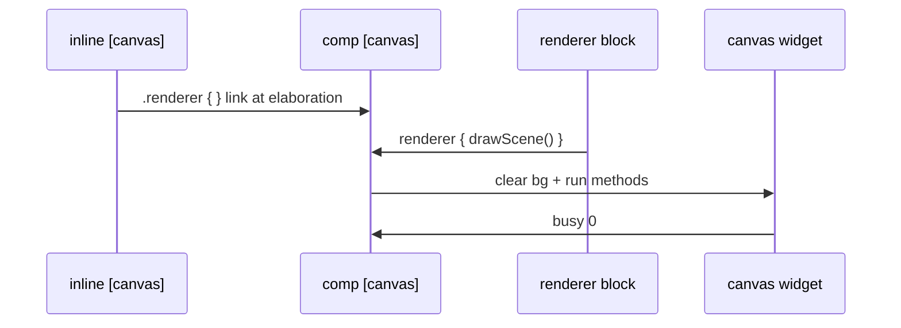

# Component canvas — `comp [canvas]`

`comp [canvas]` is the **runtime layer** for 2D drawing: an HTML `<canvas>` in the Devices panel, linked to an `inline [canvas]` definition.

Method definitions → [inline-canvas.md](inline-canvas.md). Builtins → [canvas-builtins.md](canvas-builtins.md).

In the **documentation viewer**, `logts-play` blocks support **Load** and **Load & Run** (use `on: 1` so the first run executes when `set = 1`).

---

## Quick reference

| Topic | Summary |
|-------|---------|
| **Renderer ref** | `.inlineName { }` in comp header (required) |
| **Exec block** | `.comp:{ renderer { calls } set = trigger }` |
| **Trigger** | `set` or `draw` pin — respects `on:` (`raise` / `edge` / `1`) |
| **Output** | `busy` pout — `1` while drawing |
| **Attrs** | `width`, `height` required; `bgColor` optional (default `^000000`) |
| **Doc** | `doc(comp.canvas)`, `doc(.myCanvas)` |

---

## Pipeline



| Step | Where | What happens |
|------|-------|--------------|
| 1 | **Elaboration** | `width` / `height` / `bgColor` fixed; inline ref validated |
| 2 | **Devices** | `<canvas>` created at declared size |
| 3 | **Exec block** | `renderer { }` lists method calls; `set` or `draw` schedules redraw |
| 4 | **Draw** | Canvas cleared to `bgColor`, then renderer calls execute |
| 5 | **`busy`** | `1` during draw, `0` when finished |

---

## Declaration

```logts
comp [canvas] .myCanvas:
    on: 1

    width: 320
    height: 240
    bgColor: ^000000

    .gameRenderer { }

:
```

| Attribute | Required | Description |
|-----------|----------|-------------|
| **`width`** | **Yes** | Canvas width in pixels (parse-time only) |
| **`height`** | **Yes** | Canvas height in pixels (parse-time only) |
| **`bgColor`** | No | Background clear color — `^rrggbb` (default `^000000`) |
| **`label`** | No | Optional caption above the canvas — omit for no label |
| **`on:`** | Recommended | Property-block trigger mode (`1`, `raise`, `edge`, …) |
| **`.renderer { }`** | **Yes** | Links `inline [canvas]` (body may be empty) |
| **`nl`** | No | Line break after widget in Devices panel |

**Note:** Component names must not clash with keywords (e.g. avoid `.board` — `board` is reserved).

---

## Exec block — `renderer`, `set`, `draw`, `busy`

```logts
1wire trigger = 1
1wire redraw = 0
1wire busyWire = 0

.myCanvas:{
    renderer {
        drawBg(0, 0, 320, 240, "112233")
        drawPlayer(160, 120, "P1")
    }
    set = trigger
    draw = redraw
    busy >= busyWire
}
```

| Pin | Direction | Role |
|-----|-----------|------|
| **`set`** | in | State updated → schedule coalesced redraw |
| **`draw`** | in | Explicit redraw request |
| **`busy`** | out | `1` while renderer runs on the canvas context |

The `renderer { }` block **invokes** methods from the linked inline — it does not define them.

Arguments in `renderer` may be numeric or string **literals** (same rules as method bodies).

---

## Complete runnable example

```logts-play
inline [canvas] .gameRenderer:

    drawBg(x, y, w, h, color) {
        style(0, color)
        drawRect(x, y, w, h)
    }

    drawPlayer(cx, cy) {
        style("000000", "0000ff", 2)
        drawCircle(cx, cy, 14)
        styleFill("ffffff")
        fontSize(12)
        textAlign("center")
        textBaseline("middle")
        drawText(cx, cy, "P1")
    }

    drawScene() {
        drawBg(0, 0, 200, 150, "223344")
        drawPlayer(100, 75)
    }

:

comp [canvas] .myCanvas:
    on: 1
    width: 200
    height: 150
    label: "Game view"
    bgColor: ^000000
    .gameRenderer { }
:

1wire trigger = 1
.myCanvas:{
    renderer { drawScene() }
    set = trigger
}
```

Click **Load & Run** — a 200×150 canvas appears in Devices with a blue circle and label.

---

## Smaller widget

```logts-play
inline [canvas] .icon:

    smile(cx, cy) {
        style("000000", "ffcc00", 2)
        drawCircle(cx, cy, 20)
        styleFill("000000")
        drawCircle(cx - 7, cy - 5, 2)
        drawCircle(cx + 7, cy - 5, 2)
        styleStroke("000000", 2)
        drawLine(cx - 8, cy + 8, cx + 8, cy + 8)
    }

:

comp [canvas] .face:
    on: 1
    width: 64
    height: 64
    .icon { }
:

1wire go = 1
.face:{
    renderer { smile(32, 32) }
    set = go
}
```

---

## `draw` pin — second redraw

```logts-play
inline [canvas] .dots:

    show(n) {
        styleFill("00ffaa")
        i = 0
        drawCircle(20 + i * 30, 40, 6)
    }

:

comp [canvas] .dotPanel:
    on: 1
    width: 120
    height: 80
    .dots { }
:

1wire pulse = 1
.dotPanel:{
    renderer { show(0) }
    draw = pulse
}
```

---

## Errors (elaboration)

| Situation | Result |
|-----------|--------|
| Missing `width` or `height` | Parse / elaboration error |
| No `.renderer { }` ref | Elaboration error |
| Ref not `inline [canvas]` | Elaboration error |
| `if` / `for` in method body | Parse error |

---

## Related pages

| Page | Content |
|------|---------|
| [inline-canvas.md](inline-canvas.md) | Method definitions |
| [canvas-builtins.md](canvas-builtins.md) | Draw API reference |
| [clcd.md](clcd.md) | Symbol-based display (different from free drawing) |
