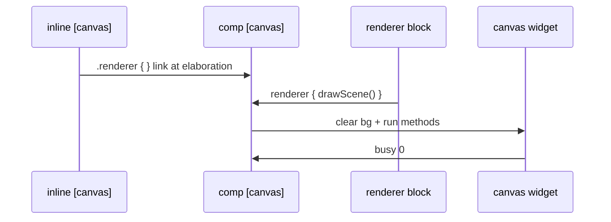

# Component canvas — `comp [canvas]`

`comp [canvas]` is the **runtime layer** for 2D drawing: an HTML `<canvas>` in the Devices panel, linked to an `inline [canvas]` definition.

Method definitions → [inline-canvas.md](inline-canvas.md). Builtins → [canvas-builtins.md](canvas-builtins.md).

In the **documentation viewer**, `logts-play` blocks support **Load** and **Load & Run** (use `on: 1` so the first run executes when `set = 1`).

---

## Quick reference

| Topic | Summary |
|-------|---------|
| **Renderer ref** | `.inlineName { }` in comp header (required) |
| **Exec block** | `.comp:{ renderer { calls } set = trigger }` |
| **Trigger** | `set` or `draw` pin — respects `on:` (`raise` / `edge` / `1`) |
| **`clear`** | Default `1` — clear bg before draw; `0` additive overlay |
| **Wire args** | `pinName/s16`, `/ascii`, `/bool` in `renderer { }` |
| **Output** | `busy` pout — `1` while drawing |
| **Attrs** | `width`, `height` required; `bgColor` optional (default `^000000`) |
| **Doc** | `doc(comp.canvas)`, `doc(.myCanvas)` |

---

## Pipeline



| Step | Where | What happens |
|------|-------|--------------|
| 1 | **Elaboration** | `width` / `height` / `bgColor` fixed; inline ref validated |
| 2 | **Devices** | `<canvas>` created at declared size |
| 3 | **Exec block** | `renderer { }` lists method calls; `set` or `draw` schedules redraw |
| 4 | **Draw** | Canvas cleared to `bgColor`, then renderer calls execute |
| 5 | **`busy`** | `1` during draw, `0` when finished |

---

## Declaration

```logts
comp [canvas] .myCanvas:
    on: 1

    width: 320
    height: 240
    bgColor: ^000000

    .gameRenderer { }

:
```

| Attribute | Required | Description |
|-----------|----------|-------------|
| **`width`** | **Yes** | Canvas width in pixels (parse-time only) |
| **`height`** | **Yes** | Canvas height in pixels (parse-time only) |
| **`bgColor`** | No | Background clear color — `^rrggbb` (default `^000000`) |
| **`label`** | No | Optional caption above the canvas — omit for no label |
| **`on:`** | Recommended | Property-block trigger mode (`1`, `raise`, `edge`, …) |
| **`.renderer { }`** | **Yes** | Links `inline [canvas]` (body may be empty) |
| **`nl`** | No | Line break after widget in Devices panel |

**Note:** Component names must not clash with keywords (e.g. avoid `.board` — `board` is reserved).

---

## Exec block — `renderer`, `set`, `draw`, `busy`

```logts
1wire trigger = 1
1wire redraw = 0
1wire busyWire = 0

.myCanvas:{
    renderer {
        drawBg(0, 0, 320, 240, "112233")
        drawPlayer(160, 120, "P1")
    }
    set = trigger
    draw = redraw
    busy >= busyWire
}
```

| Pin | Direction | Role |
|-----|-----------|------|
| **`set`** | in | State updated → schedule coalesced redraw |
| **`draw`** | in | Explicit redraw request |
| **`clear`** | in | `1` (default) — clear canvas to `bgColor` before draw; `0` — additive / overlay draw |
| **`busy`** | out | `1` while renderer runs on the canvas context |

The `renderer { }` block **invokes** methods from the linked inline — it does not define them.

Arguments in `renderer` may be **literals** (numbers, strings) or **wire references** using `pinName/format` (e.g. `xPos/s16`, `label/ascii`, `flag/bool`). Pins are inferred automatically from renderer args and can be assigned in the same exec block (`xPos = myWire`).

Read **`busy`** from another wire or use it to stall a CPU (`wait = mustWait`):

```logts
1wire mustWait = .myCanvas:busy

comp [cpu] .u:
    wait = mustWait
    /* … */
```

In a property block, redirect the pout: `busy >= mustWait`.

---

## Complete runnable example

```logts-play
inline [canvas] .gameRenderer:

    drawBg(x, y, w, h, color) {
        style(0, color)
        drawRect(x, y, w, h)
    }

    drawPlayer(cx, cy) {
        style("000000", "0000ff", 2)
        drawCircle(cx, cy, 14)
        styleFill("ffffff")
        fontSize(12)
        textAlign("center")
        textBaseline("middle")
        drawText(cx, cy, "P1")
    }

    drawScene() {
        drawBg(0, 0, 200, 150, "223344")
        drawPlayer(100, 75)
    }

:

comp [canvas] .myCanvas:
    on: 1
    width: 200
    height: 150
    label: "Game view"
    bgColor: ^000000
    .gameRenderer { }
:

1wire trigger = 1
.myCanvas:{
    renderer { drawScene() }
    set = trigger
}
```

Click **Load & Run** — a 200×150 canvas appears in Devices with a blue circle and label.

---

## Smaller widget

```logts-play
inline [canvas] .icon:

    smile(cx, cy) {
        style("000000", "ffcc00", 2)
        drawCircle(cx, cy, 20)
        styleFill("000000")
        drawCircle(cx - 7, cy - 5, 2)
        drawCircle(cx + 7, cy - 5, 2)
        styleStroke("000000", 2)
        drawLine(cx - 8, cy + 8, cx + 8, cy + 8)
    }

:

comp [canvas] .face:
    on: 1
    width: 64
    height: 64
    .icon { }
:

1wire go = 1
.face:{
    renderer { smile(32, 32) }
    set = go
}
```

---

## Wire arguments in `renderer`

```logts
inline [canvas] .posDraw:
    mark(x, y) {
        styleFill("00ffaa")
        drawRect(x, y, 12, 12)
    }
:

comp [canvas] .myCanvas:
    on: 1
    width: 100
    height: 80
    .posDraw { }
:

16wire valX = 0000000000011001
16wire valY = 0000000000100011
1wire go = 1

.myCanvas:{
    renderer { mark(xPos/s16, yPos/s16) }
    xPos = valX
    yPos = valY
    set = go
}
```

| Syntax | Meaning |
|--------|---------|
| `pinName/s16`, `/u16`, … | Signed / unsigned numeric wire (codec matches `logic-number-formats`) |
| `pinName/ascii` | Text string from wire bits |
| `pinName/bool` | Boolean (`1` / `0`) |

Pins are created on first use; assign them in the exec block like any other component pin.

---

## Multiple exec blocks and `clear`

Each `.myCanvas:{ … }` block can list its own `renderer { }` calls. **`clear`** defaults to `1` (full background clear before draw). Set **`clear = 0`** for additive overlays (e.g. a second layer without erasing the first).

```logts
1wire triggerScene = 1
1wire triggerAdd = 1

.myCanvas:{ renderer { drawScene() }     set = triggerScene }
.myCanvas:{ renderer { drawOverlay() }   clear = 0           set = triggerAdd }
```

Redraws are coalesced per animation frame (`requestAnimationFrame`). If a draw is already running (`busy = 1`), a new request is deferred until the current draw finishes.

---

## Logic `observe` → canvas (e2e)

Wire a **logic observe pin** into canvas renderer args. When a fact is asserted, the observe pin updates a shared wire; the canvas redraws at the new position.

Requires [`comp [logic]`](comp-logic.md) with an **`observe`** line in the program block — see [logic-observers.md](logic-observers.md).

```logts-play
inline [logic] .game:

:

comp [logic] .gameLogic:
    on: 1
    .game {
        observe spotX$ is number xPin
    }

:

inline [canvas] .dots:

    mark(x, y) {
        styleFill("00ffaa")
        drawCircle(x, y, 10)
    }

:

comp [canvas] .screen:
    on: 1
    width: 200
    height: 120
    bgColor: ^001122
    .dots { }

:

1wire go = 1
16wire spotX = 0000000000000000

.gameLogic:{
    logic { + spotX$(80) }
    xPin >= spotX
    set = go
}

.screen:{
    renderer { mark(xPos/s16, 60) }
    xPos = spotX
    set = go
}
```

Click **Load & Run** — a green circle appears at **x = 80** on the canvas in Devices.

Pipeline: **`logic { + spotX$(80) }`** mutation → **`xPin`** observe pin → **`spotX`** wire → **`xPos/s16`** in **`renderer { }`** → canvas draw.

Use **`16wire spotX = 0000000000000000`** (full width), not **`= 0`**, so strict wire rules accept the initializer.

---

## `draw` pin — second redraw

```logts-play
inline [canvas] .dots:

    show(n) {
        styleFill("00ffaa")
        i = 0
        drawCircle(20 + i * 30, 40, 6)
    }

:

comp [canvas] .dotPanel:
    on: 1
    width: 120
    height: 80
    .dots { }
:

1wire pulse = 1
.dotPanel:{
    renderer { show(0) }
    draw = pulse
}
```

---

## Errors (elaboration)

| Situation | Result |
|-----------|--------|
| Missing `width` or `height` | Parse / elaboration error |
| No `.renderer { }` ref | Elaboration error |
| Ref not `inline [canvas]` | Elaboration error |
| `if` / `for` in method body | Parse error |

---

## Related pages

| Page | Content |
|------|---------|
| [inline-canvas.md](inline-canvas.md) | Method definitions |
| [canvas-builtins.md](canvas-builtins.md) | Draw API reference |
| [logic-observers.md](logic-observers.md) | `observe` pins → wires (e2e with canvas) |
| [clcd.md](clcd.md) | Symbol-based display (different from free drawing) |
