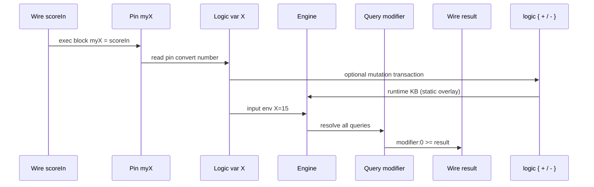

# Component logic — `comp [logic]`

`comp [logic]` is the **runtime layer** for declarative queries. It binds logic variables to component pins, reads wired inputs, runs all queries defined in the linked `inline [logic]`, and redirects results to LogTScript wires.

Definition of facts/rules/queries → [inline-logic.md](inline-logic.md).

In the **documentation viewer**, `logts-play` blocks support **Load** and **Load & Run** (use `on: 1` so the first run executes when `set = 1`).

---

## Quick reference

| Topic | Summary |
|-------|---------|
| **Program block** | `.module { X is number myX }` in comp header |
| **Exec block** | `.logic:{ myX = scoreIn, query:0 >= out, set = trigger }` |
| **Trigger** | `set` pin — respects `on:` (`raise` / `edge` / `1`) |
| **Inputs** | Pin ← wire in exec block (`myX = scoreIn`) |
| **Outputs** | Query redirect (`modifier:0 >= result`) |
| **Mutations** | `logic { + fact / - fact }` — see [logic-runtime.md](logic-runtime.md) |
| **Doc** | `doc(comp.logic)`, `doc(.characterLogic)` |

---

## Pipeline



| Step | Where | What happens |
|------|-------|--------------|
| 1 | **Elaboration** | Program block maps logic vars → pins (`X is number myX`) |
| 2 | **Exec block** | Wires assign pins (`myX = scoreIn`); optional **`logic { + / - }`** |
| 3 | **Trigger** | Active `set` (per `on:`) starts one solve pass |
| 4 | **Engine** | Runtime KB → all queries from inline run with input bindings |
| 5 | **Redirect** | Selected solutions written to target wires |

---

## Declaration

```logts
comp [logic] .characterLogic:
    on: 1

    .character {
        X is number myX
    }

:
```

| Attribute | Description |
|-----------|-------------|
| **`.module { … }`** | Links `inline [logic]` + pin bindings (required) |
| **`on:`** | Property-block trigger mode (see below) |
| **`maxDepth:`** | Optional — max goal steps per solve (default **256**) |
| **`maxSolutions:`** | Optional — max solutions collected per query (default **64**) |
| **`indexFacts:`** | **`0`** or **`1`** (default **1**) — persistent fact index; **`0`** disables index |
| **`indexRebuild:`** | **`full`** (default) or **`delta`** — index update after commit; ignored when **`indexFacts: 0`** |
| **`data:`** | **`overlay`** (default), **`static`**, or **`seed`** — see [logic-runtime.md — data modes](logic-runtime.md#data-modes) |

### Program block bindings

```logts
.character {
    X is number myX
    Name is text myName
    Alive is bool myAlive
}
```

| Form | Meaning |
|------|---------|
| `X is number myX` | Variabilă **X** ← unsigned binary; lățime pin de la wire la assign, **default/max 64** biți |
| `Name is text myName` | ASCII text — **lățimea pinului = lățimea wire-ului** la assign (`myName = wire`), multiplu de 8, max **256** biți; decode oprește la `\0` |
| `Alive is bool myAlive` | 1-bit boolean |

Only **`number`**, **`text`**, and **`bool`** are supported at the pin boundary.

### Pin `text` — lățime variabilă (nu fixă)

`X is text myX` **nu** alocă un pin de 32 biți. Pinul `text` pornește gol (8 biți) și **la fiecare** `myX = wire` își ia lățimea de la wire:

| Regulă | Comportament |
|--------|--------------|
| **Sursă** | Lățimea wire-ului din exec block (`32wire`, `160wire`, …) |
| **Pas** | Multiplu de **8** biți (octet ASCII) |
| **Max** | **256** biți (32 caractere) |
| **Decode** | Octeți → string; oprire la `\0` → atom Prolog |

Exemplu: `160wire nameSlot` + `myX = nameSlot` → pin **160** biți → `"myWickedLongName"` încape integral (17 octeți + padding `\0`), **nu** trunchiat la 4 caractere.

### Pin `number` — lățime variabilă, plafon 64

`X is number myX` la elaborare alocă **64 biți** (zero). La `myX = wire`, pinul ia lățimea wire-ului, cu **max 64**:

| Regulă | Comportament |
|--------|--------------|
| **Înainte de assign** | 64 biți (default) |
| **La assign** | Lățime wire (multiplu de 8), min 8 |
| **Plafon** | **64 biți** — wire mai lat → trunchiere la cei 64 biți low |
| **Decode** | Unsigned binary → integer Prolog |

Exemplu: `8wire scoreIn` + `myX = scoreIn` → pin **8** biți; `128wire big` → pin **64** biți.

---

## Exec block — wiring and redirects

```logts
8wire scoreIn = 00001111
8wire result = 00000000
1wire trigger = 1

.characterLogic:{
    myX = scoreIn
    modifier:0 >= result
    set = trigger
}
```

| Line | Role |
|------|------|
| `myX = scoreIn` | Wire → **pin** (not logic var directly) |
| `modifier:0 >= result` | Solution **0** of query `modifier` → wire |
| `set = trigger` | Run engine when trigger active |

### Redirect forms

| Query vars | Syntax | Target |
|------------|--------|--------|
| **0 free** (boolean) | `isJohnOwner >= flagWire` | `1` if satisfiable, else `0` |
| **1 free** | `johnOwns:0 >= firstCar` | Solution **N** → scalar wire (ASCII atom / binary number) |
| **1 free** | `johnOwns >= allCars` | **Vector bulk** — one solution per element (`8wire[N]`) |
| **1 free** | `johnOwns;unique >= allCars` | Vector bulk **after dedupe** on the free variable |
| **1 free** | `johnOwns;last >= lastCar` | **Last** solution only (scalar or first slot) |
| **1 free** | `johnOwns:count >= numRows` | Solution count (capped at vector length) |
| **1 free** | `johnOwns;unique:count >= numRows` | Count **after** `;unique` dedupe |
| **2 free** | `allAges >= table` | **Matrix bulk** — row = solution, col = variable (`32wire[R,C]`) |
| **2 free** | `allAges:0 >= row0` | **Row slice** (`32wire[C]`) |
| **2 free** | `allAges::0 >= col0` | **Column slice** |
| **2 free** | `allAges:0:1 >= ageWire` | **Single cell** (scalar wire) |
| **2 free** | `allAges:count >= numRows` | Rows written; `allAges:width >= numCols` → column count |
| **pout** | `truncated >= wire` | **`1`** if any query hit `maxSolutions` cap this pass |
| **pout** | `depthExceeded >= wire` | **`1`** if any query hit `maxDepth` this pass |
| **pout** | `mutationFailed >= wire` | **`1`** if the last `logic { }` transaction failed |

Pout redirects use the same syntax as query redirects: **`poutName >= wire`** (not `wire = pout`).

| Pout | Bits | Meaning (OR across all queries in the pass) |
|------|------|---------------------------------------------|
| **`truncated`** | 1 | At least one query had more solutions than `maxSolutions` |
| **`depthExceeded`** | 1 | At least one query exceeded `maxDepth` during search |
| **`execCount`** | 16 | Total solve passes (existing) |

Solution order follows **discovery order** (Prolog-style backtracking).

**Encoding:** atoms → **ASCII + `\0` padding** per cell; numbers → unsigned binary on cell width. Unused slots are filled from the wire init pattern (or `\0` per cell if undeclared).

**Limits:** max **2** free variables per query at the redirect interface.

### Result policies (`;unique`, `;first`, `;last`)

Place **`;policy`** immediately after the query name, **before** redirect selectors (`:0`, `:count`, `>=`):

```logts
johnOwns;unique >= allCars
johnOwns;unique:count >= numRows
johnOwns;last >= lastCar
```

| Policy | When applied | Effect |
|--------|--------------|--------|
| **`;unique`** | After solve, before pack | Dedupe by binding tuple — vector: one column; matrix: full row |
| **`;first`** | After solve | First solution only (useful when vector length > 1 but you want slot 0) |
| **`;last`** | After solve | Last solution in **discovery order** (engine still enumerates up to limits) |
| *(none)* | — | All solutions within `maxSolutions` (default behaviour) |

**`:count`** reflects the list **after** the policy runs — e.g. three raw solutions with one duplicate → **`;unique:count`** returns **2**.

---

## `on:` modes

| `on:` | Load & Run with `set = 1` | Typical use |
|-------|---------------------------|-------------|
| **`1`** / **`level`** | Runs immediately | Documentation and deterministic demos |
| **`raise`** (default) | Waits for `0→1` edge | Interactive / wave setups |

Use **`on: 1`** in examples so **Load & Run** performs a solve pass immediately.

---

## Pins and pouts

| Pin / pout | Bits | Description |
|------------|------|-------------|
| **`set`** | 1 | Trigger one solve pass when active |
| **`myX`, …** | `bool`: 1 bit; **`number`**: 8…64 (default 64); **`text`**: 8…256 de la wire | Input pins from program block |
| **`execCount`** | 16 | Solve passes completed (`.logic:execCount`) |
| **`truncated`** | 1 | Set when any query was capped by `maxSolutions` |
| **`depthExceeded`** | 1 | Set when any query hit `maxDepth` |
| **`mutationFailed`** | 1 | Set when `logic { + / - }` transaction failed (non-ground fact, etc.) |

---

## Full example — modifier table

```logts-play
inline [logic] .character:

    modifier2(1, -4)
    modifier2(X,  0) <- X >= 9,  X =< 12
    modifier2(X,  2) <- X >= 15, X =< 16

    query modifier:
        modifier2(X, Y)

:

comp [logic] .characterLogic:
    on: 1

    .character {
        X is number myX
    }

:

8wire scoreIn = 00001111
8wire result = 00000000
1wire trigger = 1

.characterLogic:{
    myX = scoreIn
    modifier:0 >= result
    set = trigger
}

show(result)
```

`scoreIn = 15` → logic binds `X = 15` → rule `modifier2(X, 2) <- X >= 15, X =< 16` → `Y = 2` → `result = 2`.

---

## Example — ownership queries

```logts-play
inline [logic] .people:

    owns(john, chevy)
    owns(john, ford)
    owns(mary, bike)

    query isJohnOwner:
        owns(john, _)

    query johnOwns:
        owns(john, X)

:

comp [logic] .peopleLogic:
    on: 1

    .people {
    }

:

1wire flag = 0
8wire firstCar = 00000000
1wire trigger = 1

.peopleLogic:{
    isJohnOwner >= flag
    johnOwns:0 >= firstCar
    set = trigger
}

show(flag)
show(firstCar)
```

`firstCar` receives the first character of `chevy` in ASCII (`c` on 8 bits).

---

## Example — vector bulk + count

```logts-play
inline [logic] .people:

    owns(john, chevy)
    owns(john, ford)
    owns(mary, bike)

    query johnOwns:
        owns(john, X)

:

comp [logic] .peopleLogic:
    on: 1

    .people {
    }

:

8wire[4] allCars = 00000000000000000000000000000000
8wire numRows = 00000000
1wire trigger = 1

.peopleLogic:{
    johnOwns >= allCars
    johnOwns:count >= numRows
    set = trigger
}

show(allCars; ascii)
show(numRows)
```

---

## Example — matrix `age(X,Y)` + row slice

```logts-play
inline [logic] .world:

    age(john, 25)
    age(mary, 30)
    age(joe, 22)

    query allAges:
        age(X, Y)

:

comp [logic] .worldLogic:
    on: 1

    .world {
    }

:

32wire[5, 2] table = 0
32wire[2] row0 = 0
8wire numRows = 00000000
1wire trigger = 1

.worldLogic:{
    allAges >= table
    allAges:0 >= row0
    allAges:count >= numRows
    set = trigger
}

show(row0; ascii)
show(numRows)
```

Column 0 = names (ASCII); column 1 = ages (binary).

---

## Example — column slice `::c`

Extract one matrix column into a vector — row `r` of column `c` is solution `r`, variable at index `c` (left-to-right in the query goal).

```logts-play
inline [logic] .world:

    age(john, 25)
    age(mary, 30)
    age(joe, 22)

    query allAges:
        age(X, Y)

:

comp [logic] .worldLogic:
    on: 1

    .world {
    }

:

32wire[5] col0 = 0
32wire[5] col1 = 0
1wire trigger = 1

.worldLogic:{
    allAges::0 >= col0
    allAges::1 >= col1
    set = trigger
}

show(col0; ascii)
show(col1)
```

`::0` → all `X` values (names); `::1` → all `Y` values (ages). Unused rows in the declared vector are filled with `\0` per cell.

---

## Example — text pin round-trip (wire → pin → logic)

Demonstrates the full **out-and-back** path: query writes an atom to a wire (ASCII), a second exec block loads the wire into a **`text` pin**, and a **parameterized query** reads `X` from that pin to resolve `Y`.

Use **two components** when the first pass must run **without** pin bindings (an bound but empty `text` pin would constrain free variables in the fetch query).

```logts-play
inline [logic] .world:

    age(john, 25)
    age(mary, 30)
    age(joe, 22)

    query allAges:
        age(X, Y)

    query lookupAge:
        age(X, Y)

:

comp [logic] .worldFetch:
    on: 1

    .world {
    }

:

comp [logic] .worldLookup:
    on: 1

    .world {
        X is text myX
    }

:

32wire nameSlot = 0
8wire ageOut = 00000000
1wire trigger = 1

.worldFetch:{
    allAges:0:0 >= nameSlot
    set = trigger
}

.worldLookup:{
    myX = nameSlot
    lookupAge:0 >= ageOut
    set = trigger
}

show(nameSlot; ascii)
show(ageOut)
```

| Step | Block | Effect |
|------|-------|--------|
| 1 | `.worldFetch` | `allAges:0:0` writes `"john"` (ASCII) to `nameSlot` |
| 2 | `.worldLookup` | `myX = nameSlot` → pin; `lookupAge` with `X` input → `Y = 25` → `ageOut` |

Round-trip chain: **atom `john` → wire → `text` pin → logic var `X` → fact `age(john, 25)`**.

---

## Example — cell redirect + ASCII show

```logts-play
inline [logic] .world:

    age(john, 25)
    age(mary, 30)

    query allAges:
        age(X, Y)

:

comp [logic] .worldLogic:
    on: 1

    .world {
    }

:

32wire nameSlot = 0
1wire trigger = 1

.worldLogic:{
    allAges:0:0 >= nameSlot
    set = trigger
    show(nameSlot; ascii)
}
```

---

## Example — negation `\+` and multi-goal query

This demo shows:

- **`query peterHasNoAge: \+ age(peter, _)`** — **0 free vars** → boolean redirect (`1` / `0`)
- **`query personWithoutAge: person(X), \+ age(X, _)`** — comma = **AND**; only **`X`** is output (not two bits for the two goals)

```logts-play
inline [logic] .world:

    person(john)
    person(mary)
    person(peter)

    age(john, 25)
    age(mary, 30)

    query personWithoutAge:
        person(X), \+ age(X, _)

    query johnHasNoAge:
        \+ age(john, _)

    query peterHasNoAge:
        \+ age(peter, _)

:

comp [logic] .worldLogic:
    on: 1

    .world {
    }

:

8wire who = 00000000
1wire johnFlag = 0
1wire peterFlag = 0
1wire trigger = 1

.worldLogic:{
    personWithoutAge:0 >= who
    johnHasNoAge >= johnFlag
    peterHasNoAge >= peterFlag
    set = trigger
    show(who; ascii)
}
```

After **Load & Run**:

| Wire | Expected |
|------|----------|
| `who` | ASCII **`p`** — first solution `X = peter` |
| `johnFlag` | **`0`** — john has an `age` fact |
| `peterFlag` | **`1`** — peter has no `age` fact |

The comma in `person(X), \+ age(X, _)` does **not** produce `"01"` or two booleans on one wire. The engine returns **solutions for free variables** (`X` only); each redirect picks scalar, vector, matrix, or boolean form as documented above.

---

## Example — `;unique` dedupe and `:count`

Duplicate facts produce duplicate solutions until you apply **`;unique`**:

```logts-play
inline [logic] .people:

    owns(john, chevy)
    owns(john, chevy)
    owns(john, ford)

    query johnOwns:
        owns(john, X)

:

comp [logic] .peopleLogic:
    on: 1

    .people { }

:

8wire[4] uniqCars = 00000000000000000000000000000000
8wire numUniq = 00000000
1wire trigger = 1

.peopleLogic:{
    johnOwns;unique >= uniqCars
    johnOwns;unique:count >= numUniq
    set = trigger
}
```

After **Load & Run**: `uniqCars` holds **`c`**, **`f`** (not two `c` slots); **`numUniq = 2`**.

---

## Example — `;last` redirect

```logts-play
inline [logic] .people:

    owns(john, chevy)
    owns(john, ford)
    owns(john, bike)

    query johnOwns:
        owns(john, X)

:

comp [logic] .peopleLogic:
    on: 1

    .people { }

:

8wire lastCar = 00000000
1wire trigger = 1

.peopleLogic:{
    johnOwns;last >= lastCar
    set = trigger
}
```

After **Load & Run**: `lastCar` = **`b`** (first letter of **`bike`**, the last solution in discovery order).

---

## Example — `maxSolutions` and `truncated` pout

```logts-play
inline [logic] .people:

    owns(john, chevy)
    owns(john, ford)
    owns(john, bike)

    query johnOwns:
        owns(john, X)

:

comp [logic] .peopleLogic:
    on: 1
    maxSolutions: 2

    .people { }

:

8wire car0 = 00000000
8wire car1 = 00000000
1wire wasTruncated = 0
1wire trigger = 1

.peopleLogic:{
    johnOwns:0 >= car0
    johnOwns:1 >= car1
    truncated >= wasTruncated
    set = trigger
}
```

After **Load & Run**: `car0` / `car1` hold the first two cars; **`wasTruncated = 1`** because a third solution exists but was not collected.

---

## Example — `maxDepth` and `depthExceeded` pout

```logts-play
inline [logic] .loop:

    loop(X) <- loop(X)

    query run:
        loop(a)

:

comp [logic] .loopLogic:
    on: 1
    maxDepth: 8

    .loop { }

:

1wire hitDepth = 0
1wire trigger = 1

.loopLogic:{
    depthExceeded >= hitDepth
    set = trigger
}
```

After **Load & Run**: **`hitDepth = 1`** — recursive rule exceeded depth (fail silent on deep branches). Query may still return **`run >= flag = 0`** (no complete proof within depth).

---

## Runtime mutations — `logic { + / - }`

Change the effective knowledge base on each solve pass without editing `inline [logic]`. Full behaviour, tombstones, and **`mutationFailed`** → [logic-runtime.md](logic-runtime.md).

**`data:`** selects the runtime KB mode (**`overlay`**, **`static`**, **`seed`**) — see [logic-runtime.md — data modes](logic-runtime.md#data-modes). **`data: static`** forbids **`logic { }`** blocks.

```logts
.whLogic:{
    logic {
        - inside(box1, c1)
        + inside(box1, c2)
    }
    where:0 >= destWire
    mutationFailed >= failed
    set = trigger
}
```

| Construct | Role |
|-----------|------|
| **`+ groundFact`** | Assert fact into component dynamic store |
| **`- groundFact`** | Tombstone — hide matching static or dynamic fact |
| **`mutationFailed >= wire`** | **`1`** if transaction failed (store unchanged) |

Mutations run **before** query redirects in the same pass. The dynamic store **persists** across `set` triggers on the same component.

**Constraints** (`constraint P <= Body` in inline) validate init and each mutation commit — [logic-constraints.md](logic-constraints.md).

```logts-play
inline [logic] .warehouse:

    inside(box1, c1)
    container(c1)
    container(c2)

    query where:
        inside(box1, X)

:

comp [logic] .whLogic:
    on: 1
    .warehouse { }
:

8wire where = 00000000
1wire failed = 0
1wire trigger = 1

.whLogic:{
    logic {
        - inside(box1, c1)
        + inside(box1, c2)
    }
    where:0 >= where
    mutationFailed >= failed
    set = trigger
}
```

After **Load & Run**: **`where`** shows **`c2`**; **`failed = 0`**.

---

## Multiple exec blocks

Several property blocks may target the same component. Query result slots are **shared**; the **last successful** exec block wins (last-write-wins), matching other multi-block components.

---

## Errors

| Situation | Result |
|-----------|--------|
| Missing program block | Elaboration error |
| Inline ref not `inline [logic]` | Elaboration error |
| Query with **>2** free variables | Elaboration error |
| Unknown redirect query name | Redirect skipped silently if no results |
| Policy block | `NotAllow comp.type{logic}` — see [allow-notallow.md](allow-notallow.md) |

---

## Related

- Knowledge definition → [inline-logic.md](inline-logic.md)
- Static vs dynamic KB, tombstones, mutations → [logic-runtime.md](logic-runtime.md)
- Constraints, validation, wire prefixes in mutation → [logic-constraints.md](logic-constraints.md)
- Similar two-layer model → [plc.md](plc.md), [asm.md](asm.md)
