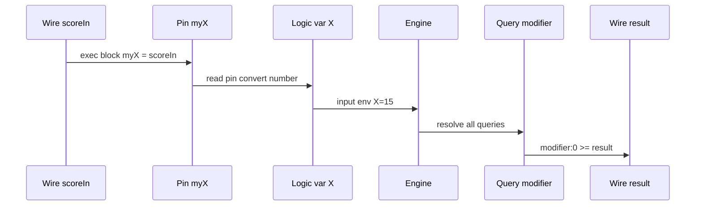

# Component logic — `comp [logic]`

`comp [logic]` is the **runtime layer** for declarative queries. It binds logic variables to component pins, reads wired inputs, runs all queries defined in the linked `inline [logic]`, and redirects results to LogTScript wires.

Definition of facts/rules/queries → [inline-logic.md](inline-logic.md).

In the **documentation viewer**, `logts-play` blocks support **Load** and **Load & Run** (use `on: 1` so the first run executes when `set = 1`).

---

## Quick reference

| Topic | Summary |
|-------|---------|
| **Program block** | `.module { X is number myX }` in comp header |
| **Exec block** | `.logic:{ myX = scoreIn, query:0 >= out, set = trigger }` |
| **Trigger** | `set` pin — respects `on:` (`raise` / `edge` / `1`) |
| **Inputs** | Pin ← wire in exec block (`myX = scoreIn`) |
| **Outputs** | Query redirect (`modifier:0 >= result`) |
| **Doc** | `doc(comp.logic)`, `doc(.characterLogic)` |

---

## Pipeline



| Step | Where | What happens |
|------|-------|--------------|
| 1 | **Elaboration** | Program block maps logic vars → pins (`X is number myX`) |
| 2 | **Exec block** | Wires assign pins (`myX = scoreIn`) |
| 3 | **Trigger** | Active `set` (per `on:`) starts one solve pass |
| 4 | **Engine** | All queries from inline run with input bindings |
| 5 | **Redirect** | Selected solutions written to target wires |

---

## Declaration

```logts
comp [logic] .characterLogic:
    on: 1

    .character {
        X is number myX
    }

:
```

| Attribute | Description |
|-----------|-------------|
| **`.module { … }`** | Links `inline [logic]` + pin bindings (required) |
| **`on:`** | Property-block trigger mode (see below) |

### Program block bindings

```logts
.character {
    X is number myX
    Name is text myName
    Alive is bool myAlive
}
```

| Form | Meaning |
|------|---------|
| `X is number myX` | Logic variable **X** ← unsigned pin **myX** |
| `Name is text myName` | ASCII text on pin width |
| `Alive is bool myAlive` | 1-bit boolean |

Only **`number`**, **`text`**, and **`bool`** are supported at the pin boundary.

---

## Exec block — wiring and redirects

```logts
8wire scoreIn = 00001111
8wire result = 00000000
1wire trigger = 1

.characterLogic:{
    myX = scoreIn
    modifier:0 >= result
    set = trigger
}
```

| Line | Role |
|------|------|
| `myX = scoreIn` | Wire → **pin** (not logic var directly) |
| `modifier:0 >= result` | Solution **0** of query `modifier` → wire |
| `set = trigger` | Run engine when trigger active |

### Redirect forms

| Query vars | Syntax | Target |
|------------|--------|--------|
| **0 free** (boolean) | `isJohnOwner >= flagWire` | `1` if satisfiable, else `0` |
| **1 free** | `johnOwns:0 >= firstCar` | Solution **N** → scalar wire (ASCII atom / binary number) |
| **1 free** | `johnOwns >= allCars` | **Vector bulk** — one solution per element (`8wire[N]`) |
| **1 free** | `johnOwns:count >= numRows` | Solution count (capped at vector length) |
| **2 free** | `allAges >= table` | **Matrix bulk** — row = solution, col = variable (`32wire[R,C]`) |
| **2 free** | `allAges:0 >= row0` | **Row slice** (`32wire[C]`) |
| **2 free** | `allAges::0 >= col0` | **Column slice** |
| **2 free** | `allAges:0:1 >= ageWire` | **Single cell** (scalar wire) |
| **2 free** | `allAges:count >= numRows` | Rows written; `allAges:width >= numCols` → column count |

Solution order follows **discovery order** (Prolog-style backtracking).

**Encoding:** atoms → **ASCII + `\0` padding** per cell; numbers → unsigned binary on cell width. Unused slots are filled from the wire init pattern (or `\0` per cell if undeclared).

**Limits:** max **2** free variables per query at the redirect interface.

---

## `on:` modes

| `on:` | Load & Run with `set = 1` | Typical use |
|-------|---------------------------|-------------|
| **`1`** / **`level`** | Runs immediately | Documentation and deterministic demos |
| **`raise`** (default) | Waits for `0→1` edge | Interactive / wave setups |

Use **`on: 1`** in examples so **Load & Run** performs a solve pass immediately.

---

## Pins and pouts

| Pin / pout | Bits | Description |
|------------|------|-------------|
| **`set`** | 1 | Trigger one solve pass when active |
| **`myX`, …** | 8 default (number/text) | Input pins from program block |
| **`execCount`** | 16 | Solve passes completed (`.logic:execCount`) |

---

## Full example — modifier table

```logts-play
inline [logic] .character:

    modifier2(1, -4)
    modifier2(X,  0) <- X >= 9,  X =< 12
    modifier2(X,  2) <- X >= 15, X =< 16

    query modifier:
        modifier2(X, Y)

:

comp [logic] .characterLogic:
    on: 1

    .character {
        X is number myX
    }

:

8wire scoreIn = 00001111
8wire result = 00000000
1wire trigger = 1

.characterLogic:{
    myX = scoreIn
    modifier:0 >= result
    set = trigger
}

show(result)
```

`scoreIn = 15` → logic binds `X = 15` → rule `modifier2(X, 2) <- X >= 15, X =< 16` → `Y = 2` → `result = 2`.

---

## Example — ownership queries

```logts-play
inline [logic] .people:

    owns(john, chevy)
    owns(john, ford)
    owns(mary, bike)

    query isJohnOwner:
        owns(john, _)

    query johnOwns:
        owns(john, X)

:

comp [logic] .peopleLogic:
    on: 1

    .people {
    }

:

1wire flag = 0
8wire firstCar = 00000000
1wire trigger = 1

.peopleLogic:{
    isJohnOwner >= flag
    johnOwns:0 >= firstCar
    set = trigger
}

show(flag)
show(firstCar)
```

`firstCar` receives the first character of `chevy` in ASCII (`c` on 8 bits).

---

## Example — vector bulk + count

```logts-play
inline [logic] .people:

    owns(john, chevy)
    owns(john, ford)
    owns(mary, bike)

    query johnOwns:
        owns(john, X)

:

comp [logic] .peopleLogic:
    on: 1

    .people {
    }

:

8wire[4] allCars = 00000000000000000000000000000000
8wire numRows = 00000000
1wire trigger = 1

.peopleLogic:{
    johnOwns >= allCars
    johnOwns:count >= numRows
    set = trigger
}

show(allCars; ascii)
show(numRows)
```

---

## Example — matrix `age(X,Y)` + row slice

```logts-play
inline [logic] .world:

    age(john, 25)
    age(mary, 30)
    age(joe, 22)

    query allAges:
        age(X, Y)

:

comp [logic] .worldLogic:
    on: 1

    .world {
    }

:

32wire[5, 2] table = 0
32wire[2] row0 = 0
8wire numRows = 00000000
1wire trigger = 1

.worldLogic:{
    allAges >= table
    allAges:0 >= row0
    allAges:count >= numRows
    set = trigger
}

show(row0; ascii)
show(numRows)
```

Column 0 = names (ASCII); column 1 = ages (binary).

---

## Example — cell redirect + ASCII show

```logts-play
inline [logic] .world:

    age(john, 25)
    age(mary, 30)

    query allAges:
        age(X, Y)

:

comp [logic] .worldLogic:
    on: 1

    .world {
    }

:

32wire nameSlot = 0
1wire trigger = 1

.worldLogic:{
    allAges:0:0 >= nameSlot
    set = trigger
    show(nameSlot; ascii)
}
```

---

## Multiple exec blocks

Several property blocks may target the same component. Query result slots are **shared**; the **last successful** exec block wins (last-write-wins), matching other multi-block components.

---

## Errors

| Situation | Result |
|-----------|--------|
| Missing program block | Elaboration error |
| Inline ref not `inline [logic]` | Elaboration error |
| Query with **>2** free variables | Elaboration error |
| Unknown redirect query name | Redirect skipped silently if no results |
| Policy block | `NotAllow comp.type{logic}` — see [allow-notallow.md](allow-notallow.md) |

---

## Related

- Knowledge definition → [inline-logic.md](inline-logic.md)
- Similar two-layer model → [plc.md](plc.md), [asm.md](asm.md)
