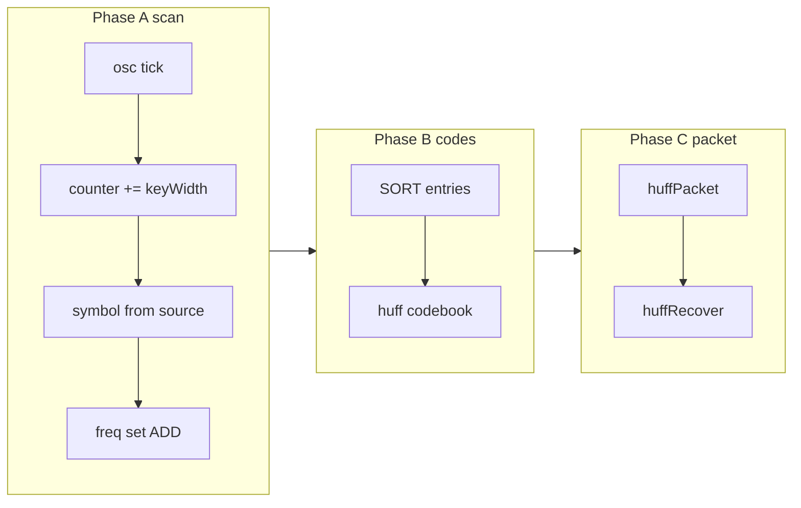

# Huffman v2 — runtime frequencies in wave mode

End-to-end **wave** demo: measure symbol frequencies from a source wire, sort entries, encode with a **prefix-free** codebook, round-trip through `.huffPacket` / `.huffRecover`.

No `buildFrom`, no `HUFFMAN_*` builtins — everything is plain logTscript (writable LUT, `on:raise`, counter, osc, `SORT`, optional `popMin` for N-general merge).

For the static codebook + protocol walkthrough (v1), see **[huffman.md](huffman.md)**.

---

## Architecture (three phases)

| Phase | What | Building blocks |
|-------|------|-----------------|
| **A — Scan** | Walk `source` in steps of `keyWidth`, count in `.freq` | `comp [osc]`, `comp [counter]`, `on:raise`, `.freq:set` + `ADD` |
| **B — Codes** | Build `.huff` codebook (manual / MUX for 4 symbols, or merge with `popMin` for N) | writable LUT `prefixFree`, `on:1` one-shot |
| **C — Packet** | Encode + decode | `.huffPacket`, `.huffRecover`, `=:` padding if needed |



---

## Phase A — Frequency LUT

```logts-play wave
inline [lut] .freq:
  writable
  depth: 8
  length: 16
  fillwith: 00000000
  data {
  }
  :
```

`fillwith: 00000000` is required so the first `set(sym, ADD(.freq:get(sym), 1))` treats a missing key as count **0** (not a Huffman codeword).

### Increment pattern (`set` + `ADD`, one `on:raise`)

```logts
on:raise {
  AND(.clk:get, NOT(atEnd)),
  ok = .freq:set(sym, ADD(.freq:get(sym), 00000001))
}
```

### Osc + counter scan (4 nibbles, `keyWidth = 4`)

Use **`write = 1`** on the counter so `data = ADD(.idx:get, 4)` loads the new index (not `dir` increment-by-1).

Advance the counter on the **falling** edge (`set = NOT(.clk:get)`) with `comp [counter] … on: raise` so `on:raise` still sees the current index when the clock rises.

Re-read `.freq:get` wires after osc ticks — top-level `8wire f10 = .freq:get(sym)` can go **stale** in wave mode.

Index `i` on each rising edge: `0`, `4`, `8`, `12`. Use **one `on:raise` per index** so the symbol is read before the counter advances:

```logts
MODE WIREWRITE
16wire source = 0010 + 0010 + 0010 + 0011
comp [osc] .clk:
  freq: 10
  :
comp [counter] .idx:
  depth: 8
  on: raise
  :
.idx:{
  data = ADD(.idx:get, 00000100)
  write = 1
  set = NOT(.clk:get)
}
on:raise { AND(.clk:get, EQ(.idx:get, 00000000)), ok = .freq:set(0010, ADD(.freq:get(0010), 00000001)) }
on:raise { AND(.clk:get, EQ(.idx:get, 00000100)), ok = .freq:set(0010, ADD(.freq:get(0010), 00000001)) }
on:raise { AND(.clk:get, EQ(.idx:get, 00001000)), ok = .freq:set(0010, ADD(.freq:get(0010), 00000001)) }
on:raise { AND(.clk:get, EQ(.idx:get, 00001100)), ok = .freq:set(0011, ADD(.freq:get(0011), 00000001)) }
```

Simulate ticks in tests with `session.setComp(interp, '.clk', '1')` then `'0'` (see test **2109**).

**Note:** `4wire sym = source.(pos)/4` as a top-level wire can go **stale** across osc ticks; evaluate the slice inside `on:raise` or use fixed `EQ(.idx:get, …)` branches as above.

---

## Phase B — Sort + codebook

After scan:

```logts
8wire[n,2] sorted = SORT(.freq:entries(); col=1)
4wire[n] syms = sorted::0
8wire[n] cnts = sorted::1
```

For a **fixed 4-symbol** demo, assign codewords in script (matches [huffman.md](huffman.md) table):

```logts
inline [lut] .huff:
  prefixFree
  data {
    00: 0
    01: 10
    10: 110
    11: 111
  }
  :
```

For **N-general** merge, use `.heap:popMin()` + `:add` on osc (see [lut.md — min/max](lut.md)); no dedicated priority-queue component required.

---

## Phase C — Packet round-trip

Same protocols as v1:

```logts-play wave
inline [lut] .huff:
  prefixFree
  data {
    00: 0
    01: 10
    10: 110
    11: 111
  }
  :
inline [protocol] .huffPacket:
  def encoded:
    expand(tokens, .huff, 2b)
  out:
    lengthOf(encoded) 8b
    encoded
  :
inline [protocol] .huffRecover:
  out:
    collapse(withLength(data, 8b), .huff, 2b)
  :
4wire source = 0001
11wire packet = .huffPacket { tokens = source }
4wire recovered = .huffRecover { data = packet }
show(source)
show(packet)
show(recovered)
```

Padded wire (`=:`) when the packet is shorter than the declared width — see [huffman.md — padded packet](huffman.md#runnable--longer-input-padded-packet-).

---

## Wave / NEXT notes

- Use **`on:1 { once, … }`** or **`on:raise`** for one-shot LUT mutations; bare `1wire _ = .lut:add(...)` at top level can run twice on first Run in wave.
- **`NEXT(~)`** in wave only recomputes wires in the `~` / `%` / `$` closure — stateful counters and `.freq` entries persist between steps ([signal-propagation.md](signal-propagation.md)).

---

## Related

- [huffman.md](huffman.md) — static codebook + protocols (v1)
- [lut.md](lut.md) — writable LUT, `:entries`, `SORT`, `popMin`
- [conditional-assignment.md](conditional-assignment.md) — `on:raise`, `on:1`
- [builtin-SORT.md](builtin-SORT.md) — `SORT(matrix; col=1)`
- [signal-propagation.md](signal-propagation.md) — wave + NEXT

---

## Gaps (N-general, backlog)

| Need | Status |
|------|--------|
| `SORT` + `:entries` | **Done** (Faza 0b) |
| `popMin` on LUT heap | **Done** (Faza 0d) |
| Automatic code assignment from tree | Script / finite osc steps |
| `comp [priorityqueue]` | Backlog — redundant with `popMin` |
| `ARGSORT` | Backlog |
