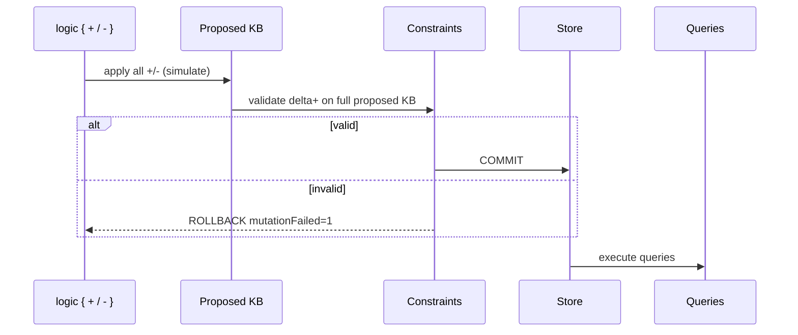

# Logic constraints — validate runtime state

`constraint` declarations in `inline [logic]` define **which ground facts are allowed** in the effective knowledge base. Validation runs at **component init** (static facts) and at **mutation commit** (proposed state after `logic { + / - }`).

Runtime mutations and overlay → [logic-runtime.md](logic-runtime.md). Component wiring → [comp-logic.md](comp-logic.md). Inline syntax → [inline-logic.md](inline-logic.md).

In the **documentation viewer**, `logts-play` blocks support **Load** and **Load & Run** (`on: 1` on the component).

---

## Quick reference

| Topic | Summary |
|-------|---------|
| **Syntax** | `constraint Head <= Body` in `inline [logic]` |
| **Neck** | **`<=`** (validation) — not **`<-`** (derivation) |
| **Same predicate** | Multiple `constraint` lines = **AND** (all must pass) |
| **Relations** | Multiple rules with `<-` = **OR** (alternatives) |
| **When validated** | Init (static KB) + each mutation commit (proposed KB) |
| **Failure at init** | Elaboration error |
| **Failure at commit** | ROLLBACK + `mutationFailed = 1` |
| **Wire args in mutation** | `text w`, `number w`, `bool w` — bare id = atom |

---

## `<-` vs `<=`

| Construct | Neck | Semantics |
|-----------|------|-----------|
| **Rule / relation** | `<-` | Derive knowledge — first matching clause wins (OR across clauses) |
| **Constraint** | `<=` | Validate facts — **every** matching constraint declaration must succeed (AND) |

```logts
canMove(X, Y) <- vehicle(X), road(Y)
canMove(X, Y) <- robot(X), corridor(Y)

constraint inside(O, C) <= object(O), container(C)
constraint inside(O, C) <= allowed(O, C)
```

- **`canMove`**: either vehicle+road **or** robot+corridor proves the goal.
- **`inside` facts**: both constraint lines must succeed for each `inside(...)` fact in the KB.

---

## What constraints validate

Constraints apply to **ground facts** in the effective KB (static ∪ dynamic adds, minus tombstones). They do **not** modify the world — they accept or reject a **proposed state**.

```text
logic { + / - }  →  proposed KB  →  validate constraints  →  COMMIT or ROLLBACK
```

| Pass | When |
|------|------|
| **Init** | All static ground facts must satisfy constraints when `comp [logic]` is elaborated |
| **Commit** | Each **`+`** fact in the transaction is checked against constraints on the **full proposed KB** |

Helper relations in the constraint body (e.g. `slotAvailable(C)`) run on the **proposed** clauses — the same engine as queries.

---

## Basic constraint

```logts
inline [logic] .warehouse:

    object(box1)
    object(box2)
    container(c1)

    inside(box1, c1)

    constraint inside(Object, Container) <=
        object(Object),
        container(Container)

    query hasBox2:
        inside(box2, c1)

:

comp [logic] .whLogic:
    on: 1
    .warehouse { }
:

1wire ok = 0
1wire failed = 0
1wire trigger = 1

.whLogic:{
    logic { + inside(box2, c1) }
    hasBox2 >= ok
    mutationFailed >= failed
    set = trigger
}
```

After **Load & Run**: **`ok = 1`**, **`failed = 0`** — `box2` and `c1` exist.

---

## Commit failure — invalid container

```logts-play
inline [logic] .warehouse:

    object(box1)
    container(c1)

    constraint inside(O, C) <= object(O), container(C)

    query ghostInside:
        inside(box1, ghost)

:

comp [logic] .whLogic:
    on: 1
    .warehouse { }
:

1wire failed = 0
1wire trigger = 1

.whLogic:{
    logic { + inside(box1, ghost) }
    mutationFailed >= failed
    set = trigger
}
```

After **Load & Run**: **`failed = 1`** — `ghost` is not a `container/1` fact; store unchanged.

---

## Init failure — static KB invalid

If static facts violate constraints, elaboration fails before any exec pass:

```logts
inline [logic] .bad:

    object(box1)
    inside(box1, ghost)

    constraint inside(O, C) <= object(O), container(C)

:

comp [logic] .badLogic:
    .bad { }
:
```

Error: static knowledge violates constraints.

---

## Multiple constraints (AND)

```logts-play
inline [logic] .wh:

    object(box1)
    object(box2)
    container(c1)

    allowed(box1, c1)

    constraint inside(O, C) <= object(O), container(C)
    constraint inside(O, C) <= allowed(O, C)

    query hasBox2:
        inside(box2, c1)

:

comp [logic] .whLogic:
    on: 1
    .wh { }
:

1wire ok = 0
1wire failed = 0
1wire trigger = 1

.whLogic:{
    logic { + inside(box2, c1) }
    hasBox2 >= ok
    mutationFailed >= failed
    set = trigger
}
```

After **Load & Run**: **`failed = 1`**, **`ok = 0`** — `allowed(box2, c1)` is missing.

---

## Single location — atomic move

Use a helper relation + negation to forbid two containers for one object:

```logts
badDuplicate(O) <- inside(O, c1), inside(O, c2)
singleLocation(O) <- \+ badDuplicate(O)

constraint inside(O, C) <= object(O), container(C), singleLocation(O)
```

**Move** (remove + add in one transaction) succeeds; **add alone** while still at `c1` fails.

```logts-play
inline [logic] .warehouse:

    object(box1)
    container(c1)
    container(c2)

    inside(box1, c1)

    badDuplicate(O) <- inside(O, c1), inside(O, c2)
    singleLocation(O) <- \+ badDuplicate(O)

    constraint inside(O, C) <=
        object(O),
        container(C),
        singleLocation(O)

    query where:
        inside(box1, X)

:

comp [logic] .whLogic:
    on: 1
    .warehouse { }
:

8wire where = 00000000
1wire failed = 0
1wire trigger = 1

.whLogic:{
    logic {
        - inside(box1, c1)
        + inside(box1, c2)
    }
    where:0 >= where
    mutationFailed >= failed
    set = trigger
}
```

After **Load & Run**: **`where`** shows **`c2`**; **`failed = 0`**.

---

## Capacity — helper on proposed state

```logts-play
inline [logic] .warehouse:

    object(box1)
    object(box2)
    object(box3)
    container(c1)

    inside(box1, c1)
    inside(box2, c1)

    capacity(c1, 2)

    badTriple(C) <- inside(box1, C), inside(box2, C), inside(box3, C)
    slotAvailable(C) <- capacity(C, Max), \+ badTriple(C)

    constraint inside(O, C) <=
        object(O),
        container(C),
        slotAvailable(C)

    query third:
        inside(box3, c1)

:

comp [logic] .whLogic:
    on: 1
    .warehouse { }
:

1wire ok = 0
1wire failed = 0
1wire trigger = 1

.whLogic:{
    logic { + inside(box3, c1) }
    third >= ok
    mutationFailed >= failed
    set = trigger
}
```

After **Load & Run**: **`failed = 1`**, **`ok = 0`** — container already full in proposed state.

---

## Capacity with `count/2` (generic)

The built-in **`count(Goal, N)`** counts solutions to **`Goal`** on the **proposed KB** — a direct replacement for helper + NAF patterns such as `badTriple` / `slotAvailable`:

```logts-play
inline [logic] .warehouse:

    object(box1)
    object(box2)
    object(box3)
    container(c1)

    inside(box1, c1)
    inside(box2, c1)

    capacity(c1, 2)

    constraint inside(O, C) <=
        object(O),
        container(C),
        capacity(C, Max),
        count(inside(_, C), N),
        N =< Max

    query thirdInC1:
        inside(box3, c1)

:

comp [logic] .whLogic:
    on: 1
    .warehouse { }
:

1wire ok = 0
1wire failed = 0
1wire trigger = 1

.whLogic:{
    logic { + inside(box3, c1) }
    thirdInC1 >= ok
    mutationFailed >= failed
    set = trigger
}
```

After **Load & Run**: **`failed = 1`**, **`ok = 0`**.

Helper relations remain valid; see [logic-indexing.md](logic-indexing.md) for **`count/2`** syntax, **`indexFacts`**, and **`indexRebuild`**.

---

## Mutation wire prefixes (D59)

In `logic { }`, a bare identifier is always a **logic atom**. To read a **LogTScript wire**, prefix with the decode type:

| Form | Meaning |
|------|---------|
| `box1`, `c1` | Atoms (even if a wire with the same name exists) |
| `text destWire` | Wire → ASCII atom |
| `text list routeVec` | Vector / packed wire → Prolog list of atoms |
| `number scoreIn` | Wire → unsigned integer |
| `number list levels` | Packed wire → list of integers |
| `bool flag` | Wire → 0/1 |
| `bool list flags` | Packed wire → list of 0/1 |

```logts-play
inline [logic] .nums:

    object(box1)

    constraint level(O, N) <= object(O), N >= 0, N =< 99

    query hasLevel:
        level(box1, 15)

:

comp [logic] .numLogic:
    on: 1
    .nums { }
:

8wire scoreIn = 00001111
1wire ok = 0
1wire failed = 0
1wire trigger = 1

.numLogic:{
    logic { + level(box1, number scoreIn) }
    hasLevel >= ok
    mutationFailed >= failed
    set = trigger
}
```

After **Load & Run**: **`ok = 1`**, **`failed = 0`**.

List wire prefix in mutations:

```logts-play
inline [logic] .routes:

    path(a, [x])

    query hasB:
        path(b, Nodes)

:

comp [logic] .routeLogic:
    on: 1
    .routes { }
:

8wire[4] routeVec = 01101110011001010111001100000000
1wire ok = 0
1wire failed = 0
1wire trigger = 1

.routeLogic:{
    logic { + path(b, text list routeVec) }
    hasB >= ok
    mutationFailed >= failed
    set = trigger
}
```

**Load & Run**: adds `path(b,[n,e,s])` from the packed wire → **`ok = 1`**.

Missing wire with prefix → transaction failure:

```logts
logic { + inside(box2, text missingWire) }
```

→ **`mutationFailed = 1`**.

---

## Pipeline with constraints



Queries always run on the **committed** KB (unchanged if rollback).

---

## Constraint check simulation

**`.whLogic:check({ + / - })`** on **`comp [logic]`** applies the **same** constraint rules as a mutation commit, without writing to the dynamic store.

| Case | Outcome |
|------|---------|
| All **`+`** facts satisfy every matching **`constraint`** | Boolean **`1`** |
| Any **`+`** fact fails a constraint body | Boolean **`0`** |
| **`check({ })`** — no ops | **Error** |
| **`+ inside(box1, X)`** — Prolog variable | **Error** (non-ground) |
| **`data: static`** component | **Error** |

**`-`** ops participate in the simulated KB overlay; only **`+`** facts are validated against constraints (same as mutation commit).

```logts-play
inline [logic] .warehouse:

    object(box3)
    container(c1)

    constraint inside(Object, Container) <=
        object(Object),
        container(Container)

:

comp [logic] .whLogic:
    on: 1
    .warehouse { }
:

1wire ok = .whLogic:check({ + inside(box3, ghost) })
```

After **Load & Run**: **`ok = 0`** — **`ghost`** is not a declared **`container/1`** fact.

---

## Wave and legacy

Constraint and mutation results are intended to be **identical** under wave and legacy propagation. Automated tests cover both modes.

---

## Related

- [logic-runtime.md](logic-runtime.md) — mutations, tombstones, overlay
- [inline-logic.md](inline-logic.md) — facts, rules, queries
- [comp-logic.md](comp-logic.md) — exec block, redirects, `mutationFailed`
