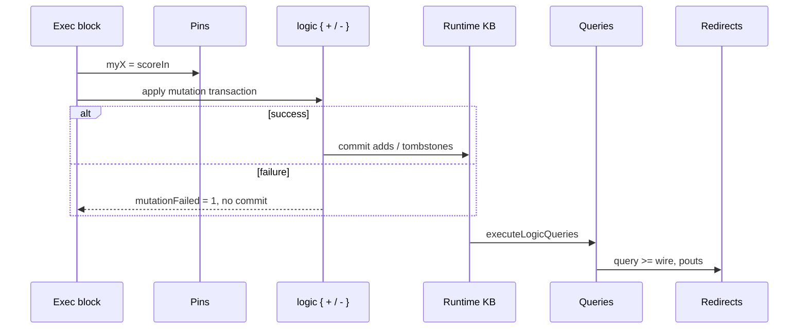

# Logic runtime — static KB, dynamic overlay, mutations

This page describes how **`comp [logic]`** builds the knowledge base used on each solve pass: **static** facts from `inline [logic]`, a **dynamic overlay** (adds and tombstones), and the **`logic { + / - }`** mutation block in exec blocks.

Definition syntax → [inline-logic.md](inline-logic.md). Component wiring and query redirects → [comp-logic.md](comp-logic.md). Ad-hoc expression queries → [logic-query-exec.md](logic-query-exec.md).

In the **documentation viewer**, `logts-play` blocks support **Load** and **Load & Run** (use `on: 1` on the component so the first run executes when `set = 1`).

---

## Quick reference

| Topic | Summary |
|-------|---------|
| **Static KB** | Ground facts and rules from `inline [logic]` — unchanged at runtime |
| **Effective KB** | Mode-dependent — see [logic-runtime.md — data modes](logic-runtime.md#data-modes) |
| **Dynamic overlay** | Per-component store: **adds** (`+`) and **tombstones** (`-`) — **`overlay`** mode |
| **Mutation syntax** | `logic { + fact\n- fact }` in exec block — Prolog **assert** / **retract** analogy |
| **Transaction** | All ops in one `logic { }` block commit together or roll back |
| **`mutationFailed`** | Pout **`1`** if the transaction failed (non-ground fact, etc.) |
| **Order per pass** | Pin assigns → **mutations** → **queries** → redirects |
| **Persistence** | Dynamic store survives across `set` passes on the same component |
| **`.world:query`** | Reads **static inline only** — not the component dynamic overlay |
| **Wire in mutation** | `text w` / `text list w` / … — bare id = atom; **`text each w`** zip rows; **`text every w`** Cartesian alternatives; **`text list each matrix`** / **`text list every matrix`** |
| **Constraints** | `constraint P <= Body` — see [logic-constraints.md](logic-constraints.md) |

---

## Static vs dynamic

```text
inline [logic] .warehouse          comp [logic] .whLogic
  inside(box1, c1)        ──►        dynamicStore { adds, tombstones }
  rules / queries                      │
                                       ▼
                               runtime clauses = static ∖ tombstones ∪ adds
                                       │
                                       ▼
                               executeLogicQueries (named queries)
```

| Layer | Where | Mutable at runtime? |
|-------|-------|---------------------|
| **Static** | `inline [logic]` facts and rules | No |
| **Dynamic adds** | `+ groundFact` in exec block | Yes — per `comp [logic]` instance |
| **Tombstones** | `- groundFact` hides a static fact | Yes — fact omitted from effective KB until removed from store |

Rules are always taken from the merged inline definition. Only **ground facts** participate in the overlay.

---

## Data modes

Set **`data:`** on **`comp [logic]`** to control how facts enter the runtime knowledge base. Omit **`data:`** for **`overlay`** (default).

| Mode | Runtime facts | Mutations | Use |
|------|---------------|-----------|-----|
| **`overlay`** (default) | Static facts ∖ tombstones ∪ dynamic adds | **`logic { + / - }`** — `-` may tombstone static facts | General mutable KB on top of inline |
| **`static`** | Static inline facts only | **`logic { }` forbidden** (elaboration error) | Query-only; read inline KB unchanged |
| **`seed`** | Ground facts copied to dynamic store at init; rules stay in inline | **`logic { + / - }`** — `-` deletes from dynamic (no tombstones) | Mutable facts isolated from inline static layer |

Invalid values (**`data: copy`**, unknown strings) are **elaboration errors**.

### Example — `data: static` (query only)

```logts-play
inline [logic] .warehouse:

    object(box1)
    container(c1)

    inside(box1, c1)

    query stillAtC1:
        inside(box1, c1)

:

comp [logic] .whLogic:
    data: static
    on: 1
    .warehouse { }
:

1wire ok = 0
1wire trigger = 1

.whLogic:{
    stillAtC1 >= ok
    set = trigger
}
```

After **Load & Run**: **`ok = 1`**. A **`logic { }`** block on this component is rejected at elaboration.

### Example — `data: seed` (seed + mutate)

At init, all ground facts from the merged inline (including facts from **`use`**) are copied into the component dynamic store. Rules and constraints remain in the inline layer.

```logts-play
inline [logic] .warehouse:

    object(box1)
    object(box2)
    container(c1)

    inside(box1, c1)

    constraint inside(Object, Container) <=
        object(Object),
        container(Container)

    query hasBox2:
        inside(box2, c1)

:

comp [logic] .whLogic:
    data: seed
    on: 1
    .warehouse { }
:

1wire ok = 0
1wire failed = 0
1wire trigger = 1

.whLogic:{
    logic { + inside(box2, c1) }
    hasBox2 >= ok
    mutationFailed >= failed
    set = trigger
}
```

After **Load & Run**: **`ok = 1`**, **`failed = 0`**. Retracting a seeded fact uses **`- fact`**, which removes it from the dynamic store directly (no tombstone on static facts).

---

## Mutation block — `logic { + / - }`

Place a **`logic { … }`** property inside a **`comp [logic]`** exec block:

```logts
.whLogic:{
    logic {
        - inside(box1, c1)
        + inside(box1, c2)
    }
    where:0 >= destWire
    mutationFailed >= failedWire
    set = trigger
}
```

| Line | Meaning |
|------|---------|
| **`+ fact`** | **Assert** — add ground fact to dynamic store (like Prolog `assert/1`) |
| **`- fact`** | **Retract** — tombstone the fact key (static or previously added) |
| **Order inside block** | Applied top-to-bottom as one transaction |
| **Multiple blocks / passes** | Same exec block: one `logic { }` per pass; store **accumulates** across passes |

Facts use the same syntax as inline ground facts: `predicate(arg1, arg2)`.

### Ground facts only

Every argument must be **ground** (atom, number, or compound of ground terms). Variables are rejected.

| Attempt | Result |
|---------|--------|
| `+ inside(box1, c2)` | Success — bare identifiers are atoms |
| `+ inside(box1, X)` | **Transaction fails** — `mutationFailed = 1`, store unchanged |
| `+ located(box1, text destWire)` | Success — wire decoded to atom before ground check |
| `+ level(box1, number scoreIn)` | Success — wire decoded to integer |
| `+ reading(1, number/fp16 sensorIn)` | Success — `16wire` decoded to raw IEEE half bits as integer |
| `+ inside(box2, text missingWire)` | **Fails** — wire not found |

### Idempotent add (D43)

Adding a fact that is **already** in the effective KB (static or dynamic) succeeds. No duplicate clause is stored.

### Remove absent (D44)

`- fact` when the fact is **not** in the effective KB still **succeeds** (Prolog-style retract of absent fact). A tombstone may be recorded so a matching static fact stays hidden if added later in the same store lifecycle.

### Tombstones (D45)

`- inside(box1, c1)` on a static fact does **not** edit the inline module. It records a **tombstone** so `inside(box1, c1)` is skipped when building runtime clauses. Queries on the component see the fact as **retracted**.

---

## Solve pass pipeline



| Step | What runs |
|------|-----------|
| 1 | Wire → pin assignments (`myX = scoreIn`) |
| 2 | Collect all `logic { }` blocks; resolve **`text`/`number`/`bool` wire** refs |
| 3 | **Atomic transaction** — all `+`/`-` succeed or none apply |
| 3b | **[Constraints]** validate proposed KB — see [logic-constraints.md](logic-constraints.md) |
| 4 | Build runtime clauses from static + dynamic store |
| 5 | Run **all** named queries from inline (with pin input env) |
| 6 | Write query and pout redirects |

Mutations run **before** queries in the same pass, so redirects can observe updated facts immediately.

---

## `mutationFailed` pout

When a mutation fails, the component sets **`mutationFailed = 1`** and leaves the dynamic store unchanged. For a human-readable reason (constraint ordinal, parse error, resolved ops), arm **Signal Trace** at **L2** — see [signal-trace.md — logic-mut](signal-trace.md#logic-mut).

| Value | Meaning |
|-------|---------|
| **`0`** | No mutation block, or last transaction **committed** |
| **`1`** | Last transaction **failed** — typically non-ground fact; **no** partial apply |

Redirect like any other pout:

```logts
mutationFailed >= failed
```

On failure, the dynamic store is unchanged from before that transaction.

---

## Mutations vs queries

| Mechanism | Where | Purpose |
|-----------|-------|---------|
| **`logic { + / - }`** | `comp [logic]` exec block | Change effective facts between passes |
| **`query name:` redirect** | Same exec block | Read solutions after mutations |
| **`.world:query({ … })`** | Expression on inline instance | Ad-hoc goals on **static** inline KB only |

Use **component query redirects** to test facts after mutation. Inline **`.world:query`** does not see the component dynamic store.

---

## Example — move box between containers

Static warehouse fact: `inside(box1, c1)`. One pass moves the box to `c2`.

```logts-play
inline [logic] .warehouse:

    object(box1)
    container(c1)
    container(c2)

    inside(box1, c1)

    query where:
        inside(box1, X)

    query stillAtC1:
        inside(box1, c1)

:

comp [logic] .whLogic:
    on: 1
    .warehouse { }
:

8wire where = 00000000
1wire still = 0
1wire failed = 0
1wire trigger = 1

.whLogic:{
    logic {
        - inside(box1, c1)
        + inside(box1, c2)
    }
    where:0 >= where
    stillAtC1 >= still
    mutationFailed >= failed
    set = trigger
}
```

After **Load & Run**:

- **`where`** — first character is **`c`** (`c2` atom) — box moved.
- **`still`** — **`0`** — old location retracted.
- **`failed`** — **`0`** — transaction OK.

---

## Example — assert new status fact

```logts-play
inline [logic] .tags:

    query hasActive:
        status(box1, active)

:

comp [logic] .tagLogic:
    on: 1
    .tags { }
:

1wire ok = 0
1wire failed = 0
1wire trigger = 1

.tagLogic:{
    logic { + status(box1, active) }
    hasActive >= ok
    mutationFailed >= failed
    set = trigger
}
```

After **Load & Run**: **`ok = 1`**, **`failed = 0`**.

---

## Example — idempotent duplicate add

Adding the same fact twice (across two passes or in one block) does not fail.

```logts-play
inline [logic] .tags:

    query hasActive:
        status(box1, active)

:

comp [logic] .tagLogic:
    on: 1
    .tags { }
:

1wire ok = 0
1wire failed = 0
1wire trigger = 1

.tagLogic:{
    logic {
        + status(box1, active)
        + status(box1, active)
    }
    hasActive >= ok
    mutationFailed >= failed
    set = trigger
}
```

After **Load & Run**: **`ok = 1`**, **`failed = 0`**.

---

## Example — non-ground fact fails transaction

```logts-play
inline [logic] .warehouse:

    inside(box1, c1)

    query stillAtC1:
        inside(box1, c1)

:

comp [logic] .whLogic:
    on: 1
    .warehouse { }
:

1wire failed = 0
1wire still = 0
1wire trigger = 1

.whLogic:{
    logic { + inside(box1, X) }
    stillAtC1 >= still
    mutationFailed >= failed
    set = trigger
}
```

After **Load & Run**:

- **`failed = 1`** — `X` is not ground.
- **`still = 1`** — static `inside(box1, c1)` unchanged.

---

## Example — tombstone hides static fact

```logts-play
inline [logic] .warehouse:

    inside(box1, c1)

    query stillAtC1:
        inside(box1, c1)

:

comp [logic] .whLogic:
    on: 1
    .warehouse { }
:

1wire ok = 0
1wire trigger = 1

.whLogic:{
    logic { - inside(box1, c1) }
    stillAtC1 >= ok
    set = trigger
}
```

After **Load & Run**: **`ok = 0`** — static fact hidden by tombstone, not deleted from inline.

---

## Example — wire prefix in mutation

Use **`text`**, **`number`**, **`bool`**, or **`text list`**, **`number list`**, **`bool list`** before a wire name. Bare identifiers are **atoms** (even when a homonymous wire exists).

```logts-play
inline [logic] .warehouse:

    query hasLocated:
        located(box1, zone2)

:

comp [logic] .whLogic:
    on: 1
    .warehouse { }
:

40wire destWire = 01111010 01101111 01101110 01100101 00110010
1wire ok = 0
1wire failed = 0
1wire trigger = 1

.whLogic:{
    logic { + located(box1, text destWire) }
    hasLocated >= ok
    mutationFailed >= failed
    set = trigger
}
```

After **Load & Run**: **`ok = 1`**, **`failed = 0`** — `destWire` encodes atom **`zone2`**.

```logts
logic { + inside(box1, container2) }    /* atom container2 */
logic { + inside(box1, text container2) } /* wire container2 → atom from bits */
```

---

## Mutation **`each`** — zip rows into N facts

Postfix modifier on wire refs (extends F25 bind syntax):

```text
<text | number | bool> [list] each <wireName>
```

| Form | Wire shape | One expanded call at row `i` |
|------|------------|------------------------------|
| `text each V` | vector `Wwire[N]` | atom from cell `i` |
| `number each V` | vector | number from cell `i` |
| `bool each V` | vector | bool from cell `i` |
| `text list each M` | matrix `Wwire[R,C]` | Prolog list from **row** `i` (fill cells skipped, same as `text list`) |
| `text list W` **without** `each` | vector | **unchanged** — one list argument for the whole wire |
| `text list M` **without** `each` on matrix | — | **error** (same as before) |

**Rules:**

- All `each` args in one fact must share the same row count (`N` = vector length or matrix rows). Mismatch → **`mutationFailed = 1`**.
- Args **without** `each` (literals, atoms, `text w`, `text list w`, …) are **broadcast** — same value on every expanded call.
- `-` uses the same expansion as `+`.
- Before resolve/commit, the engine expands to separate `+`/`-` ops; constraints and indexing see each ground fact individually.

### Example — zip two vectors

```logts-play
inline [logic] .pairs:

    query qa:
        pair(a, X)
    query qb:
        pair(b, X)

:

8wire[3] owners = 01100001 + 01100010 + 01100011
8wire[3] cars = 01101000 + 01101001 + 01101010

comp [logic] .pairLogic:
    on: 1
    .pairs { }
:

1wire okA = 0
1wire okB = 0
1wire failed = 0
1wire trigger = 1

.pairLogic:{
    logic {
        + pair(text each owners, text each cars)
    }
    qa >= okA
    qb >= okB
    mutationFailed >= failed
    set = trigger
}
```

After **Load & Run**: three facts `pair(a,t)`, `pair(b,u)`, `pair(c,v)` (one ASCII cell per vector slot) → **`okA = 1`**, **`okB = 1`**, **`failed = 0`**.

### Example — vector owner + matrix row lists

```logts-play
inline [logic] .fleet:

    query carA:
        car(a, L)

:

8wire[3] owners = 01100001 + 01100010 + 01100011
8wire[3,3] carsMatrix = 01101000 + 01100010 + 01100001 + 01100010 + 01110000 + 00000000 + 01101101 + 00000000 + 00000000

comp [logic] .fleetLogic:
    on: 1
    .fleet { }
:

1wire ok = 0
1wire failed = 0
1wire trigger = 1

.fleetLogic:{
    logic {
        + car(text each owners, text list each carsMatrix)
    }
    carA >= ok
    mutationFailed >= failed
    set = trigger
}
```

After **Load & Run**: owner **`a`** gets list **`[t,b,a]`** from row 0 (NUL/fill cells dropped) → **`ok = 1`**.

### Example — broadcast without `each`

```logts-play
inline [logic] .tags:

    query qa:
        tag(a, active, L)

:

8wire[3] owners = 01100001 + 01100010 + 01100011
8wire[3] sharedTags = 01101000 + 01100010 + 01100011

comp [logic] .tagLogic:
    on: 1
    .tags { }
:

1wire ok = 0
1wire failed = 0
1wire trigger = 1

.tagLogic:{
    logic {
        + tag(text each owners, active, text list sharedTags)
    }
    qa >= ok
    mutationFailed >= failed
    set = trigger
}
```

The literal **`active`** and the **`text list sharedTags`** value are identical on every expanded `tag/3` fact.

---

## Mutation **`every`** — Cartesian expansion

Postfix modifier on wire refs (extends **`each`**):

```text
<text | number | bool | float[/fmt]> [list] every <wireName>
```

| Form | Wire shape | Expansion |
|------|------------|-----------|
| `text every V` | vector `Wwire[N]` | **every** cell value is an alternative (N expanded calls per other `every` arg) |
| `number every V` | vector | every number cell |
| `bool every V` | vector | every bool cell |
| `float/fp16 every V` | vector | every decoded float cell |
| `text list every M` | matrix `Wwire[R,C]` | **each matrix row** as one Prolog list alternative (R alternatives) |
| `text every A` + `text every B` | two vectors | **full Cartesian product** (N×M expanded facts) |
| `text each A` + `text every B` | vector + vector | **`each` zip** establishes rows, then **`every`** multiplies **within each row** |

**Rules:**

- **`each`** and **`every`** are **mutually exclusive on the same wire ref** (`text each every W` → parse error).
- Multiple **`every`** args in one fact → Cartesian product across all of them.
- Args **without** a modifier are **broadcast** (same as **`each`** expansion).
- **`every`** inside **nested compounds** is expanded structurally before commit (same pipeline as top-level).
- Expansion is capped at **10 000** ground facts per mutation/check op; exceeding the cap sets **`mutationFailed = 1`** with no partial commit.
- `-` uses the same expansion as `+`.

**Mental model:** **`each`** = pick synchronized row · **`every`** = pick every alternative · **plain** = broadcast once.

### Example — Cartesian product (3×2)

```logts-play
inline [logic] .pairs:

    query qah:
        pair(a, h)
    query qai:
        pair(a, i)
    query qbh:
        pair(b, h)
    query qbi:
        pair(b, i)
    query qch:
        pair(c, h)
    query qci:
        pair(c, i)

:

8wire[3] owners = 01100001 + 01100010 + 01100011
8wire[2] cars = 01101000 + 01101001

comp [logic] .pairLogic:
    on: 1
    .pairs { }
:

1wire ok = 0
1wire failed = 0
1wire trigger = 1

.pairLogic:{
    logic {
        + pair(text every owners, text every cars)
    }
    qah >= ok
    qai >= ok
    qbh >= ok
    qbi >= ok
    qch >= ok
    qci >= ok
    mutationFailed >= failed
    set = trigger
}
```

After **Load & Run**: six facts `(a,h)`, `(a,i)`, `(b,h)`, `(b,i)`, `(c,h)`, `(c,i)` → all six query wires **`1`**, **`failed = 0`**.

### Example — `each` rows + `every` colors per row

```logts-play
inline [logic] .triples:

    query q1:
        triple(a, h, r)
    query q6:
        triple(b, i, b)

:

8wire[2] owners = 01100001 + 01100010
8wire[2] cars = 01101000 + 01101001
8wire[3] colors = 01110010 + 01100111 + 01100010

comp [logic] .tripleLogic:
    on: 1
    .triples { }
:

1wire ok1 = 0
1wire ok6 = 0
1wire failed = 0
1wire trigger = 1

.tripleLogic:{
    logic {
        + triple(text each owners, text each cars, text every colors)
    }
    q1 >= ok1
    q6 >= ok6
    mutationFailed >= failed
    set = trigger
}
```

After **Load & Run**: **6** facts (2 zip rows × 3 colors) → **`ok1 = 1`**, **`ok6 = 1`**, **`failed = 0`**.

### Example — nested compound with `each` + `every`

```logts-play
inline [logic] .loc:

    query q1:
        located(j, zone(1, n))
    query q6:
        located(m, zone(2, e))

:

8wire[2] names = 01101010 + 01101101
16wire[2] ids = 0000000000000001 + 0000000000000010
8wire[3] areas = 01101110 + 01110011 + 01100101

comp [logic] .locLogic:
    on: 1
    .loc { }
:

1wire ok1 = 0
1wire ok6 = 0
1wire failed = 0
1wire trigger = 1

.locLogic:{
    logic {
        + located(
            text each names,
            zone(number each ids, text every areas)
        )
    }
    q1 >= ok1
    q6 >= ok6
    mutationFailed >= failed
    set = trigger
}
```

After **Load & Run**: **6** facts — outer **`each`** on names; inner **`number each ids`** follows the same row index; inner **`text every areas`** Cartesian per row → **`ok1 = 1`**, **`ok6 = 1`**.

Multiline **`logic { + … }`** facts are supported (parentheses may span lines).

### Example — `check({ + … every … })`

```logts-play
inline [logic] .pairs:

:

8wire[2] owners = 01100001 + 01100010
8wire[2] cars = 01101000 + 01101001

comp [logic] .pairLogic:
    on: 1
    .pairs { }
:

1wire pass = .pairLogic:check({ + pair(text every owners, text every cars) })
```

After **Load & Run**: **`pass = 1`** (same expansion and validation as a commit).

---

## Example — mutations then query in one pass

Mutations commit before redirects read query results.

```logts-play
inline [logic] .warehouse:

    inside(box1, c1)
    container(c1)
    container(c2)

    query where:
        inside(box1, X)

:

comp [logic] .whLogic:
    on: 1
    .warehouse { }
:

8wire dest = 00000000
1wire trigger = 1

.whLogic:{
    logic {
        - inside(box1, c1)
        + inside(box1, c2)
    }
    where:0 >= dest
    set = trigger
}
```

After **Load & Run**: **`dest`** shows **`c2`** (ASCII **`c`** in first byte).

---

## Example — `mutationFailed` after success

```logts-play
inline [logic] .tags:

    query hasActive:
        status(box1, active)

:

comp [logic] .tagLogic:
    on: 1
    .tags { }
:

1wire failed = 1
1wire trigger = 1

.tagLogic:{
    logic { + status(box1, active) }
    mutationFailed >= failed
    set = trigger
}
```

After **Load & Run**: **`failed = 0`**.

---

## Persistence across passes

The dynamic store is owned by the **component instance**. A second **`set`** pass sees adds and tombstones from earlier passes (until reset by reloading the script).

```logts-play
inline [logic] .tags:

    query hasActive:
        status(box1, active)

:

comp [logic] .tagLogic:
    on: 1
    .tags { }
:

1wire ok = 0
1wire trigger = 0

.tagLogic:{
    logic { + status(box1, active) }
    hasActive >= ok
    set = trigger
}
```

1. **Load & Run** with `trigger = 0` — no pass; **`ok = 0`**.
2. Set **`trigger = 1`** and **Run** again — **`ok = 1`** (fact persists).

For a single-shot demo, keep **`1wire trigger = 1`** as in other examples.

---

## Wave and legacy

Mutation and query results are intended to be **identical** under **wave** and **legacy** propagation. Automated tests cover both modes for move, tombstone, wire args, and failure paths.

---

## Related

- [inline-logic.md](inline-logic.md) — static facts, rules, queries
- [logic-constraints.md](logic-constraints.md) — `constraint` validation, `<=` vs `<-`
- [logic-indexing.md](logic-indexing.md) — fact index, `count/2`, `indexFacts`, `indexRebuild`
- [comp-logic.md](comp-logic.md) — pins, redirects, pouts, policies
- [logic-query-exec.md](logic-query-exec.md) — `.world:query` on static inline KB
