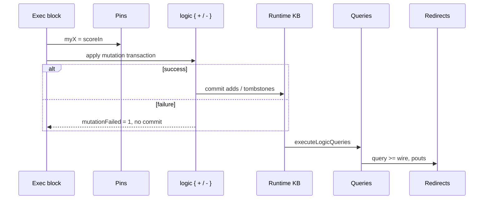

# Logic runtime — static KB, dynamic overlay, mutations

This page describes how **`comp [logic]`** builds the knowledge base used on each solve pass: **static** facts from `inline [logic]`, a **dynamic overlay** (adds and tombstones), and the **`logic { + / - }`** mutation block in exec blocks.

Definition syntax → [inline-logic.md](inline-logic.md). Component wiring and query redirects → [comp-logic.md](comp-logic.md). Ad-hoc expression queries → [logic-query-exec.md](logic-query-exec.md).

In the **documentation viewer**, `logts-play` blocks support **Load** and **Load & Run** (use `on: 1` on the component so the first run executes when `set = 1`).

---

## Quick reference

| Topic | Summary |
|-------|---------|
| **Static KB** | Ground facts and rules from `inline [logic]` — unchanged at runtime |
| **Dynamic overlay** | Per-component store: **adds** (`+`) and **tombstones** (`-`) |
| **Effective KB** | `static ∖ tombstoned facts ∪ dynamic adds` |
| **Mutation syntax** | `logic { + fact\n- fact }` in exec block — Prolog **assert** / **retract** analogy |
| **Transaction** | All ops in one `logic { }` block commit together or roll back |
| **`mutationFailed`** | Pout **`1`** if the transaction failed (non-ground fact, etc.) |
| **Order per pass** | Pin assigns → **mutations** → **queries** → redirects |
| **Persistence** | Dynamic store survives across `set` passes on the same component |
| **`.world:query`** | Reads **static inline only** — not the component dynamic overlay |
| **Wire in mutation** | `text w` / `number w` / `bool w` — bare id = atom |
| **Constraints** | `constraint P <= Body` — see [logic-constraints.md](logic-constraints.md) |

---

## Static vs dynamic

```text
inline [logic] .warehouse          comp [logic] .whLogic
  inside(box1, c1)        ──►        dynamicStore { adds, tombstones }
  rules / queries                      │
                                       ▼
                               runtime clauses = static ∖ tombstones ∪ adds
                                       │
                                       ▼
                               executeLogicQueries (named queries)
```

| Layer | Where | Mutable at runtime? |
|-------|-------|---------------------|
| **Static** | `inline [logic]` facts and rules | No |
| **Dynamic adds** | `+ groundFact` in exec block | Yes — per `comp [logic]` instance |
| **Tombstones** | `- groundFact` hides a static fact | Yes — fact omitted from effective KB until removed from store |

Rules are always taken from the merged inline definition. Only **ground facts** participate in the overlay.

---

## Mutation block — `logic { + / - }`

Place a **`logic { … }`** property inside a **`comp [logic]`** exec block:

```logts
.whLogic:{
    logic {
        - inside(box1, c1)
        + inside(box1, c2)
    }
    where:0 >= destWire
    mutationFailed >= failedWire
    set = trigger
}
```

| Line | Meaning |
|------|---------|
| **`+ fact`** | **Assert** — add ground fact to dynamic store (like Prolog `assert/1`) |
| **`- fact`** | **Retract** — tombstone the fact key (static or previously added) |
| **Order inside block** | Applied top-to-bottom as one transaction |
| **Multiple blocks / passes** | Same exec block: one `logic { }` per pass; store **accumulates** across passes |

Facts use the same syntax as inline ground facts: `predicate(arg1, arg2)`.

### Ground facts only

Every argument must be **ground** (atom, number, or compound of ground terms). Variables are rejected.

| Attempt | Result |
|---------|--------|
| `+ inside(box1, c2)` | Success — bare identifiers are atoms |
| `+ inside(box1, X)` | **Transaction fails** — `mutationFailed = 1`, store unchanged |
| `+ located(box1, text destWire)` | Success — wire decoded to atom before ground check |
| `+ level(box1, number scoreIn)` | Success — wire decoded to integer |
| `+ inside(box2, text missingWire)` | **Fails** — wire not found |

### Idempotent add (D43)

Adding a fact that is **already** in the effective KB (static or dynamic) succeeds. No duplicate clause is stored.

### Remove absent (D44)

`- fact` when the fact is **not** in the effective KB still **succeeds** (Prolog-style retract of absent fact). A tombstone may be recorded so a matching static fact stays hidden if added later in the same store lifecycle.

### Tombstones (D45)

`- inside(box1, c1)` on a static fact does **not** edit the inline module. It records a **tombstone** so `inside(box1, c1)` is skipped when building runtime clauses. Queries on the component see the fact as **retracted**.

---

## Solve pass pipeline



| Step | What runs |
|------|-----------|
| 1 | Wire → pin assignments (`myX = scoreIn`) |
| 2 | Collect all `logic { }` blocks; resolve **`text`/`number`/`bool` wire** refs |
| 3 | **Atomic transaction** — all `+`/`-` succeed or none apply |
| 3b | **[Constraints]** validate proposed KB — see [logic-constraints.md](logic-constraints.md) |
| 4 | Build runtime clauses from static + dynamic store |
| 5 | Run **all** named queries from inline (with pin input env) |
| 6 | Write query and pout redirects |

Mutations run **before** queries in the same pass, so redirects can observe updated facts immediately.

---

## `mutationFailed` pout

| Value | Meaning |
|-------|---------|
| **`0`** | No mutation block, or last transaction **committed** |
| **`1`** | Last transaction **failed** — typically non-ground fact; **no** partial apply |

Redirect like any other pout:

```logts
mutationFailed >= failed
```

On failure, the dynamic store is unchanged from before that transaction.

---

## Mutations vs queries

| Mechanism | Where | Purpose |
|-----------|-------|---------|
| **`logic { + / - }`** | `comp [logic]` exec block | Change effective facts between passes |
| **`query name:` redirect** | Same exec block | Read solutions after mutations |
| **`.world:query({ … })`** | Expression on inline instance | Ad-hoc goals on **static** inline KB only |

Use **component query redirects** to test facts after mutation. Inline **`.world:query`** does not see the component dynamic store.

---

## Example — move box between containers

Static warehouse fact: `inside(box1, c1)`. One pass moves the box to `c2`.

```logts-play
inline [logic] .warehouse:

    object(box1)
    container(c1)
    container(c2)

    inside(box1, c1)

    query where:
        inside(box1, X)

    query stillAtC1:
        inside(box1, c1)

:

comp [logic] .whLogic:
    on: 1
    .warehouse { }
:

8wire where = 00000000
1wire still = 0
1wire failed = 0
1wire trigger = 1

.whLogic:{
    logic {
        - inside(box1, c1)
        + inside(box1, c2)
    }
    where:0 >= where
    stillAtC1 >= still
    mutationFailed >= failed
    set = trigger
}
```

After **Load & Run**:

- **`where`** — first character is **`c`** (`c2` atom) — box moved.
- **`still`** — **`0`** — old location retracted.
- **`failed`** — **`0`** — transaction OK.

---

## Example — assert new status fact

```logts-play
inline [logic] .tags:

    query hasActive:
        status(box1, active)

:

comp [logic] .tagLogic:
    on: 1
    .tags { }
:

1wire ok = 0
1wire failed = 0
1wire trigger = 1

.tagLogic:{
    logic { + status(box1, active) }
    hasActive >= ok
    mutationFailed >= failed
    set = trigger
}
```

After **Load & Run**: **`ok = 1`**, **`failed = 0`**.

---

## Example — idempotent duplicate add

Adding the same fact twice (across two passes or in one block) does not fail.

```logts-play
inline [logic] .tags:

    query hasActive:
        status(box1, active)

:

comp [logic] .tagLogic:
    on: 1
    .tags { }
:

1wire ok = 0
1wire failed = 0
1wire trigger = 1

.tagLogic:{
    logic {
        + status(box1, active)
        + status(box1, active)
    }
    hasActive >= ok
    mutationFailed >= failed
    set = trigger
}
```

After **Load & Run**: **`ok = 1`**, **`failed = 0`**.

---

## Example — non-ground fact fails transaction

```logts-play
inline [logic] .warehouse:

    inside(box1, c1)

    query stillAtC1:
        inside(box1, c1)

:

comp [logic] .whLogic:
    on: 1
    .warehouse { }
:

1wire failed = 0
1wire still = 0
1wire trigger = 1

.whLogic:{
    logic { + inside(box1, X) }
    stillAtC1 >= still
    mutationFailed >= failed
    set = trigger
}
```

After **Load & Run**:

- **`failed = 1`** — `X` is not ground.
- **`still = 1`** — static `inside(box1, c1)` unchanged.

---

## Example — tombstone hides static fact

```logts-play
inline [logic] .warehouse:

    inside(box1, c1)

    query stillAtC1:
        inside(box1, c1)

:

comp [logic] .whLogic:
    on: 1
    .warehouse { }
:

1wire ok = 0
1wire trigger = 1

.whLogic:{
    logic { - inside(box1, c1) }
    stillAtC1 >= ok
    set = trigger
}
```

After **Load & Run**: **`ok = 0`** — static fact hidden by tombstone, not deleted from inline.

---

## Example — wire prefix in mutation

Use **`text`**, **`number`**, or **`bool`** before a wire name. Bare identifiers are **atoms** (even when a homonymous wire exists).

```logts-play
inline [logic] .warehouse:

    query hasLocated:
        located(box1, zone2)

:

comp [logic] .whLogic:
    on: 1
    .warehouse { }
:

40wire destWire = 01111010 01101111 01101110 01100101 00110010
1wire ok = 0
1wire failed = 0
1wire trigger = 1

.whLogic:{
    logic { + located(box1, text destWire) }
    hasLocated >= ok
    mutationFailed >= failed
    set = trigger
}
```

After **Load & Run**: **`ok = 1`**, **`failed = 0`** — `destWire` encodes atom **`zone2`**.

```logts
logic { + inside(box1, container2) }    /* atom container2 */
logic { + inside(box1, text container2) } /* wire container2 → atom from bits */
```

---

## Example — mutations then query in one pass

Mutations commit before redirects read query results.

```logts-play
inline [logic] .warehouse:

    inside(box1, c1)
    container(c1)
    container(c2)

    query where:
        inside(box1, X)

:

comp [logic] .whLogic:
    on: 1
    .warehouse { }
:

8wire dest = 00000000
1wire trigger = 1

.whLogic:{
    logic {
        - inside(box1, c1)
        + inside(box1, c2)
    }
    where:0 >= dest
    set = trigger
}
```

After **Load & Run**: **`dest`** shows **`c2`** (ASCII **`c`** in first byte).

---

## Example — `mutationFailed` after success

```logts-play
inline [logic] .tags:

    query hasActive:
        status(box1, active)

:

comp [logic] .tagLogic:
    on: 1
    .tags { }
:

1wire failed = 1
1wire trigger = 1

.tagLogic:{
    logic { + status(box1, active) }
    mutationFailed >= failed
    set = trigger
}
```

After **Load & Run**: **`failed = 0`**.

---

## Persistence across passes

The dynamic store is owned by the **component instance**. A second **`set`** pass sees adds and tombstones from earlier passes (until reset by reloading the script).

```logts-play
inline [logic] .tags:

    query hasActive:
        status(box1, active)

:

comp [logic] .tagLogic:
    on: 1
    .tags { }
:

1wire ok = 0
1wire trigger = 0

.tagLogic:{
    logic { + status(box1, active) }
    hasActive >= ok
    set = trigger
}
```

1. **Load & Run** with `trigger = 0` — no pass; **`ok = 0`**.
2. Set **`trigger = 1`** and **Run** again — **`ok = 1`** (fact persists).

For a single-shot demo, keep **`1wire trigger = 1`** as in other examples.

---

## Wave and legacy

Mutation and query results are intended to be **identical** under **wave** and **legacy** propagation. Automated tests cover both modes for move, tombstone, wire args, and failure paths.

---

## Related

- [inline-logic.md](inline-logic.md) — static facts, rules, queries
- [logic-constraints.md](logic-constraints.md) — `constraint` validation, `<=` vs `<-`
- [logic-indexing.md](logic-indexing.md) — fact index, `count/2`, `indexFacts`, `indexRebuild`
- [comp-logic.md](comp-logic.md) — pins, redirects, pouts, policies
- [logic-query-exec.md](logic-query-exec.md) — `.world:query` on static inline KB
