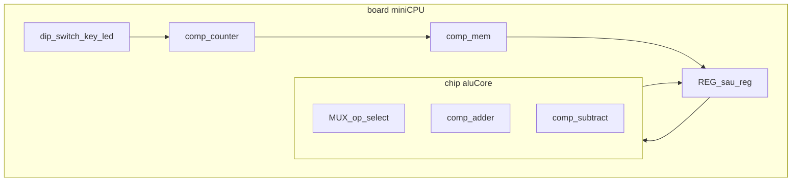

# Mini CPU / ALU cu memorie — fezabilitate

## Răspuns scurt

**Da** — poți face un script mic, demonstrativ, de tip „CPU cu 1 registru + RAM + ALU” folosind doar ce există acum. **`comp [mem]` singur nu e suficient conceptual**, dar împreună cu câteva primitive deja în limbaj acoperi un ALU + stocare + pași de execuție.

**Nu e nevoie de componente noi** în engine pentru un demo didactic. Ce „mai lipsește” sunt mai degrabă **organizare** (chip-uri/board-uri) și **disciplină de clock** (un pas = un impuls), nu tipuri noi (`instruction`, `bus`, etc.).

---

## Ce ai deja (suficient pentru un mini-CPU)

| Rol în CPU | Primitive LogTScript | Note |
|------------|----------------------|------|
| **RAM / program** | `comp [mem]` | ROM inițial cu `= ^hex`; read/write cu `.ram:{ at, data, write }` — [mem.md](mem.md) |
| **ALU (ADD/SUB/AND…)** | `comp [adder]` / `[subtract]` sau `ADD()` / `SUBTRACT()` | Pentru CPU persistent, preferă **componente** în `chip`, nu funcții instant — [adder.md](adder.md) |
| **Selectare operație** | `MUX1` / `MUX2` / `MUX3` | Alegi între rezultate ALU după câțiva biți din instrucțiune |
| **Accumulator / IR** | `REG(data, clk, clr)` sau `comp [reg]` | Stare între pași — [reg.md](reg.md) |
| **Program Counter** | `comp [counter]` | Load + increment pe `dir` — [counter.md](counter.md) |
| **Flags (carry, zero)** | `carry` de la adder; `EQ` pentru zero | Fără componentă dedicată „flags” |
| **Shift** (opțional) | `LSHIFT` / `RSHIFT` sau `comp [shifter]` | Pentru instrucțiuni simple nu e obligatoriu |
| **Clock / step** | `comp [key]` sau `comp [osc]` + `comp [switch]` | Un **pas** = un impuls (manual sau automat) |
| **UI program / stare** | `board` + `dip`, `switch`, `led`, `7seg` | Board permite panel + wave în body — [board.md](board.md) |
| **Logică reutilizabilă** | `chip` (ALU, decoder) în `board` (sistem) | ALU fără UI în chip; mem + display în board — [chip.md](chip.md) |

---

## Arhitectură recomandată

### Variantă A — „Harvard didactic” (implementată)

- **`mem` program** (ROM): instrucțiuni preîncărcate cu `= ^....`
- **`mem` date** (RAM): variabile runtime
- **PC** (`counter`): adresa instrucțiunii curente
- **Accumulator** (`comp [reg]`): operand + rezultat
- **ALU** (`chip +[alu4]`): add/sub + MUX pe `op[0]`
- **Board top** (`board +[cpu4]`): clock (`step`), reset (`rst`), afișaj (`7seg`), pout `acc` / `pc` / `ir`

**Un ciclu (manual):**

1. Citește instrucțiune de la `PC` din memoria program
2. Decode simplu (nibble înalt = opcode, nibble jos = operand)
3. Execută (ALU / write mem / load mem / jump)
4. `PC++` sau load nou la jump
5. Așteaptă următorul impuls pe `step`

Vezi [mini-cpu.md](mini-cpu.md) pentru ISA și scriptul complet.

### Variantă B — „ALU demo” (fără fetch complet)

Doar: DIP pentru operanzi + opcode, `adder`/`subtract`, `led`/`7seg` pentru rezultat. **Fără mem program** — util ca prim pas înainte de CPU complet.

---

## Ce NU îți trebuie ca tip nou de componentă

| Idee | Alternativă existentă |
|------|------------------------|
| „Instruction register” | `REG` / wire + property block la step |
| „Bus” | MUX + wiring în chip |
| „Decoder hardware” | `chip` cu MUX pe opcode; sau `def` la **top-level** |
| „Stack” | al doilea `counter` + `mem` |
| „Program loader” | inițializare `mem` cu `=` sau `.ram = ^hex` |

---

## Limitări de ținut minte

1. **`mem` nu e combinational** — citirea/scrierea merge prin property blocks (`at`, `write`, `set`). CPU-ul trebuie gândit **clocked / step-by-step**.
2. **Wave în board** — comportament previzibil la step; evită bucle combinaționale implicite în același tick.
3. **Lățimi mici** — pentru demo: `depth: 4`, `length: 8–16`, opcode 4 biți (nibble înalt), 6 tipuri de instrucțiuni.
4. **`def` în body board/chip** — interzis; logica de decode în wiring/MUX.

---

## Pași implementare (Variantă A)

1. **ALU chip** (`chip +[alu4]`): `a`, `b`, `op[2]`, `result`, `carry`
2. **Board step CPU** (`board +[cpu4]`): mem program, mem date, PC, ACC, instanță ALU, pin `step`, `7seg`, pout `acc`/`pc`/`ir`
3. **ISA minimă** pe 8 biți: nibble opcode + nibble operand
4. Teste + `probe(.cpu:acc)`; program demo în ROM
