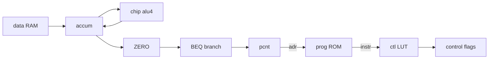

# Mini CPU v2 (Harvard, ASM, BEQ, terminal)

Teaching demo built on [mini-cpu.md](mini-cpu.md) (v1). Same 4-bit Harvard stepping model, with **ASM ROM**, **`comp [lut]` decode**, **`BEQ`**, **`ZERO()`**, **`chip [alu4]`** (no duplicate adder/subtract in the board), and **`comp [terminal]`** trace on `HALT`.

Feasibility notes: [mini-cpu-plan.md](mini-cpu-plan.md). v1 script and tests (859–866) are unchanged.

---

## What is new vs v1

| Topic | v1 | v2 |
|-------|----|----|
| Program ROM | `= ^10334221` (hand hex) | ASM via `inline [asm]` + `romblob` wire |
| Opcode decode | 6× `EQ` + `MUX` | `comp [lut] .ctl` control word ([lut.md](lut.md)) |
| Branches | `JMP` only | `JMP` (absolute) + `BEQ` (relative, signed) |
| Zero test | — | `ZERO(curacc)` ([builtin-bit-selection-functions.md](builtin-bit-selection-functions.md)) |
| ALU in board | Duplicate `adder` / `subtract` | `chip [alu4] .alu:` instance |
| I/O | `7seg` only | `7seg` + `terminal` on `HALT` |
| Wire names | — | **No `_` in identifiers** (`_` is a special token in LogTScript) |

---

## Architecture

| Block | Role |
|-------|------|
| `chip +[alu4]` | 4-bit ADD/SUB (`op.1` selects) |
| `board +[cpu4v2]` | Fetch-decode-execute per `set` pulse |
| `comp [mem] .prog` | ROM 8×8, init from ASM `romblob` |
| `comp [mem] .data` | RAM 16×4 (`= ^3` → address 0 = 3) |
| `comp [lut] .ctl` | Opcode → 7-bit control (`load`…`halt` flags) |
| `comp [counter] .pcnt` | PC (load + increment) |
| `comp [reg] .accum` | Accumulator |
| `comp [7seg] .disp` | Hex ACC |
| `comp [terminal] .trace` | Appends `A` on `HALT` (demo trace) |
| `comp [adder] .pcinc` / `.bradd` | `PC+1` and branch target for `BEQ` |



---

## ISA (8 bits: opcode + operand)

Format: `[opcode:4][operand:4]` — `instr.0/4` = opcode, `instr.4/4` = operand.

| Opcode | Mnemonic | Effect |
|--------|----------|--------|
| `0000` | NOP | No effect |
| `0001` | LOAD | `ACC ← RAM[operand]` |
| `0010` | STORE | `RAM[operand] ← ACC` |
| `0011` | ADDI | `ACC ← ACC + operand` |
| `0100` | SUBI | `ACC ← ACC - operand` |
| `0101` | JMP | `PC ← operand` (absolute) |
| `0110` | BEQ | If `ACC = 0`: `PC ← PC + 1 + signed_offset` |
| `0111` | HALT | Stop PC increment |

```logts
inline [asm] .cpuisa:
  NOP   : 0000 + 4b
  LOAD  : 0001 + 4b
  STORE : 0010 + 4b
  ADDI  : 0011 + 4b
  SUBI  : 0100 + 4b
  JMP   : 0101 + 4b
  BEQ   : 0110 + S4b
  HALT  : 0111 + 4b
  :
```

---

## Demo program (countdown + loop)

`RAM[0] = 3`. Loop subtracts until `ACC = 0`, then `BEQ` exits to `HALT`.

```logts
40wire romblob = .cpuisa {
  LOAD \0
loop:
  SUBI \1
  BEQ done
  JMP loop
done:
  HALT
}

comp [mem] .prog:
  depth: 8
  length: 8
  = romblob
  on: raise
  :
```

**Trace (9 steps from reset):** ACC `3→2→1→0`, then `HALT` at PC `4`.

---

## LUT opcode decode

`comp [lut]` inside the board is the usual choice for per-cycle decode with `.ctl:in` / `.ctl:get`.

Alternatively, declare `inline [lut] .ctl` at **top level** and reference it from the board with **`^.ctl`** (global ref — no instance prefix). Example: `^.ctl:LOAD`, `^.ctl(in = opc)`, `doc(^.ctl)`.

`^.name` works for any top-level `inline` (`asm`, `lut`, `protocol`) from inside board/chip/pcb bodies. Hex literals are unchanged: `^FF` is not global.

Control word (7 bits, LSB = bit `ctl.6/1`):

| Flag | Bit | `1` when |
|------|-----|----------|
| load | `ctl.6/1` | LOAD |
| store | `ctl.5/1` | STORE |
| addi | `ctl.4/1` | ADDI |
| subi | `ctl.3/1` | SUBI |
| jmp | `ctl.2/1` | JMP |
| beq | `ctl.1/1` | BEQ |
| halt | `ctl.0/1` | HALT |

```logts-play
comp [lut] .ctl:
  depth: 7
  length: 16
  fillwith: 0000000
  = data {
    0001: 0000001
    0010: 0000010
    0011: 0000100
    0100: 0001000
    0101: 0010000
    0110: 0100000
    0111: 1000000
  }
  :

4wire opc = 0110
.ctl:in = opc
7wire ctl = .ctl:get
1wire isbeq = ctl.1/1
show(isbeq)
```

v1 used separate `EQ(opc, …)` lines — same semantics, more wiring.

---

## BEQ and `ZERO`

```logts
curacc = .accum:get
iszero = ZERO(curacc)
isbeqtaken = AND(isbeq, iszero)
```

Branch target: `brtgt = (PC + 1) + signed_offset` (two `comp [adder]` stages: `.pcinc`, `.bradd`).

Load PC on branch or jump:

```logts
pcload = MUX(isbeqtaken, opd, brtgt)
```

`MUX(sel, when0, when1)` — when `sel = 1`, the **third** argument is selected. So `sel = 1` → `brtgt`, `sel = 0` → `opd` (used for `JMP`).

```logts
dobranch = OR(isjmp, isbeqtaken)
.pcnt:{ data = pcload
  write = 1
  set = AND(dobranch, set) }
doinc = AND(NOT(ishalt), NOT(dobranch))
```

---

## Terminal on HALT

```logts
comp [terminal] .trace:
  rows: 4
  columns: 20
  on: 1
  :

.trace:{ append = ^41
  set = AND(ishalt, set) }
```

After the full countdown, the terminal shows `A` (hex `^41`). See [terminal.md](terminal.md).

---

## Quick example (9 steps)

Uses `chip +[alu4]` from v1, `board +[cpu4v2]`, and prelude `CPUISA_V2` + `romblob` (see `test_suite_ported.js` constants `CPU4V2_BASE`).

```logts-play
# Paste CPUISA_V2 + romblob + CHIP_ALU4 + BOARD_CPU4V2 from test_suite_ported.js
# Then:
board [cpu4v2] .cpu::

.cpu:{ set = 1 }
# … repeat 9 times, or use a key/oscillator wrapper

show(.cpu:acc)
show(.cpu:pc)
```

**Expected:** ACC = `0000`, PC = `0100` (HALT).

---

## Advanced (optional)

### Call stack with `comp [queue]`

Push/pop return addresses on `comp [queue]` — see [queue.md](queue.md). Not required for the minimal demo.

### Harvard fetch + data in one step (`mem` multi-port)

`comp [mem]` with `ports: 2` and `readonly` on port 1 — see [mem.md](mem.md) § Multi-port. v2 keeps two `mem` instances for clarity.

---

## v1 vs v2 summary

| | v1 `cpu4` | v2 `cpu4v2` |
|---|-----------|-------------|
| Instructions | 7 | 8 (+BEQ) |
| ROM encoding | Hex | ASM |
| Decode | `EQ` | `comp [lut]` |
| Board ALU | Inline add/sub | `chip [alu4]` |
| Tests | 859–866 | 1056–1063 |

---

## Automated tests

`test_suite_ported.js` — group `mini-cpu-v2`, IDs **1056–1063** (init, LOAD, full countdown, BEQ, probe, clock, NEXT, terminal).

Constants: `CPUISA_V2`, `CPU4V2_ROM`, `BOARD_CPU4V2`, `CPU4V2_BASE`, `CPU4V2_STEPS_FULL = 9`.

---

## Related

- [mini-cpu.md](mini-cpu.md) — v1 demo
- [asm.md](asm.md) — ISA and `BEQ` / labels
- [lut.md](lut.md) — `comp [lut]` decode
- [mem.md](mem.md) — program/data memory
- [terminal.md](terminal.md) — text output
- [queue.md](queue.md) — optional stack
- [builtin-bit-selection-functions.md](builtin-bit-selection-functions.md) — `ZERO`
- [assignment-operators.md](assignment-operators.md) — strict `=` for wires
