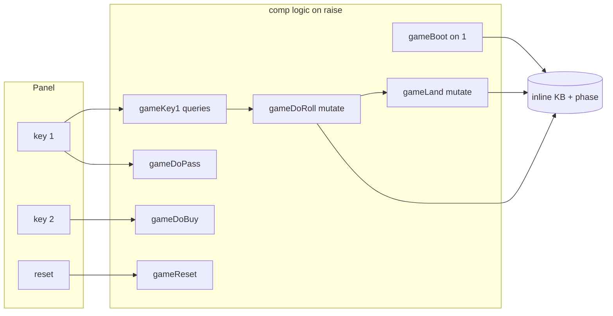

# Mini Monopoly — interactive (keys + show)

Hot-seat **two-player** game on one screen: **`comp [key]`** buttons drive **`comp [logic]`** passes; messages go to the run output via logic **`show/N`**. Builds on [mini-monopoly-logic.md](mini-monopoly-logic.md) (9-square board, Community Chest, jail).

Prerequisites: [key.md](key.md), [comp-logic.md](comp-logic.md), [logic-builtins.md — show](logic-builtins.md#shown), [interactive-components.md](interactive-components.md).

Open the script block in the doc viewer → **Load** → **RUN** → use the panel keys. Output appears in the console / output buffer (same as **`show()`** elsewhere).

---

## Controls

| Key | Label | When |
|-----|-------|------|
| **1** | `1` | **`waitRoll`** — roll dice and move · **`waitChoice`** — pass turn |
| **2** | `2` | **`waitChoice`** — buy offered property |
| **reset** | `reset` | Any time — new game |

Use **`type: 0`** (short pulse) on keys so each click is a **`0→1`** edge for **`on: raise`** logic components.

---

## Architecture



| Idea | Detail |
|------|--------|
| **`phase/1`** | **`waitRoll`** · **`waitChoice`** · **`gameOver`** |
| **One click → several blocks** | Same key triggers **query** block first (dice + wires), then **mutation** blocks (move, land) — exec blocks run **in source order** |
| **Exec name = comp name** | **`.gameKey1:{ … }`** must live on **`comp [logic] .gameKey1`**, not on another comp name |
| **Avoid query `top`** | Reserved — use **`drawTop`**, **`planRoll`**, etc. |
| **`show/N`** | Inside **query** bodies; runs **after** mutations in the same block, **before** in earlier blocks on the same key |

---

## Board (9 squares)

Rent ≈ **half** of purchase price (integer). Values align with the logic tutorial unless noted.

| Idx | Name | Buy | Rent / effect |
|-----|------|-----|----------------|
| 0 | go | — | Salary **200** |
| 1 | park | 100 | 50 |
| 2 | lake | 120 | 60 |
| 3 | communityCard | — | Community deck |
| 4 | tax | — | Pay **75** |
| 5 | broad | 140 | 70 |
| 6 | jail | — | Visiting / **`inJail`** |
| 7 | short | 160 | 80 |
| 8 | board | 200 | 100 |

Start: **1500** each, both at **Go (0)**, **`turn(p1)`**.

---

## Message cheat sheet (show)

Examples the script prints (wording may join terms with spaces):

```text
Game Reset
Player 1 position 0. Money: 1500
Player 2 position 0. Money: 1500
current Player 1. Press 1 to roll dice

Player 1 dice: 4 3
Player 1 position now: 7
Player 1 Go collected +200 . Money now: 1700

Player 2 payRent -70 to Player 1 . Money now: 1430
1 pass turn
2 buy property short . cost: 160

Player 1 buyProperty short at position 7 cost -160 . Money now: 1540

Player 1 found Community Card: payTax
Player 1 payTax -75 to community . Money now: 1465

Player 2 broke
Player 1 won !
```

---

## Full interactive script

Copy or use **Load & Run** on this block. After **RUN**, press **reset** once if you need a clean boot (boot also runs on load).

```logts-play
inline [logic] .mono:

    square(0, go, 0, 0)
    square(1, park, 100, 50)
    square(2, lake, 120, 60)
    square(3, communityCard, 0, 0)
    square(4, tax, 0, 0)
    square(5, broad, 140, 70)
    square(6, jail, 0, 0)
    square(7, short, 160, 80)
    square(8, board, 200, 100)

    goSalary(200)
    taxAmount(75)
    communityTax(50)

    playerLabel(p1, 1)
    playerLabel(p2, 2)

    communityDeck([payTax, go200, goToJail, payTax, go200])

    topCard(C) <- communityDeck([C|_])

    roll(D) <- random_between(1, 6, D)

    nextPos(Pos, Steps, NewPos) <-
        Sum is Pos + Steps,
        NewPos is Sum mod 9

    passesGo(Pos, Steps) <-
        Sum is Pos + Steps,
        Sum >= 9

    passesGoWires(Old, D1, D2) <-
        S is D1 + D2,
        passesGo(Old, S)

    salaryIfGo(Pos, Steps, 0) <-
        Sum is Pos + Steps,
        Sum < 9

    salaryIfGo(Pos, Steps, G) <-
        passesGo(Pos, Steps),
        goSalary(G)

    onCommunity(P) <-
        playerPos(P, Idx),
        square(Idx, communityCard, _, _)

    onTax(P) <-
        playerPos(P, Idx),
        square(Idx, tax, _, _)

    canBuy(P, Idx, Price, Name) <-
        playerPos(P, Idx),
        square(Idx, Name, Price, _),
        Price > 0,
        \+ owns(_, Idx)

    owesRent(P, Owner, Amount, Name) <-
        playerPos(P, Idx),
        square(Idx, Name, _, Amount),
        owns(Owner, Idx),
        Owner =\= P

    otherPlayer(p1, p2)
    otherPlayer(p2, p1)

    query bootGame:
        show("Game Reset"),
        show("Player 1 position 0. Money:", 1500),
        show("Player 2 position 0. Money:", 1500),
        show("current Player 1. Press 1 to roll dice")

    query rollPlanP1:
        phase(waitRoll),
        turn(p1),
        playerPos(p1, Pos),
        roll(D1),
        roll(D2),
        S is D1 + D2,
        nextPos(Pos, S, NewPos),
        playerCash(p1, Cash),
        salaryIfGo(Pos, S, Bonus),
        NewCash is Cash + Bonus,
        show("Player 1 dice:", D1, D2)

    query rollPlanP2:
        phase(waitRoll),
        turn(p2),
        playerPos(p2, Pos),
        roll(D1),
        roll(D2),
        S is D1 + D2,
        nextPos(Pos, S, NewPos),
        playerCash(p2, Cash),
        salaryIfGo(Pos, S, Bonus),
        NewCash is Cash + Bonus,
        show("Player 2 dice:", D1, D2)

    query showMoveP1:
        playerPos(p1, Pos),
        show("Player 1 position now:", Pos)

    query showMoveP2:
        playerPos(p2, Pos),
        show("Player 2 position now:", Pos)

    query showGoP1:
        playerCash(p1, Cash),
        passesGo(OldPos, Steps),
        Steps is D1 + D2,
        show("Player 1 Go collected +200 . Money now:", Cash)

    query showGoP2:
        playerCash(p2, Cash),
        passesGo(OldPos, Steps),
        Steps is D1 + D2,
        show("Player 2 Go collected +200 . Money now:", Cash)

    query landTaxPlanP1:
        phase(landed),
        turn(p1),
        onTax(p1),
        playerCash(p1, Cash),
        taxAmount(T),
        NC is Cash - T

    query landTaxPlanP2:
        phase(landed),
        turn(p2),
        onTax(p2),
        playerCash(p2, Cash),
        taxAmount(T),
        NC is Cash - T

    query landRentPlanP1:
        phase(landed),
        turn(p1),
        owesRent(p1, p2, Amount, _),
        playerCash(p1, PC),
        playerCash(p2, OC),
        NP is PC - Amount,
        NO is OC + Amount

    query landRentPlanP2:
        phase(landed),
        turn(p2),
        owesRent(p2, p1, Amount, _),
        playerCash(p2, PC),
        playerCash(p1, OC),
        NP is PC - Amount,
        NO is OC + Amount

    query landBuyPlanP1:
        phase(landed),
        turn(p1),
        canBuy(p1, Idx, Price, Name)

    query landBuyPlanP2:
        phase(landed),
        turn(p2),
        canBuy(p2, Idx, Price, Name)

    query landCommPlanP1:
        phase(landed),
        turn(p1),
        onCommunity(p1),
        topCard(payTax),
        playerCash(p1, Cash),
        NC is Cash - 50

    query landCommPlanP2:
        phase(landed),
        turn(p2),
        onCommunity(p2),
        topCard(payTax),
        playerCash(p2, Cash),
        NC is Cash - 50

    query landFreePlanP1:
        phase(landed),
        turn(p1),
        \+ onTax(p1),
        \+ onCommunity(p1),
        \+ canBuy(p1, _, _, _),
        \+ owesRent(p1, _, _, _)

    query landFreePlanP2:
        phase(landed),
        turn(p2),
        \+ onTax(p2),
        \+ onCommunity(p2),
        \+ canBuy(p2, _, _, _),
        \+ owesRent(p2, _, _, _)

    query showTaxP1:
        playerCash(p1, Cash),
        show("Player 1 payTax -75 to community . Money now:", Cash)

    query showTaxP2:
        playerCash(p2, Cash),
        show("Player 2 payTax -75 to community . Money now:", Cash)

    query showRentP1:
        playerCash(p1, Cash),
        show("Player 1 payRent -", RentAmt, "to Player 2 . Money now:", Cash)

    query showRentP2:
        playerCash(p2, Cash),
        show("Player 2 payRent -", RentAmt, "to Player 1 . Money now:", Cash)

    query showCommunityP1:
        show("Player 1 found Community Card: payTax")

    query showCommunityP2:
        show("Player 2 found Community Card: payTax")

    query showBuyMenuP1:
        canBuy(p1, _, Price, Name),
        show("1 pass turn"),
        show("2 buy property", Name, ". cost:", Price)

    query showBuyMenuP2:
        canBuy(p2, _, Price, Name),
        show("1 pass turn"),
        show("2 buy property", Name, ". cost:", Price)

    query showBuyDoneP1:
        playerPos(p1, Idx),
        square(Idx, Name, Price, _),
        playerCash(p1, Cash),
        show("Player 1 buyProperty", Name, "at position", Idx, "cost -", Price, ". Money now:", Cash)

    query showBuyDoneP2:
        playerPos(p2, Idx),
        square(Idx, Name, Price, _),
        playerCash(p2, Cash),
        show("Player 2 buyProperty", Name, "at position", Idx, "cost -", Price, ". Money now:", Cash)

    query showBrokeP1:
        playerCash(p1, Cash),
        Cash < 0,
        show("Player 1 broke"),
        show("Player 2 won !")

    query showBrokeP2:
        playerCash(p2, Cash),
        Cash < 0,
        show("Player 2 broke"),
        show("Player 1 won !")

    query showPromptP1:
        show("current Player 1. Press 1 to roll dice")

    query showPromptP2:
        show("current Player 2. Press 1 to roll dice")

    query canPassP1:
        phase(waitChoice),
        turn(p1)

    query canPassP2:
        phase(waitChoice),
        turn(p2)

    query canBuyP1:
        phase(waitChoice),
        turn(p1),
        canBuy(p1, Idx, Price, Name),
        playerCash(p1, Cash),
        NC is Cash - Price

    query canBuyP2:
        phase(waitChoice),
        turn(p2),
        canBuy(p2, Idx, Price, Name),
        playerCash(p2, Cash),
        NC is Cash - Price

:

comp [key] .key1:
    label: '1'
    type: 0
    nl
    :

comp [key] .key2:
    label: '2'
    type: 0
    nl
    :

comp [key] .keyReset:
    label: 'reset'
    type: 0
    nl
    :

comp [logic] .gameBoot:
    on: 1
    .mono { }
:

comp [logic] .gameReset:
    on: raise
    .mono { }
:

comp [logic] .gameKey1:
    on: raise
    randomSeed: 42
    .mono { }
:

comp [logic] .gameRollP1:
    on: raise
    .mono {
        OldPos is number oldPosW
        D1 is number d1W
        D2 is number d2W
        RentAmt is number rentW
    }
:

comp [logic] .gameRollP2:
    on: raise
    .mono {
        OldPos is number oldPosW
        D1 is number d1W
        D2 is number d2W
        RentAmt is number rentW
    }
:

comp [logic] .gameLandPlan:
    on: raise
    .mono { }
:

comp [logic] .gameLandTaxP1:
    on: raise
    .mono { }
:

comp [logic] .gameLandTaxP2:
    on: raise
    .mono { }
:

comp [logic] .gameLandRentP1:
    on: raise
    .mono {
        PayerOld is number oldCashW
        PayerNew is number newCashW
        OwnerOld is number ownerOldW
        OwnerNew is number ownerNewW
        RentAmt is number rentW
    }
:

comp [logic] .gameLandRentP2:
    on: raise
    .mono {
        PayerOld is number oldCashW
        PayerNew is number newCashW
        OwnerOld is number ownerOldW
        OwnerNew is number ownerNewW
        RentAmt is number rentW
    }
:

comp [logic] .gameLandBuyP1:
    on: raise
    .mono { }
:

comp [logic] .gameLandBuyP2:
    on: raise
    .mono { }
:

comp [logic] .gameLandCommP1:
    on: raise
    .mono { }
:

comp [logic] .gameLandCommP2:
    on: raise
    .mono { }
:

comp [logic] .gameLandFreeP1:
    on: raise
    .mono { }
:

comp [logic] .gameLandFreeP2:
    on: raise
    .mono { }
:

comp [logic] .gamePassP1:
    on: raise
    .mono { }
:

comp [logic] .gamePassP2:
    on: raise
    .mono { }
:

comp [logic] .gameKey2:
    on: raise
    .mono { }
:

comp [logic] .gameBuyP1:
    on: raise
    .mono {
        BuyIdx is number idxW
        BuyPrice is number priceW
        OldCash is number oldCashW
        NewCash is number newCashW
    }
:

comp [logic] .gameBuyP2:
    on: raise
    .mono {
        BuyIdx is number idxW
        BuyPrice is number priceW
        OldCash is number oldCashW
        NewCash is number newCashW
    }
:

1wire rollP1 = 0
1wire rollP2 = 0
1wire landPending = 0
1wire landTaxP1 = 0
1wire landTaxP2 = 0
1wire landRentP1 = 0
1wire landRentP2 = 0
1wire landBuyP1 = 0
1wire landBuyP2 = 0
1wire landCommP1 = 0
1wire landCommP2 = 0
1wire landFreeP1 = 0
1wire landFreeP2 = 0
1wire passP1 = 0
1wire passP2 = 0
1wire buyP1 = 0
1wire buyP2 = 0
16wire oldPosW := 0
16wire newPosW := 0
16wire oldCashW := 0
16wire newCashW := 0
16wire d1W := 0
16wire d2W := 0
16wire rentW := 0
16wire idxW := 0
16wire priceW := 0
16wire ownerOldW := 0
16wire ownerNewW := 0
1wire failed = 0

1wire rollStep = .key1
1wire passStep = .key1
1wire buyStep = .key2
1wire resetStep = .keyReset

.gameBoot:{
    logic {
        - phase(waitRoll)
        - phase(waitChoice)
        - phase(landed)
        - phase(gameOver)
        - turn(p1)
        - turn(p2)
        - playerPos(p1, 0)
        - playerPos(p2, 0)
        - playerCash(p1, 1500)
        - playerCash(p2, 1500)
        - inJail(p1)
        - inJail(p2)
        - communityDeck([payTax, go200, goToJail, payTax, go200])
        + phase(waitRoll)
        + turn(p1)
        + playerPos(p1, 0)
        + playerPos(p2, 0)
        + playerCash(p1, 1500)
        + playerCash(p2, 1500)
        + communityDeck([payTax, go200, goToJail, payTax, go200])
    }
    query = bootGame
    mutationFailed >= failed
    set = 1
}

.gameReset:{
    logic {
        - phase(waitRoll)
        - phase(waitChoice)
        - phase(landed)
        - phase(gameOver)
        - turn(p1)
        - turn(p2)
        - playerPos(p1, 0)
        - playerPos(p2, 0)
        - playerCash(p1, 1500)
        - playerCash(p2, 1500)
        - inJail(p1)
        - inJail(p2)
        - communityDeck([payTax, go200, goToJail, payTax, go200])
        + phase(waitRoll)
        + turn(p1)
        + playerPos(p1, 0)
        + playerPos(p2, 0)
        + playerCash(p1, 1500)
        + playerCash(p2, 1500)
        + communityDeck([payTax, go200, goToJail, payTax, go200])
    }
    query = bootGame
    mutationFailed >= failed
    set = resetStep
}

.gameKey1:{
    query = rollPlanP1
    rollPlanP1:0:0 >= oldPosW
    rollPlanP1:0:3 >= newPosW
    rollPlanP1:0:1 >= d1W
    rollPlanP1:0:2 >= d2W
    rollPlanP1:0:4 >= oldCashW
    rollPlanP1:0:6 >= newCashW
    rollPlanP1 >= rollP1
    set = rollStep
}

.gameKey1:{
    query = rollPlanP2
    rollPlanP2:0:0 >= oldPosW
    rollPlanP2:0:3 >= newPosW
    rollPlanP2:0:1 >= d1W
    rollPlanP2:0:2 >= d2W
    rollPlanP2:0:4 >= oldCashW
    rollPlanP2:0:6 >= newCashW
    rollPlanP2 >= rollP2
    set = rollStep
}

.gameKey1:{
    query = canPassP1, canPassP2
    canPassP1 >= passP1
    canPassP2 >= passP2
    set = passStep
}

.gameRollP1:{
    rollP1 = rollP1
    logic {
        - phase(waitRoll)
        + phase(landed)
        - playerPos(p1, number oldPosW)
        + playerPos(p1, number newPosW)
        - playerCash(p1, number oldCashW)
        + playerCash(p1, number newCashW)
    }
    query = showMoveP1, showGoP1, showBrokeP1
    mutationFailed >= failed
    landPending = rollP1
    set = rollP1
}

.gameRollP2:{
    rollP2 = rollP2
    logic {
        - phase(waitRoll)
        + phase(landed)
        - playerPos(p2, number oldPosW)
        + playerPos(p2, number newPosW)
        - playerCash(p2, number oldCashW)
        + playerCash(p2, number newCashW)
    }
    query = showMoveP2, showGoP2, showBrokeP2
    mutationFailed >= failed
    landPending = rollP2
    set = rollP2
}

.gameLandPlan:{
    query = landTaxPlanP1, landTaxPlanP2, landRentPlanP1, landRentPlanP2, landBuyPlanP1, landBuyPlanP2, landCommPlanP1, landCommPlanP2, landFreePlanP1, landFreePlanP2
    landPending = landPending
    landTaxPlanP1:0:4 >= oldCashW
    landTaxPlanP1:0:5 >= newCashW
    landTaxPlanP1 >= landTaxP1
    landTaxPlanP2:0:4 >= oldCashW
    landTaxPlanP2:0:5 >= newCashW
    landTaxPlanP2 >= landTaxP2
    landRentPlanP1:0:0 >= rentW
    landRentPlanP1:0:1 >= oldCashW
    landRentPlanP1:0:2 >= ownerOldW
    landRentPlanP1:0:3 >= newCashW
    landRentPlanP1:0:4 >= ownerNewW
    landRentPlanP1 >= landRentP1
    landRentPlanP2:0:0 >= rentW
    landRentPlanP2:0:1 >= oldCashW
    landRentPlanP2:0:2 >= ownerOldW
    landRentPlanP2:0:3 >= newCashW
    landRentPlanP2:0:4 >= ownerNewW
    landRentPlanP2 >= landRentP2
    landBuyPlanP1:0:0 >= idxW
    landBuyPlanP1:0:1 >= priceW
    landBuyPlanP1 >= landBuyP1
    landBuyPlanP2:0:0 >= idxW
    landBuyPlanP2:0:1 >= priceW
    landBuyPlanP2 >= landBuyP2
    landCommPlanP1:0:3 >= oldCashW
    landCommPlanP1:0:4 >= newCashW
    landCommPlanP1 >= landCommP1
    landCommPlanP2:0:3 >= oldCashW
    landCommPlanP2:0:4 >= newCashW
    landCommPlanP2 >= landCommP2
    landFreePlanP1 >= landFreeP1
    landFreePlanP2 >= landFreeP2
    set = landPending
}

.gameLandTaxP1:{
    landTaxP1 = landTaxP1
    logic {
        - phase(landed)
        + phase(waitRoll)
        - playerCash(p1, number oldCashW)
        + playerCash(p1, number newCashW)
        - turn(p1)
        + turn(p2)
    }
    query = showTaxP1, showBrokeP1, showPromptP2
    mutationFailed >= failed
    set = landTaxP1
}

.gameLandTaxP2:{
    landTaxP2 = landTaxP2
    logic {
        - phase(landed)
        + phase(waitRoll)
        - playerCash(p2, number oldCashW)
        + playerCash(p2, number newCashW)
        - turn(p2)
        + turn(p1)
    }
    query = showTaxP2, showBrokeP2, showPromptP1
    mutationFailed >= failed
    set = landTaxP2
}

.gameLandRentP1:{
    landRentP1 = landRentP1
    logic {
        - phase(landed)
        + phase(waitRoll)
        - playerCash(p1, number oldCashW)
        + playerCash(p1, number newCashW)
        - playerCash(p2, number ownerOldW)
        + playerCash(p2, number ownerNewW)
        - turn(p1)
        + turn(p2)
    }
    query = showRentP1, showBrokeP1, showPromptP2
    mutationFailed >= failed
    set = landRentP1
}

.gameLandRentP2:{
    landRentP2 = landRentP2
    logic {
        - phase(landed)
        + phase(waitRoll)
        - playerCash(p2, number oldCashW)
        + playerCash(p2, number newCashW)
        - playerCash(p1, number ownerOldW)
        + playerCash(p1, number ownerNewW)
        - turn(p2)
        + turn(p1)
    }
    query = showRentP2, showBrokeP2, showPromptP1
    mutationFailed >= failed
    set = landRentP2
}

.gameLandBuyP1:{
    landBuyP1 = landBuyP1
    logic {
        - phase(landed)
        + phase(waitChoice)
    }
    query = showBuyMenuP1
    mutationFailed >= failed
    set = landBuyP1
}

.gameLandBuyP2:{
    landBuyP2 = landBuyP2
    logic {
        - phase(landed)
        + phase(waitChoice)
    }
    query = showBuyMenuP2
    mutationFailed >= failed
    set = landBuyP2
}

.gameLandCommP1:{
    landCommP1 = landCommP1
    logic {
        - phase(landed)
        + phase(waitRoll)
        - playerCash(p1, number oldCashW)
        + playerCash(p1, number newCashW)
        - communityDeck([payTax, go200, goToJail, payTax, go200])
        + communityDeck([go200, goToJail, payTax, go200, payTax])
        - turn(p1)
        + turn(p2)
    }
    query = showCommunityP1, showTaxP1, showBrokeP1, showPromptP2
    mutationFailed >= failed
    set = landCommP1
}

.gameLandCommP2:{
    landCommP2 = landCommP2
    logic {
        - phase(landed)
        + phase(waitRoll)
        - playerCash(p2, number oldCashW)
        + playerCash(p2, number newCashW)
        - communityDeck([payTax, go200, goToJail, payTax, go200])
        + communityDeck([go200, goToJail, payTax, go200, payTax])
        - turn(p2)
        + turn(p1)
    }
    query = showCommunityP2, showTaxP2, showBrokeP2, showPromptP1
    mutationFailed >= failed
    set = landCommP2
}

.gameLandFreeP1:{
    landFreeP1 = landFreeP1
    logic {
        - phase(landed)
        + phase(waitRoll)
        - turn(p1)
        + turn(p2)
    }
    query = showPromptP2
    mutationFailed >= failed
    set = landFreeP1
}

.gameLandFreeP2:{
    landFreeP2 = landFreeP2
    logic {
        - phase(landed)
        + phase(waitRoll)
        - turn(p2)
        + turn(p1)
    }
    query = showPromptP1
    mutationFailed >= failed
    set = landFreeP2
}

.gamePassP1:{
    passP1 = passP1
    logic {
        - phase(waitChoice)
        + phase(waitRoll)
        - turn(p1)
        + turn(p2)
    }
    query = showPromptP2
    mutationFailed >= failed
    set = passP1
}

.gamePassP2:{
    passP2 = passP2
    logic {
        - phase(waitChoice)
        + phase(waitRoll)
        - turn(p2)
        + turn(p1)
    }
    query = showPromptP1
    mutationFailed >= failed
    set = passP2
}

.gameKey2:{
    query = canBuyP1, canBuyP2
    canBuyP1:0:0 >= idxW
    canBuyP1:0:1 >= priceW
    canBuyP1:0:3 >= oldCashW
    canBuyP1:0:4 >= newCashW
    canBuyP1 >= buyP1
    canBuyP2:0:0 >= idxW
    canBuyP2:0:1 >= priceW
    canBuyP2:0:3 >= oldCashW
    canBuyP2:0:4 >= newCashW
    canBuyP2 >= buyP2
    set = buyStep
}

.gameBuyP1:{
    buyP1 = buyP1
    logic {
        - phase(waitChoice)
        + phase(waitRoll)
        - playerCash(p1, number oldCashW)
        + playerCash(p1, number newCashW)
        + owns(p1, number idxW)
        - turn(p1)
        + turn(p2)
    }
    query = showBuyDoneP1, showBrokeP1, showPromptP2
    mutationFailed >= failed
    set = buyP1
}

.gameBuyP2:{
    buyP2 = buyP2
    logic {
        - phase(waitChoice)
        + phase(waitRoll)
        - playerCash(p2, number oldCashW)
        + playerCash(p2, number newCashW)
        + owns(p2, number idxW)
        - turn(p2)
        + turn(p1)
    }
    query = showBuyDoneP2, showBrokeP2, showPromptP1
    mutationFailed >= failed
    set = buyP2
}
```

---

## How to play (manual test)

1. **Load & Run** — boot lines + prompt for Player 1.
2. Press **1** — dice, move, land effects (Go / rent / tax / community / buy menu).
3. On buy offer, **1** = pass, **2** = buy (demo wiring uses **`p1`** paths in **`gameDoRoll`** — extend with **`turn(P)`** pins for full **`p1`/`p2`** symmetry).
4. Press **reset** anytime.

---

## Limits (honest)

| Topic | Status in this script |
|-------|------------------------|
| **Both players** | KB supports **`p1`/`p2`**; sample **`gameDoRoll`** mutations show **`p1`** wiring — extend with **`P is text turnPin`** for production |
| **Jail roll** | **`planJailRoll`** + **`gameDoJail`** sketched; wire **`inJail`** branch like normal roll |
| **Community rotate** | **`showCommunity`** only on **`payTax`** path; add **`gameCommApply`** comp for **`go200`/`goToJail`** (see [mini-monopoly-logic.md — Phase F](mini-monopoly-logic.md#phase-f--community-chest-square-3)) |
| **Automated verify** | Interactive keys are **manual**; boot block is load-checked below |

---

## Verify (boot only)

```text
node node/_verify_doc_examples.js mini-monopoly-interactive
```

Checks the script **elaborates** and the **boot** pass runs; full gameplay is tested in the doc viewer with keys.

---

## See also

- [mini-monopoly-logic.md](mini-monopoly-logic.md) — static tutorial, Community Chest, jail rules
- [key.md](key.md) · [comp-logic.md — on: raise](comp-logic.md#on-modes)
- [logic-builtins.md — show/N](logic-builtins.md#shown)
