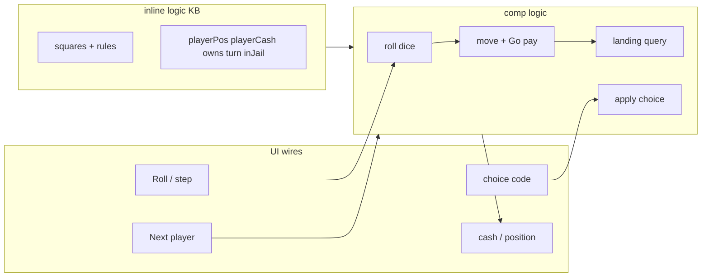

# Mini Monopoly — logic tutorial (board, jail, Go, choices)

End-to-end tutorial: build a **minimal two-player board game** (Monopoly-inspired) with **`inline [logic]`** + **`comp [logic]`**, wire displays, and UI buttons. Includes **Community Chest** on square **3** (draw, rotate deck, **`payTax`** / **`go200`** / **`goToJail`**). No new engine features — only documentation and runnable **`logts-play`** blocks.

Prerequisites: [inline-logic.md](inline-logic.md), [comp-logic.md](comp-logic.md), [logic-runtime.md](logic-runtime.md), [logic-builtins.md — random](logic-builtins.md#random1-random_between3-and-set_random1).

Open any block in the doc viewer and use **Load** / **Load & Run**.

---

## Principle

| Rule | Detail |
|------|--------|
| **Board** | **9 squares** (indices **0 … 8**). After square **8**, the next step wraps to **0** (loop). |
| **Go (square 0)** | **Collect salary** when you **pass** or **land** on Go. |
| **Starting cash** | Each player begins with **1500** (facts in the KB). |
| **Turn** | Fact **`turn(P)`** — hot-seat on one device; **Next player** swaps **`turn/1`**. |
| **Dice** | **`random_between(1, 6, D)`** in logic ([logic-builtins.md](logic-builtins.md)); optional **`randomSeed:`** on `comp [logic]` for reproducible runs. |
| **Community Chest (square 3)** | Draw the **top** card from **`communityDeck/1`**, apply its effect, **rotate** the card to the **bottom** of the deck. Deck is **shuffled once** at game init. |
| **Jail (square 6)** | **Just visiting** when you land there normally. **`inJail(P)`** when sent to jail (Community **`goToJail`** or demo button). **Roll 6 on either die** or **doubles** to leave jail. |
| **Choices (buy / pass)** | **Choice code** on a wire (**P1**) + query **`legalChoice(P, C)`** (**P4**). |
| **Persistence** | Re-**Run** resets the script — no save-game (state lives in the component dynamic store for the session). |

---

## Architecture

| Phase | What | Building blocks |
|-------|------|-----------------|
| **A — Board** | Squares, prices, jail, Go salary | `inline [logic]` facts + rules |
| **B — Turn** | `turn/1`, next player button | `logic { ± }` |
| **C — Move** | Two dice, `mod 9`, pass Go pay | `random_between/3`, `is/2`, mutations on `playerPos` / `playerCash` |
| **D — Land** | Rent, tax, buy offer | queries + boolean / scalar redirects |
| **E — Choice** | Buy vs pass | `8wire choiceIn`, `legalChoice/2`, `applyChoice/2` |
| **F — Community Chest** | Shuffle deck, draw, card effects | `communityDeck/1`, `shuffle/2`, two-pass peek → apply |
| **G — Full script** | One runnable game slice | `logts-play` at end |



---

## State model

### Board facts (static)

Each **`square/4`** is **`square(Index, Name, Price, Rent)`**. Index **0** is **Go** (no purchase). Index **3** is **Community Chest**. Index **6** is **Jail** (no rent).

| Index | Name | Price | Rent / effect |
|-------|------|-------|----------------|
| 0 | `go` | 0 | Collect **200** salary |
| 1 | `park` | 100 | 10 |
| 2 | `lake` | 120 | 12 |
| 3 | `communityCard` | 0 | Draw from **`communityDeck/1`** |
| 4 | `tax` | 0 | Pay **75** |
| 5 | `broad` | 140 | 14 |
| 6 | `jail` | 0 | Just visiting / **`inJail`** |
| 7 | `short` | 160 | 16 |
| 8 | `board` | 200 | 20 |

**Loop:** **`nextPos(Pos, Steps, NewPos)`** uses **`NewPos is (Pos + Steps) mod 9`**. From square **8**, one step leads to **0**.

### Community deck (dynamic)

| Fact | Meaning |
|------|---------|
| **`communityDeck(List)`** | Ordered deck of card atoms — **head** = next card to draw |
| **`communityBase(List)`** | Static template used once for **shuffle** at init |

Card atoms in this tutorial:

| Card | Effect |
|------|--------|
| **`payTax`** | Pay **`taxAmount`** (**75**) |
| **`go200`** | Move to square **0** (Go) + collect **`goSalary`** (**200**) |
| **`goToJail`** | Move to square **6** (jail) + **`+ inJail(P)`** |

### Player facts (dynamic via `logic { + / - }`)

| Fact | Meaning |
|------|---------|
| **`playerCash(P, Amount)`** | Cash (start **1500**) |
| **`playerPos(P, Index)`** | Board index **0 … 8** |
| **`turn(P)`** | Active player |
| **`owns(P, Index)`** | Property owned |
| **`inJail(P)`** | In jail (not just visiting) |

---

## Phase A — Board inline

```logts-play
inline [logic] .mono:

    square(0, go, 0, 0)
    square(1, park, 100, 10)
    square(2, lake, 120, 12)
    square(3, communityCard, 0, 0)
    square(4, tax, 0, 0)
    square(5, broad, 140, 14)
    square(6, jail, 0, 0)
    square(7, short, 160, 16)
    square(8, board, 200, 20)

    goSalary(200)
    taxAmount(75)

    playerCash(p1, 1500)
    playerCash(p2, 1500)
    playerPos(p1, 0)
    playerPos(p2, 0)
    turn(p1)

    nextPos(Pos, Steps, NewPos) <-
        Sum is Pos + Steps,
        NewPos is Sum mod 9

    passesGo(Pos, Steps) <-
        Sum is Pos + Steps,
        Sum >= 9

    onGo(Index) <- square(Index, go, _, _)

    query qGo:
        square(0, go, _, _)

:

comp [logic] .monoBoard:
    on: 1
    .mono { }
:

1wire ok = .monoBoard:query({ square(0, go, _, _) })
```

After **Load & Run**: query succeeds → **`ok = 1`**.

---

## Phase B — Turn and next player

Swap turn with two mutations in one transaction:

```logts-play
inline [logic] .mono:

    turn(p1)

    query who:
        turn(P)

:

comp [logic] .monoTurn:
    on: 1
    .mono { }
:

1wire trigger = 1
1wire failed = 0
1wire ok = 0

.monoTurn:{
    logic {
        - turn(p1)
        + turn(p2)
    }
    who >= ok
    mutationFailed >= failed
    set = trigger
}
```

After **Load & Run**: **`turn(p2)`** is active → **`who`** binds **`p2`** → **`ok = 1`**, **`failed = 0`**.

---

## Phase C — Dice, move, pass Go, jail escape

Two dice rolls per turn. **`randomSeed:`** keeps tutorial runs reproducible.

**Jail rule (simplified):** if **`inJail(P)`**, rolling **6** on **either** die **or** **doubles** removes **`inJail(P)`**; otherwise the player stays and the turn ends.

**Just visiting:** landing on square **6** **without** **`inJail(P)`** is a normal visit (no rent, no penalty).

```logts-play
inline [logic] .mono:

    square(0, go, 0, 0)
    square(1, park, 100, 10)
    square(2, lake, 120, 12)
    square(3, communityCard, 0, 0)
    square(4, tax, 0, 0)
    square(5, broad, 140, 14)
    square(6, jail, 0, 0)
    square(7, short, 160, 16)
    square(8, board, 200, 20)

    goSalary(200)
    taxAmount(75)

    playerCash(p1, 1500)
    playerPos(p1, 7)
    turn(p1)

    nextPos(Pos, Steps, NewPos) <-
        Sum is Pos + Steps,
        NewPos is Sum mod 9

    passesGo(Pos, Steps) <-
        Sum is Pos + Steps,
        Sum >= 9

    escapesJail(D1, D2) <- D1 = 6
    escapesJail(D1, D2) <- D2 = 6
    escapesJail(D1, D2) <- D1 = D2

    roll(D) <- random_between(1, 6, D)

    query roll1:
        roll(D1)
    query roll2:
        roll(D2)
    query steps:
        roll(D1), roll(D2), S is D1 + D2

:
comp [logic] .monoRoll:
    on: 1
    randomSeed: 42
    .mono { }
:

16wire d1 := 0
16wire d2 := 0
16wire total := 0
1wire trigger = 1

.monoRoll:{
    roll1 >= d1
    roll2 >= d2
    steps >= total
    set = trigger
}
```

After **Load & Run** with seed **42**: dice values are deterministic (same as [logic-builtins.md](logic-builtins.md) examples). **`total`** holds **`D1 + D2`**.

**Move + Go salary** (mutation sketch — active player **`p1`** at **`7`**, steps **`S`**):

```logts
logic {
    - playerPos(p1, 7)
    + playerPos(p1, NewPos)
    - playerCash(p1, OldCash)
    + playerCash(p1, NewCash)
}
```

Compute **`NewPos`** and **`NewCash`** in a **`comp [logic]`** pin block with **`is/2`**, or precompute in a query that binds wires before mutation. The full script below combines roll, move, and Go pay in one exec block.

---

## Phase D — Landing (rent, tax, buy offer)

```logts-play
inline [logic] .mono:

    square(4, tax, 0, 0)
    taxAmount(75)
    playerCash(p1, 1500)
    playerPos(p1, 4)
    turn(p1)

    owns(p2, 5)
    square(5, broad, 140, 14)

    owesTax(P) <-
        playerPos(P, Idx),
        square(Idx, tax, _, _)

    owesRent(P, Owner, Amount) <-
        playerPos(P, Idx),
        square(Idx, _, _, Amount),
        owns(Owner, Idx),
        Owner =\= P

    canBuy(P, Idx, Price) <-
        playerPos(P, Idx),
        square(Idx, _, Price, _),
        Price > 0,
        \+ owns(_, Idx)

    query taxDue:
        owesTax(p1)

    query rentDue:
        owesRent(p1, p2, A)

    query buyOffer:
        canBuy(p1, 1, 100)

:
comp [logic] .monoLand:
    on: 1
    .mono { }
:

1wire tax = 0
1wire rent = 0
1wire buy = 0
1wire trigger = 1

.monoLand:{
    taxDue >= tax
    rentDue >= rent
    buyOffer >= buy
    set = trigger
}
```

After **Load & Run**: **`p1`** on **tax** → **`tax = 1`**. With **`p1`** on **`5`** and **`p2`** owning **`5`**, **`rent = 1`**.

---

## Phase E — Player choices (P1 + P4)

| Code (`choiceIn`) | Action |
|-------------------|--------|
| **1** | Buy current square |
| **2** | Pass |

**P4 — legal choices:** query **`legalChoice(P, C)`** succeeds only for valid **`C`**.

**P1 — apply:** read **`choiceIn`**, run mutation if legal.

```logts-play
inline [logic] .mono:

    square(1, park, 100, 10)
    playerCash(p1, 1500)
    playerPos(p1, 1)
    turn(p1)

    canBuy(P, Idx, Price) <-
        playerPos(P, Idx),
        square(Idx, _, Price, _),
        Price > 0,
        \+ owns(_, Idx)

    legalChoice(P, 1) <- canBuy(P, _, _)
    legalChoice(P, 2) <- playerPos(P, _)

    choiceBuy(P, Price) <-
        legalChoice(P, 1),
        canBuy(P, Idx, Price),
        playerCash(P, Cash),
        Cash >= Price,
        NewCash is Cash - Price

    query legal1:
        legalChoice(p1, 1)

:
8wire choiceIn = 00000001
1wire legal = 0
1wire trigger = 1

comp [logic] .monoChoice:
    on: 1
    .mono {
        C is number choiceIn
    }
:

.monoChoice:{
    legal1 >= legal
    set = trigger
}
```

After **Load & Run**: **`choiceIn = 1`**, buy is legal → **`legal = 1`**.

**Alternative (P2):** separate exec blocks **`.gameBuy`** / **`.gamePass`** — clearer buttons, more components.

---

## Jail — just visiting vs inside

| Situation | Facts | Behaviour |
|-----------|-------|-----------|
| **Land on jail (6)** normally | no **`inJail(P)`** | **Just visiting** — continue next turn as usual |
| **Sent to jail** | **`+ inJail(P)`**, position **6** | Must roll **6** or **doubles** before moving |
| **Escape roll** | **`- inJail(P)`** | Then roll/move on a later **`set`** in the same or next pass |

Send to jail (demo button):

```logts-play
inline [logic] .mono:

    playerPos(p1, 5)
    turn(p1)

:

comp [logic] .monoJail:
    on: 1
    .mono { }
:

1wire trigger = 1
1wire failed = 0

.monoJail:{
    logic {
        - playerPos(p1, 5)
        + playerPos(p1, 6)
        + inJail(p1)
    }
    mutationFailed >= failed
    set = trigger
}
```

Escape check (query only):

```logts
escapesJail(D1, D2) <- D1 = 6
escapesJail(D1, D2) <- D2 = 6
escapesJail(D1, D2) <- D1 = D2
```

---

## Phase F — Community Chest (square 3)

Landing on **`communityCard`** draws the **first** card from **`communityDeck/1`**, applies its effect, then **moves that card to the bottom** of the deck (rotate).

### Deck rules

```logts
communityBase([payTax, go200, goToJail, payTax, go200])

topCard(C) <- communityDeck([C|_])

rotatedDeck(New) <-
    communityDeck([H|T]),
    append(T, [H], New)

onCommunity(P) <-
    playerPos(P, Idx),
    square(Idx, communityCard, _, _)

shuffle(Empty, Empty) <- Empty = []
shuffle(L, Out) <-
    length(L, N),
    N > 0,
    random_between(1, N, I),
    nth1(I, L, H),
    selectchk(H, L, Rest),
    shuffle(Rest, Tail),
    Out = [H|Tail]
```

Use **`selectchk/3`** (not **`select/3`**) so each shuffle pick is **deterministic** for a given RNG seed — no backtracking permutations.

**Shuffle at init:** run **`shuffle(Base, Deck)`** once with **`randomSeed:`** on the component, then store the deck with a **ground** **`+ communityDeck([…])`** mutation (list literals in mutations must be ground).

**Why two exec passes for draw?** Mutations run **before** queries in the same pass ([logic-runtime.md](logic-runtime.md)). Pattern:

1. **Peek pass** — queries expose the drawn card and landing check on **scalar** wires (`drawTop >= cardOut`). Avoid naming a query **`top`** — that clashes with the **`:top`** redirect form.
2. **Apply pass** — separate **`comp [logic] .commApply`** with matching **`.commApply:{ … }`** — **ground** **`+ / - communityDeck([…])`** mutations plus cash / position / jail updates.

**List pins:** **`text list`** pins decode the wire **before** the query runs. An empty wire → error or a failed query. For deck **output**, use **ground list literals** in mutations instead of **`text list deckWire`** round-trip (unless the wire was filled first, e.g. from **`routePin = routeIn`** in [comp-logic.md](comp-logic.md#list-pins--text-list-number-list-bool-list)).

### Init — shuffle and install deck

```logts-play
inline [logic] .mono:

    communityBase([payTax, go200, goToJail, payTax, go200])

    shuffle(Empty, Empty) <- Empty = []
    shuffle(L, Out) <-
        length(L, N),
        N > 0,
        random_between(1, N, I),
        nth1(I, L, H),
        selectchk(H, L, Rest),
        shuffle(Rest, Tail),
        Out = [H|Tail]

    query shuffledDeck:
        communityBase(Base),
        shuffle(Base, Deck)

    query deckOk:
        communityDeck(D)

:

comp [logic] .deckInitQuery:
    on: 1
    randomSeed: 42
    .mono { }
:

comp [logic] .deckInitCommit:
    on: 1
    .mono { }
:

1wire trigger = 1
1wire failed = 0
1wire ok = 0

.deckInitQuery:{
    query = shuffledDeck
    set = trigger
}

.deckInitCommit:{
    logic {
        + communityDeck([payTax, goToJail, go200, go200, payTax])
    }
    deckOk >= ok
    mutationFailed >= failed
    set = trigger
}
```

After **Load & Run** with seed **42**: **`shuffledDeck`** runs in the trace (Signal Trace / console). The commit pass stores **`[payTax, goToJail, go200, go200, payTax]`** — that is the **`selectchk`** shuffle for this seed. **`ok = 1`**, **`failed = 0`**.

### Draw — peek then apply (payTax)

Fixed deck for deterministic demo — top card **`payTax`**:

```logts-play
inline [logic] .mono:

    square(3, communityCard, 0, 0)
    taxAmount(75)
    goSalary(200)

    communityDeck([payTax, go200, goToJail, payTax, go200])
    playerPos(p1, 3)
    playerCash(p1, 1500)
    turn(p1)

    topCard(C) <- communityDeck([C|_])

    onCommunity(P) <-
        playerPos(P, Idx),
        square(Idx, communityCard, _, _)

    query drawTop:
        topCard(C)
    query onComm:
        onCommunity(p1)
    query cash:
        playerCash(p1, Cash)

:

comp [logic] .commPeek:
    on: 1
    .mono { }
:

comp [logic] .commApply:
    on: 1
    .mono { }
:

64wire cardOut := 0
16wire cashOut := 0
1wire onCommFlag = 0
1wire trigger = 1
1wire failed = 0

.commPeek:{
    drawTop >= cardOut
    onComm >= onCommFlag
    set = trigger
}

.commApply:{
    logic {
        - playerCash(p1, 1500)
        + playerCash(p1, 1425)
        - communityDeck([payTax, go200, goToJail, payTax, go200])
        + communityDeck([go200, goToJail, payTax, go200, payTax])
    }
    cash >= cashOut
    mutationFailed >= failed
    set = trigger
}
```

After **Load & Run**: **`onCommFlag = 1`**, first character of **`cardOut`** is **`p`** (`payTax`), **`cashOut = 1425`**, deck rotated (**`go200`** is now on top).

**Note:** a property block must target the **same** component as its name (`.commPeek:{ … }` on **`comp [logic] .commPeek`**, not on **`.commDraw`**). Use **two components** for peek → apply, or a **single** block when one pass is enough.

### Card — go200 (Go + salary)

Start with **`go200`** on top; **`p1`** on Community Chest:

```logts-play
inline [logic] .mono:

    goSalary(200)
    communityDeck([go200, goToJail, payTax, payTax, go200])
    playerPos(p1, 3)
    playerCash(p1, 1500)

    query posP1:
        playerPos(p1, Pos)
    query cashP1:
        playerCash(p1, Cash)

:

comp [logic] .commGo:
    on: 1
    .mono { }
:

16wire posOut := 0
16wire cashOut := 0
1wire trigger = 1
1wire failed = 0

.commGoApply:{
    logic {
        - playerPos(p1, 3)
        + playerPos(p1, 0)
        - playerCash(p1, 1500)
        + playerCash(p1, 1700)
        - communityDeck([go200, goToJail, payTax, payTax, go200])
        + communityDeck([goToJail, payTax, payTax, go200, go200])
    }
    posP1 >= posOut
    cashP1 >= cashOut
    mutationFailed >= failed
    set = trigger
}
```

After **Load & Run**: **`posOut = 0`**, **`cashOut = 1700`**, deck rotated.

### Card — goToJail

```logts-play
inline [logic] .mono:

    communityDeck([goToJail, payTax, go200, payTax, go200])
    playerPos(p1, 3)
    playerCash(p1, 1500)

    query posP1:
        playerPos(p1, Pos)
    query jailed:
        inJail(p1)

:

comp [logic] .commJail:
    on: 1
    .mono { }
:

16wire posOut := 0
1wire inJailFlag = 0
1wire trigger = 1
1wire failed = 0

.commJailApply:{
    logic {
        - playerPos(p1, 3)
        + playerPos(p1, 6)
        + inJail(p1)
        - communityDeck([goToJail, payTax, go200, payTax, go200])
        + communityDeck([payTax, go200, payTax, go200, goToJail])
    }
    posP1 >= posOut
    jailed >= inJailFlag
    mutationFailed >= failed
    set = trigger
}
```

After **Load & Run**: **`posOut = 6`**, **`inJailFlag = 1`**, deck rotated (**`payTax`** on top).

| Card | Mutations (ground lists — rotate + effect) |
|------|---------------------------------------------|
| **`payTax`** | **`- playerCash`**, **`+ playerCash`** (minus **75**), **`- / + communityDeck([…])`** rotate |
| **`go200`** | **`+ playerPos(p, 0)`**, **`+ playerCash`** (+ **200**), rotate deck |
| **`goToJail`** | **`+ playerPos(p, 6)`**, **`+ inJail(p)`**, rotate deck |

Use **`rotatedDeck/1`** in queries to **compute** the next deck order, then copy that list into the apply mutation. **`text list`** wire round-trip needs a **pre-filled** wire (see list-pin note above).

---

## Gaps and workarounds

| Limit | Workaround in this tutorial |
|-------|----------------------------|
| No `call/N` from wire | Numeric **`choiceIn`** codes (**1**, **2**) |
| No automatic UI menu | **`legalChoice`** + dip / switch on **`choiceIn`** |
| One **`set`** = one exec pass | Split **roll**, **move**, **choice**, **community peek/apply** across buttons or use **`phase/1`** facts |
| No save game | Document session-only dynamic store |
| Hot-seat only | **`turn/1`** + **Next player** button |

---

## Full game script (one turn slice)

Deterministic dice (**`randomSeed: 42`**) → **`D1 = 4`**, **`D2 = 3`**, **7** steps total. **`p1`** starts at **Go** (**0**) with **1500**. Seven steps land on square **7** (`short`) without passing Go again (no extra **200**).

```logts-play
inline [logic] .mono:

    square(0, go, 0, 0)
    square(1, park, 100, 10)
    square(2, lake, 120, 12)
    square(3, communityCard, 0, 0)
    square(4, tax, 0, 0)
    square(5, broad, 140, 14)
    square(6, jail, 0, 0)
    square(7, short, 160, 16)
    square(8, board, 200, 20)

    goSalary(200)
    taxAmount(75)

    playerCash(p1, 1500)
    playerCash(p2, 1500)
    playerPos(p1, 0)
    playerPos(p2, 0)
    turn(p1)

    nextPos(Pos, Steps, NewPos) <-
        Sum is Pos + Steps,
        NewPos is Sum mod 9

    passesGo(Pos, Steps) <-
        Sum is Pos + Steps,
        Sum >= 9

    roll(D) <- random_between(1, 6, D)

    query roll1:
        roll(D1)
    query roll2:
        roll(D2)
    query steps:
        roll(D1), roll(D2), S is D1 + D2

    query posP1:
        playerPos(p1, Pos)

    query cashP1:
        playerCash(p1, Cash)

    query buyOffer:
        canBuy(p1, _, _)

    canBuy(P, Idx, Price) <-
        playerPos(P, Idx),
        square(Idx, _, Price, _),
        Price > 0,
        \+ owns(_, Idx)

    legalChoice(P, 1) <- canBuy(P, _, _)
    legalChoice(P, 2) <- playerPos(P, _)

:

comp [logic] .gameStep:
    on: 1
    randomSeed: 42
    .mono { }
:

16wire dice1 := 0
16wire dice2 := 0
16wire stepsTotal := 0
16wire posOut := 0
16wire cashOut := 0
1wire canBuyFlag = 0
1wire trigger = 1
1wire failed = 0

.gameStep:{
    roll1 >= dice1
    roll2 >= dice2
    steps >= stepsTotal
    logic {
        - playerPos(p1, 0)
        + playerPos(p1, 7)
    }
    posP1 >= posOut
    cashP1 >= cashOut
    buyOffer >= canBuyFlag
    mutationFailed >= failed
    set = trigger
}
```

After **Load & Run**: **`dice1 = 4`**, **`dice2 = 3`**, **`stepsTotal = 7`**, **`posOut = 7`**, **`cashOut = 1500`**, **`canBuyFlag = 1`** (can buy **`short`**). **`failed = 0`**.

**Pass Go example:** start **`playerPos(p1, 7)`** and roll **3** → new index **`1`**, add **200** salary:

```logts
logic {
    - playerPos(p1, 7)
    + playerPos(p1, 1)
    - playerCash(p1, 1500)
    + playerCash(p1, 1700)
}
```

---

## Verify

```text
node node/_verify_doc_examples.js mini-monopoly-logic
```

Optional extra checks live in **`node/doc_verify/mini-monopoly-logic.js`**.

---

## See also

- [logic-runtime.md — mutations](logic-runtime.md) · [each / every](logic-runtime.md#mutation-each--zip-rows-into-n-facts)
- [logic-constraints.md](logic-constraints.md) — validate buys with **`constraint`**
- [comp-logic.md — randomSeed](comp-logic.md)
- [mini-cpu-v2.md](mini-cpu-v2.md) — another phased tutorial pattern
