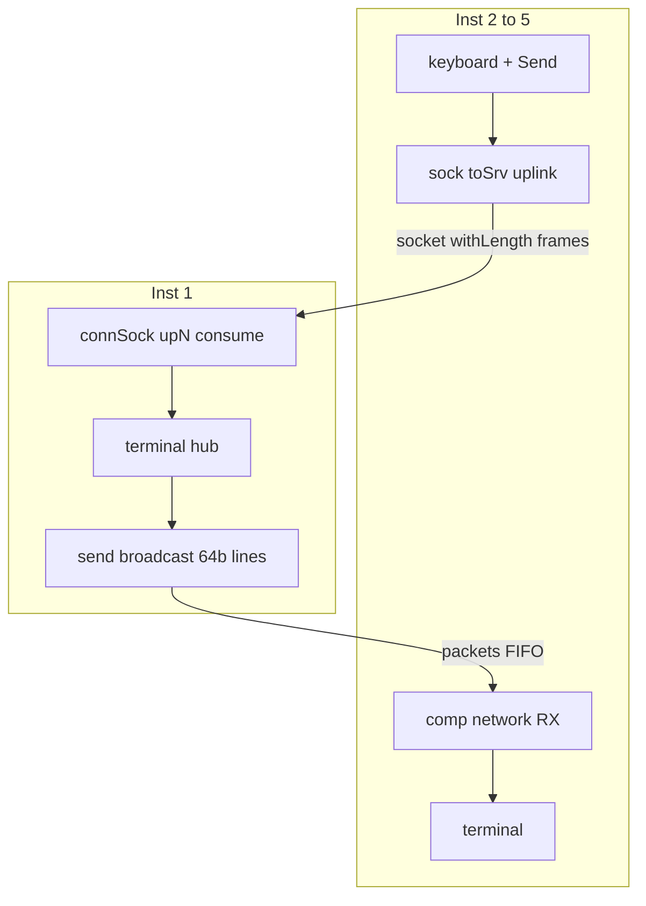

# Network chat — socket uplink + packet downlink (wave)

Multi-instance **wave** chat demo: clients on **Inst 2–5** send framed messages to a **server on Inst 1** over a **socket uplink**; the server formats lines and **broadcasts** them back on the **packet bus** (downlink). Same script on every client; instance id comes from [`/instance/`](meta-constants.md).

Related: [sock.md](sock.md) (`openSock`, `connSock`, `SOCKATTACHED`), [network.md](network.md) (`send` broadcast), [protocol-parse.md](protocol-parse.md) (`withLength`, `parseView`).

**Suite tests:** **2528–2529** (`SOCKATTACHED`), **2530–2531** (`.chatFrame` / `.chatParse`), **2532–2533** (uplink cross-instance), **2534** (downlink broadcast), **2535–2536** (`lineBuf` / hello frame width), **2569–2571** (wave hub: deferred `connSock`, JOIN packet cu inst în coadă, terminal join, CHAT uplink + downlink prefix).

Scripturile wave validate sunt **`NETWORK_CHAT_SERVER_WAVE`** / **`NETWORK_CHAT_CLIENT_WAVE`** în `tests/test_suite.js` (ca `huffFsmScript` la Huffman v2).

---

## Why socket + packets? (v1 hybrid)

| Direction | Mechanism | Reason |
|-----------|-----------|--------|
| Client → server | **Socket** stream (`openSock` / `connSock`, `sock <<`) | Variable-length chat frames with `lengthOf` / `withLength` on a bit stream |
| Server → clients | **Packet bus** (`send` broadcast, no `target`) | Fan-out to all clients; consumer sockets cannot `<<` on the downlink path |

**v2 (later):** dual-socket (separate downlink socket per client). See plan [network_chat_socket.plan.md](../../.cursor/plans/network_chat_socket.plan.md).

---

## Architecture



| Role | Instance | Uplink | Downlink |
|------|----------|--------|----------|
| Server | **1** | `connSock -> upN` per client port | `send` broadcast on `chat-demo` |
| Client | **2–5** | `openSock <- toSrv`, port = `/instance/` | `comp [network]` RX, `pop` → terminal |

**Port map:** uplink port **N** = client instance id (Inst 2 → port `0010`, Inst 3 → `0011`, …).

### Deferred connect (wave) — no `connSock` at Run

The server does **not** call `connSock` on load. Instead:

1. **Pre-declared** property blocks — `set` tied to a bit in `readyToConnectToInst`
2. **`on:1`** — on JOIN packet from client, set the bit to `1`
3. **Wave** — propagation sees bit `1` → `.ns:{ connSock … }` block runs `connSock`
4. **`on:raise`** — when `SOCKATTACHED(upN)` goes to `1`, reset the bit to `0`

No need for `.ns:{ … }` **inside** `on:1` — only pin writes / wire assignments there.

```logts
4wire readyToConnectToInst : 0000

.ns:{ connSock -> up2
  target = 0010
  port = 0010
  set = readyToConnectToInst.0 }
.ns:{ connSock -> up3
  target = 0011
  port = 0011
  set = readyToConnectToInst.1 }
.ns:{ connSock -> up4
  target = 0100
  port = 0100
  set = readyToConnectToInst.2 }
.ns:{ connSock -> up5
  target = 0101
  port = 0101
  set = readyToConnectToInst.3 }

on:1 {
  client2wantsToJoin,
  readyToConnectToInst.0 = 1
}
on:raise {
  SOCKATTACHED(up2),
  readyToConnectToInst.0 = 0
}
```

| Step | Who | What |
|------|-----|------|
| 1 | **Server** Inst 1 | **Run** — waits idle, no error |
| 2 | **Client** Inst 2 | `openSock` + JOIN packet to Inst 1 (`target = 0001`) |
| 3 | Server (wave) | bit `readyToConnectToInst.0 = 1` → `connSock` |
| 4 | Both | CHAT on socket uplink; lines on packet downlink |

The client must call **`openSock`** before `connSock` can succeed — but that happens on the client tab, not before **Run** on the server.

## Protocol — `.chatFrame` / `.chatParse`

Uplink frames: fixed header + **bit-length** prefix + body (`lengthOf` on encode, `withLength(..., nbytes b)` on parse where `nbytes` holds the bit count).

```logts-play wave
inline [protocol] .chatFrame:
  def frameBody:
    body ~b
  out:
    kind 8b
    clientId 8b
    lengthOf(frameBody) 8b
    frameBody
  :

inline [protocol] .chatParse:
  mode: parse
  parseView: tree
  out:
    kind 8b
    clientId 8b
    nbytes 8b
    withLength(body, nbytes b)
  :
```

| `kind` | Meaning |
|--------|---------|
| `00000001` | **JOIN** — client connected (body empty) |
| `00000010` | **CHAT** — `body` is UTF-8 bits (`^…` hex literal) |

`clientId` is the 8-bit instance id (`/instance/` on the client).

### JOIN — packet to server (signaling)

The client opens the socket (producer), then notifies the server with a unicast **packet** (`target = 0001`), not with `connSock` on the server at Run:

```logts
4wire myId : /instance/
.nc:{ openSock <- toSrv
  port = myId
  set = 1 }
.net:{ send = ^4A4F494E00000000
  target = 0001
  set = 1 }
```

(`^4A4F494E…` = magic `JOIN` + padding in the 64b packet; the server parses and sets `client2wantsToJoin` / the bit in `readyToConnectToInst`.)

### CHAT — socket frame (after connect)

```logts
40wire chat = .chatFrame { kind = \2;8, clientId = myId, body = ^6869 }
toSrv << chat
```

(`^6869` → ASCII `hi`.)

### Parse on server (consume socket)

```logts
sock up2
40wire parsed =: .chatParse { data << up2 }
8wire kind = parsed:kind
8wire clientId = parsed:clientId
16wire body = parsed:body
```

`data << up2` **consumes** parsed bits from the socket (see [sock.md](sock.md#protocol-parse-consume)).

---

## `SOCKATTACHED(sock)`

Returns **`1`** while the sock is live on the bus; **`0`** after `closeSock`, peer **Stop**, or unregister.

Server hub: poll `SOCKATTACHED(upN)` — edge `1 → 0` means client **left** → broadcast `*client N left*` and clear join state.

```logts-play wave
comp [network] .ns:
  channel: 'chat-demo'
  on: 1
  :
sock up2
.ns:{ connSock -> up2
  target = 0010
  port = 0010
  set = 1 }
1wire live = SOCKATTACHED(up2)
show(live)
```

Run **openSock** on Inst 2 (client) first, then the block above on Inst 1. Details: [network.md — Socket connections](network.md#socket-connections-shared-sock).

---

## Downlink line format (server)

One **136-bit** broadcast packet = one terminal line (ASCII in the payload). Prefix `*` for system messages. Use `width: 136` on every `comp [network]` in the demo (`*client 2 joined*` is 17 characters = 136 bits).

| Event | Example line (ASCII) |
|-------|----------------------|
| Join | `*client 2 joined*` |
| Chat | `client2> hello` |
| Leave | `*client 2 left*` |

```logts
.net:send = "*client 2 joined*"
.net:set = 1
```

(`"*client 2 joined*"` — 17 characters = 136 bits with `width: 136`.)

Client RX (top-level — property block OK):

```logts
comp [network] .net:
  width: 136
  length: 8
  channel: 'chat-demo'
  on: 1
  :
136wire line = .net:get
.net:pop = 1
.net:set = 1
```

Append `line` to [terminal](terminal.md) (ASCII tag `; a` on `show` if needed).

---

## Server script sketch (Inst 1)

`logts-play wave` — deferred `connSock` via `readyToConnectToInst`, JOIN on **packet**, CHAT on socket after connect. **Inst 2** fully wired below; duplicate the pattern for Inst 3–5 (`up3`, `prefix3`, …).

Inside **`on:{ }`**: pin writes (`.net:send = …`) or wire / bit assignments — **not** property blocks `.ns:{ connSock … }`. `connSock` blocks stay at **top level**, with `set = readyToConnectToInst.N`.

```logts-play wave
MODE WIREWRITE
inline [protocol] .chatFrame:
  def frameBody:
    body ~b
  out:
    kind 8b
    clientId 8b
    lengthOf(frameBody) 8b
    frameBody
  :

inline [protocol] .chatParse:
  mode: parse
  parseView: tree
  out:
    kind 8b
    clientId 8b
    nbytes 8b
    withLength(body, nbytes b)
  :

comp [network] .net:
  width: 136
  length: 8
  channel: 'chat-demo'
  on: 1
  :

comp [network] .ns:
  width: 136
  length: 8
  channel: 'chat-demo'
  on: 1
  :

sock up2

4wire readyToConnectToInst : 0000
1wire client2wantsToJoin : 0
1wire seen2 : 0
1wire joinBroadcast : 0
136wire joinLine2 : "*client 2 joined*"
136wire leaveLine2 := "*client 2 left*"
136wire prefix2 : "client2> "
136wire chatLine : 0

.ns:{ connSock -> up2
  target = 0010
  port = 0010
  set = readyToConnectToInst.0 }

comp [terminal] .term:
  on: 1
  :

comp [osc] .poll:
  on: 1
  :

on:1 {
  AND(.poll:get, NOT(.net:empty)),
  client2wantsToJoin = 1,
  .net:pop = 1,
  .net:set = 1
}
on:1 {
  client2wantsToJoin,
  readyToConnectToInst.0 = 1,
  client2wantsToJoin = 0
}
on:raise {
  SOCKATTACHED(up2),
  readyToConnectToInst.0 = 0,
  joinBroadcast = 1
}
on:1 {
  AND(.poll:get, joinBroadcast),
  joinBroadcast = 0,
  .net:send = joinLine2,
  .net:set = 1,
  .term:append = joinLine2,
  .term:newline = 1,
  .term:set = 1,
  seen2 = 1
}
on:1 {
  AND(.poll:get, NOT(SOCKATTACHED(up2)), seen2),
  seen2 = 0,
  .net:send = leaveLine2,
  .net:set = 1,
  .term:append = leaveLine2,
  .term:newline = 1,
  .term:set = 1
}
on:1 {
  AND(.poll:get, SOCKATTACHED(up2), GT(BITSIZE(up2), 011111)),
  136wire parsed =: .chatParse { data << up2 },
  8wire kind = parsed:kind,
  1wire isChat = EQ(kind, \2;8),
  chatLine := prefix2 + parsed:body,
  .net:send = chatLine,
  .net:set = isChat,
  .term:append = MUX(isChat, chatLine, 00000000),
  .term:newline = isChat,
  .term:set = isChat
}
```

---

## Client script sketch (Inst 2–5)

Same script on every client tab; **`4wire myInst : /instance/`** at Run sets port and `clientId`.

```logts-play wave
MODE WIREWRITE
inline [protocol] .chatFrame:
  def frameBody:
    body ~b
  out:
    kind 8b
    clientId 8b
    lengthOf(frameBody) 8b
    frameBody
  :

comp [network] .net:
  width: 136
  length: 8
  channel: 'chat-demo'
  on: 1
  :

comp [network] .nc:
  width: 136
  length: 8
  channel: 'chat-demo'
  on: 1
  :

4wire myInst : /instance/
sock toSrv
sock lineBuf

.nc:{ openSock <- toSrv
  port = myInst
  set = 1 }

.net:{ send = ^4A4F494E00000000000000000000000000
  target = 0001
  set = 1 }

comp [keyboard] .kbd:
  on: 1
  :

comp [key] .send:
  text: 'Send'
  on: 1
  :

comp [terminal] .inp:
  rows: 2
  columns: 40
  on: 1
  :

comp [terminal] .out:
  on: 1
  :

comp [osc] .poll:
  on: 1
  :

.inp:{
  append = .kbd
  set = .kbd:valid
}

on:1 {
  .kbd:valid,
  lineBuf << .kbd
}

on:1 {
  AND(.poll:get, NOT(.net:empty)),
  136wire line = .net:get,
  .out:append = line,
  .out:newline = 1,
  .out:set = 1,
  .net:pop = 1,
  .net:set = 1
}
on:1 {
  AND(.send:get, GT(BITSIZE(lineBuf), 0)),
  toSrv << .chatFrame { kind = \2;8, clientId = myInst, body = lineBuf },
  lineBuf << clear,
  .inp:clear = 1,
  .inp:set = 1
}
```

**Input buffer:** `comp [keyboard]` has no `:buf` — accumulate typed bytes in a **local** `sock lineBuf` (`lineBuf << .kbd` on `:valid`). On **Send**, append the frame directly: `toSrv << .chatFrame { …, body = lineBuf }` — do **not** assign to a fixed `40wire` (a 5-letter message is **64** bits total: 24-bit header + 40-bit body). Then `lineBuf << clear`.

**`on:1` rule:** pin writes only (`.out:append = line`, `.out:set = 1`) — **not** property blocks (`.out:{ … }`). See [conditional-assignment.md](conditional-assignment.md).

---

## Walkthrough (multi-tab)

1. Open **Inst 1** → load **server** sketch → **Run** (no clients — no error).
2. Open **Inst 2** → load **client** sketch → **Run** (`openSock` + JOIN packet); server connects `up2` via wave.
3. Open **Inst 3** with the same client script → **Run**.
4. Type on Inst 2, **Send** → CHAT on socket; lines on terminals via broadcast.
5. **Stop** Inst 2 → server: `SOCKATTACHED(up2)=0` → `*client 2 left*`.
6. **Win → Network Traffic** → Sockets.

---

## Limits (v1)

| Topic | v1 behaviour |
|-------|----------------|
| Body size | `lengthOf` in **8 bits** → max **255 bits** per frame (~31 ASCII bytes). Use `16b` prefix if you need longer messages. |
| Downlink socket | Not used — packets only |
| Fan-out one socket port | Not supported (see socket plan 1.4+a) |

---

## See also

- [sock.md](sock.md) — socket API, `SOCKATTACHED`, protocol consume
- [network.md](network.md) — `send`, broadcast, `/instance/`
- [protocol-assemble.md](protocol-assemble.md) — `lengthOf`, `withLength`
- [terminal.md](terminal.md) — hub display
- [keyboard.md](keyboard.md) — input buffer
