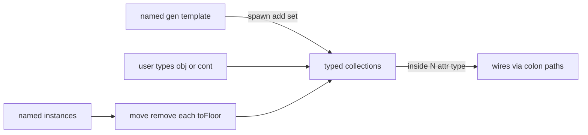

# PHZ — Physical Zone Framework

PHZ is a LogTScript **language module** for **physical logic**: topology, ownership, identity, capacity, typed collections, and membership moves. It is **not** a continuous physics engine (no forces, velocities, collisions, or time integration).

Related policy: [allow-notallow.md](allow-notallow.md) — `phz.type{…}` (built-ins plus user type names).

Signature: think in **zones and things**, not in gates. Attributes are ordinary bit wires (pouts). Containers and user `cont`-derived types hold typed collections. Generators are templates that append into a collection when you pulse `set`.

Shaft travel for panel motors (`maxDistance`, `:distance`, `:laps`) lives on [`motor.md`](motor.md) — often used next to PHZ conveyors/elevators as **user** types.

---

## Running examples (Load / Load & Run)

Runnable blocks use the `logts-play` format. Each block shows two buttons in the documentation viewer:

| Button | What it does |
|--------|----------------|
| **Load** | Copies the script into a **new editor tab** without running it. |
| **Load & Run** | Copies the script **and** runs it immediately. Read `show` lines in **Output**. |

Blocks use `logts-play wave` (wave propagation in the new tab).

**Literal tip for gen counts:** bare digits that are only `0`/`1` tokenize as BIN (`10` works as decimal ten in PHZ `add`). Other decimals need `\N` (`add = \5`) because DEC is not a valid expression atom.

---

## Philosophy

### What problem PHZ solves

Digital scripts often need a **world model** that is still fully digital:

- “This box is on floor 2 and weighs 3.”
- “This room can hold at most 30 items.”
- “Spawn ten copies of a template into the room.”
- “Move only trucks from conveyor A to B.”
- “Ask how many objects are inside, or read the first / last one’s `id`.”

That is **physical logic**: discrete facts about place, ownership, and identity — encoded as bits LogTScript already understands.

### What PHZ deliberately is not

| Not this | Instead |
|----------|---------|
| Rigid-body / continuous physics | Discrete attributes + list membership |
| Built-in conveyor / elevator kinds | User types: `phz +[conveyor < cont]: …` |
| A unified schema for all objects in a container | Per-object attributes; missing attr → error |
| Destroy-on-remove | `remove` only detaches (object may stay named / uncontained) |
| `.c:count` shortcut | Always `.c:inside:count` (or `:wheels:count` on a named collection) |

### Core metaphor

```text
  named obj / user-obj ──► a thing you can address (.box:flag)
  named gen ─────────────► a stamp / factory (template attrs)
  named cont / user-cont ► zone with one or more typed collections
       │
       ├── :inside ──────► default list (obj by default)
       └── :wheels ──────► extra typed collection (user typedef)
```

- **`floor`** — zoning layer (8-bit), not a physics height.
- **`id`** — global 16-bit identity on every **obj** / **cont** instance (named and anonymous; script-wide autoincrement). Only **`gen`** has no `id`.
- **`max` / `count`** — capacity (alias of default `inside` capacity) and occupancy of a collection.
- **Spawn** — `gen` copies its template attributes onto new objs and appends them to a collection path.
- **Membership** — at most one collection at a time; `move` / `remove` / `toFloor` change place or floor without physics.

### Design invariants

1. **Bits everywhere** — every readable field is a pout-width bit string.
2. **Ownership path** — contents are reached through collection paths (`:inside…`, `:wheels…`).
3. **Heterogeneous OK** on `obj` lists — different gens may spawn different attribute sets; reading a missing attr fails for that object only. Typed collections enforce **element type** compatibility.
4. **Re-spawn appends** — `on:1` is hardcoded on gen; every property block with `set = 1` spawns again.
5. **Overflow is an error** — `count + add > max` does not wrap.
6. **Unique membership** — one object in at most one collection; `remove` → uncontained (not destroyed).

---

## Kinds and user types

| Kind | Syntax | Role |
|------|--------|------|
| `obj` | `phz [obj] .o:` | Named object; attributes → pouts |
| `gen` | `phz [gen] .g:` | Template + spawn into a collection (**not** extensible) |
| `cont` | `phz [cont] .c:` | Container with default `inside` list |
| user | `phz +[T < obj\|cont]:` then `phz [T] .x:` | Custom type; collections only on `cont` base |

Policy: built-ins `obj gen cont` plus registered user names in `phz.type{…}`.

---

## Object

### Short form

Creates `id` (global autoincrement) and `floor: 0`.

**Load & Run** — expect `id = 0000000000000001`, `fl = 00000000`.

```logts-play wave
phz [obj] .o2::
16wire id = .o2:id
8wire fl = .o2:floor
show(id, fl)
```

### Definition attributes (simplified syntax)

Not full wireLiterals. At definition time:

| Form | Width | Notes |
|------|-------|-------|
| `id` | 16 bits | optional; else global autoincrement `1…65535`; no wire / `(W)` |
| `floor` | 8 bits | default `0`; wire must be exactly 8 bits; no `(W)` |
| decimal `3` | `bitLength` | `3` → `11` |
| `3 (8)` | 8 | MSB pad |
| `"ABC"` | 24 | ASCII |
| `"ABC" (40)` | 40 | LSB pad with `\0` |
| wire name | wire width | resolved at exec |

**Load & Run** — `weight` is `11`, padded `00000011`, label is 24 bits of `"ABC"`.

```logts-play wave
phz [obj] .crate:
  weight: 3
  weightPad: 3 (8)
  label: "ABC"
  :
2wire w = .crate:weight
8wire wp = .crate:weightPad
24wire lab = .crate:label
show(w, wp, lab)
```

### Runtime writes (named obj / cont)

RHS uses normal LogTScript wireLiterals (`=` or property block). PHZ named instances use **`on:1`** for property blocks (same as gen), so writes run on the first pass without an edge.

**Load & Run** — `flag` becomes `1`.

```logts-play wave
phz [obj] .box:
  flag: 0
  :
.box:{
  flag = 1
}
1wire f = .box:flag
show(f)
```

---

## Generator

A gen is a **template**, not an instance in a container. **`gen` cannot be subclassed** (`phz +[T < gen]` is invalid).

```
phz [gen] .factory:
  type: obj
  floor: 0
  someAttr: 1
  :
```

Rules:

- `type:` is **required** — built-in `obj` or any registered user type compatible with the target collection
- `id` is **forbidden** on gen (ids are allocated at spawn)
- Property-block fields for spawn: `add`, `inside`, `set`, optional `floor`
- `on:1` is hardcoded — every block with `set = 1` **spawns again** (appends)
- `inside` is required and may name a **cont** or a **collection path** (`.car:wheels`)
- Spawned objects may be anonymous (path / `each` only) unless you create named instances and `move` them

### Spawn into a container

**Load & Run** — ten objects; `n = 0000000000001010`, `empty = 0`, first spawn `id = 2` (`.room` took `1`), `flag = 1`.

```logts-play wave
phz [cont] .room:
  max: 30
  :
phz [gen] .factory:
  type: obj
  floor: 0
  flag: 1
  :
.factory:{
  add = 10
  inside = .room
  set = 1
}
16wire n = .room:inside:count
1wire empty = .room:inside:empty
16wire id0 = .room:inside:0:id
1wire f0 = .room:inside:0:flag
show(n, empty, id0, f0)
```

### Re-spawn appends

**Load & Run** — first block adds 10, second adds 5 → `n = 0000000000001111` (15).

```logts-play wave
phz [cont] .bin:
  max: 30
  :
phz [gen] .mk:
  type: obj
  :
.mk:{
  add = 10
  inside = .bin
  set = 1
}
.mk:{
  add = \5
  inside = .bin
  set = 1
}
16wire n = .bin:inside:count
show(n)
```

---

## Container

Creates `id` (global autoincrement) and `floor: 0`, plus the default `inside` collection.

```
phz [cont] .room:
  floor: 0
  max: 30
  :
```

- Default collection: `inside: obj[16]` (capacity 16 if `max` omitted)
- Attribute pout `max` (16 bits) is an **alias** of the default `inside` capacity
- overflow (`count + add > max`) → error
- reserved top-level attribute names: `inside`, `count`, `empty`  
  (`first` / `last` are allowed as normal attrs on the cont itself; they are **not** the same as `:inside:first`)
- `id` optional at definition (same rules as obj); otherwise autoincrement shared with all obj/cont instances

### `:inside` API (read-only membership paths)

| Path | Meaning |
|------|---------|
| `.c:inside:count` | object count (16 bits) |
| `.c:inside:empty` | `1` if empty else `0` |
| `.c:inside:0` | dump attributes of object 0 (show UX) |
| `.c:inside:0:id` | attribute pout |
| `.c:inside:0:type` | PHZ runtime type (ASCII bits) |
| `.c:inside:first` / `:last` | first / last object |
| `.c:inside` | list display (show UX) |

There is **no** `.c:count` — use `.c:inside:count`.

`show(.c:inside)` and `show(.c:inside:N)` are **display-only** (like ASM decode text): they cannot be assigned to wires. Read `:count`, `:empty`, or `:N:attr` for bit values.

Display tags work the same as for wires / vectors: `show(.container1; dec)`, `show(.bag:inside; hex)`, `show(.bag:inside:0; ascii)`, plus `elAll` / `elRange=` / `compact` on collection lists. Attribute bits are reformatted; the synthetic `type` field stays a readable name (`obj`, `cont`, `wheel`, …).

Bare `show(.container1)` dumps that instance’s attributes (and collection length lines). `show(.container1; dec)` applies decimal formatting to those attributes.

**Load & Run** — list like a vector (`:0` / `:1` + `has length`); one object expands fields.

```logts-play wave
phz [cont] .bag:
  max: 30
  :
phz [gen] .mkA:
  type: obj
  onlyA: 1
  :
phz [gen] .mkB:
  type: obj
  onlyB: 1
  :
.mkA:{
  add = 1
  inside = .bag
  set = 1
}
.mkB:{
  add = 1
  inside = .bag
  set = 1
}
show(.bag:inside)
show(.bag:inside:0)
```

Expected shape:

```text
.bag:inside
:0 = {id=0000000000000010, floor=00000000, onlyA=1}
:1 = {id=0000000000000011, floor=00000000, onlyB=1}
.bag:inside has length [2]
.bag:inside:0 = {id=0000000000000010, floor=00000000, onlyA=1}
  id = 0000000000000010 (16bit)
  floor = 00000000 (8bit)
  onlyA = 1 (1bit)
```

Use `show(.bag:inside; elAll)` for long lists (same truncation rules as vectors: default shows first three + last when `N > 5`).

Missing attribute on that object → `missing attribute named …`. There is **no** unified schema that merges all attributes of every object in a container.

**Load & Run** — three spawned objs; `.slot` is id `1`, first spawn id `2`, last id `4`.

```logts-play wave
phz [cont] .slot::
phz [gen] .mk:
  type: obj
  :
.mk:{
  add = \3
  inside = .slot
  set = 1
}
16wire firstId = .slot:inside:first:id
16wire lastId = .slot:inside:last:id
show(firstId, lastId)
```

### Heterogeneous gens in one container

Different templates may contribute different attributes on an `obj` list. Reading an attribute that exists only on another object fails.

**Load & Run** — index `0` has `onlyA`, index `1` has `onlyB`.

```logts-play wave
phz [cont] .bag:
  max: 30
  :
phz [gen] .mkA:
  type: obj
  onlyA: 1
  :
phz [gen] .mkB:
  type: obj
  onlyB: 1
  :
.mkA:{
  add = 1
  inside = .bag
  set = 1
}
.mkB:{
  add = 1
  inside = .bag
  set = 1
}
1wire a0 = .bag:inside:0:onlyA
1wire b1 = .bag:inside:1:onlyB
show(a0, b1)
```

---

## User types and typed collections

Declare with `phz +[Name < obj]` or `phz +[Name < cont]`. On a `cont` base, collection fields use `name: ElementType[max]`.

Redeclaring `inside: person[4]` on a derived type **replaces** the default `inside` element type and capacity.

Live docs: `doc(phz)` lists built-ins, user types (`phz.[wheel < obj]`), named instances, then anonymous spawn counts (`2x (phz.[wheel < obj])`). `doc(phz.car)` shows a typedef; `doc(.container1)` shows that instance’s attributes (`id: auto` when identity was allocated automatically).

**Load & Run** — two wheels in `.c1:wheels`; count is `2`.

```logts-play wave
phz +[wheel < obj]:
  :
phz +[car < cont]:
  wheels: wheel[4]
  :
phz [car] .c1::
phz [gen] .gw:
  type: wheel
  :
.gw:{
  add = \2
  inside = .c1:wheels
  set = 1
}
16wire n = .c1:wheels:count
show(n)
show(.c1:wheels)
```

Type check: spawning `obj` into `wheels: wheel[4]` fails (`incompatible`). A collection `trunk: obj[100]` accepts any type that derives from `obj`.

`show(.c1:wheels)` is vector-like — same rules as `show(.c:inside)`.

### Capacity: old `max` vs `inside: Type[N]`

| Form | Meaning |
|------|---------|
| `phz [cont] .c: max: 30` | sets default `inside` capacity to 30; pout `:max` mirrors it |
| `inside: obj[16]` (default) | same capacity semantics as phase‑1 default `max` |
| `wheels: wheel[4]` | separate list; capacity 4; not reflected in cont `:max` |

---

## Move, remove, toFloor

Property block on a container / collection owner:

| Field | Role |
|-------|------|
| `move` | object ref (`.box1` or `:inside:each` under `each`) |
| `to` | destination collection (`.room:inside`, `.yard:inside`, …) |
| `toFloor` | set `floor` on the moved object (ownership unchanged) |
| `remove` | detach only — object becomes **uncontained** |
| `set` | enable the operation (`1` or a predicate with `each`) |

Named objects stay addressable after `remove` / `move`.

**Load & Run** — box enters room, is removed, then enters yard; `id` stays `1`.

```logts-play wave
phz [obj] .box1::
phz [cont] .room::
phz [cont] .yard::
.room:{
  move = .box1
  to = .room:inside
  set = 1
}
.room:{
  remove = .box1
  set = 1
}
.yard:{
  move = .box1
  to = .yard:inside
  set = 1
}
16wire nRoom = .room:inside:count
16wire nYard = .yard:inside:count
16wire id = .box1:id
show(nRoom, nYard, id)
```

**Load & Run** — `toFloor` sets floor while still inside the lift.

```logts-play wave
phz [obj] .box1::
phz [cont] .lift::
.lift:{
  move = .box1
  to = .lift:inside
  set = 1
}
.lift:{
  move = .box1
  toFloor = \2
  set = 1
}
8wire fl = .box1:floor
show(fl)
```

---

## Collection iteration (`each`)

PHZ does **not** provide language loops such as `for`, `while`, or `foreach`.  
Collection iteration is performed **internally** by the PHZ engine. Scripts only describe **what** should happen to each matching object.

### The `each` placeholder

`each` represents the **current object** while the engine walks a collection snapshot.

- It is **not** a variable and is **not** stored in the container.
- It exists **only** while a PHZ property block is executing.
- It is recreated for every object in the snapshot.

Destination collections always use an explicit path, e.g. `to = .storage:inside` (not bare `.storage`).

### Relative collections

Inside a PHZ property block, paths starting with `:` are **self-relative** to the instance that owns the block. So `:inside` means that instance’s default collection (same idea as vector indexing: `:inside:0`).

```
.room:{
  move = :inside:each
  to = .storage:inside
  set = 1
}
```

is iteration over `.room:inside`.

The same form works for **any** collection on that instance: `:wheels:each`, `:cars:each`, etc. Attribute-only blocks such as `:wheels:each:flag = 1` iterate that named collection (not default `inside`).

`:type` on an object is the PHZ **runtime type** (readable name / ASCII), not a normal user attribute named `type`.

### Nested collection paths

When an element is itself cont-like, paths may continue into its collections:

- `.w:inside:0:inside:count` — count inside the first child container of `.w:inside`
- `.w:cars:0:wheels:count` — wheels on the first car in `.w:cars`
- `to = .belt:start:0:inside` — move destination may be a collection on an **anonymous** child cont (not only a named `.cont:coll`)

(Index / `first` / `last`, then another collection name, then `count` / `empty` / attrs / further nesting.)

### Move every object

**Load & Run** — both objects leave `.src` and enter `.dst` (`nSrc = 0`, `nDst = 2`).

```logts-play wave
phz [cont] .src:
  max: 30
  :
phz [cont] .dst:
  max: 30
  :
phz [gen] .mk:
  type: obj
  :
.mk:{
  add = \2
  inside = .src
  set = 1
}
.src:{
  move = :inside:each
  to = .dst:inside
  set = 1
}
16wire nSrc = .src:inside:count
16wire nDst = .dst:inside:count
show(nSrc, nDst)
```

### Filtering with `set`

`each` may appear inside the `set` expression. Only objects for which `set` evaluates to `1` are affected; others stay put.

**Load & Run** — only the truck moves; `a = 1` (obj left), `b = 1` (truck arrived).

```logts-play wave
phz +[truck < obj]:
  :
phz [cont] .conv1:
  max: 30
  :
phz [cont] .conv2:
  max: 30
  :
phz [gen] .gt:
  type: truck
  :
phz [gen] .go:
  type: obj
  :
.gt:{
  add = 1
  inside = .conv1
  set = 1
}
.go:{
  add = 1
  inside = .conv1
  set = 1
}
.conv1:{
  move = :inside:each
  to = .conv2:inside
  set = EQ(:inside:each:type, "truck")
}
16wire a = .conv1:inside:count
16wire b = .conv2:inside:count
show(a, b)
```

### Modifying attributes

`each` may also be the target of an assignment. The RHS may read the current object via `:inside:each:…`.

**Load & Run** — trucks get `km = 1`; plain `obj` stays at `0`. Expect `k0 = 1`, `k1 = 0` (truck spawned first).

```logts-play wave
phz +[truck < obj]:
  :
phz [cont] .yard:
  max: 30
  :
phz [gen] .gt:
  type: truck
  km: 0 (2)
  :
phz [gen] .go:
  type: obj
  km: 0 (2)
  :
.gt:{
  add = 1
  inside = .yard
  set = 1
}
.go:{
  add = 1
  inside = .yard
  set = 1
}
.yard:{
  :inside:each:km = \1
  set = EQ(:inside:each:type, "truck")
}
2wire k0 = .yard:inside:0:km
2wire k1 = .yard:inside:1:km
show(k0, k1; dec)
```

You can also compute on the current object, e.g. `:inside:each:km = ADD(:inside:each:km, \1)`, as long as widths match the attribute.

### Multiple operations in one block

One property block may update attributes **and** move the same matching object in a single iteration.

**Load & Run** — ready item is marked `processed = 1` and moved to `.finished`; the other stays. Expect `nY = 1`, `nF = 1`, `p = 1`.

```logts-play wave
phz [cont] .yard:
  max: 30
  :
phz [cont] .finished:
  max: 30
  :
phz [gen] .ready:
  type: obj
  status: "ready"
  processed: 0
  :
phz [gen] .wait:
  type: obj
  status: "wait"
  processed: 0
  :
.ready:{
  add = 1
  inside = .yard
  set = 1
}
.wait:{
  add = 1
  inside = .yard
  set = 1
}
.yard:{
  :inside:each:processed = 1
  move = :inside:each
  to = .finished:inside
  set = EQ(:inside:each:status, "ready")
}
16wire nY = .yard:inside:count
16wire nF = .finished:inside:count
1wire p = .finished:inside:0:processed
show(nY, nF, p)
```

### Driving `set` from LogTScript

The block runs when its own `set` evaluates to `1`. That signal may come from any wire.

**Load & Run** — `moveReady` is `1`, so both objects move to `.storage`.

```logts-play wave
phz [cont] .room:
  max: 30
  :
phz [cont] .storage:
  max: 30
  :
phz [gen] .mk:
  type: obj
  :
.mk:{
  add = \2
  inside = .room
  set = 1
}
1wire moveReady = 1
.room:{
  move = :inside:each
  to = .storage:inside
  set = moveReady
}
16wire nRoom = .room:inside:count
16wire nStore = .storage:inside:count
show(nRoom, nStore, moveReady)
```

A typical pattern with motors is `1wire moveReady = EQ(.motor:laps, \1)` — see [motor.md](motor.md).

### `each` and `on:` blocks

`each` is **not** available inside `on:` blocks. Those blocks only hold ordinary assignments; they do not run PHZ property-block iteration.

Invalid idea:

```
on:1 {
  show(:inside:each:id)
}
```

Instead, an `on:` block (or any script) should produce a signal that later activates a PHZ property block:

```
1wire moveReady = EQ(.motor:laps, \1)

.room:{
  move = :inside:each
  to = .storage:inside
  set = moveReady
}
```

When `moveReady` becomes `1`, the engine executes the property block and creates the temporary `each` binding.

### Design notes

- `each` is intentionally **not** part of the core LogTScript language — it is a temporary execution context of the PHZ engine.
- You cannot assign `each` to a wire or store it.
- You cannot use `each` outside an active PHZ property block.
- Iteration uses a **snapshot** of the collection at the start of the block so moves during the pass do not double-visit or skip wrongly.

Conveyors / elevators remain **user** types (e.g. `phz +[conveyor < cont]:`), not built-in PHZ kinds. Pair them with [`motor.md`](motor.md) `maxDistance` / `:distance` / `:laps` when you need shaft travel on the panel.

**Signal Trace:** with the panel armed (L2+), PHZ emits `phz spawn` / `phz move` / `phz remove` lines (filter **PHZ**). Spawn shows `id` + `floor` inline; other attributes expand under **`[+]`** at L3. See [debug.md](debug.md).

---

## Mental model (flow)



---

## See also

- `doc(phz)` / `doc(phz.type)` / `doc(.inst)` — live signatures in the editor (see [doc-function.md](doc-function.md))
- [motor.md](motor.md) — `maxDistance`, `:distance`, `:laps`
- [allow-notallow.md](allow-notallow.md) — restricting `phz` kinds / user types
- [doc-viewer.md](doc-viewer.md) — how **Load** / **Load & Run** work
- [chip-board-execution.md](chip-board-execution.md) — another module with runnable `logts-play` demos
