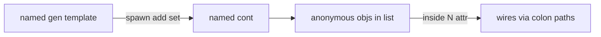

# PHZ — Physical Zone Framework (phase 1)

PHZ is a LogTScript **language module** for **physical logic**: topology, ownership, identity, and capacity. It is **not** a continuous physics engine (no forces, velocities, collisions, or time integration).

Related policy: [allow-notallow.md](allow-notallow.md) — `phz.type{obj gen cont}`.

Signature: think in **zones and things**, not in gates. Attributes are ordinary bit wires (pouts). Containers hold anonymous spawned objects. Generators are templates that append into a container when you pulse `set`.

---

## Philosophy

### What problem PHZ solves

Digital scripts often need a **world model** that is still fully digital:

- “This box is on floor 2 and weighs 3.”
- “This room can hold at most 30 items.”
- “Spawn ten copies of a template into the room.”
- “Ask how many objects are inside, or read the first / last one’s `id`.”

That is **physical logic**: discrete facts about place, ownership, and identity — encoded as bits LogTScript already understands.

### What PHZ deliberately is not

| Not this | Instead |
|----------|---------|
| Rigid-body / continuous physics | Discrete attributes + list membership |
| Named instances for every spawned item | Anonymous objects only inside a `cont` list |
| A unified schema for all objects in a container | Per-object attributes; missing attr → error |
| Filling containers by hand assignment | Phase 1 fill is **only** via `gen` spawn |
| `.c:count` shortcut | Always `.c:inside:count` (ownership path) |

### Core metaphor

```text
  named obj ──────────► a thing you can address (.box:flag)
  named gen ──────────► a stamp / factory (template attrs)
  named cont ─────────► a zone / bag with capacity (max)
       │
       └── :inside ───► anonymous spawned objs (read-only path)
```

- **`floor`** — zoning layer (8-bit), not a physics height.
- **`id`** — global 16-bit identity (script-wide autoincrement), not a memory address.
- **`max` / `count`** — capacity and occupancy of a container list.
- **Spawn** — `gen` copies its template attributes onto new anonymous objs and appends them to `cont`.

### Design invariants (phase 1)

1. **Bits everywhere** — every readable field is a pout-width bit string.
2. **Ownership path** — container contents are reached only through `:inside…`.
3. **Heterogeneous OK** — two gens may spawn different attribute sets into the same cont; reading a missing attr on one object fails for that object only.
4. **Re-spawn appends** — `on:1` is hardcoded on gen; every property block with `set = 1` spawns again.
5. **Overflow is an error** — `count + add > max` does not wrap.

---

## Running examples (Load / Load & Run)

Runnable blocks use the `logts-play` format. Each block shows two buttons in the documentation viewer:

| Button | What it does |
|--------|----------------|
| **Load** | Copies the script into a **new editor tab** without running it. |
| **Load & Run** | Copies the script **and** runs it immediately. Read `show` lines in **Output**. |

Blocks use `logts-play wave` (wave propagation in the new tab).

**Literal tip for gen counts:** bare digits that are only `0`/`1` tokenize as BIN (`10` works as decimal ten in PHZ `add`). Other decimals need `\N` (`add = \5`) because DEC is not a valid expression atom.

---

## Kinds

| Kind | Syntax | Role |
|------|--------|------|
| `obj` | `phz [obj] .o:` | Named object; attributes → pouts |
| `gen` | `phz [gen] .g:` | Template + spawn into a container |
| `cont` | `phz [cont] .c:` | Container with `max` and internal list |

Policy type set: `phz.type{obj gen cont}`.

---

## Object

### Short form

Creates `id` (global autoincrement) and `floor: 0`.

**Load & Run** — expect `id = 0000000000000001`, `fl = 00000000`.

```logts-play wave
phz [obj] .o2::
16wire id = .o2:id
8wire fl = .o2:floor
show(id, fl)
```

### Definition attributes (simplified syntax)

Not full wireLiterals. At definition time:

| Form | Width | Notes |
|------|-------|-------|
| `id` | 16 bits | optional; else global autoincrement `1…65535`; no wire / `(W)` |
| `floor` | 8 bits | default `0`; wire must be exactly 8 bits; no `(W)` |
| decimal `3` | `bitLength` | `3` → `11` |
| `3 (8)` | 8 | MSB pad |
| `"ABC"` | 24 | ASCII |
| `"ABC" (40)` | 40 | LSB pad with `\0` |
| wire name | wire width | resolved at exec |

**Load & Run** — `weight` is `11`, padded `00000011`, label is 24 bits of `"ABC"`.

```logts-play wave
phz [obj] .crate:
  weight: 3
  weightPad: 3 (8)
  label: "ABC"
  :
2wire w = .crate:weight
8wire wp = .crate:weightPad
24wire lab = .crate:label
show(w, wp, lab)
```

### Runtime writes (named obj / cont)

RHS uses normal LogTScript wireLiterals (`=` or property block). PHZ named instances use **`on:1`** for property blocks (same as gen), so writes run on the first pass without an edge. Writing through `:inside` is **not** supported in phase 1.

**Load & Run** — `flag` becomes `1`.

```logts-play wave
phz [obj] .box:
  flag: 0
  :
.box:{
  flag = 1
}
1wire f = .box:flag
show(f)
```

---

## Generator

A gen is a **template**, not an instance in a container.

```
phz [gen] .factory:
  type: obj
  floor: 0
  someAttr: 1
  :
```

Rules:

- `type: obj` is **required**
- `id` is **forbidden** on gen (ids are allocated at spawn)
- Property-block fields for spawn: `add`, `inside`, `set`, optional `floor`
- `on:1` is hardcoded — every block with `set = 1` **spawns again** (appends)
- `inside` is required and must name a `cont`
- Cont fill in phase 1 is **only** from gen

### Spawn into a container

**Load & Run** — ten objects; `n = 0000000000001010`, `empty = 0`, first `id = 1`, `flag = 1`.

```logts-play wave
phz [cont] .room:
  max: 30
  :
phz [gen] .factory:
  type: obj
  floor: 0
  flag: 1
  :
.factory:{
  add = 10
  inside = .room
  set = 1
}
16wire n = .room:inside:count
1wire empty = .room:inside:empty
16wire id0 = .room:inside:0:id
1wire f0 = .room:inside:0:flag
show(n, empty, id0, f0)
```

### Re-spawn appends

**Load & Run** — first block adds 10, second adds 5 → `n = 0000000000001111` (15).

```logts-play wave
phz [cont] .bin:
  max: 30
  :
phz [gen] .mk:
  type: obj
  :
.mk:{
  add = 10
  inside = .bin
  set = 1
}
.mk:{
  add = \5
  inside = .bin
  set = 1
}
16wire n = .bin:inside:count
show(n)
```

---

## Container

```
phz [cont] .room:
  floor: 0
  max: 30
  :
```

- `max` is 16 bits; default value **16** if omitted
- overflow (`count + add > max`) → error
- reserved top-level attribute names: `inside`, `count`, `empty`  
  (`first` / `last` are allowed as normal attrs on the cont itself; they are **not** the same as `:inside:first`)

### `:inside` API (read-only)

| Path | Meaning |
|------|---------|
| `.c:inside:count` | object count (16 bits) |
| `.c:inside:empty` | `1` if empty else `0` |
| `.c:inside:0` | dump attributes of object 0 (show UX) |
| `.c:inside:0:id` | attribute pout |
| `.c:inside:first` / `:last` | first / last object |
| `.c:inside` | list display (show UX) |

There is **no** `.c:count` — use `.c:inside:count`.

`show(.c:inside)` and `show(.c:inside:N)` are **display-only** (like ASM decode text): they cannot be assigned to wires. Read `:count`, `:empty`, or `:N:attr` for bit values.

**Load & Run** — list like a vector (`:0` / `:1` + `has length`); one object expands fields.

```logts-play wave
phz [cont] .bag:
  max: 30
  :
phz [gen] .mkA:
  type: obj
  onlyA: 1
  :
phz [gen] .mkB:
  type: obj
  onlyB: 1
  :
.mkA:{
  add = 1
  inside = .bag
  set = 1
}
.mkB:{
  add = 1
  inside = .bag
  set = 1
}
show(.bag:inside)
show(.bag:inside:0)
```

Expected shape:

```text
.bag:inside
:0 = {id=0000000000000001, floor=00000000, onlyA=1}
:1 = {id=0000000000000010, floor=00000000, onlyB=1}
.bag:inside has length [2]
.bag:inside:0 = {id=0000000000000001, floor=00000000, onlyA=1}
  id = 0000000000000001 (16bit)
  floor = 00000000 (8bit)
  onlyA = 1 (1bit)
```

Use `show(.bag:inside; elAll)` for long lists (same truncation rules as vectors: default shows first three + last when `N > 5`).

Missing attribute on that object → `missing attribute named …`. There is **no** unified schema that merges all attributes of every object in a container.

**Load & Run** — three spawned objs; first id `1`, last id `3`.

```logts-play wave
phz [cont] .slot::
phz [gen] .mk:
  type: obj
  :
.mk:{
  add = \3
  inside = .slot
  set = 1
}
16wire firstId = .slot:inside:first:id
16wire lastId = .slot:inside:last:id
show(firstId, lastId)
```

### Heterogeneous gens in one container

Different templates may contribute different attributes. Reading an attribute that exists only on another object fails.

**Load & Run** — index `0` has `onlyA`, index `1` has `onlyB`.

```logts-play wave
phz [cont] .bag:
  max: 30
  :
phz [gen] .mkA:
  type: obj
  onlyA: 1
  :
phz [gen] .mkB:
  type: obj
  onlyB: 1
  :
.mkA:{
  add = 1
  inside = .bag
  set = 1
}
.mkB:{
  add = 1
  inside = .bag
  set = 1
}
1wire a0 = .bag:inside:0:onlyA
1wire b1 = .bag:inside:1:onlyB
show(a0, b1)
```

`show(.c:inside)` is display UX only — there is **no** unified schema that merges all attributes of every object.

---

## Mental model (flow)



---

## Phase 1 limits

- No write through `:inside` (move / mutate spawned objs later).
- No fill of `cont` except via `gen`.
- No continuous physics.
- Generated objects have **no** visible `.name` — only list indices / first / last.

---

## See also

- [allow-notallow.md](allow-notallow.md) — restricting `phz` kinds
- [doc-viewer.md](doc-viewer.md) — how **Load** / **Load & Run** work
- [chip-board-execution.md](chip-board-execution.md) — another module with runnable `logts-play` demos
