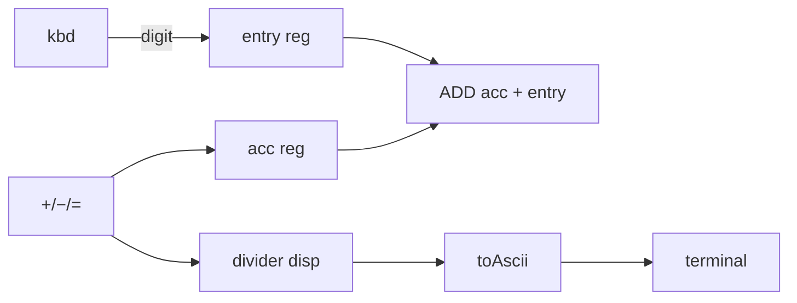

# Pocket calculator (keyboard + keys + terminal)

Teaching demo: a two-register **unsigned 8-bit** pocket calculator built from [keyboard.md](keyboard.md), [key.md](key.md), [reg.md](reg.md), [divider.md](divider.md), [lut.md](lut.md), and [terminal.md](terminal.md). Typed digits accumulate in **entry**; **`+`** / **`-`** / **`=`** apply to **acc** and print the result on the terminal; **`R`** clears everything.

Automated test: **1609** (`keyboard` group).

---

## Architecture

| Block | Role |
|-------|------|
| `comp [keyboard] .kbd` | Digits `0`–`9` (`onlyNumbers`); `:get` = 4-bit digit, `:valid` pulse per accepted key |
| `comp [key] .plus` / `.minus` / `.eq` / `.reset` | Momentary keys `+`, `-`, `=`, `R` |
| `comp [reg] .entry` | Multi-digit number being typed (`entry × 10 + digit`) |
| `comp [reg] .acc` | Accumulator (running result) |
| `comp [divider] .disp` | `DIVIDE` for two decimal digits (quotient + remainder mod 10) |
| `comp [lut] .toAscii` | Digit value `0`…`9` → ASCII byte for `append` |
| `comp [terminal] .term` | Scrollable result log |



**Entry shift:** on each `:valid` from the keyboard, `entryNew = entry × 10 + digit` (`MULTIPLY` + `ADD`).

**Operations (unsigned, saturate at 0):**

| Key | Effect |
|-----|--------|
| `+` | `acc ← acc + entry`; print `acc`; clear `entry` |
| `-` | `acc ← max(acc − entry, 0)` via `SUBTRACT` borrow + `MUX`; print; clear `entry` |
| `=` | Same as `+` (demo alias) |
| `R` | `acc ← 0`, `entry ← 0`, `terminal.clear` |

**Display:** before updating `acc`, a property block feeds `sum` (or `diffSat`) into `comp [divider] .disp`, then two `append` lines print the tens digit (quotient) and ones digit (remainder). `toAscii` LUT address width is 4 bits (`length: 16`); divider outputs are 8-bit but only the low digit matters.

---

## Why `comp [divider]` instead of `DIVIDE` wires?

`DIVIDE(a, b)` wires are fine for arithmetic, but **terminal `append` re-evaluates its expression when the block fires**. Pre-computed ASCII wires can be **stale** relative to `acc` / `entry` updates on the same key edge. Driving `comp [divider]` in a property block (then reading `.disp:get` / `.disp:mod` inside `.toAscii(in = …)`) evaluates the digit at **apply** time.

---

## Optional: `N2N10S` display (didactic)

For packed decimal teaching, see [decimal-conversion.md](decimal-conversion.md). A variant can print via `N2N10S` + per-nibble ASCII; the demo below uses **divider + toAscii** for clarity and fewer moving parts.

---

## Runnable demo (complete script)

Use **Load** or **Load & Run** in the script editor. Focus **Digits**, type on the keyboard; click **`+`** / **`-`** / **`=`** / **`R`** on the panel.

```logts-play wave
comp [keyboard] .kbd:
  label: 'Digits'
  focusColor: ^00ff00
  onlyNumbers
  on: 1
  :

comp [key] .plus:
  label: '+'
  type: 0
  on: 1
  :

comp [key] .minus:
  label: '-'
  type: 0
  on: 1
  :

comp [key] .eq:
  label: '='
  type: 0
  on: 1
  :

comp [key] .reset:
  label: 'R'
  type: 0
  on: 1
  nl
  :

comp [lut] .toAscii:
  depth: 8
  length: 16
  fillwith: 00110000
  = data {
    ^0: 00110000
    ^1: 00110001
    ^2: 00110010
    ^3: 00110011
    ^4: 00110100
    ^5: 00110101
    ^6: 00110110
    ^7: 00110111
    ^8: 00111000
    ^9: 00111001
  }
  on: 1
  :

comp [reg] .acc:
  depth: 8
  on: 1
  :

comp [reg] .entry:
  depth: 8
  on: 1
  :

comp [divider] .disp:
  depth: 8
  on: 1
  :

comp [terminal] .term:
  rows: 8
  columns: 24
  color: ^0f0
  on: 1
  nl
  :

8wire zero = 00000000
8wire ten = 00001010
8wire entryCur = .entry:get
8wire entryMul, 8wire ov1 = MULTIPLY(entryCur, ten)
8wire entryNew, 1wire c1 = ADD(entryMul, .kbd)
8wire accCur = .acc:get
8wire sum, 1wire cSum = ADD(accCur, entryCur)
8wire diff, 1wire borrow = SUBTRACT(accCur, entryCur)
8wire diffSat = MUX(borrow, diff, zero)

.entry:{
  data = entryNew
  set = .kbd:valid
}

.disp:{
  a = sum
  b = ten
  set = .plus
}

.term:{
  append = .toAscii(in = .disp:get)
  set = .plus
}
.term:{
  append = .toAscii(in = .disp:mod)
  set = .plus
}
.term:{
  newline = 1
  set = .plus
}

.acc:{
  data = sum
  set = .plus
}
.entry:{
  data = zero
  set = .plus
}

.disp:{
  a = diffSat
  b = ten
  set = .minus
}

.term:{
  append = .toAscii(in = .disp:get)
  set = .minus
}
.term:{
  append = .toAscii(in = .disp:mod)
  set = .minus
}
.term:{
  newline = 1
  set = .minus
}

.acc:{
  data = diffSat
  set = .minus
}
.entry:{
  data = zero
  set = .minus
}

.disp:{
  a = sum
  b = ten
  set = .eq
}

.term:{
  append = .toAscii(in = .disp:get)
  set = .eq
}
.term:{
  append = .toAscii(in = .disp:mod)
  set = .eq
}
.term:{
  newline = 1
  set = .eq
}

.acc:{
  data = sum
  set = .eq
}
.entry:{
  data = zero
  set = .eq
}

.acc:{
  data = zero
  set = .reset
}
.entry:{
  data = zero
  set = .reset
}
.term:{
  clear = 1
  set = .reset
}
```

### Try it

| Steps | Terminal (expected) |
|-------|---------------------|
| `1` `2` **`+`** | `12` |
| `3` **`+`** | `12` then `15` |
| **`R`** | cleared |
| `9` **`+`** `1` **`-`** | `8` |
| `3` **`+`** `8` **`-`** | `0` (saturate) |

**While typing digits:** nothing is printed yet — `entry` / `entryNew` update in **showVars**, but the terminal only appends a **result line** on **`+`**, **`-`**, or **`=`** (then `newline`). That matches a classic “enter then operate” flow, not character echo per key.

After **Load & Run**: focus **Digits**, type `12`, click **`+`** — terminal shows `12`. Uses **`wave`** propagation (same as the editor default).

---

## Related

- [keyboard.md](keyboard.md) — focus, `onlyNumbers`, `:valid`
- [key.md](key.md) — panel keys
- [terminal.md](terminal.md) — `append`, `newline`, `clear`
- [divider.md](divider.md) — `comp [divider]`
- [decimal-conversion.md](decimal-conversion.md) — `N2N10S` / `N10S2N` alternative display
- [mini-cpu-v2.md](mini-cpu-v2.md) — similar doc layout with **Load & Run** runnable block
